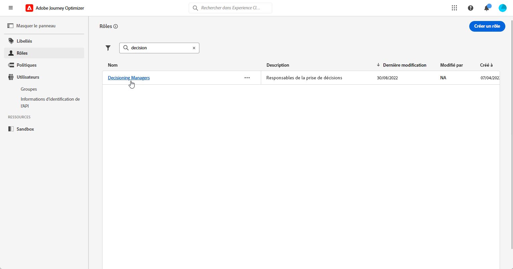
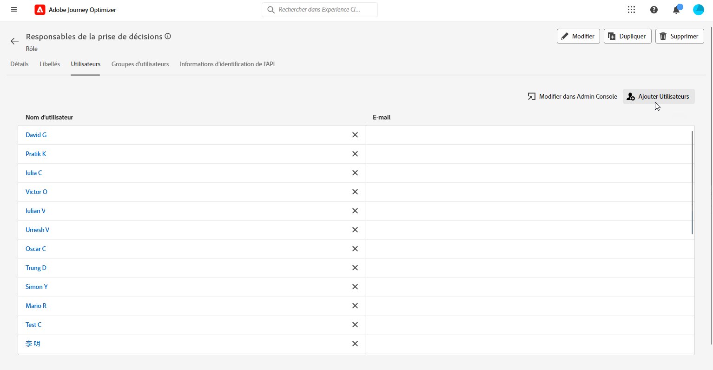
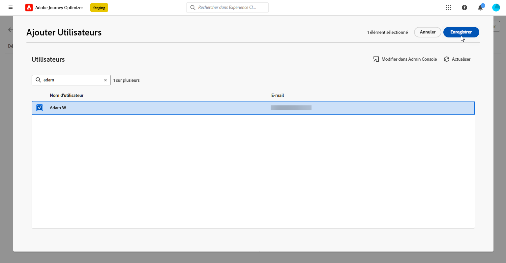

# Commencer avec la prise de décisions {#get-started-experience-decisioning}

>[!CONTEXTUALHELP]
>id="ajo_email_enable_experience_decisioning"
>title="Qu’est-ce que la prise de décisions ?"
>abstract="La prise de décisions est un nouvel outil, en plus de la gestion des décisions, permettant de sélectionner les meilleurs éléments du moteur de décision et de les diffuser à chaque individu. Elle nécessite une configuration supplémentaire pour pouvoir être utilisée."

## Qu’est-ce que la prise de décision ? {#about}

La prise de décision simplifie la personnalisation en offrant un catalogue centralisé d’offres marketing connues sous le nom d’« éléments de décision » et un moteur de décision sophistiqué. Ce moteur tire parti des règles et des critères de classement pour sélectionner et présenter les éléments de décision les plus pertinents à chaque personne.

Ces éléments de décision sont intégrés de manière transparente à un large éventail de surfaces entrantes par le biais du [canal d’expérience basé sur le code](../code-based/get-started-code-based.md), accessible dans les campagnes [!DNL Adobe Journey Optimizer].

>[!IMPORTANT]
>
>Les politiques de décision, dans la prise de décision, ne peuvent être utilisées que dans des campagnes d’expérience basée sur du code et des campagnes par e-mail.

➡️ [Découvrez cette fonctionnalité en vidéo.](#video)

➡️ Un cas d’utilisation de bout en bout montrant comment créer des décisions et les utiliser dans des expériences de contenu avec le canal d’expérience basé sur du code est présenté dans [cette section](experience-decisioning-uc.md).

## Étapes clés de la prise de décision {#steps}

Les principales étapes pour utiliser la prise de décision sont les suivantes :

1. **Attribuez les autorisations appropriées**. La prise de décision n’est disponible que pour les utilisateurs et les utilisatrices ayant accès à un **[!UICONTROL rôle]** associé à la prise de décision, comme les Gestionnaires de décisions. Si vous ne pouvez pas accéder à la prise de décision, vos autorisations doivent être étendues.

   +++Découvrir comment attribuer le rôle de responsable de décision

   1. Pour attribuer un rôle à un utilisateur ou une utilisatrice dans le produit [!DNL Permissions], accédez à l’onglet **[!UICONTROL Rôles]** et sélectionnez le rôle de personne gestionnaire de décision.

      

   1. Dans l’onglet **[!UICONTROL Utilisateurs et utilisatrices]**, cliquez sur **[!UICONTROL Ajouter un utilisateur ou une utilisatrice]**.

      

   1. Saisissez le nom ou l’adresse e-mail de votre utilisateur ou utilisatrice, ou sélectionnez cette personne dans la liste, puis cliquez sur **[!UICONTROL Enregistrer]**.

      Si le profil de l’utilisateur ou de l’utilisatrice n’a pas été créé auparavant, consultez la [documentation relative à l’ajout d’utilisateurs et d’utilisatrices](https://experienceleague.adobe.com/fr/docs/experience-platform/access-control/ui/users).

      

   La personne doit alors recevoir un e-mail la redirigeant vers votre instance.

   +++

1. **Configurez des attributs personnalisés** : personnalisez le catalogue d’éléments selon vos besoins spécifiques en configurant des attributs personnalisés dans le schéma du catalogue.

   ➡️ [Découvrez comment configurer le catalogue d’éléments.](catalogs.md)

1. **Créez des éléments de décision** pour les afficher à l’audience ciblée.

   ➡️[Découvrez comment créer des éléments de décision](items.md) dans l’interface d’utilisation (et dans la [documentation de l’API](api-reference/decisions-items/create.md)).

1. **Organisez des collections** : utilisez des collections pour classer les éléments de décision en fonction de règles basées sur des attributs. Incorporez des collections dans vos stratégies de sélection afin de déterminer la collection d’éléments de décision à prendre en compte.

   ➡️ [Découvrez comment gérer les collections d’éléments](collections.md) dans l’interface d’utilisation (et dans la [documentation de l’API](api-reference/items-collections/create.md)).

1. **Créez des règles de décision** : les règles de décision sont utilisées dans les éléments de décision et/ou les stratégies de sélection pour déterminer qui a accès à l’affichage d’un élément de décision.

   ➡️ [Découvrez comment créer des règles de décision](rules.md).

1. **Mettez en œuvre des méthodes de classement** : créez des méthodes de classement et appliquez-les dans les stratégies de sélection afin de déterminer l’ordre de priorité de sélection des éléments de décision.

   ➡️ [Découvrez comment créer des méthodes de classement.](ranking/ranking.md)

1. **Créez des stratégies de sélection** : créez des stratégies de sélection qui tirent parti des collections, des règles de décision et des méthodes de classement afin d’identifier les éléments de décision pouvant être affichés dans les profils.

   ➡️ [Découvrez comment créer des stratégies de sélection](selection-strategies.md) dans l’interface d’utilisation (et dans la documentation de l’[API](api-reference/selection-strategies/create.md)).

1. **Créez une politique de décision et incorporez-la dans votre parcours basé sur du code ou par e-mail ou votre campagne basée sur du code ou par e-mail** : les politiques de décision combinent plusieurs stratégies de sélection pour déterminer les éléments de décision éligibles à afficher pour l’audience prévue.

   ➡️ [Découvrez comment utiliser les politiques de décision](create-decision.md).
➡️ Pour diffuser l’offre par l’intermédiaire du canal d’expérience basée sur du code, suivez les étapes d’implémentation de [cette section](../code-based/code-based-implementation-samples.md).

## Ressources supplémentaires

* **[Créer des éléments de décision](items.md)** - Découvrez comment créer et gérer des éléments de décision, y compris des offres, des variations de contenu et des expériences.
* **[Configurer des catalogues de décisions](catalogs.md)** - Découvrez comment organiser les éléments de décision en catalogues pour une meilleure gestion.
* **[Définir des stratégies de sélection](selection-strategies.md)** - Découvrez comment créer des stratégies de sélection avec des règles d’éligibilité et des méthodes de classement.
* **[Créer des politiques de décision](create-decision-policy.md)** - Découvrez comment créer des politiques de décision combinant des stratégies et des contraintes.
* **[Classement et modèles d’IA](ranking/ranking.md)** - Maîtrisez les formules de classement et les modèles d’IA pour une prise de décision personnalisée.
* **[Mécanismes de sécurisation de prise de décision](decisioning-guardrails.md)** - Examinez les limites importantes et les bonnes pratiques pour la mise en œuvre de la prise de décision.
* **[Tutoriels sur la prise de décision](https://experienceleague.adobe.com/fr/docs/journey-optimizer-learn/tutorials/decision-capabilities/decisioning/introduction-to-decisioning){target="_blank"}** - Consultez des tutoriels vidéo détaillés sur les fonctionnalités de prise de décision et les bonnes pratiques.

## Vidéo pratique {#video}

Découvrez les fonctionnalités de prise de décision dans Adobe Journey Optimizer.

>[!VIDEO](https://video.tv.adobe.com/v/3451101?quality=12)
