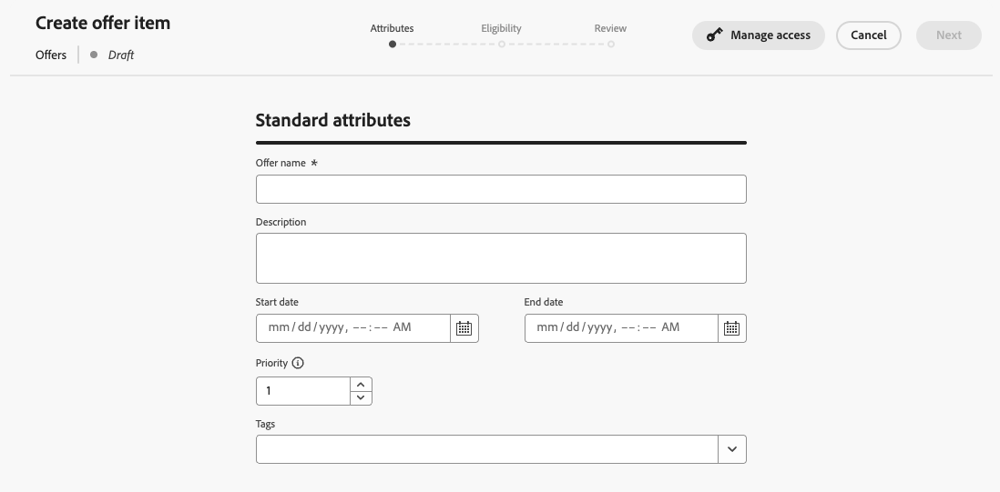
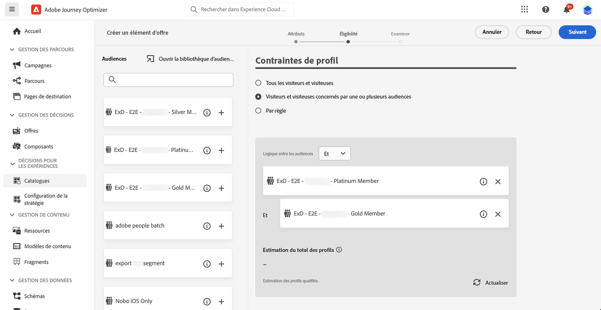
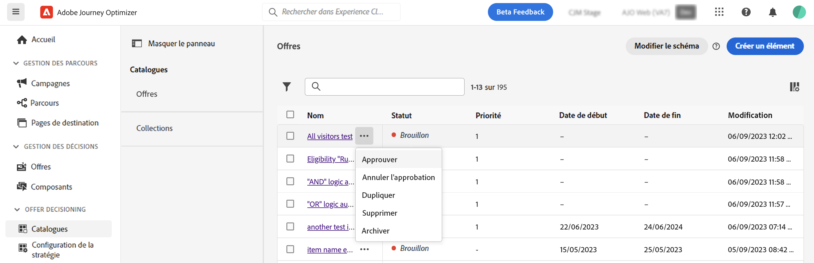

# Éléments de décision {#items}

>[!BEGINSHADEBOX]

Ce guide couvre les sujets suivants :

* [Prise en main de la prise de décision basée sur l’expérience](gs-experience-decisioning.md)
* Gérer les éléments de décision
   * [Configurer le catalogue d’éléments](catalogs.md)
   * **[Créer des éléments de décision](items.md)**
   * [Gérer des collections d’éléments](collections.md)
* Configurer la sélection d’éléments
   * [Créer des règles de décision](rules.md)
   * [Créer des méthodes de classement](ranking.md)
* [Créer des stratégies de sélection](selection-strategies.md)
* [Créer des stratégies de décision](create-decision.md)

>[!ENDSHADEBOX]

Journey Optimizer vous permet de créer des offres marketing, appelées éléments de décision, que vous pouvez créer et organiser dans un catalogue et des collections centralisés. Ils sont composés d’attributs standard et personnalisés, conçus précisément pour répondre à vos besoins. En outre, ils intègrent des contraintes de profil qui vous permettent de définir pour qui un élément de décision peut être affiché.

Avant de créer un élément de décision, veillez à créer un **règle de décision** si vous souhaitez définir des conditions pour déterminer à qui l’élément de décision peut être affiché. [Découvrez comment créer des règles de décision](rules.md).

## Créer votre premier élément de décision

Pour créer un élément de décision, procédez comme suit :

1. Accédez à **[!UICONTROL Experience Decisioning]** > **[!UICONTROL Éléments]**.

1. Définissez les attributs standard de l’élément de décision :

   1. Attribuez un nom et une description.
   1. Spécifiez les dates de début et de fin. L’élément ne sera pris en compte que par le moteur de prise de décision au cours de ces dates.
   1. Définissez la variable **[!UICONTROL Priorité]** de l’élément de décision par rapport aux autres, si un profil est admissible pour plusieurs éléments. Une priorité plus élevée accorde la priorité à l’élément par rapport aux autres.

   

1. Les attributs personnalisés sont des attributs spécifiques personnalisés, adaptés à vos besoins, que vous pouvez affecter à un élément de décision. Elles sont définies dans le schéma de catalogue des éléments de décision. [Découvrez comment utiliser des catalogues](catalogs.md)

1. Une fois les attributs de l’élément de décision définis, cliquez sur **[!UICONTROL Suivant]** pour définir les contraintes de profil de l’élément.

   Par défaut, tous les profils seront éligibles pour recevoir l’élément de décision, mais vous pouvez utiliser des audiences ou des règles pour limiter l’élément à des profils spécifiques uniquement, les deux solutions correspondant à différents usages. Pour plus d’informations, développez la section ci-dessous :

   +++Utilisation des audiences par rapport aux règles de prise de décision

   Pour faire simple, la sortie d’une audience est une liste de profils, tandis qu’une règle de décision est une fonction exécutée à la demande sur un seul profil pendant le processus de prise de décision.

   * **Audiences**: d’une part, les audiences sont un groupe de profils Adobe Experience Platform qui correspondent à une certaine logique basée sur les attributs de profil et les événements d’expérience. Cependant, la gestion des offres ne recalcule pas l’audience, qui peut ne pas être à jour lors de la présentation de l’offre.

   * **Règles de décision**: d’un autre côté, une règle de décision est basée sur les données disponibles dans Adobe Experience Platform et détermine à qui une offre peut être affichée. Une fois sélectionnée dans une offre ou une décision pour un emplacement donné, la règle est exécutée chaque fois qu’une décision est prise, ce qui garantit que chaque profil obtient la dernière et la meilleure offre.

+++

   

   * Pour limiter la présentation de l’élément de décision aux membres d’une ou de plusieurs audiences Adobe Experience Platform, sélectionnez la variable **[!UICONTROL Visiteurs appartenant à une ou plusieurs audiences]** , puis ajoutez une ou plusieurs audiences depuis le volet de gauche et combinez-les à l’aide de l’option **[!UICONTROL Et]** / **[!UICONTROL Ou]** opérateurs logiques. [En savoir plus sur les audiences](../audience/about-audiences.md).

   * Pour associer une règle de décision spécifique à l’élément de décision, sélectionnez **[!UICONTROL Par règle]**, puis faites glisser la règle de votre choix depuis le volet de gauche vers la zone centrale. [En savoir plus sur les règles de décision](rules.md).

   Lorsque vous sélectionnez des audiences ou des règles de décision, vous pouvez afficher des informations sur les profils qualifiés estimés. Cliquez sur **[!UICONTROL Actualiser]** pour mettre à jour les données.

   >[!NOTE]
   >
   >Les estimations de profil ne sont pas disponibles lorsque les paramètres de règle incluent des données qui ne figurent pas dans le profil, telles que des données contextuelles. Par exemple, une règle d’éligibilité qui exige que la météo actuelle soit de ≥80 degrés.

1. Une fois les contraintes de l’élément de décision définies, cliquez sur **[!UICONTROL Suivant]** pour réviser et enregistrer l’élément.

1. L’élément de décision apparaît désormais dans la liste, avec la variable **[!UICONTROL Version préliminaire]** statut. Lorsqu’il est prêt à être présenté aux profils, cliquez sur le bouton représentant des points de suspension et sélectionnez **[!UICONTROL Approuver]**.

   

## Gestion des éléments de décision

Dans la liste des éléments de décision, vous pouvez modifier un élément de décision, modifier son statut (**Version préliminaire**, **Approuvé**, **Archivé**), dupliquez ou supprimez-le.

Pour modifier un élément de décision, ouvrez-le, apportez vos modifications et enregistrez-le.

La sélection d’un élément de décision ou le clic sur le bouton représentant des points de suspension active les actions décrites ci-dessous.

* **[!UICONTROL Approuver]**: définit l’état de l’élément de décision sur Approuvé.
* **[!UICONTROL Annuler l’approbation]**: redéfinit l’état de l’élément de décision sur **[!UICONTROL Version préliminaire]**.
* **[!UICONTROL Dupliquer]**: crée un élément de décision avec des attributs et des contraintes identiques. Par défaut, le nouvel élément a la valeur **[!UICONTROL Version préliminaire]** statut.
* **[!UICONTROL Supprimer]**: supprime l’élément de décision de la liste.

  >[!IMPORTANT]
  >
  >Une fois supprimé, l’élément de décision et son contenu ne sont plus accessibles. Cette action ne peut pas être annulée. Si l’élément de décision est utilisé dans une collection ou une décision, il ne peut pas être supprimé. Vous devez d’abord supprimer l’élément de décision de tous les objets.

* **[!UICONTROL Archiver]**: définit l’état de l’élément de décision sur **[!UICONTROL Archivé]**. L’élément de décision est toujours disponible dans la liste, mais vous ne pouvez pas redéfinir son état sur **[!UICONTROL Version préliminaire]** ou **[!UICONTROL Approuvé]**. Vous pouvez uniquement la dupliquer ou la supprimer.
