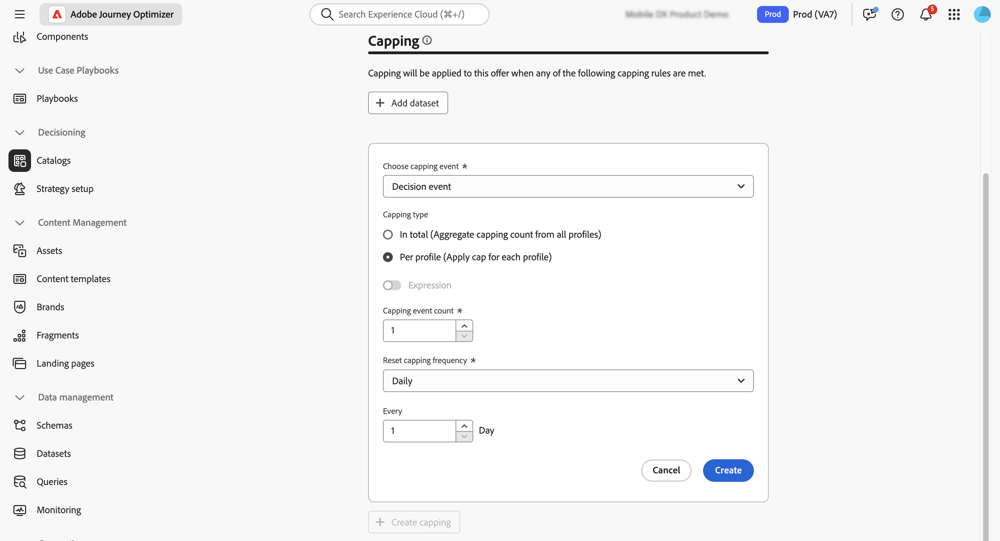
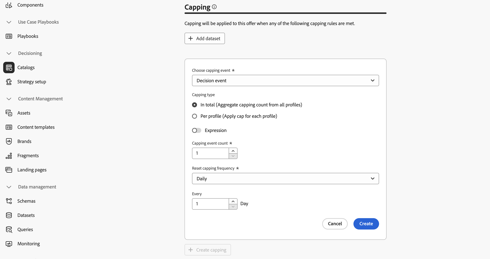

# Créer votre premier élément de décision {#items}

>[!CONTEXTUALHELP]
>id="ajo_exd_items"
>title="Gérer les éléments de décision"
>abstract="Journey Optimizer vous permet de créer des offres marketing, appelées éléments de décision, que vous pouvez créer et organiser dans un catalogue et des collections centralisés. Actuellement, tous les éléments de décision créés sont consolidés dans un seul catalogue « Offres ». Depuis cet écran, vous pouvez également accéder au schéma du catalogue à l’aide du bouton **Modifier le schéma** et créer des attributs personnalisés pour vos éléments de décision."

Journey Optimizer vous permet de créer des offres marketing, appelées éléments de décision, que vous pouvez créer et organiser dans un catalogue et des collections centralisés. Ils sont composés d’attributs standard et personnalisés, conçus précisément pour répondre à vos besoins. En outre, ils intègrent des contraintes de profil qui vous permettent de définir pour qui un élément de décision peut être affiché.

Avant de créer un élément de décision, veillez à créer une **règle de décision** si vous souhaitez définir des conditions pour déterminer pour qui l’élément de décision peut être affiché. [Découvrez comment créer des règles de décision](rules.md).

Pour créer un élément de décision, accédez à **[!UICONTROL Prise de décision]** > **[!UICONTROL Catalogues]**, puis cliquez sur **[!UICONTROL Créer un élément]** et suivez les étapes présentées dans les sections ci-dessous.

## Définir les attributs de l’élément de décision {#attributes}

>[!CONTEXTUALHELP]
>id="ajo_exd_item_priority"
>title="Définir la priorité de l’élément de décision"
>abstract="Si un profil est admissible pour plusieurs éléments, la priorité permet de comparer cet élément de décision à d’autres. Une priorité plus élevée confère à l’élément une préséance sur les autres."

>[!CONTEXTUALHELP]
>id="ajo_exd_item_custom_attributes"
>title="Définir les attributs personnalisés"
>abstract="Les attributs personnalisés sont des attributs spécifiques, adaptés à vos besoins, que vous pouvez affecter à un élément de décision. Ils sont créés dans le schéma de catalogue des éléments de décision. Cette section s’affiche uniquement si vous avez ajouté au moins un attribut personnalisé au schéma de catalogue."

Commencez par définir les attributs standard et personnalisés de l’élément de décision :

1. Saisissez un nom et une description.
1. Spécifiez les dates de début et de fin. L’élément sera pris en compte par le moteur de prise de décision dans cette plage de dates.
1. Définissez la **[!UICONTROL Priorité]** de l’élément de décision par rapport aux autres, si un profil est qualifié pour plusieurs éléments. Une priorité plus élevée confère à l’élément une préséance sur les autres.

   >[!NOTE]
   >
   >La priorité est un type de données Entier. Tous les attributs qui sont des types de données Entier doivent contenir des valeurs entières (pas de décimales).

1. Le champ **Balises** vous permet d’affecter des balises unifiées Adobe Experience Platform à vos éléments de décision. Vous pouvez ainsi facilement les classer et améliorer la recherche. [Découvrir comment utiliser les balises](../start/search-filter-categorize.md#tags)

1. Utilisez des fragments pour ajouter plusieurs contenus à l’élément de décision, par exemple, si vous souhaitez afficher différents contenus pour plusieurs modèles d’appareils mobiles. [En savoir plus sur les fragments](../content-management/fragments.md)

   >[!AVAILABILITY]
   >
   >Les fragments dans les éléments de décision ne sont actuellement disponibles que pour un ensemble d’organisations (disponibilité limitée). Pour plus d’informations, contactez votre représentant ou représentante Adobe.

   Dans la section **[!UICONTROL Fragments]**, sélectionnez les fragments publiés que vous souhaitez utiliser et attribuez-leur une clé de référence. Vous pouvez ensuite utiliser ces fragments dans vos politiques de décision. [Voici comment procéder](create-decision.md#fragments)

   {width=70%}

   Vous pouvez uniquement sélectionner les fragments publiés et ajouter jusqu’à six fragments dans un élément de décision.

   >[!WARNING]
   >
   >Actuellement, seuls les [fragments d’expression](../personalization/use-expression-fragments.md) sont pris en charge.
   >
   >Les fragments imbriqués (fragments référençant d’autres fragments) ne peuvent pas être utilisés. L’[approbation](#approve) de l’élément de décision échoue si vous ajoutez un tel fragment.

1. Spécifiez des attributs personnalisés (facultatif). Les attributs personnalisés sont des attributs spécifiques, adaptés à vos besoins, que vous pouvez affecter à un élément de décision. Ils sont définis dans le schéma de catalogue des éléments de décision. [Découvrez comment utiliser les catalogues](catalogs.md).

1. Une fois les attributs de l’élément de décision définis, cliquez sur **[!UICONTROL Suivant]**.

## Configurer l’éligibilité de l’élément de décision {#eligibility}

>[!CONTEXTUALHELP]
>id="ajo_exd_item_constraints"
>title="Ajouter des audiences ou des règles de décision"
>abstract="Par défaut, tous les profils seront éligibles pour recevoir l’élément de décision; Vous pouvez toutefois utiliser des audiences ou des règles pour limiter l’élément à des profils spécifiques uniquement."

<!--
>"additional-url="https://experienceleague.adobe.com/fr/docs/journey-optimizer/using/audiences-profiles-identities/audiences/about-audiences" text="Use audiences"
>additional-url="https://experienceleague.adobe.com/fr/docs/journey-optimizer/using/decisioning/experience-decisioning/rules" text="Use decision rules"
-->

Par défaut, tous les profils seront éligibles pour recevoir l’élément de décision; Vous pouvez toutefois utiliser des audiences ou des règles pour limiter l’élément à des profils spécifiques uniquement ; les deux solutions correspondant à différents usages. Pour plus d’informations, développez la section ci-dessous :

+++Utiliser les audiences ou les règles de décision

Pour faire simple, la sortie d’une audience est une liste de profils, tandis qu’une règle de décision est une fonction exécutée à la demande sur un seul profil pendant le processus de prise de décision.

* **Audiences** : d’un côté, les audiences sont un groupe de profils Adobe Experience Platform qui correspondent à une certaine logique basée sur les attributs de profil et les événements d’expérience. Cependant, la gestion des offres ne recalcule pas l’audience, qui peut ne pas être à jour lors de la présentation de l’offre.

* **Règles de décision** : d’un autre côté, une règle de décision est basée sur les données disponibles dans Adobe Experience Platform et détermine à qui une offre peut être montrée. Une fois sélectionnée dans une offre ou une décision pour un emplacement donné, la règle est exécutée chaque fois qu’une décision est prise, ce qui garantit que chaque profil obtient la dernière et la meilleure offre.

+++

* Pour limiter la présentation de l’élément de décision aux membres d’une ou de plusieurs audiences Adobe Experience Platform, sélectionnez l’option **[!UICONTROL Visiteurs et visiteuses appartenant à une ou plusieurs audiences]**, puis ajoutez une ou plusieurs audiences depuis le volet de gauche et combinez-les à l’aide des opérateurs logiques **[!UICONTROL Et]**/**[!UICONTROL Ou]**. [En savoir plus sur les audiences](../audience/about-audiences.md).

* Pour associer une règle de décision spécifique à l’élément de décision, sélectionnez **[!UICONTROL Par règle]**, puis faites glisser la règle de votre choix du volet de gauche vers la zone centrale. [En savoir plus sur les règles de décision](rules.md).

Lorsque vous sélectionnez des audiences ou des règles de décision, vous pouvez afficher des informations sur les profils qualifiés estimés. Cliquez sur **[!UICONTROL Actualiser]** pour mettre à jour les données.

>[!NOTE]
>
>Les estimations de profil ne sont pas disponibles lorsque les paramètres de règle incluent des données qui ne figurent pas dans le profil, telles que des données contextuelles. Par exemple, une règle d’éligibilité qui exige que la météo actuelle soit de ≥80 degrés.

## Configurer les règles de limitation {#capping}

>[!CONTEXTUALHELP]
>id="ajo_exd_item_capping_expression"
>title="Expression"
>abstract="Au lieu d’utiliser une valeur statique pour le seuil de limitation, vous pouvez définir votre propre expression. Vous pouvez ainsi calculer le seuil de manière dynamique à l’aide d’attributs de décision et/ou d’attributs externes d’un jeu de données Adobe Experience Platform.  Les **expressions** de règle de limitation sont actuellement en disponibilité limitée pour l’ensemble des utilisateurs et utilisatrices. Elles ne sont prises en charge que pour le type de limitation **[!UICONTROL Au total]**."

La limitation est utilisée comme contrainte pour définir le nombre maximal de fois où un élément d’offre peut être présenté. Limiter le nombre de fois où les personnes reçoivent des offres spécifiques vous permet d’éviter de sur-solliciter votre clientèle et donc d’optimiser chaque point de contact avec la meilleure offre. Vous pouvez créer jusqu’à 10 limitations pour un élément de décision donné.

>[!NOTE]
>
>
>La mise à jour de la valeur du compteur de limitations peut prendre jusqu’à 3 secondes. Prenons l’exemple suivant : vous présentez une offre sur la bannière web de votre site web. Si une personne accède à la page suivante de votre site web en moins de 3 secondes, la valeur du compteur ne sera pas incrémentée pour cette personne.

Lors de la configuration des règles de limitation, vous pouvez référencer des attributs stockés dans les jeux de données Adobe Experience Platform pour définir des seuils. Pour utiliser un jeu de données, sélectionnez-le dans la section **[!UICONTROL Jeu de données]**.

>[!NOTE]
>
>Cette fonctionnalité est actuellement en disponibilité limitée pour l’ensemble des utilisateurs et utilisatrices. Vous trouverez des informations détaillées sur son utilisation dans cette section : [Utiliser les données Adobe Experience Platform pour la prise de décision](../experience-decisioning/aep-data-exd.md).

Pour définir des règles de limitation pour l’élément de décision, cliquez sur le bouton **[!UICONTROL Créer une limitation]**, puis procédez comme suit :

1. Définissez l’**[!UICONTROL événement de limitation]** à prendre en compte pour augmenter le compteur.

   * **[!UICONTROL Événement de décision]** (valeur par défaut) : nombre maximal de fois où une offre peut être présentée.
   * **[!UICONTROL Impression]** (canaux entrants uniquement) : nombre maximal de fois où l’offre peut être présentée à un utilisateur ou une utilisatrice.
   * **[!UICONTROL Clics]** : nombre maximal de fois où l’utilisateur ou l’utilisatrice peut cliquer sur un élément de décision.
   * **[!UICONTROL Événement personnalisé]** : vous pouvez définir un événement personnalisé afin de limiter le nombre de fois où l’élément est envoyé. Par exemple, vous pouvez limiter la validité d’un bon à 10 000 utilisations ou jusqu’à ce qu’un profil donné l’ait utilisé 1 fois. Pour ce faire, utilisez les schémas [XDM d’Adobe Experience Platform](https://experienceleague.adobe.com/docs/experience-platform/xdm/home.html?lang=fr){target="_blank"} pour créer une règle d’événement personnalisé.

   >[!NOTE]
   >
   >Pour tous les événements de limitation, à l’exception des événements de décision, les commentaires sur la gestion des décisions peuvent ne pas être collectés automatiquement, ce qui peut entraîner une incrémentation incorrecte du compteur de limitation. Pour vous assurer que chaque événement de limitation est suivi et comptabilisé dans le compteur de limitation, vérifiez que le schéma utilisé pour collecter les événements d’expérience inclut le groupe de champs approprié pour cet événement. Des informations détaillées sur la collecte de données sont disponibles dans la documentation relative à la gestion des décisions de Journey Optimizer :
   >* [Collecte de données sur la gestion des décisions](data-collection/data-collection.md)
   >* [Configurer la collecte de données](data-collection/schema-requirement.md)

1. Choisir le type de limitation :

   * Sélectionnez **[!UICONTROL Au total]** pour définir le nombre de fois où un élément peut être proposé dans l’audience cible combinée, ce qui signifie pour l’ensemble des utilisateurs et utilisatrices. Par exemple, si vous êtes une entreprise distribuant de l’électronique qui a conclu un « contrat télévisuel d’offre d’ouverture », vous souhaitez que l’offre ne soit renvoyée que 200 fois sur tous les profils.

   * Sélectionnez **[!UICONTROL Par profil]** pour définir le nombre de fois où l’offre peut être proposée à la même personne. Par exemple, si vous êtes une banque avec une offre « Carte de crédit Platinum », vous ne souhaitez pas que cette offre soit présentée plus de 5 fois par profil. En effet, vous pensez que si l’utilisateur ou l’utilisatrice a vu l’offre 5 fois sans réagir à celle-ci, il ou elle sera plus susceptible de passer à l’action lors de la meilleure offre suivante.

1. Définissez le seuil de limitation. Pour ce faire, vous pouvez saisir une valeur statique ou calculer le seuil à l’aide d’une expression. Pour plus d’informations, développez les sections ci-dessous.

   +++Seuil statique

   Dans le champ **[!UICONTROL Limiter le nombre de limitations]**, indiquez le nombre de fois où l’offre peut être présentée à l’ensemble des utilisateurs et utilisatrices ou à chaque profil, en fonction du type de limitation sélectionné. Le nombre doit être un entier supérieur à 0.

   Par exemple, vous avez défini un événement de limitation personnalisé comme le nombre de passages en caisse pris en compte. Si vous saisissez « 10 » dans le champ **[!UICONTROL Limiter le nombre de limitations]**, aucune autre offre ne sera envoyée après 10 passages en caisse.

   +++

   +++Seuil d’expression

   Au lieu d’utiliser une valeur statique pour le seuil de limitation, vous pouvez définir votre propre expression. Vous pouvez ainsi calculer le seuil de manière dynamique à l’aide d’attributs de décision et/ou d’attributs externes d’un jeu de données Adobe Experience Platform.

   Par exemple, un ou une spécialiste marketing peut décider d’ajouter un multiplicateur pour ajuster l’exposition. Cette personne peut notamment multiplier l’inventaire disponible par deux, ce qui permet à l’offre d’être présentée à deux fois plus de clients et clientes que d’unités disponibles. Cette approche prévoit que tous les clients et toutes les clientes ne convertiront pas, assurant ainsi une meilleure portée sans surenchérir.

   >[!NOTE]
   >
   >Les **expressions** de règle de limitation sont actuellement en disponibilité limitée pour l’ensemble des utilisateurs et utilisatrices. Elles ne sont prises en charge que pour le type de limitation **[!UICONTROL Au total]**.

   Pour utiliser une expression, activez l’option **[!UICONTROL Expression]**, puis modifiez l’expression selon vos besoins.

   

   +++

1. Dans la liste déroulante **[!UICONTROL Réinitialiser la fréquence de limitation]**, définissez la fréquence à laquelle le compteur de limitation est réinitialisé. Pour ce faire, définissez la période du comptage (tous les jours, toutes les semaines ou tous les mois) et saisissez le nombre de jours, semaines ou mois de votre choix. Par exemple, si vous souhaitez que le nombre de limitations soit réinitialisé toutes les 2 semaines, sélectionnez **[!UICONTROL Hebdomadaire]** dans la liste déroulante correspondante et saisissez **2** dans l’autre champ.

   * Le compteur de capping de la fréquence se réinitialise à **00 h 00 UTC**, le jour que vous avez défini ou le premier jour de la semaine ou du mois, le cas échéant. Le jour de début de semaine est le **dimanche**. La durée que vous avez choisie ne peut pas dépasser **2 ans** (ou le nombre correspondant de mois, de semaines ou de jours).

   * Une fois que vous avez publié votre élément de décision, vous ne pourrez plus modifier la période (mensuelle, hebdomadaire ou quotidienne) de la fréquence. Vous pouvez désormais modifier le capping de la fréquence si le statut de l’élément est **[!UICONTROL Brouillon]** et si l’élément n’a jamais été publié auparavant avec le capping de la fréquence activé.

   * Une durée de mise en mémoire tampon maximale de 15 minutes peut être nécessaire avant que les événements ne soient comptabilisés dans les contraintes de capping de la fréquence, soit lorsque l’élément de décision est approuvé, soit lorsque la limitation est créée, selon ce qui se produit en dernier.

1. Cliquez sur **[!UICONTROL Créer]** pour confirmer la création de la règle de limitation. Vous pouvez créer jusqu’à 10 règles pour un seul élément de décision. Pour ce faire, cliquez sur le bouton **[!UICONTROL Créer une limitation]** et répétez les étapes ci-dessus.

   

<!--* Identifying how many times a given customer has been shown a decision item. 
If a marketer wants to determine how many times a specific customer has been shown an offer, they can do that. Go to Profiles menu, Attributes tab. You'll see all counter values. The alphanumeric string is associated to the offer. To make the map, go to an item, in the URL check the last alphanumeric strings. D stands for day, w stands for week, m for month. "Ce" custom event-->

## Vérifier et approuver l’élément de décision {#approve}

1. Une fois l’éligibilité et les règles de limitation définies pour l’élément de décision, cliquez sur **[!UICONTROL Suivant]** pour vérifier l’élément et l’enregistrer.

1. L’élément de décision apparaît désormais dans la liste, avec le statut **[!UICONTROL Brouillon]**. Lorsqu’il est prêt à être présenté aux profils, cliquez sur le bouton représentant des points de suspension et sélectionnez **[!UICONTROL Approuver]**.

   

## Gérer les éléments de décision {#manage}

Dans la liste des éléments de décision, vous pouvez modifier un élément de décision, modifier son statut (**Brouillon**, **Approuvé**, **Archivé**), le dupliquer ou le supprimer.

Pour modifier un élément de décision, ouvrez-le, apportez vos modifications et enregistrez-le.

Sélectionner un élément de décision ou cliquer sur le bouton représentant des points de suspension active les actions décrites ci-dessous.

* **[!UICONTROL Approuver]** : définit l’état de l’élément de décision sur Approuvé.
* **[!UICONTROL Annuler l’approbation]** : redéfinit le statut de l’élément de décision sur **[!UICONTROL Brouillon]**.
* **[!UICONTROL Dupliquer]** : crée un élément de décision avec des attributs et des contraintes identiques. Par défaut, le nouvel élément a le statut **[!UICONTROL Brouillon]**.
* **[!UICONTROL Supprimer]** : supprime l’élément de décision de la liste.

  >[!IMPORTANT]
  >
  >Une fois supprimés, l’élément de décision et son contenu ne sont plus accessibles. Cette action ne peut pas être annulée.

  Les éléments d’offre approuvés ne peuvent pas être supprimés s’ils sont utilisés dans une collection ou une décision. Pour les supprimer, changez leur statut en « Brouillon ». Pour ce faire, cliquez sur le bouton représentant des points de suspension et sélectionnez **[!UICONTROL Annuler l’approbation]**.

  

* **[!UICONTROL Archiver]** : définit le statut de l’élément de décision sur **[!UICONTROL Archivé]**. L’élément de décision est toujours disponible dans la liste, mais vous ne pouvez pas redéfinir son statut sur **[!UICONTROL Brouillon]** ou sur **[!UICONTROL Approuvé]**. Vous pouvez uniquement le dupliquer ou le supprimer.

