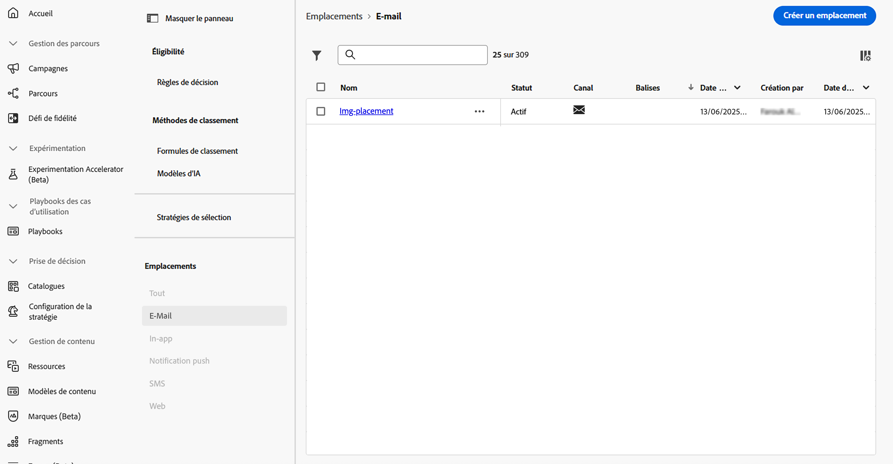
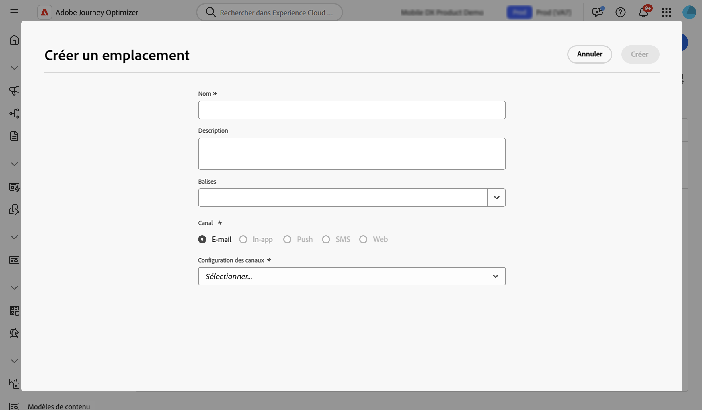
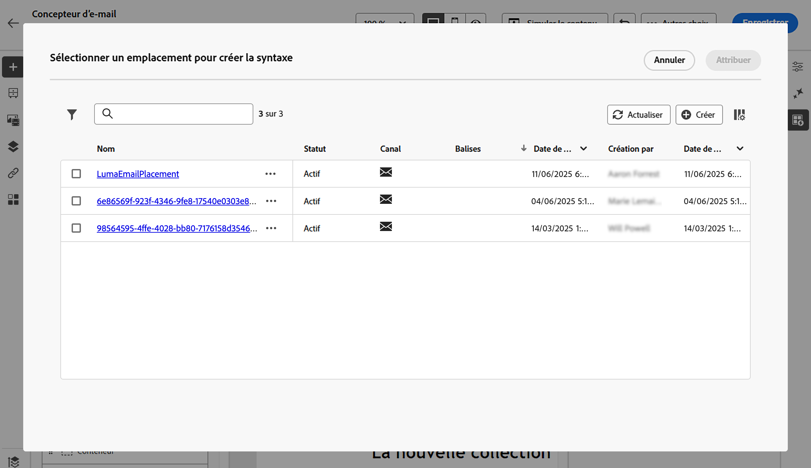

# Utiliser des emplacements {#create-decision}

## À propos des emplacements {#about}

Un emplacement est un conteneur utilisé pour présenter des éléments de décision. Il permet de s’assurer que le contenu d’offre approprié s’affiche au bon endroit dans votre message.

Lorsque vous ajoutez une politique de décision à un e-mail, vous devez associer un emplacement au composant qui affichera les éléments de décision renvoyés. Cela vous permet, par exemple, de suivre les performances des éléments de décision à différents emplacements dans les rapports.

La liste des emplacements est accessible dans le menu **[!UICONTROL Configuration de la stratégie]**. Des filtres sont disponibles pour récupérer des emplacements en fonction d’une surface de canal spécifique ou des balises.

>[!NOTE]
>
>Pour l’instant, les emplacements ne sont disponibles que pour le canal E-mail.

## Créer un emplacement {#create}

Pour créer une emplacement, procédez comme suit :

1. Accédez au menu **[!UICONTROL Configuration de la stratégie]**, sélectionnez **[!UICONTROL E-mail]**, puis cliquez sur le bouton **[!UICONTROL Créer un emplacement]**.

   Vous pouvez également créer un emplacement directement à partir du Concepteur d’e-mail lors de l’ajout d’une politique de décision. [Découvrez comment associer un emplacement à un composant d’e-mail](../experience-decisioning/create-decision.md#save).

1. Définissez les propriétés de l&#39;emplacement :

   

   * **[!UICONTROL Nom]** : nom de l&#39;emplacement. Veillez à définir un nom significatif pour le récupérer plus facilement.
   * **[!UICONTROL Description]** : description de l’emplacement.
   * **[!UICONTROL Balises]** : attribuez des balises unifiées Adobe Experience Platform à l’emplacement. Vous pouvez ainsi facilement les classer et améliorer la recherche. [Découvrir comment utiliser les balises](../start/search-filter-categorize.md#tags)
   * **[!UICONTROL Canal]** : canal pour lequel l’emplacement sera utilisé. Pour l’instant, les emplacements ne sont disponibles que pour les e-mails.
   * **[!UICONTROL Configuration des canaux]** : associez une configuration de canal à l’emplacement. [Découvrez comment configurer des canaux](../configuration/channel-surfaces.md).

1. Cliquez sur **[!UICONTROL Créer]**.

Une fois l’emplacement créé, il s’affiche dans la liste des emplacements lors de l’ajout d’une politique de décision dans un e-mail. Vous pouvez le sélectionner pour afficher ses propriétés et le modifier. [Découvrez comment créer des politiques de décision](../experience-decisioning/create-decision.md).

