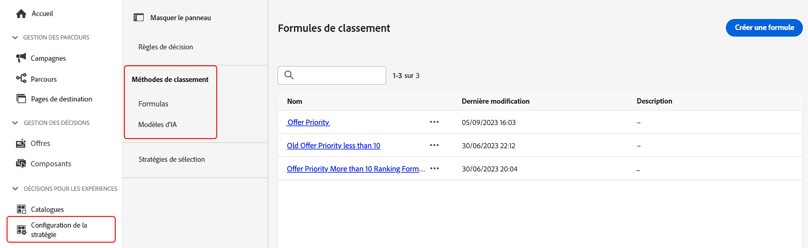

# Méthodes de classement {#rankings}

>[!CONTEXTUALHELP]
>id="ajo_exd_config_formulas"
>title="Créer des formules de classement"
>abstract="Les formules vous permettent de définir des règles déterminant l’élément qui doit être présenté en premier au lieu de prendre en compte les scores de priorité de l’élément. Une fois qu’une méthode de classement a été créée, vous pouvez l’affecter à une stratégie de sélection afin de définir les éléments à sélectionner en premier."

Les méthodes de classement vous permettent de classer les éléments à afficher pour un profil donné. Une fois qu’une méthode de classement a été créée, vous pouvez l’affecter à une stratégie de sélection afin de définir les éléments à sélectionner en premier.

Deux types de méthodes de classement sont disponibles :

* Les **formules** vous permettent de définir des règles déterminant l’élément qui doit être présenté en premier au lieu de prendre en compte les scores de priorité de l’élément.

* Les **modèles d’IA** vous permettent d’utiliser des systèmes de modèles entraînés qui exploitent plusieurs points de données pour déterminer l’élément qui doit être présenté en premier.

## Créer des méthodes de classement {#create}

Pour créer une méthode de classement, procédez comme suit :

1. Accédez au menu **[!UICONTROL Configuration de la stratégie]**, puis sélectionnez le menu **[!UICONTROL Formules]** ou **[!UICONTROL Modèles d’IA]** en fonction du type de classement que vous souhaitez utiliser.

1. Cliquez sur le bouton **[!UICONTROL Créer une formule]** ou **[!UICONTROL Créer un modèle d’IA]** dans le coin supérieur droit de l’écran.

   

1. Configurez la formule ou le modèle d’IA en fonction de vos besoins, puis enregistrez la formule ou le modèle.

   Des informations détaillées sur la création de formules de classement et de modèles d’IA sont disponibles dans la documentation sur la gestion des décisions :

   * [Formules de classement](../offers/ranking/create-ranking-formulas.md)
   * [Modèles d’IA](../offers/ranking/ai-models.md)

   >[!NOTE]
   >
   >La profondeur d’imbrication dans une formule de classement est limitée à 30 niveaux. Ceci est mesuré en comptant les parenthèses fermantes `)` dans la chaîne PQL. La taille d’une chaîne de règle peut aller jusqu’à 8 Ko pour les caractères codés en UTF-8. Cela équivaut à 8 000 caractères ASCII (1 octet chacun) ou 2 000 à 4 000 caractères non ASCII (2 à 4 octets chacun). [En savoir plus sur les barrières de sécurité et les limitations de prise de décision](gs-experience-decisioning.md#guardrails)

Une politique de décision prend en charge jusqu’à 10 stratégies de sélection et éléments de décision combinés. [En savoir plus sur les barrières de sécurité et les limitations de prise de décision](gs-experience-decisioning.md#guardrails)

+++ Optimisation de modèles sur des mesures [!DNL Customer Journey Analytics] personnalisées

>[!NOTE]
>
>Cette fonctionnalité est disponible uniquement pour les clients [!DNL Customer Journey Analytics] disposant de droits d’administration.
>
>Avant de commencer, assurez-vous d’avoir intégré Journey Optimizer à Customer Journey Analytics afin d’exporter des jeux de données Journey Optimizer dans vos vues de données par défaut. [Découvrez comment exploiter les  [!DNL Journey Optmizer] données dans [!DNL Customer Journey Analytics]](../reports/cja-ajo.md)

Les modèles d’optimisation personnalisés sont un type de modèle d’IA qui vous permet de définir des objectifs commerciaux et d’utiliser les données clients pour former des modèles orientés vers l’entreprise afin de proposer des offres personnalisées et d’optimiser les IPC. Vous trouverez des informations détaillées sur la création d’un modèle d’IA personnalisé dans la [documentation sur la gestion des décisions](../offers/ranking/personalized-optimization-model.md).

Par défaut, les modèles d’optimisation personnalisés utilisent **clics sur les offres** comme mesure d’optimisation. Si vous utilisez [!DNL Customer Journey Analytics], [!DNL Decisioning] vous permet d’exploiter vos propres mesures personnalisées pour optimiser votre modèle.

Pour ce faire, accédez à l’écran de création de modèle d’IA personnalisé et développez la liste déroulante **[!UICONTROL Conversion event]** . Toutes les mesures de votre [!DNL Customer Journey Analytics] [vue de données](https://experienceleague.adobe.com/en/docs/analytics-platform/using/cja-dataviews/data-views){target="_blank"} par défaut s’affichent dans la liste. Sélectionnez la mesure sur laquelle vous souhaitez optimiser votre modèle, puis effectuez la création du modèle AI comme vous le faites habituellement.

>[!NOTE]
>
>Par défaut, les mesures de [!DNL Customer Journey Analytics] utilisent un modèle d’attribution &quot;Dernière touche&quot;, qui attribue 100 % du crédit au point de contact qui survient le plus récemment avant la conversion.
>
>Bien qu’il soit possible de modifier le modèle d’attribution, tous les modèles d’attribution ne sont pas idéaux pour l’optimisation du modèle d’IA. Nous vous recommandons de sélectionner soigneusement un modèle d’attribution qui s’aligne sur vos objectifs d’optimisation afin d’assurer la précision et les performances du modèle.
>
>Pour plus d’informations sur les modèles d’attribution disponibles et des conseils sur leur utilisation, consultez la [[!DNL Customer Journey Analytics] documentation](https://experienceleague.adobe.com/en/docs/analytics-platform/using/cja-dataviews/component-settings/attribution){target="_blank"}

+++

## Utiliser des attributs d’éléments de décision dans des formules {#items}

Les formules de classement sont exprimées en **syntaxe PQL** et peuvent utiliser divers attributs, tels que les attributs de profil, les [données contextuelles](context-data.md) et les attributs liés à vos éléments de décision.

Pour utiliser des attributs liés à vos éléments de décision dans des formules, veillez à respecter la syntaxe ci-dessous dans le code de votre formule de classement. Pour plus d’informations, développez chaque section :

+++Utiliser des attributs standard d’éléments de décision

+++

+++Utiliser des attributs personnalisés d’éléments de décision

+++
