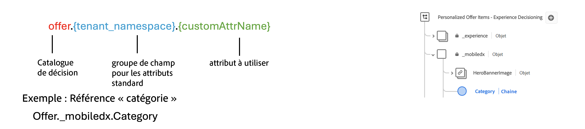

# Méthodes de classement {#rankings}

>[!CONTEXTUALHELP]
>id="ajo_exd_config_formulas"
>title="Créer des formules de classement"
>abstract="Les formules vous permettent de définir des règles déterminant l’élément qui doit être présenté en premier au lieu de prendre en compte les scores de priorité de l’élément. Une fois qu’une méthode de classement a été créée, vous pouvez l’affecter à une stratégie de sélection afin de définir les éléments à sélectionner en premier."

Les méthodes de classement vous permettent de classer les éléments à afficher pour un profil donné. Une fois qu’une méthode de classement a été créée, vous pouvez l’affecter à une stratégie de sélection afin de définir les éléments à sélectionner en premier.

Deux types de méthodes de classement sont disponibles :

* Les **formules** vous permettent de définir des règles déterminant l’élément qui doit être présenté en premier au lieu de prendre en compte les scores de priorité de l’élément.

* Les **modèles d’IA** vous permettent d’utiliser des systèmes de modèles entraînés qui exploitent plusieurs points de données pour déterminer l’élément qui doit être présenté en premier.

## Créer des méthodes de classement {#create}

Pour créer une méthode de classement, procédez comme suit :

1. Accédez au menu **[!UICONTROL Configuration de la stratégie]**, puis sélectionnez le menu **[!UICONTROL Formules]** ou **[!UICONTROL Modèles d’IA]** en fonction du type de classement que vous souhaitez utiliser.

1. Cliquez sur le bouton **[!UICONTROL Créer une formule]** ou **[!UICONTROL Créer un modèle d’IA]** dans le coin supérieur droit de l’écran.

   

1. Configurez la formule ou le modèle d’IA en fonction de vos besoins, puis enregistrez la formule ou le modèle.

   Des informations détaillées sur la création de formules de classement et de modèles d’IA sont disponibles dans la documentation sur la gestion des décisions :

   * [Formules de classement](../offers/ranking/create-ranking-formulas.md)
   * [Modèles d’IA](../offers/ranking/ai-models.md)

## Utiliser des attributs d’éléments de décision dans des formules {#items}

Les formules de classement sont exprimées en **syntaxe PQL** et peuvent utiliser divers attributs, tels que les attributs de profil, les [données contextuelles](context-data.md) et les attributs liés à vos éléments de décision.

Pour utiliser des attributs liés à vos éléments de décision dans des formules, veillez à respecter la syntaxe ci-dessous dans le code de votre formule de classement. Pour plus d’informations, développez chaque section :

+++Utiliser des attributs standard d’éléments de décision

+++

+++Utiliser des attributs personnalisés d’éléments de décision

+++
