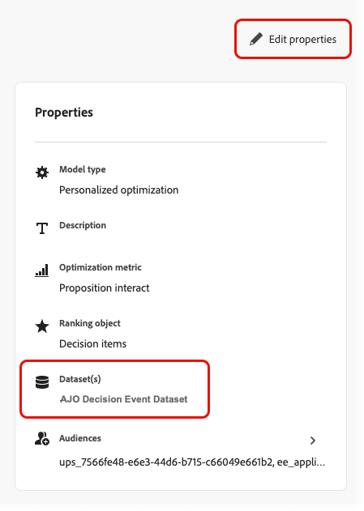

# Surveiller vos modèles d’IA {#ai-model-observability}

Que vous soyez spécialiste du marketing, spécialiste des données ou administrateur de prise de décision, comprendre les performances et le comportement de vos modèles d’optimisation personnalisés vous permet de sélectionner les meilleures offres pour chaque client à l’aide de l’IA.

Pour ce faire, vous pouvez surveiller l’intégrité, l’état de l’entraînement et l’évolution de vos modèles d’IA directement dans [!DNL Journey Optimizer].

Vous pouvez ainsi déterminer clairement si votre modèle fonctionne, quand il a été formé pour la dernière fois, ce qui s’est passé au cours de la formation, comment il génère les résultats de votre entreprise (par exemple, les conversions ou les recettes) et déterminer s’il ne fonctionne pas<!-- (for example, unexpected decision item count, training data date range, or insufficient events)-->.

>[!AVAILABILITY]
>
>Actuellement, cette fonctionnalité n’est prise en charge que pour les modèles [optimisation personnalisée](personalized-optimization-model.md).

➡️ [Découvrez cette fonctionnalité en vidéo](#video)

## Afficher le statut de l’entraînement {#from-ai-model-list}

Une fois qu’un modèle est défini sur actif, il entre dans un cycle de vie continu : les données sont collectées et le modèle est périodiquement entraîné pour optimiser le classement des offres. Vous pouvez vérifier le statut d’entraînement de vos modèles d’optimisation personnalisés dans la liste des modèles d’IA.

1. Accédez à **[!UICONTROL Prise de décision]** > **[!UICONTROL Configuration de la stratégie]** > **[!UICONTROL Modèles d’IA]** pour ouvrir l’inventaire des modèles d’IA.

1. Vous pouvez afficher tous les modèles d’IA disponibles et leur statut.

1. Pour chaque modèle d’IA **[!UICONTROL en ligne]** du type Optimisation personnalisée , deux colonnes permettent de voir :
   * la date de la dernière tâche de formation (**[!UICONTROL Dernière formation]**), et
   * Si chaque modèle a été correctement entraîné ou non (**[!UICONTROL résultat de l’entraînement]**).

   

   Vous pouvez ainsi identifier rapidement les modèles qui nécessitent une étude ou un dépannage plus approfondis.

## Accès à un rapport de statut du modèle {#access-ai-model-details}

Cliquez dans un modèle d’IA d’optimisation personnalisé dans la liste. De là, vous pouvez afficher les éléments répertoriés ci-dessous :

* **[!UICONTROL Modèle actuellement déployé]** - Cette section indique le modèle actuellement déployé, la date de déploiement, la période de données qu’il utilise, le nombre d’éléments de décision (offres) inclus et personnalisés, ainsi que l’affectation actuelle du trafic entre les sous-modèles<!-- (random exploration, new offer booster?, contextual bandit, neural network)-->.

  

  Dans cet exemple, le modèle a été entraîné sur cinq éléments de décision et le modèle a suffisamment de trafic pour développer des prédictions personnalisées pour trois des éléments de décision. Les deux éléments de décision restants sont diffusés au hasard.

  Vous pouvez également constater que le modèle alloue actuellement 40 % du trafic au réseau neuronal personnalisé, 40 % du trafic au bandit contextuel et 20 % du trafic à l’exploration aléatoire.

* **[!UICONTROL Dernière tâche de formation]** - Cette section affiche le statut de la dernière tâche de formation, la date de son exécution et les messages d’erreur éventuels. [En savoir plus sur les états d’erreur](#check-for-error-states)

  

  Dans cet exemple, vous pouvez constater que le modèle déployé correspond à la tâche de formation prévue.

* **[!UICONTROL Propriétés]** - Cette section affiche les propriétés du modèle, telles que le jeu de données utilisé, la mesure d’optimisation et les audiences utilisées pour entraîner le modèle d’optimisation personnalisé.

  

  Cliquez sur **[!UICONTROL Modifier les propriétés]** pour modifier ces éléments. Vous serez redirigé vers l’écran Créer un modèle d’IA . [En savoir plus](create-ai-models.md)

* **[!DNL Model performance]** - Cette section présente les performances de chaque branche du modèle au fil du temps, telles que l’affectation du trafic et le taux de conversion pour chaque sous-modèle. Vous pouvez basculer entre les **7 derniers jours** et les **30 derniers jours**. L’effet élévateur et la signification statistique sont les indicateurs clés permettant de déterminer si le modèle améliore réellement vos résultats marketing.

  

  Dans cet exemple, vous pouvez constater qu’au cours des 30 derniers jours, les sous-modèles personnalisés ont entraîné une augmentation de plus de 60 % du taux de conversion. Cette augmentation est statistiquement significative, ce qui signifie que ce modèle d’IA a un impact sur votre entreprise.

* **[!UICONTROL Affectation du trafic du modèle au fil du temps]** - Cette section montre comment votre modèle a évolué au fil du temps. Lorsqu’un modèle est déployé pour la première fois, 100 % du trafic est aléatoire, car aucune donnée d’offre n’a encore été collectée. Après le premier recyclage, le trafic se déplace généralement vers les bras personnalisés.

  

  Dans cet exemple, vous pouvez constater que l’affectation du trafic est passée d’une exploration aléatoire à 100 % à un trafic de réseau neuronal et de bandit contextuel, le modèle ayant été recyclé au fil du temps.

## Comprendre les erreurs d’identification {#check-for-error-states}

Pour afficher les détails d’erreur d’un modèle d’IA d’optimisation personnalisé dont la dernière tâche de formation a échoué, procédez comme suit.

1. Cliquez dans le modèle dans la liste. Les détails du statut du modèle s’affichent.

   {width="95%"}

   Dans cet exemple, vous pouvez constater qu’aucun modèle n’est déployé, car la dernière tâche de formation a échoué.

   >[!NOTE]
   >
   >Lorsqu’aucun modèle n’est déployé, les demandes de décision sont diffusées à l’aide d’une affectation de trafic aléatoire uniforme.

1. Parcourez les détails de l’erreur dans la section **[!UICONTROL Dernière tâche de formation]**.

   {width="70%"}

   Une tâche de formation échoue généralement lorsque le jeu de données que vous avez sélectionné pour ce modèle ne contient aucun événement de retour. Cela signifie que vous devez renseigner le jeu de données ou sélectionner un nouveau jeu de données avec les événements de conversion appropriés.

1. Vous pouvez vérifier quel jeu de données est sélectionné dans les **[!UICONTROL Propriétés]** du modèle. Cliquez sur **[!UICONTROL Modifier les propriétés]** pour sélectionner un autre jeu de données. [En savoir plus](create-ai-models.md)

   {align="left" width="45%"}

## Questions fréquentes {#faq}

+++ Quels modèles d’IA puis-je surveiller ?

La surveillance des modèles d’IA est actuellement prise en charge pour les modèles [optimisation personnalisée](personalized-optimization-model.md) uniquement. Les autres types de modèles de classement n’exposent pas encore le rapport de statut du modèle.
+++

+++ Pourquoi la tâche de formation de mon modèle a-t-elle échoué ?

Les tâches de formation échouent souvent lorsque le jeu de données sélectionné pour le modèle ne comporte aucun événement de retour d’informations (conversion) ou en comporte très peu. Vérifiez la section **[!UICONTROL Dernière tâche d’entraînement]** pour obtenir les détails de l’erreur, puis passez en revue les **[!UICONTROL Propriétés]** du modèle pour confirmer le jeu de données et la mesure d’optimisation. Renseignez le jeu de données avec les événements appropriés ou [sélectionnez un autre jeu de données](create-ai-models.md) avec les données de conversion appropriées.
+++

+++ En quoi la surveillance des modèles d’IA est-elle liée aux rapports de campagne et de parcours ?

La surveillance des modèles d’IA diffère des rapports de campagne ou de parcours. Un seul modèle d’IA peut être utilisé dans plusieurs campagnes ou plusieurs parcours. En outre, les rapports de campagne ou de parcours n’indiquent pas quel modèle a été utilisé pour une diffusion donnée. Utilisez la surveillance de l’état du modèle d’IA pour comprendre et surveiller le modèle lui-même ; utilisez [rapports de campagne](../../reports/campaign-global-report-cja.md) et [rapports de parcours ](../../reports/journey-global-report-cja.md) pour les mesures au niveau de la diffusion.
+++

+++ Ma mesure d’optimisation est une mesure continue telle que le chiffre d’affaires ou la valeur de commande, et non une mesure binaire telle que les clics ou les conversions. Comment interpréter les valeurs de taux de conversion et de conversions signalées ?

Lors de l’utilisation d’une mesure continue telle que le chiffre d’affaires ou la valeur de commande, le modèle tente de prédire la valeur estimée associée à la présentation d’une offre donnée (et non la probabilité de conversion). La valeur « Conversions » signalée est le chiffre d’affaires total (ou la valeur de commande) associé aux affichages d’offres enregistrés pour chaque branche de modèle. Le « Taux de conversion » signalé est la valeur Conversions divisée par la valeur Affichages et peut dépasser 100 % dans le cas d’une mesure continue.
+++

+++ Qu’est-ce que l’importance de l’effet élévateur ?

La significativité de l’effet élévateur correspond à la signification statistique de l’effet élévateur rapporté par rapport à l’exploration aléatoire. La significativité est calculée à l’aide d’un test du chi carré des différences de proportion, qui fournit un résultat identique au calcul de significativité d’un test Z pour deux proportions de population.
+++

+++ Quel est l’index de Gini du modèle ? Qu’est-ce qu’une « bonne » valeur de l’index de Gini ?

L’indice de Gini du modèle (également appelé coefficient de Gini) est une mesure hors ligne de la puissance prédictive d’un modèle. L’index de Gini du modèle s’étend de 0 (aucune puissance prédictive) à 1 (prédit parfaitement la valeur de conversion ou de mesure pour chaque offre pour chaque client). Il n’existe pas de valeur d’index Gini « correcte » universelle, car différents cas d’utilisation de prise de décision entraînent un comportement d’utilisateur différent, et donc des résultats de modèle différents. Dans le même cas d’utilisation, des valeurs d’index de Gini plus élevées indiquent un modèle de qualité supérieure.
+++

+++ Comment l’index de Gini est-il calculé ?

L’index de Gini de chaque bras de modèle est calculé différemment selon que la mesure d’optimisation est binaire ou continue :

**Mesure d’optimisation binaire** (par exemple clics, ordres) : l’index de Gini est calculé en fonction de l’aire sous la courbe (ASC) de la courbe caractéristique de fonctionnement du récepteur (ROC), généralement appelée AUC ROC ou simplement AUC pour abréger. L’ASC du ROC varie de 0,5 (modèle aléatoire avec une puissance prédictive nulle) à 1,0 (puissance prédictive parfaite). L’ASC du ROC est convertie en un index de Gini en utilisant la formule Gini = 2 x (ASC du ROC) - 1.

**Mesure d’optimisation continue** (par exemple, chiffre d’affaires, valeur de commande) : l’index de Gini est calculé en fonction de l’aire sous la courbe de Lorenz associée aux positifs prévus cumulés du modèle par rapport aux positifs réels cumulés dans la population. L&#39;aire sous la courbe de Lorenz va de 0,0 (puissance prédictive parfaite) à 0,5 (modèle aléatoire avec puissance prédictive nulle). L’ASC de Lorenz est convertie en index de Gini en utilisant la formule Gini = 1 - 2 x (ASC de Lorenz).
+++

+++ Quelle est la meilleure mesure de la qualité du modèle : l’indice de Gini ou la signification de l’effet élévateur / effet élévateur ?

En règle générale, les mesures en ligne de la qualité du modèle, telles que l’effet élévateur et l’importance de l’effet élévateur, sont considérées comme la méthode de référence pour mesurer la qualité du modèle. Les indices de Gini fournissent un point de données supplémentaire aux équipes de science des données client qui évaluent les modèles de prise de décision.
+++

<!--
## Understanding statuses and errors {#statuses-errors}

* **Success** – The latest training job completed successfully. The model is trained and deployed for ranking.
* **Failed** – The latest training job failed (for example, no events in the datasets). The UI shows an error message and a request ID; use these when troubleshooting or contacting support.
* **In progress** – A training job is running. Some metrics may be temporarily unavailable until it finishes.
* **Pending** – No result yet (for example, model recently activated or settings recently changed).

If no model has been successfully deployed yet, the "currently deployed model" section and some performance fields will be empty or show the initial-state messaging.
-->

## Vidéo pratique {#video}

Découvrez comment surveiller vos modèles de classement par l’IA et interpréter le statut et les performances de la formation dans [!DNL Journey Optimizer].

>[!VIDEO](https://video.tv.adobe.com/v/3479849?quality=12)

## Documentation connexe {#related}

* [À propos des modèles d’IA](ai-models.md)
* [Modèle d’optimisation personnalisé](personalized-optimization-model.md)
* [Créer des modèles d’IA](create-ai-models.md)
* [Créer un jeu de données pour collecter des événements](../data-collection/create-dataset.md)
