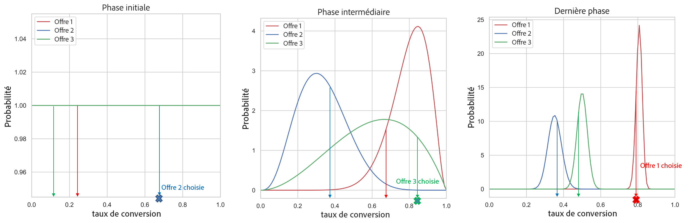
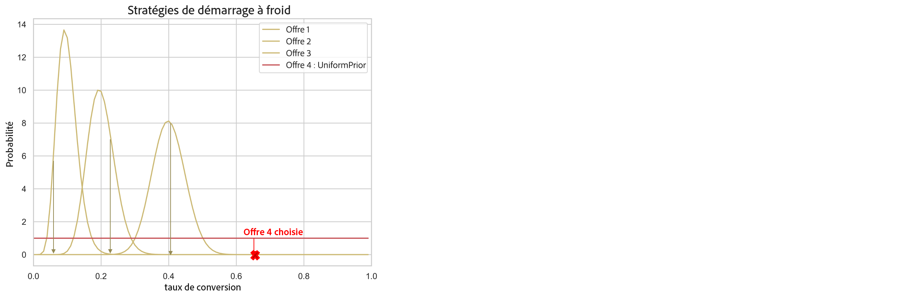

# Modèles d’optimisation automatique {#auto-optimization-model}

Un modèle d’optimisation automatique vise à proposer des offres qui optimisent le retour (KPI) défini par les clients commerciaux. Ces KPI peuvent prendre la forme de taux de conversion, de chiffres dʼaffaires, etc. À ce stade, l’optimisation automatique cherche à optimiser les clics sur les offres, avec comme cible la conversion de lʼoffre. L’optimisation automatique n’est pas personnalisée et s’optimise en fonction des performances « globales » des offres.

## Exigences relatives aux jeux de données

Pour entraîner un modèle d’optimisation automatique, le jeu de données doit répondre aux exigences minimales suivantes :

* Au moins 2 offres du jeu de données doivent avoir eu au moins 100 événements d’affichage et 5 événements de clic au cours des 14 derniers jours.
* Les offres possédant moins de 100 événements d’affichage et/ou 5 événements de clic au cours des 14 derniers jours seront traitées par le modèle comme de nouvelles offres et ne pourront être diffusées que par le bandit d’exploration.
* Les offres possédant plus de 100 événements d’affichage et 5 événements de clic au cours des 14 derniers jours seront traitées par le modèle comme des offres existantes et pourront être diffusées par les bandits d’exploration et d’exploitation.

Les offres d’une stratégie de sélection qui utilisent un modèle d’optimisation automatique sont diffusées de manière aléatoire jusqu’au moment où un modèle d’optimisation automatique est entraîné pour la première fois.

## Limites {#limitations}

L’utilisation des modèles d’optimisation automatique pour la gestion des décisions est soumise aux limitations suivantes :

<!--* Auto-optimization models do not work with the Batch Decisioning API.-->
* Les commentaires nécessaires à la création d’un modèle doivent être envoyés en tant qu’événement d’expérience. Ils ne doivent pas être envoyés automatiquement dans les canaux [!DNL Journey Optimizer].

## Terminologie {#terminology}

Les termes suivants sont utiles pour aborder l’optimisation automatique :

* **Bandit manchot** : une approche de type [bandit manchot](https://fr.wikipedia.org/wiki/Bandit_manchot_(mathématiques)){target="_blank"} en matière d’optimisation permet d’équilibrer l’apprentissage exploratoire et l’exploitation de cet apprentissage.

* **Échantillonnage de Thomson** : l’échantillonnage de Thompson est un algorithme relatif aux problèmes de décision en ligne où les actions sont entreprises de manière séquentielle, de façon à trouver l’équilibre entre l’exploitation de ce qui est connu pour maximiser les performances immédiates et l’investissement pour accumuler de nouvelles informations susceptibles d’améliorer les performances futures. [En savoir plus](#thompson-sampling)

* [**Loi Bêta**](https://fr.wikipedia.org/wiki/Loi_bêta){target="_blank"} : ensemble de [lois de probabilité continues](https://fr.wikipedia.org/wiki/Loi_de_probabilité){target="_blank"} définies sur l&#39;intervalle [0, 1] [paramétré](https://en.wikipedia.org/wiki/Statistical_parameter){target="_blank"} par deux [paramètres de forme](https://fr.wikipedia.org/wiki/Paramètre_de_forme){target="_blank"} positifs.

## Échantillonnage de Thompson {#thompson-sampling}

L’algorithme qui sous-tend l’optimisation automatique est l’**échantillonnage de Thompson**. Dans cette section, nous abordons l’intuition sous-jacente à l’échantillonnage de Thompson.

[L’échantillonnage de Thompson](https://fr.wikipedia.org/wiki/Échantillonnage_de_Thompson){target="_blank"}, ou bandits bayésiens, est une approche bayésienne du problème du bandit manchot.  L’idée de base est de traiter la récompense moyenne 𝛍 de chaque offre comme une **variable aléatoire** et d’utiliser les données collectées jusqu’à présent pour mettre à jour notre « croyance » de la récompense moyenne. Cette « croyance » est représentée mathématiquement par une **loi de probabilité a posteriori**, qui est essentiellement une plage de valeurs pour la récompense moyenne, ainsi que la plausibilité (ou probabilité) que la récompense ait cette valeur pour chaque offre.Ensuite, pour chaque décision, nous réalisons un **échantillonnage d’un point de chacune de ces lois a posteriori de récompense** et sélectionnons l’offre dont la récompense échantillonnée a la valeur la plus élevée.

Ce processus est illustré dans la figure ci-dessous, qui présente 3 offres différentes. Au départ, nous n’avons aucune preuve des données et nous supposons que toutes les offres ont une loi a posteriori uniforme de récompense. Nous tirons un échantillon de la loi a posteriori de récompense de chaque offre. L’échantillon sélectionné dans la loi de l’offre 2 a la valeur la plus élevée. Voici un exemple d’**exploration**. Après avoir affiché l’offre 2, nous collectons toute récompense potentielle (par exemple, conversion/pas de conversion) et mettons à jour la loi a posteriori de l’offre 2 à l’aide du théorème de Bayes, comme expliqué ci-dessous.  Nous poursuivons ce processus et mettons à jour les lois a posteriori chaque fois qu’une offre est affichée et que la récompense est collectée. Dans la seconde figure, l’offre 3 est sélectionnée. Bien que l’offre 1 ait obtenu la récompense moyenne la plus élevée (sa loi a posteriori de récompense est la plus éloignée à droite), le processus d’échantillonnage de chaque loi nous a amenés à choisir une offre 3 apparemment sous-optimale. Ce faisant, nous nous donnons la possibilité d’en savoir plus sur la loi de récompense véritable de l’offre 3.

À mesure que davantage d’échantillons sont collectés, la confiance augmente et une estimation plus précise de la récompense possible est obtenue (correspondant à des lois de récompense plus étroites).Ce processus de mise à jour de nos croyances au fur et à mesure que de nouvelles preuves deviennent disponibles est connu sous le nom d’**inférence bayésienne**.

Finalement, si une offre (par exemple l’offre 1) est un gagnant définitif, sa loi a posteriori de récompense sera séparée des autres. À ce stade, pour chaque décision, la récompense échantillonnée de l’offre 1 sera probablement la plus élevée, et nous la choisirons avec une probabilité plus élevée. Cela s’appelle l’**exploitation** : nous sommes convaincus que l’offre 1 est la meilleure. Elle est donc choisie pour maximiser les récompenses.

**Figure 1** : *pour chaque décision, nous échantillonnons un point des lois a posteriori de récompense. L’offre avec la valeur d’échantillon la plus élevée (taux de conversion) est choisie. Dans la phase initiale, toutes les offres ont une loi uniforme puisque nous n’avons aucune preuve concernant les taux de conversion des offres à partir des données. En collectant plus d’échantillons, les lois a posteriori deviennent plus étroites et plus précises. En fin de compte, l’offre présentant le taux de conversion le plus élevé est choisie à chaque fois.*

+++**Détails techniques**

Pour calculer/mettre à jour des lois, nous utilisons le **théorème de Bayes**. Pour chaque offre ***i***, nous voulons calculer sa ***P(𝛍i | données)***, c’est-à-dire la probabilité d’une valeur de récompense **𝛍i** pour chaque offre ***i***, compte tenu des données que nous avons collectées jusqu’à présent pour cette offre.

D’après le théorème de Bayes :

***Loi a posteriori = vraisemblance * loi a priori***

La **probabilité a priori** est l’estimation initiale de la probabilité de produire une sortie. Une fois qu’une preuve a été collectée, la probabilité est connue sous le nom de **probabilité a posteriori**.

L’optimisation automatique est conçue pour prendre en compte les récompenses binaires (clic/pas de clic). Dans ce cas, la vraisemblance représente le nombre de succès provenant de N essais et est modélisée par une **loi binomiale**. Pour certaines fonctions de vraisemblance, si vous choisissez une certaine loi a priori, la loi a posteriori se retrouve dans la même loi que la loi a priori. Une telle loi a priori est alors appelée une **loi a priori conjuguée**. Ce genre de loi a priori rend le calcul de la loi a posteriori très simple. La **loi Beta** est une loi a priori conjuguée à la vraisemblance binomiale (récompenses binaires). Il s’agit donc d’un choix pratique et judicieux pour les lois de probabilité a priori et a posteriori. La loi Beta considère deux paramètres : ***α*** et ***β***.Ces paramètres peuvent être considérés comme le nombre de succès et d’échecs, et la valeur moyenne donnée par :

Comme nous l’avons expliqué ci-dessus, la fonction de Vraisemblance est modélisée par une distribution binomiale, avec s succès (conversions) et f échecs (aucune conversion), et q est une [variable aléatoire](https://fr.wikipedia.org/wiki/Variable_aléatoire){target="_blank"} avec une [distribution Beta](https://fr.wikipedia.org/wiki/Loi_bêta){target="_blank"}.

La loi a priori est modélisée par la loi Beta et la loi a posteriori se présente comme suit :

La loi a posteriori est calculée simplement en ajoutant le nombre de succès et d’échecs aux paramètres existants ***α*** et ***β***.

Pour l’optimisation automatique, comme illustré dans l’exemple ci-dessus, nous commençons avec une loi a priori ***Beta(1, 1)*** (loi uniforme) pour toutes les offres et, après avoir obtenu s succès et f échecs pour une offre donnée, la loi a posteriori devient une loi Beta avec des paramètres ***(s+α, f+β)*** pour cette offre.
+++

**Rubriques connexes** :

Pour une étude plus approfondie de l’échantillonnage de Thompson, lisez les documents de recherche suivants :

* [Évaluation empirique de l’échantillonnage de Thompson](https://proceedings.neurips.cc/paper/2011/file/e53a0a2978c28872a4505bdb51db06dc-Paper.pdf){target="_blank"}
* [Analyse de l’échantillonnage de Thompson pour le problème du bandit manchot](https://proceedings.mlr.press/v23/agrawal12/agrawal12.pdf){target="_blank"}

## Problème du démarrage à froid {#cold-start}

Le problème du « démarrage à froid » se produit lorsqu’une nouvelle offre est ajoutée à une campagne et qu’aucune donnée n’est disponible concernant le taux de conversion de cette nouvelle offre. Au cours de cette période, nous devons définir une stratégie concernant la fréquence de sélection de cette nouvelle offre afin de minimiser la baisse de performance, tandis que nous collectons des informations sur le taux de conversion de cette nouvelle offre. Plusieurs solutions existent pour résoudre ce problème. La clé est de trouver un équilibre entre l’exploration de cette nouvelle offre et d’éviter de trop sacrifier l’exploitation. Actuellement, nous utilisons la « loi uniforme » comme estimation initiale du taux de conversion de la nouvelle offre (loi a priori). En gros, nous donnons à toutes les valeurs de taux de conversion une probabilité d’occurrence égale.

**Figure 2** : *prenons l’exemple d’une campagne comportant trois offres. Alors que la campagne est active, l’offre 4 y est ajoutée. Au départ, nous ne disposons d’aucune donnée sur le taux de conversion de l’offre 4 et nous devons résoudre le problème du démarrage à froid. Nous utilisons la loi uniforme comme estimation initiale du taux de conversion de l’offre 4, tandis que nous collectons des données pour cette nouvelle offre. Comme expliqué dans la section [Échantillonnage de Thompson](#thompson-sampling), pour choisir l’offre qui sera présentée à un utilisateur, nous échantillonnons des points des lois a posteriori de récompense des offres et sélectionnons l’offre avec la valeur d’échantillon la plus élevée. Dans l’exemple ci-dessus, l’offre 4 est choisie puis, en fonction de la récompense collectée, la loi a posteriori de cette offre est mise à jour, comme expliqué dans la section [Échantillonnage de Thompson](#thompson-sampling).*

## Mesure de Lift {#lift}

« Lift » est la mesure utilisée pour mesurer les performances de toute stratégie déployée dans le service de classement, par rapport à la stratégie de base (service des offres uniquement de manière aléatoire).

Par exemple, si nous voulons mesurer les performances d’une stratégie d’échantillonnage de Thompson (TS) utilisée dans le service de classement et que le KPI est le taux de conversion (CVR), le « Lift » de la stratégie TS par rapport à la stratégie de base est défini comme suit :

>[!NOTE]
>
>Actuellement, le rapport Mesure de l’effet élévateur n’est disponible que pour le modèle d’IA [Optimisation personnalisée](personalized-optimization-model.md). [En savoir plus sur les rapports relatifs à la prise de décisions](../../reports/campaign-global-report-cja-code.md#decisioning-reporting)
