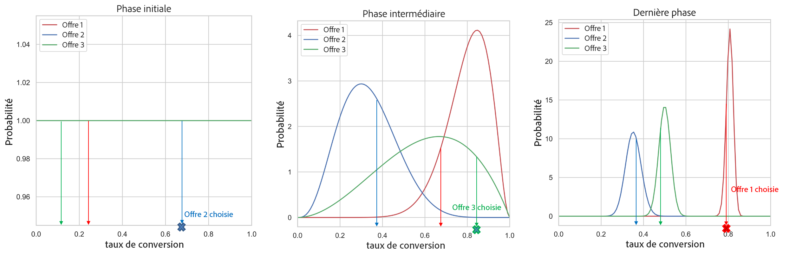

# Modèles d’optimisation automatique {#auto-optimization-model}

Le modèle d’optimisation automatique de [!DNL Adobe Journey Optimizer] est un modèle d’apprentissage par renforcement qui maximise le taux de clic publicitaire (CTR) des offres en explorant toutes les offres (ou tout le contenu), puis en classant les éléments en fonction du CTR prévu, après l’application des règles d’éligibilité et des limites de fréquence.

## Cas d’utilisation et avantages {#use-cases-benefits}

L’optimisation automatique peut être utilisée chaque fois que vous souhaitez une configuration rapide et facile, que vous souhaitez trouver des offres gagnantes globales et que vous souhaitez maximiser les clics sur les offres dans un seul canal. Par exemple :

* Choisissez les meilleures offres à insérer sur une page web pour maximiser les clics sur les offres.
* Choisissez les meilleures offres à insérer dans un e-mail pour maximiser les clics sur les offres.
* Choisissez les meilleures offres à insérer dans un écran d&#39;application mobile pour maximiser les clics sur les offres.

L’optimisation automatique est un bon choix lorsque :

* Les offres changent au fil du temps ou fréquemment : le modèle d’optimisation automatique est entraîné à nouveau toutes les six heures.

## Exigences et limitations {#requirements-limitations}

L’optimisation automatique présente les exigences et limites suivantes :

* L’optimisation automatique nécessite un jeu de données d’entraînement contenant des événements d’affichage d’offre, des événements de clic sur l’offre et le groupe de champs Événement d’expérience - Interactions de proposition .
* Les modèles d’optimisation automatique ne peuvent pas être utilisés dans les requêtes à l’API Batch Decisioning.
* L’optimisation automatique s’optimise toujours pour les clics sur les offres. Pour maximiser les performances pour un objectif autre que les clics sur les offres, utilisez le modèle [Optimisation personnalisée](personalized-optimization-model.md).
* L’optimisation automatique tente de trouver des offres gagnantes globales et ne trouve pas de classement personnalisé pour chaque client. Pour trouver des classements personnalisés pour chaque client, utilisez le modèle [Optimisation personnalisée](personalized-optimization-model.md).

Pour entraîner un modèle d’optimisation automatique, le jeu de données doit répondre aux exigences minimales suivantes :

* Au moins 2 offres du jeu de données doivent avoir eu au moins 100 événements d’affichage et 5 événements de clic au cours des 14 derniers jours.
* Les offres possédant moins de 100 événements d’affichage et/ou 5 événements de clic au cours des 14 derniers jours seront traitées par le modèle comme de nouvelles offres et ne pourront être diffusées que par le bandit d’exploration.
* Les offres possédant plus de 100 événements d’affichage et 5 événements de clic au cours des 14 derniers jours seront traitées par le modèle comme des offres existantes et pourront être diffusées par les bandits d’exploration et d’exploitation.

Les offres d’une stratégie de sélection qui utilisent un modèle d’optimisation automatique sont diffusées de manière aléatoire jusqu’au moment où un modèle d’optimisation automatique est entraîné pour la première fois.

## Trouver le juste équilibre entre l’optimisation et l’apprentissage {#balancing-optimization-learning}

L’optimisation automatique est un modèle d’[apprentissage par renforcement](https://en.wikipedia.org/wiki/Reinforcement_learning){target="_blank"} qui s’informe sur les performances de clic publicitaire des offres en fonction du comportement réel des clients. Les modèles d’apprentissage renforcés visent à maximiser un objectif en choisissant des actions dont les résultats sont mieux prédits. Cependant, un modèle qui présente toujours à chaque client l’élément ou les éléments présentant les meilleurs résultats prédits ne connaîtrait jamais les performances des nouveaux éléments introduits au fil du temps (ce qu’on appelle le « problème de démarrage à froid »), ni ne connaîtrait les changements dans les performances d’autres éléments existants résultant de changements dans le comportement des clients au fil du temps. Les modèles d&#39;apprentissage par renforcement doivent donc gérer ce que l&#39;on appelle communément le [ compromis exploration-exploitation ](https://en.wikipedia.org/wiki/Exploration%E2%80%93exploitation_dilemma){target="_blank"}, c&#39;est-à-dire l&#39;optimisation de l&#39;équilibre avec l&#39;apprentissage.

L’optimisation automatique utilise une approche courante appelée [ bandit manchot ](https://fr.wikipedia.org/wiki/Bandit_manchot_(mathématiques)){target="_blank"} pour gérer le compromis. Le bandit manchot prend des décisions de classement en fonction de :

* taux de clic publicitaire prévu pour chaque élément
* différences dans le taux de clic publicitaire prévu pour chaque élément
* le degré d’incertitude du modèle quant à ses prédictions pour chaque élément.

Les bandits manchots utilisent ces informations, ainsi qu’une variabilité aléatoire, pour choisir les actions à entreprendre. L’optimisation automatique est un algorithme [ensemble](https://en.wikipedia.org/wiki/Ensemble_learning){target="_blank"} qui contient plusieurs bandits à plusieurs bras afin de s’assurer que toutes les offres sont explorées de manière adéquate tout en maximisant les performances globales.

Lorsqu’il répond à une demande de classement, un bandit manchot « superviseur » décide d’abord si cette demande doit être biaisée en faveur de l’exploration ou en faveur de l’exploitation. Cette décision est prise selon une approche « epsilon-greedy ».

La deuxième couche de classement est effectuée par l’un des deux bandits [échantillonnage de Thompson](https://fr.wikipedia.org/wiki/Échantillonnage_de_Thompson){target="_blank"} :

* 10 % du trafic est alloué à un bandit axé sur l’exploration qui est plus susceptible de recommander de nouvelles offres ou des offres contenant des données limitées, en supposant que le modèle bénéficierait d’une meilleure connaissance du comportement des clients en réponse à ces offres.
* 90 % du trafic est alloué à un bandit axé sur l’exploitation qui est plus susceptible de recommander de manière cohérente des offres à hautes performances au fil du temps, en supposant que les offres nouvelles ou à faibles données sont plus susceptibles de ne pas être performantes jusqu’à preuve du contraire.

Techniquement parlant, ces hypothèses sont des paramètres de la loi de probabilité a priori, également appelée [ a priori](https://en.wikipedia.org/wiki/Prior_probability){target="_blank"}. À mesure que les offres rassemblent davantage de données d’affichage et de clic, l’influence des priorités sélectionnées diminue et les prédictions faites par les deux bandits ont tendance à converger au fil du temps.

Notre approche consistant à combiner plusieurs bandits et à allouer un certain trafic dédié à l’exploration présente plusieurs avantages :

* le modèle s’informe le plus rapidement des offres les plus récentes avec le moins de données
* le modèle continue à s’informer sur toutes les offres et répond aux changements de comportement des clients au fil du temps
* le modèle ne la surclasse pas en favorisant agressivement les offres avec un CTR apparent plus élevé mais peu d’observations, ou en désapprouvant agressivement les offres avec un CTR apparent plus faible mais peu d’observations
* le modèle est robuste et permet de gérer les décisions d’affectation du trafic sur des centaines d’offres avec des données de clic éparses et avec des quantités de données historiques très différentes

## Échantillonnage de Thompson {#thompson-sampling}

L’[échantillonnage de Thompson](https://fr.wikipedia.org/wiki/Échantillonnage_de_Thompson){target="_blank"} ou bandits bayésiens, est une approche bayésienne du problème du bandit manchot. Le modèle traite la récompense moyenne 𝛍 de chaque offre comme une variable aléatoire et utilise les données collectées jusqu’à présent pour mettre à jour notre « croyance » sur la récompense moyenne. Cette « croyance » est représentée mathématiquement par une loi de probabilité a posteriori , qui est essentiellement une plage de valeurs pour la récompense moyenne, ainsi que la plausibilité (ou probabilité) que la récompense ait cette valeur pour chaque offre. Ensuite, pour chaque décision, nous réalisons un échantillonnage d’un point de chacune de ces lois a posteriori de récompense et sélectionnons l’offre dont la récompense échantillonnée a la valeur la plus élevée.

Ce processus est illustré dans la figure ci-dessous, qui présente 3 offres différentes. Au départ, nous n’avons aucune preuve des données et nous supposons que toutes les offres ont une loi a posteriori uniforme de récompense. Nous tirons un échantillon de la loi a posteriori de récompense de chaque offre. L’échantillon sélectionné dans la loi de l’offre 2 a la valeur la plus élevée. Voici un exemple d’exploration. Après avoir affiché l’offre 2, nous collectons toute récompense potentielle (par exemple, conversion/aucune conversion) et mettons à jour la loi a posteriori de l’offre 2 à l’aide du théorème de Bayes, comme expliqué ci-dessous. Nous poursuivons ce processus et mettons à jour les lois a posteriori chaque fois qu’une offre est affichée et que la récompense est collectée. Dans la seconde figure, l’offre 3 est sélectionnée. Bien que l’offre 1 ait obtenu la récompense moyenne la plus élevée (sa loi a posteriori de récompense est la plus éloignée à droite), le processus d’échantillonnage de chaque loi nous a amenés à choisir une offre 3 apparemment sous-optimale. Ce faisant, nous nous donnons la possibilité d’en savoir plus sur la véritable distribution de récompense de l’offre 3.

À mesure que davantage d’échantillons sont collectés, la confiance augmente et une estimation plus précise de la récompense possible est obtenue (correspondant à des lois de récompense plus étroites). Ce processus de mise à jour de nos croyances à mesure que de nouvelles preuves deviennent disponibles est connu sous le nom d **inférence bayésienne**.

Finalement, si une offre (par exemple l’offre 1) est un gagnant définitif, sa loi a posteriori de récompense sera séparée des autres. À ce stade, pour chaque décision, la récompense échantillonnée de l’offre 1 sera probablement la plus élevée, et nous la choisirons avec une probabilité plus élevée. Il s’agit d’une exploitation : nous sommes convaincus que l’offre 1 est la meilleure. Elle est donc choisie pour maximiser les récompenses.

**Figure 1** : *pour chaque décision, nous échantillonnons un point des lois a posteriori de récompense. L’offre avec la valeur d’échantillon la plus élevée (taux de conversion) est choisie. Dans la phase initiale, toutes les offres ont une loi uniforme puisque nous n’avons aucune preuve concernant les taux de conversion des offres à partir des données. En collectant plus d’échantillons, les lois a posteriori deviennent plus étroites et plus précises. En fin de compte, l’offre présentant le taux de conversion le plus élevé est choisie à chaque fois.*

+++ Détails du calcul

Pour calculer/mettre à jour des lois, nous utilisons **le théorème de Bayes**. Pour chaque offre ***i***, nous voulons calculer sa ***P(𝛍i | données)***, c’est-à-dire la probabilité d’une valeur de récompense **𝛍i** pour chaque offre ***i***, compte tenu des données que nous avons collectées jusqu’à présent pour cette offre.

D’après le théorème de Bayes :

***Loi a posteriori = vraisemblance * loi a priori***

La **probabilité a priori** est l’estimation initiale de la probabilité de produire une sortie. Une fois qu’une preuve a été collectée, la probabilité est connue sous le nom de **probabilité a posteriori**.

L’optimisation automatique est conçue pour prendre en compte les récompenses binaires (clic/pas de clic). Dans ce cas, la vraisemblance représente le nombre de succès provenant de N essais et est modélisée par une loi binomiale. Pour certaines fonctions de vraisemblance, si vous choisissez une certaine loi a priori, la loi a posteriori se retrouve dans la même loi que la loi a priori. Une telle loi a priori est alors appelée une **loi a priori conjuguée**. Ce genre de loi a priori rend le calcul de la loi a posteriori très simple. La loi {target="_blank"} est une loi a priori conjuguée à la vraisemblance binomiale (récompenses binaires). Il s’agit donc d’un choix pratique et judicieux pour les lois de probabilité a priori et a posteriori. La distribution Beta utilise deux paramètres : ***α*** et ***β***. Ces paramètres peuvent être considérés comme le nombre de succès et d’échecs, et la valeur moyenne donnée par :

Comme expliqué ci-dessus, la fonction de Vraisemblance est modélisée par une loi binomiale, avec s succès (conversions) et f échecs (aucune conversion), et q est une variable aléatoire avec une loi Beta.

La loi a priori est modélisée par la loi Beta et la loi a posteriori se présente comme suit :

+++

### Biais d&#39;exploration et biais d&#39;exploitation {#exploration-exploitation-bias}

Une valeur initiale doit être choisie pour les paramètres ***α***, ***β***. L’optimisation automatique comprend à la fois un bandit d’échantillonnage de Thompson biaisé par l’exploration et un bandit d’échantillonnage de Thompson biaisé par l’exploitation qui utilisent différentes valeurs antérieures initiales ***α*** et ***β*** dans leurs distributions Beta.

Dans une approche générale d’échantillonnage de Thompson, la loi a posteriori est calculée simplement en ajoutant le nombre de succès et d’échecs aux paramètres existants ***α***, ***β***. L’optimisation automatique utilise différents facteurs de pondération pour les nouveaux succès et échecs afin de modifier l’impact des nouvelles données par rapport aux données antérieures dans les bandits à biais d’exploration et d’exploitation.

## Références {#references}

Pour une étude plus approfondie des bandits d’échantillonnage de Thompson, reportez-vous aux documents de recherche suivants :

* [Évaluation empirique de l’échantillonnage de Thompson](https://proceedings.neurips.cc/paper/2011/file/e53a0a2978c28872a4505bdb51db06dc-Paper.pdf){target="_blank"}
* [Analyse de l’échantillonnage de Thompson pour le problème du bandit manchot](https://proceedings.mlr.press/v23/agrawal12/agrawal12.pdf){target="_blank"}
