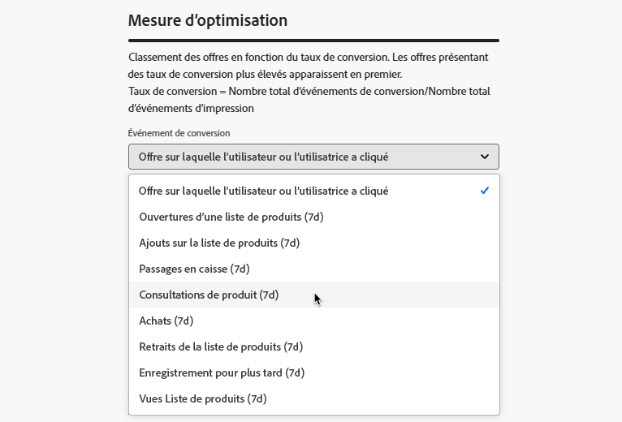

# Créer des modèles d’IA {#create-ai-models}

[!DNL Journey Optimizer] permet de créer des **modèles &#39;’IA** pour classer les offres en fonction des objectifs de votre entreprise.

>[!CAUTION]
>
>Pour créer, modifier ou supprimer des modèles d&#39;IA, vous devez disposer de la permission **Gestion des stratégies de classement**. [En savoir plus](../../administration/high-low-permissions.md#manage-ranking-strategies)

## Créer un modèle d’IA {#create-ranking-strategy}

>[!CONTEXTUALHELP]
>id="ajo_exd_ai_model_metric"
>title="Mesure d’optimisation"
>abstract="Offres de classement de [!DNL Journey Optimizer] en fonction du **taux de conversion** (Taux de conversion = Nombre total d’événements de conversion/Nombre total d’événements d’impression). Le taux de conversion est calculé à l’aide de deux types de mesures : les **Événements d’impression** (offres affichées) et les **Événements de conversion** (offres qui génèrent des clics via e-mail ou web). Ces événements sont automatiquement capturés à l’aide du SDK web ou du SDK mobile fourni."

Pour créer un modèle d’IA, procédez comme suit :

1. Créez un jeu de données dans lequel les événements de conversion seront collectés. [Voici comment procéder.](../data-collection/create-dataset.md)

1. Accédez au menu **[!UICONTROL Prise de décision]** > **[!UICONTROL Configuration de la stratégie]** et sélectionnez **[!UICONTROL Modèles d’IA]**.

   

   Tous les modèles d’IA créés jusqu’à présent y sont répertoriés.

1. Cliquez sur le bouton **[!UICONTROL Créer un modèle d’IA]**.

1. Spécifiez un nom unique et une description pour le modèle d’IA, le cas échéant.

1. Sélectionnez le type de modèle d’IA que vous souhaitez créer :

   * L’option **[!UICONTROL Optimisation automatique]** optimise les offres en fonction des performances des offres antérieures. [En savoir plus](auto-optimization-model.md)
   * L’**[!UICONTROL optimisation personnalisée]** optimise et personnalise les offres en fonction des audiences et des performances des offres. [En savoir plus](personalized-optimization-model.md)

   

1. La section **[!UICONTROL Mesure d’optimisation]** fournit des informations sur l’événement de conversion utilisé par le modèle d’IA pour calculer le classement des offres.

   Offres de classement de [!DNL Journey Optimizer] en fonction du **taux de conversion** (Taux de conversion = Nombre total d’événements de conversion/Nombre total d’événements d’impression). Le taux de conversion est calculé à l’aide de deux types de mesures :
   * Les **événements d’impression** (les offres qui sont affichées).
   * Les **événements de conversion** (les offres qui génèrent des clics par e-mail ou sur le Web).

   Ces événements sont automatiquement capturés à l’aide du SDK Web ou du SDK Mobile fourni. Pour plus d’informations, consultez la vue d’ensemble du [SDK Web Adobe Experience Platform](https://experienceleague.adobe.com//docs/experience-platform/edge/home.html?lang=fr).

   +++ Optimisation de modèles sur des mesures [!DNL Customer Journey Analytics] personnalisées

   >[!NOTE]
   >
   >Cette fonctionnalité est disponible uniquement pour la clientèle [!DNL Customer Journey Analytics] disposant de droits d’administration.
   >
   >Avant de commencer, assurez-vous d’avoir intégré Journey Optimizer à Customer Journey Analytics afin d’exporter des jeux de données Journey Optimizer dans vos vues de données par défaut. [Découvrir comment exploiter les données  [!DNL Journey Optmizer]  dans  [!DNL Customer Journey Analytics]](../../reports/cja-ajo.md)

   Les modèles d’**[!UICONTROL optimisation personnalisée]** sont un type de modèle d’IA qui vous permet de définir des objectifs métier et d’utiliser les données client pour entraîner des modèles orientés métier afin de diffuser des offres personnalisées et d’optimiser les KPI.

   Par défaut, les modèles d’optimisation personnalisés utilisent les **clics sur l’offre** comme mesure d’optimisation. Si vous utilisez [!DNL Customer Journey Analytics], [!DNL Decisioning] vous permet de tirer profit de vos propres mesures personnalisées pour optimiser votre modèle.

   Pour ce faire, sélectionnez le type de modèle **[!UICONTROL Optimisation personnalisée]** et développez la liste déroulante **[!UICONTROL Événement de conversion]**. Toutes les mesures de votre [vue de données](https://experienceleague.adobe.com/fr/docs/analytics-platform/using/cja-dataviews/data-views){target="_blank"} [!DNL Customer Journey Analytics] par défaut s’affichent dans la liste. Sélectionnez la mesure que vous souhaitez utiliser pour optimiser votre modèle.

   {width=85%}

   >[!NOTE]
   >
   >Par défaut, les mesures de [!DNL Customer Journey Analytics] utilisent un modèle d’attribution « Dernière touche », qui attribue 100 % du crédit au point de contact qui survient le plus récemment avant la conversion.
   >
   >Bien qu’il soit possible de modifier le modèle d’attribution, tous les modèles d’attribution ne sont pas idéaux pour l’optimisation du modèle d’IA. Nous vous recommandons de sélectionner soigneusement un modèle d’attribution qui s’aligne sur vos objectifs d’optimisation afin d’assurer la précision et les performances du modèle.
   >
   >Pour plus d’informations sur les modèles d’attribution disponibles et des conseils sur leur utilisation, consultez la [[!DNL Customer Journey Analytics] documentation](https://experienceleague.adobe.com/fr/docs/analytics-platform/using/cja-dataviews/component-settings/attribution){target="_blank"}.

   +++

1. Sélectionnez le ou les jeux de données dans lesquels les événements de conversion et d’impression sont collectés. Découvrez comment créer ce type de jeu de données dans [cette section](../data-collection/create-dataset.md).

   {width=85%}

   >[!CAUTION]
   >
   >Seuls les jeux de données créés à partir de schémas associés au groupe de champs **[!UICONTROL Événement d’expérience - Interactions avec les propositions]** (précédemment appelé « mixin ») s’affichent dans la liste déroulante.

1. Si vous créez un modèle d’IA **[!UICONTROL Optimisation personnalisée]**, sélectionnez le ou les segments à utiliser pour entraîner le modèle d’IA.

   <!--➡️ [Discover this feature in video](#video)-->

   >[!NOTE]
   >
   >Vous pouvez sélectionner jusqu’à 5 audiences.

1. Enregistrez et activez le modèle d’IA.

<!--At this point, you must have:

* created the AI model,
* defined which type of event you want to capture - offer displayed (impression) and/or offer clicked (conversion),
* and in which dataset you want to collect the event data.-->

Désormais, chaque fois quʼune offre est présentée et/ou qu’un utilisateur ou une utilisatrice clique dessus, vous souhaitez que lʼévénement correspondant soit automatiquement capturé par le groupe de champs **[!UICONTROL Événement dʼexpérience - Interactions avec les propositions]** à lʼaide du [SDK Web Adobe Experience Platform](https://experienceleague.adobe.com/docs/experience-platform/edge/web-sdk-faq.html?lang=fr#what-is-adobe-experience-platform-web-sdk%3F){target="_blank"} ou du SDK mobile.

Pour envoyer des types d’événement (offre affichée ou offre ayant fait l’objet d’un clic), vous devez définir la valeur correcte pour chaque type d’événement dans un événement d’expérience qui est envoyé dans Adobe Experience Platform. [Voici comment procéder.](../data-collection/schema-requirement.md)

<!--
## How-to video {#video}

Learn how to create a personalized optimization model and how to apply it to a decision.

>[!VIDEO](https://video.tv.adobe.com/v/3445953?captions=fre_fr&quality=12)-->
