# Utiliser le créateur de formules d’IA {#create-ranking-formulas}

Les **formules de classement** vous permettent de définir des règles déterminant quelle offre doit être présentée en premier, plutôt que de prendre en compte les scores de priorité.

Pour créer ces règles, le créateur de formules d’IA d’**[!UICONTROL Adobe Journey Optimizer]** offre une plus grande flexibilité et un meilleur contrôle du classement des offres. Au lieu de vous fier uniquement à une priorité d’offre statique, vous pouvez à présent définir des formules de classement personnalisées qui combinent les scores du modèle d’IA, les priorités d’offre, les attributs de profil, les attributs d’offre et les signaux contextuels par le biais d’une interface guidée.

Cette approche vous permet d’ajuster dynamiquement le classement des offres en fonction de n’importe quelle combinaison entre la propension pilotée par l’IA, la valeur commerciale et le contexte en temps réel, ce qui facilite l’alignement de la prise de décisions sur les objectifs marketing et les besoins de la clientèle. Le créateur de formules d’IA prend en charge les formules simples ou avancées en fonction du niveau de contrôle que vous souhaitez appliquer.

Après avoir créé une formule de classement, vous pouvez l’affecter à une [stratégie de sélection](../selection-strategies.md). Si plusieurs offres sont éligibles à la présentation lors de l’utilisation de cette stratégie de sélection, le moteur de décision emploiera la formule sélectionnée pour calculer l’offre à présenter en premier.

➡️ [Découvrez cette fonctionnalité en vidéo.](#video)

## Créer une formule de classement {#create-ranking-formula}

>[!CONTEXTUALHELP]
>id="ajo_exd_config_formulas"
>title="Créer des formules de classement"
>abstract="Les formules vous permettent de définir des règles déterminant la décision qui doit être présentée en premier au lieu de prendre en compte les scores de priorité de l’élément. Après avoir créé une formule de classement, vous pouvez l’affecter à une stratégie de sélection."

Pour créer une formule de classement, procédez comme suit :

1. Accédez au menu **[!UICONTROL Configuration de la stratégie]**, puis sélectionnez l’onglet **[!UICONTROL Formules de classement]**. La liste des formules créées précédemment s’affiche.

   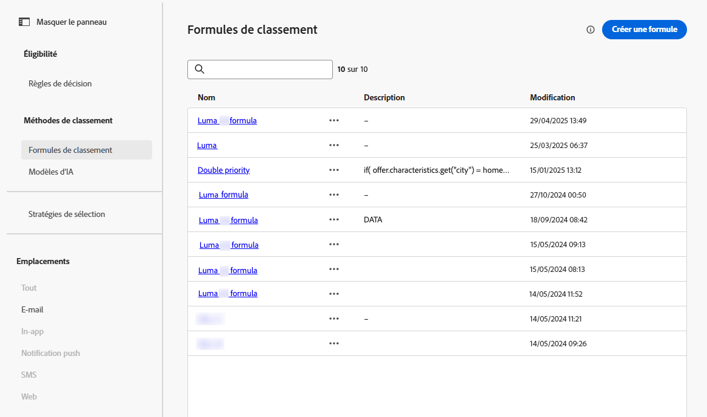

1. Cliquez sur **[!UICONTROL Créer une formule]**.

1. Spécifiez le nom de la formule et ajoutez une description, le cas échéant.

   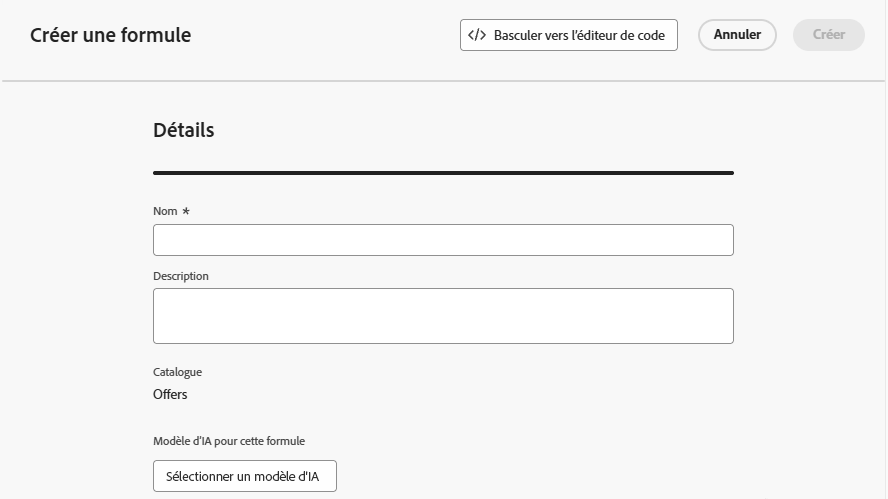{width="80%"}

1. Si vous le souhaitez, cliquez sur **[!UICONTROL Sélectionner un modèle d’IA]** pour définir le modèle à utiliser comme référence pour créer votre formule de classement.

   >[!NOTE]
   >
   >Les [modèles d’optimisation personnalisés](personalized-optimization-model.md) utilisant des mesures continues ne sont pas pris en charge avec le créateur de formules d’IA.

   Chaque fois que vous vous référez à un score de modèle lors de la définition de votre formule ci-dessous, le modèle d’IA que vous avez sélectionné est utilisé.

   >[!CAUTION]
   >
   >Lors de l’utilisation d’un modèle d’IA intégré à une formule de classement, les données ne sont pas reflétées dans le rapport [Taux de conversion du trafic d’exclusion et piloté par le modèle](../../reports/campaign-global-report-cja-code.md#conversion-rate).

1. Définissez les conditions qui détermineront le score de classement pour les éléments de décision correspondants. Vous pouvez, au choix, effectuer ce qui suit :

   * Renseigner la section **[!UICONTROL Critères]** à partir de l’[interface d’utilisation](#ranking-select-criteria)
   * Passer à l’[éditeur de code](#ranking-code-editor)

   >[!NOTE]
   >
   >La profondeur d’imbrication dans une formule de classement est limitée à 30 niveaux. Celle-ci est mesurée en comptant les parenthèses fermantes `)` dans la chaîne PQL. La taille d’une chaîne de règle est de 8 Ko maximum pour les caractères codés en UTF-8. Cela équivaut à 8 000 caractères ASCII (1 octet chacun) ou 2 000 à 4 000 caractères non ASCII (2 à 4 octets chacun). [En savoir plus sur les mécanismes de sécurisation et sur les limitations de la prise de décisions](../decisioning-guardrails.md#ranking-formulas)

1. Vous pouvez également utiliser des données provenant d’Adobe Experience Platform afin d’ajuster dynamiquement la logique de classement pour refléter des conditions réelles. Cela s’avère particulièrement utile pour les attributs qui changent fréquemment, tels que la disponibilité des produits ou la tarification en temps réel.

   Cette fonctionnalité est actuellement disponible en version Beta publique pour l’ensemble des clientes et clients. Contactez votre représentant ou représentante de compte si vous souhaitez y accéder. [Découvrez comment utiliser des données Adobe Experience Platform pour la prise de décision.](../aep-data-exd.md)

<!--## Select an ELS dataset {#els-dataset}

Journey Optimizer allows you to leverage data from Adobe Experience Platform. [Learn more](../data/aep-data-perso.md)

To leverage data from an AEP dataset, follow the steps below.

1. From the **[!UICONTROL ELS settings]** section, select an ELS dataset from the list.

1. Select a decision attribute.

    >[!NOTE]
    >
    >This action is mandatory.

{width="80%"-->

## Définir des critères à l’aide du créateur de formules {#ranking-select-criteria}

Grâce à une interface intuitive, vous pouvez affiner la prise de décisions en ajustant les scores de l’IA (propension), la valeur de l’offre (priorité), les leviers contextuels et les propensions des profils externes, individuellement ou en combinaison, afin d’optimiser chaque interaction. <!--Whether you are maximizing revenue, promoting strategic offers, or balancing business goals with real-time context, the formula builder gives you total control in defining ranking strategies.-->

Pour définir des critères directement à partir de l’interface, procédez comme suit :

<!--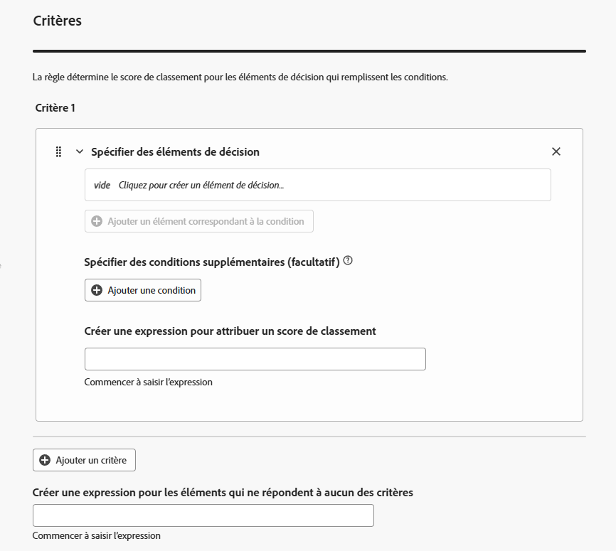{width="80%"}-->

1. Dans la section **[!UICONTROL Critère 1]**, spécifiez les éléments de décision auxquels vous souhaitez appliquer un score de classement en procédant comme suit :
   * sélectionnez un [attribut d’élément de décision](../items.md#attributes)
   * sélectionner un opérateur logique
   * ajouter une condition correspondante - vous pouvez saisir une valeur ou sélectionner un attribut de profil ou [des données contextuelles](../context-data.md)

   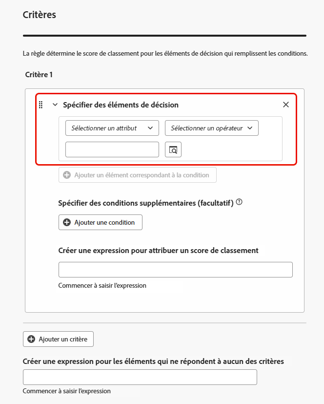{width="70%"}

1. Vous pouvez éventuellement spécifier des éléments supplémentaires pour affiner les conditions correspondantes afin que vos critères soient vrais.

   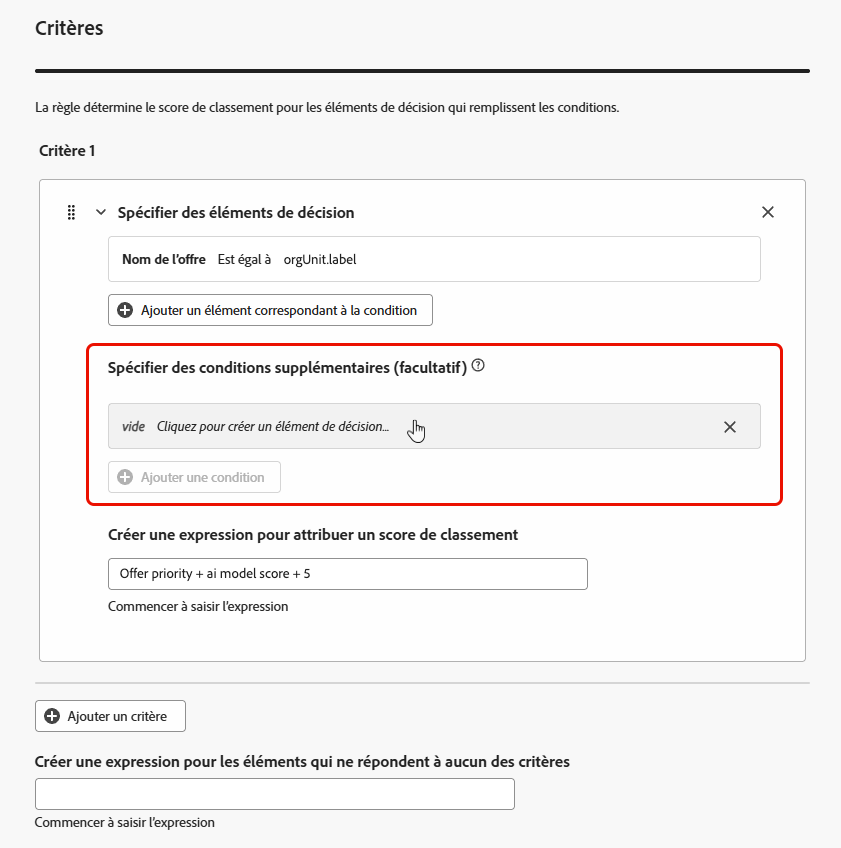{width="80%"}

   Par exemple, vous avez défini le critère 1 tel que l’attribut personnalisé *Météo* *Est égal à* la condition *Chaud*. De plus, vous pouvez ajouter une autre condition, par exemple si la première condition est remplie et si la température dépasse 75 degrés Fahrenheit au moment de la requête, alors le critère 1 est vrai.<!--Add a screenshot with the example-->

1. Créez une expression qui attribuera un score de classement aux éléments de décision qui répondent à la condition définie ci-dessus. Vous pouvez référencer l’un des éléments suivants :

   * le score provenant du modèle d’IA que vous avez éventuellement sélectionné dans la section **[!UICONTROL Détails]** [ci-dessus](#create-ranking-formula) ;
   * la priorité de l’élément de décision, qui est une valeur affectée manuellement lors de la [création d’un élément de décision](../items.md#attributes) ; <!--If a profile qualifies for multiple decision items, a higher priority grants the item precedence over others.-->
   * tout attribut susceptible de résider sur le profil, tel qu’un score de propension dérivé de l’extérieur ;
   * une valeur statique que vous pouvez attribuer dans un format libre ;
   * une combinaison des options ci-dessus.

   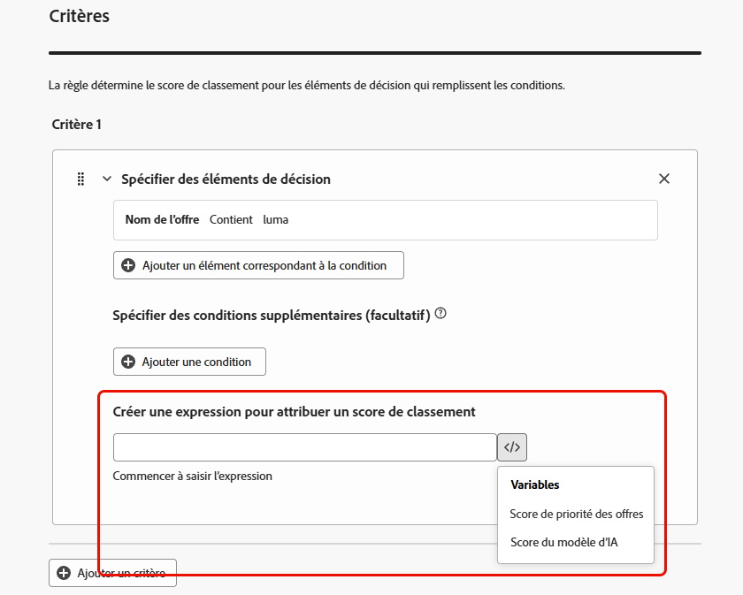{width="70%"}

   >[!NOTE]
   >
   >Cliquez sur l’icône en regard du champ pour ajouter des variables prédéfinies.

1. Cliquez sur **[!UICONTROL Ajouter un critère]** pour ajouter un ou plusieurs critères autant de fois que nécessaire. La logique se présente comme suit :
   * Si le premier critère est vrai pour un élément de décision donné, il est prioritaire sur les suivants.
   * Si ce n’est pas le cas, le moteur de décision passe au deuxième critère, et ainsi de suite.

1. Dans le dernier champ, vous pouvez créer une expression qui sera affectée à tous les éléments de décision qui ne répondent pas aux critères ci-dessus.

   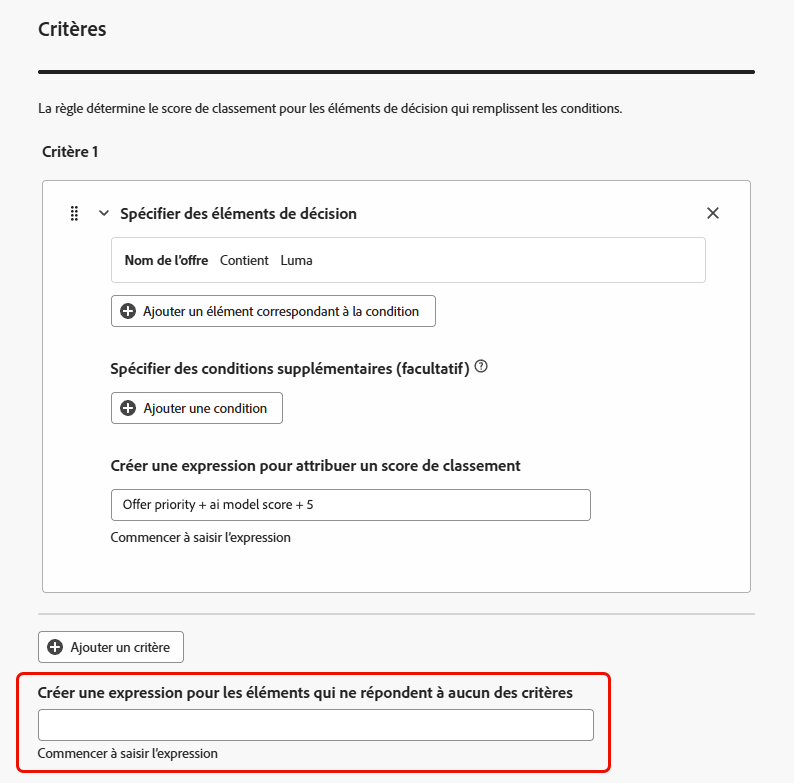{width="70%"}

1. Cliquez sur **[!UICONTROL Créer]** pour terminer votre formule de classement. Vous pouvez maintenant la sélectionner dans la liste pour en afficher les détails et la modifier ou la supprimer. Elle est maintenant prête à être utilisée dans une [stratégie de sélection](../selection-strategies.md) pour classer les éléments de décision éligibles.

### Exemple de formule de classement

Consultez l’exemple ci-dessous.

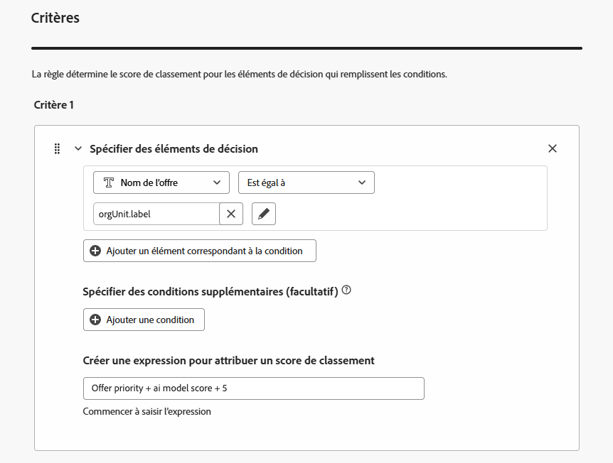{width="80%"}

Si la région de l’élément de décision (attribut personnalisé) est égale au libellé géographique du profil (attribut de profil), le score de classement exprimé ici (qui est une combinaison de la priorité de l’élément de décision, du score du modèle d’IA et d’une valeur statique) sera appliqué à tous les éléments de décision répondant à cette condition.

## Utiliser l’éditeur de code {#ranking-code-editor}

Pour exprimer les formules de classement dans la **syntaxe PQL**, basculez vers l’éditeur de code à l’aide du bouton dédié en haut à droite de l’écran. Pour plus d’informations sur l’utilisation de la syntaxe PQL, reportez-vous à la [documentation dédiée](https://experienceleague.adobe.com/docs/experience-platform/segmentation/pql/overview.html?lang=fr).

>[!CAUTION]
>
>Cette action vous empêchera de revenir à l’affichage du créateur par défaut pour cette formule.

Vous pouvez ensuite utiliser les attributs de profil, les [données contextuelles](../context-data.md) et les [attributs d’élément de décision](../items.md#attributes).

Dans cet exemple, nous voulons augmenter la priorité de toutes les offres contenant l’attribut « hot » en cas de météo avec températures chaudes. Pour ce faire, **contextData.weather=hot** a été transmis dans l’appel de prise de décisions.<!--[Learn how to work with context data](context-data.md)-->

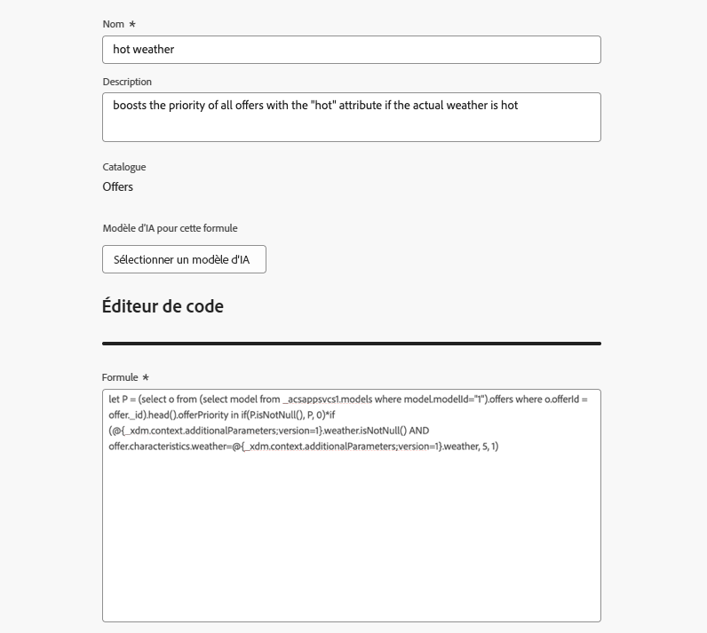{width="80%"}

>[!IMPORTANT]
>
>Lors de la création d’une formule de classement, la consultation d’une période précédente n’est pas prise en charge (par exemple, l’ajout d’un événement d’expérience qui s’est produit le mois dernier en tant que composant de la formule). Toute tentative d’inclusion d’une période de recherche arrière lors de la création d’une formule déclenche une erreur lors de son enregistrement.

Pour utiliser des attributs liés à vos éléments de décision dans des formules, veillez à respecter la syntaxe correcte dans le code de votre formule de classement. Pour plus d’informations, développez chaque section :

+++Utiliser des attributs standard d’éléments de décision

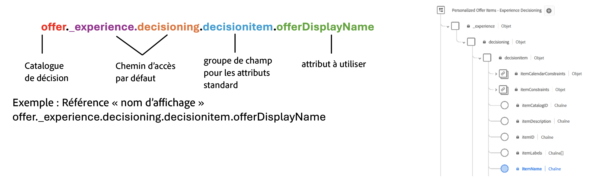

+++

+++Utiliser des attributs personnalisés d’éléments de décision

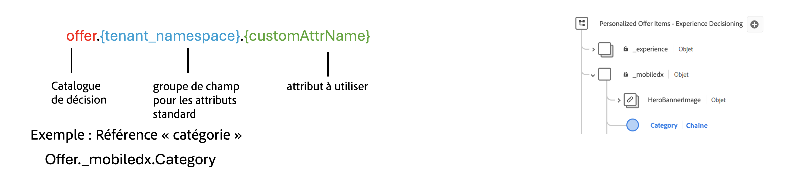

+++

### Exemples PQL de formules de classement {#ranking-formula-examples}

Vous pouvez créer de nombreuses formules de classement différentes en fonction de vos besoins. Voici quelques exemples.

+++Booster les offres avec un attribut d’offre spécifique basé sur l’attribut de profil

Si le profil réside dans la ville correspondant à l’offre, doublez la priorité de toutes les offres de cette ville.

**Formule de classement:**

```
if( offer.characteristics.get("city") = homeAddress.city, offer.rank.priority * 2, offer.rank.priority)
```

+++

+++Booster les offres pour lesquelles la date de fin est inférieure à 24 heures

**Formule de classement:**

```
if( offer.selectionConstraint.endDate occurs <= 24 hours after now, offer.rank.priority * 3, offer.rank.priority)
```

+++

+++Booster les offres en fonction de la propension des clients à acheter le produit proposé

Vous pouvez augmenter le score d’une offre en fonction d’un score de propension du client.

Dans cet exemple, le client d’instance est *_salesvelocity* et le schéma de profil contient une plage de scores stockés dans un tableau :

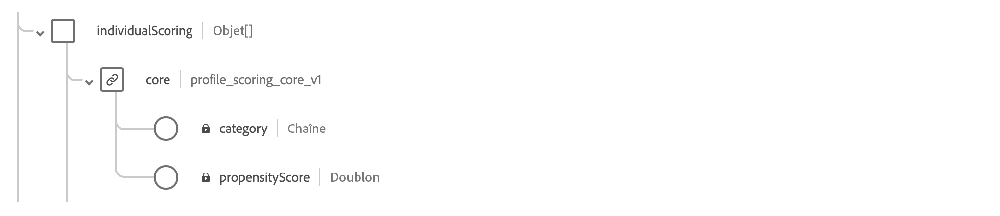

Ainsi, pour un profil tel que :

```
{"_salesvelocity": {"individualScoring": [
                    {"core": {
                            "category":"insurance",
                            "propensityScore": 96.9
                        }},
                    {"core": {
                            "category":"personalLoan",
                            "propensityScore": 45.3
                        }},
                    {"core": {
                            "category":"creditCard",
                            "propensityScore": 78.1
                        }}
                    ]}
}
```

+++

+++Mettre en avant des offres en fonction du code postal et du revenu annuel d’un profil

Dans cet exemple, le système tente toujours de présenter en premier une offre avec un code postal identique, puis utilise une offre générale si aucune correspondance n’est trouvée. Cela évite de présenter les offres destinées aux autres codes postaux.

```pql
if( offer._luma.offerDetails.zipCode = _luma.zipCode,luma.annualIncome / 1000 + 10000, if( not offer.luma.offerDetails.zipCode,_luma.annualIncome / 1000, -9999) )
```

Fonction de la formule :

* Si l’offre possède le même code postal que l’utilisateur ou l’utilisatrice, attribuez-lui un score très élevé afin qu’elle soit sélectionnée en premier.
* Si l’offre ne comporte aucun code postal (s’il s’agit d’une offre générale), attribuez-lui un score normal en fonction du revenu de l’utilisateur ou de l’utilisatrice.
* Si le code postal de l’offre est différent de celui de l’utilisateur ou de l’utilisatrice, attribuez-lui un score très faible afin qu’elle ne soit pas sélectionnée.

+++

+++Booster les offres basées sur des données contextuelles

[!DNL Journey Optimizer] permet de mettre en avant certaines offres en fonction des données contextuelles transmises dans l’appel. Par exemple, si la valeur `contextData.weather=hot` est transmise, la priorité de toutes les offres avec la valeur `attribute=hot` doit être augmentée.

>[!NOTE]
>
>Pour obtenir des informations détaillées sur la transmission de données contextuelles<!-- using the **Edge Decisioning** and **Decisioning** APIs-->, consultez [cette section](../context-data.md).

Notez que lorsque vous utilisez l’API **Decisioning**, les données contextuelles sont ajoutées à l’élément de profil dans le corps de la requête, comme dans l’exemple ci-dessous.

```
"xdm:profiles": [
{
    "xdm:identityMap": {
        "crmid": [
            {
            "xdm:id": "CRMID1"
            }
        ]
    },
    "xdm:contextData": [
        {
            "@type":"_xdm.context.additionalParameters;version=1",
            "xdm:data":{
                "xdm:weather":"hot"
            }
        }
    ]
    
}],
```

+++

## Vidéo pratique {#video}

Découvrez comment utiliser le créateur de formules d’IA dans Adobe Journey Optimizer pour créer des stratégies de classement d’offres personnalisées.

>[!VIDEO](https://video.tv.adobe.com/v/3464446/?learn=on&enablevpops)
