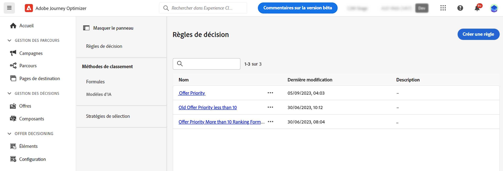

# Méthodes de classement {#rankings}

Les méthodes de classement vous permettent de classer les éléments à afficher pour un profil donné. Une fois qu’une méthode de classement a été créée, vous pouvez l’affecter à une stratégie de sélection afin de définir les éléments à sélectionner en premier.

Deux types de méthodes de classement sont disponibles :

* Les **formules** vous permettent de définir des règles déterminant l’élément qui doit être présenté en premier au lieu de prendre en compte les scores de priorité de l’élément.

* Les **modèles d’IA** vous permettent d’utiliser des systèmes de modèles entraînés qui exploitent plusieurs points de données pour déterminer l’élément qui doit être présenté en premier.

## Créer des méthodes de classement {#create}

Pour créer une méthode de classement, procédez comme suit :

1. Accédez au menu **[!UICONTROL Configuration de la stratégie]**, puis sélectionnez le menu **[!UICONTROL Formules]** ou **[!UICONTROL Modèles d’IA]** en fonction du type de classement que vous souhaitez utiliser.

   

1. Cliquez sur le bouton **[!UICONTROL Créer une formule]** ou **[!UICONTROL Créer un modèle d’IA]** dans le coin supérieur droit de l’écran.

   Des informations détaillées sur création de formules de classement et de modèles d’IA sont disponibles dans les sections suivantes :

   * [Formules de classement](ranking-formulas.md)
   * [Modèles d’IA](ai-models.md)

1. Configurez la formule ou le modèle d’IA en fonction de vos besoins, puis enregistrez la formule ou le modèle.

Votre méthode de classement est maintenant prête à être utilisée dans une [stratégie de sélection](../selection-strategies.md) pour classer les éléments de décision éligibles.

