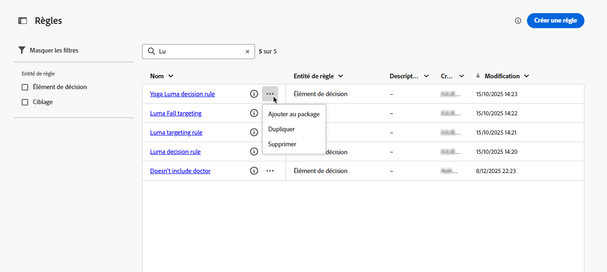
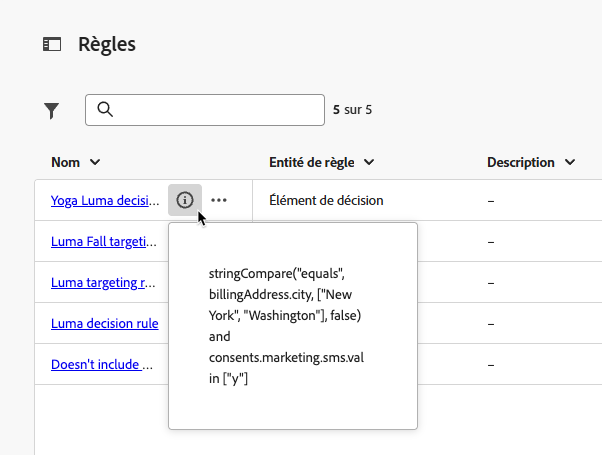
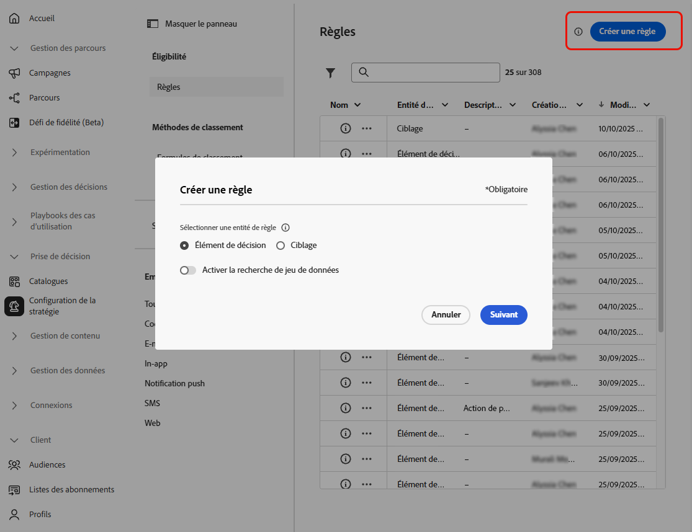
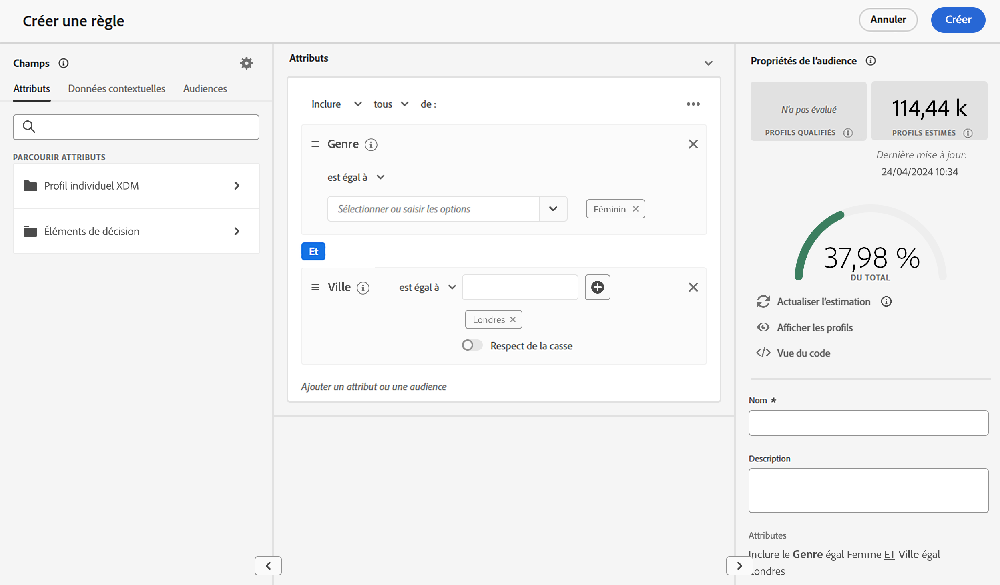
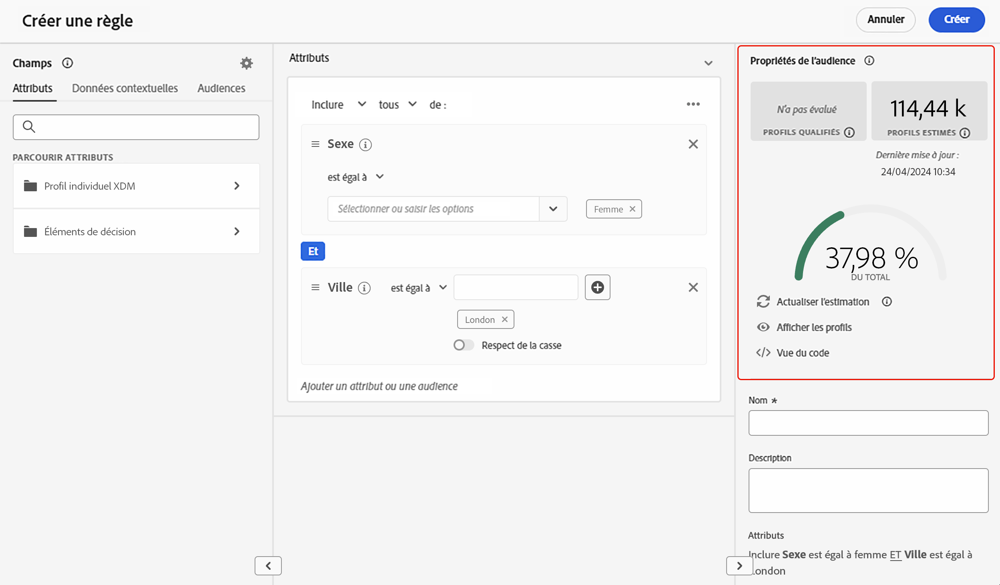

# Créer des règles {#rules}

>[!CONTEXTUALHELP]
>id="ajo_exd_config_rules"
>title="Créer des règles"
>abstract="Vous pouvez créer deux types de règles : des **règles de décision** qui peuvent être utilisées dans des éléments de décision ou des stratégies de sélection pour contrôler quels éléments doivent être présentés à quelle audience, ou des **règles de ciblage** pour déterminer des segments d’audience spécifiques qui peuvent recevoir un contenu personnalisé, ou rejoindre un chemin de parcours spécifique.  Lors de la création d’une règle de décision, vous pouvez sélectionner **[!UICONTROL Activer la recherche de jeu de données]** pour utiliser les données Adobe Experience Platform. Cela vous permet de définir des critères d’éligibilité en fonction d’attributs externes dynamiques, afin que les éléments de décision s’affichent uniquement au moment approprié."

## À propos des règles {#about}

Dans [!DNL Journey Optimizer], vous pouvez créer deux types de règles réutilisables :

* [Règles de décision](#decision-rules)
* [Règles de ciblage](#targeting-rules)

### Règles de décision {#decision-rules}

Les règles de décision vous permettent de définir l’audience des éléments de décision en appliquant des contraintes, directement au niveau de l’élément de décision ou dans une stratégie de sélection spécifique. Vous pouvez ainsi contrôler précisément quels éléments doivent être présentés à qui.

Prenons l’exemple d’un scénario dans lequel vous avez des éléments de décision concernant des produits liés au yoga et conçus pour les femmes. Avec les règles de décision, vous pouvez spécifier que ces éléments ne doivent être affichés que pour les profils dont le genre est « Femme », et qui ont indiqué un « Point ciblé » dans « Yoga ».

>[!NOTE]
>
>Outre les règles de décision relatives aux éléments et à la stratégie de sélection, vous pouvez définir l’audience prévue au niveau de la campagne. [En savoir plus](../campaigns/create-campaign.md#audience)

### Règles de ciblage {#targeting-rules}

>[!AVAILABILITY]
>
>Les règles de ciblage sont actuellement en disponibilité limitée. Contactez votre représentant ou représentante Adobe pour en obtenir l’accès.
>
>Notez que cette fonctionnalité n’est disponible que pour les organisations qui ont acheté le module complémentaire **Decisioning**. Elle sera progressivement disponible pour l’ensemble de la clientèle.

Les règles de ciblage permettent de déterminer les qualifications spécifiques qui doivent être remplies pour qu’un client ou une cliente puisse recevoir du contenu personnalisé ou rejoindre un chemin de parcours spécifique, en fonction de segments d’audience spécifiques, ce qui vous permet de cibler des sous-audiences dans vos parcours et campagnes.

Souvent, il s’agit d’une combinaison de plusieurs attributs, en plus des événements de comportement client et des données contextuelles. Pour économiser du temps et des efforts, vous pouvez créer des règles de ciblage une seule fois et les réutiliser dans vos parcours et campagnes, avec la possibilité de les modifier rapidement en ligne au moment de la création.

Vous pouvez utiliser ces règles :

* lors de la création du [ciblage d’optimisation de contenu](../content-management/optimization-targeting.md) dans des parcours ou des campagnes ;
* lors de la création de l’[optimisation des chemins de parcours](../building-journeys/optimize.md#targeting).

➡️ [Découvrez cette fonctionnalité en vidéo.](#video)

## Accéder aux règles {#access}

La liste des règles est accessible dans le menu **[!UICONTROL Prise de décision]** > **[!UICONTROL Configuration de la stratégie]**.

Les actions suivantes sont disponibles :

* Vous pouvez filtrer par entité de règle (**[!UICONTROL Élément de décision]** ou **[!UICONTROL Ciblage]** – [En savoir plus](#about)).

* Sélectionnez une règle en cliquant sur son nom et modifiez-la à l’aide du créateur de règles. [Voici comment procéder](#create)

* Cliquez sur le bouton **[!UICONTROL Plus d’actions]** en regard de chaque élément pour effectuer les opérations suivantes :

   * Si vous avez sélectionné l’entité **[!UICONTROL Élément de décision]**, ajoutez la règle à un package afin de l’exporter vers un autre sandbox. Découvrez comment [exporter des objets vers un autre sandbox](../configuration/copy-objects-to-sandbox.md).
   * Dupliquez une règle.
   * Supprimez une règle.

{width=100%}

* Cliquez sur l’icône **[!UICONTROL Plus d’infos]** pour afficher la formule qui constitue la règle.

{width=60%}

## Création d’une règle {#create}

Pour créer une règle, procédez comme suit :

1. Accédez à **[!UICONTROL Prise de décision]** > **[!UICONTROL Configuration de la stratégie]** > **[!UICONTROL Règles]**, puis cliquez sur le bouton **[!UICONTROL Créer une règle]**.

1. Sélectionnez l’entité de règle pour spécifier le type d’objet pour lequel la règle est créée.

   {width=90%}

   * **[!UICONTROL Élément de décision]** : la règle peut être appliquée à un [élément de décision](#decision-rules) dans le contexte de la prise de décision.
   * **[!UICONTROL Ciblage]** : la règle peut être utilisée lors de la création de règles de [ciblage](#targeting-rules) soit dans le cadre de l’[optimisation de contenu](../content-management/optimization-targeting.md) dans une campagne ou un parcours, soit dans l’[activité Optimiser le parcours](../building-journeys/optimize.md#targeting).

1. Si vous créez une règle **[!UICONTROL Élément de décision]**, vous pouvez sélectionner **[!UICONTROL Activer la recherche de jeu de données]** pour utiliser les données d’Adobe Experience Platform afin d’enrichir votre logique de décision avec des données externes. Cela s’avère particulièrement utile pour les attributs qui changent fréquemment, tels que la disponibilité des produits ou la tarification en temps réel.

   >[!AVAILABILITY]
   >
   >Cette fonctionnalité est actuellement disponible en version Beta publique pour l’ensemble des clientes et clients. Contactez votre représentant ou représentante de compte si vous souhaitez y accéder. [Découvrez comment utiliser des données Adobe Experience Platform pour la prise de décision.](../experience-decisioning/aep-data-exd.md)

1. L’écran de création des règles s’affiche. Attribuez un nom à votre règle et fournissez une description.

1. Créez la règle en fonction de vos besoins à l’aide du créateur de segments d’Adobe Experience Platform. Pour ce faire, vous pouvez utiliser différentes sources de données telles que :
   * Attributs de profil
   * Attributs d’élément de décision, disponibles uniquement lors de la création d’une règle **[!UICONTROL Élément de décision]**
   * Audiences
   * Données contextuelles provenant d’Adobe Experience Platform [Découvrir comment utiliser les données contextuelles](context-data.md)

   {width=85%}

   >[!NOTE]
   >
   >Le créateur de segments fourni pour créer des règles présente certaines spécificités par rapport à celui utilisé avec le service de segmentation d’Adobe Experience Platform. Cependant, le processus global décrit dans la documentation est toujours valide pour créer des règles dans [!DNL Journey Optimizer]. [Découvrir comment créer des définitions de segment](../audience/creating-a-segment-definition.md)

1. À mesure que vous ajoutez et configurez de nouveaux champs dans l’espace de travail, le volet **[!UICONTROL Propriétés de l’audience]** affiche des informations sur l’estimation des profils appartenant à l’audience. Cliquez sur **[!UICONTROL Actualiser l’estimation]** pour mettre à jour les données.

   {width=85%}

   >[!NOTE]
   >
   >Les estimations de profil ne sont pas disponibles lorsque les paramètres de règle incluent des données qui ne sont pas stockées dans le profil, telles que des données contextuelles.

1. Une fois que votre règle est prête, cliquez sur **[!UICONTROL Créer]**. La règle créée apparaît dans la liste et, selon l’entité que vous avez créée, peut être utilisée :

   * dans les **éléments de décision** et les **stratégies de sélection** pour régir la présentation des éléments de décision aux profils ;
   * ou lors de la création du **ciblage** dans l’optimisation du contenu ou l’optimisation des chemins d’accès.

>[!NOTE]
>
>La profondeur d’imbrication dans une règle est limitée à 30 niveaux. Celle-ci est mesurée en comptant les parenthèses fermantes `)` dans la chaîne PQL.
>
>La taille d’une chaîne de règle est de 15 Ko maximum pour les caractères codés en UTF-8. Cela équivaut à 15 000 caractères ASCII (1 octet chacun) ou 3 750 à 7 500 caractères non ASCII (2 à 4 octets chacun).
>
>[En savoir plus sur les mécanismes de sécurisation et sur les limitations des règles d’éligibilité](decisioning-guardrails.md#eligibility-rules)

## Vidéo pratique {#video}

Découvrez comment créer, dupliquer et appliquer des **règles de ciblage** réutilisables dans Adobe Journey Optimizer afin de personnaliser efficacement les campagnes en fonction des attributs de la clientèle, tels que la zone géographique, la langue et le comportement. Gagnez du temps tout en améliorant la précision de l’audience.

>[!VIDEO](https://video.tv.adobe.com/v/3476129/?captions=fre_fr&quality=12)
