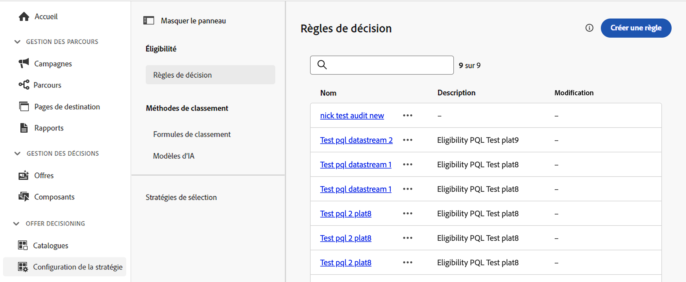

# Règles de décision {#rules}

>[!CONTEXTUALHELP]
>id="ajo_exd_config_rules"
>title="Créer des règles de décision"
>abstract="Les règles de décision vous permettent de définir l’audience des éléments de décision en appliquant des contraintes, directement au niveau de l’élément de décision ou dans une stratégie de sélection spécifique. Vous pouvez ainsi contrôler précisément quels éléments doivent être présentés à qui."

>[!BEGINSHADEBOX « Ce guide couvre les sujets suivants »]

* [Commencer avec la prise de décision basée sur l’expérience](gs-experience-decisioning.md)
* Gérer les éléments de décision : [Configurer le catalogue d’éléments](catalogs.md) – [Créer des éléments de décision](items.md) – [Gérer des collections d’éléments](collections.md)
* Configurer la sélection des éléments : **[Créer des règles de décision](rules.md)** – [Créer des méthodes de classement](ranking.md)
* [Créer des stratégies de sélection](selection-strategies.md)
* [Créer des politiques de décision](create-decision.md)

>[!ENDSHADEBOX]

Les règles de décision vous permettent de définir l’audience des éléments de décision en appliquant des contraintes, directement au niveau de l’élément de décision ou dans une stratégie de sélection spécifique. Vous pouvez ainsi contrôler précisément quels éléments doivent être présentés à qui.

Prenons l’exemple d’un scénario dans lequel vous avez des éléments de décision concernant des produits liés au yoga et conçus pour les femmes. Avec les règles de décision, vous pouvez spécifier que ces éléments ne doivent être affichés que pour les profils dont le genre est &quot;Femme&quot; et qui ont indiqué un &quot;Point ciblé&quot; dans &quot;Yoga&quot;.

>[!NOTE]
>
>Outre les règles de décision relatives aux éléments et à la stratégie de sélection, vous pouvez définir l’audience prévue au niveau de la campagne. [En savoir plus](../campaigns/create-campaign.md#audience)

La liste des règles de décision est accessible dans le menu **[!UICONTROL Configuration]**/**[!UICONTROL Régles de décisions]**.

## Créer une règle de décision {#create}

Pour créer cette règle de décision, procédez comme suit :

1. Accédez à **[!UICONTROL Configuration]** / **[!UICONTROL Règles de décision]** puis cliquez sur **[!UICONTROL Créer une règle]** bouton .

1. L’écran de création des règles de décision s’affiche. Nommez votre règle et décrivez-la.

1. Créez la règle de décision en fonction de vos besoins à l’aide du créateur de segments de Adobe Experience Platform. Pour ce faire, vous pouvez utiliser diverses sources de données telles que les attributs de profil, les audiences ou les données contextuelles provenant de Adobe Experience Platform. [Découvrez comment exploiter les données contextuelles dans les règles de décision](#context-data)

   

   >[!NOTE]
   >
   >Le créateur de segments fourni pour créer des règles de décision présente certaines spécificités par rapport à celui utilisé avec le service de segmentation Adobe Experience Platform.  Cependant, le processus global décrit dans la documentation est toujours valide pour créer des règles de décision. [Découvrir comment créer des définitions de segment](../audience/creating-a-segment-definition.md)

1. À mesure que vous ajoutez et configurez de nouveaux champs dans l’espace de travail, le volet **[!UICONTROL Propriétés de l’audience]** affiche des informations sur l’estimation des profils appartenant à l’audience. Cliquez sur **[!UICONTROL Actualiser l’estimation]** pour mettre à jour les données.

   >[!NOTE]
   >
   >Les estimations de profil ne sont pas disponibles lorsque les paramètres de règle incluent des données qui ne figurent pas dans le profil, telles que des données contextuelles.

1. Une fois votre règle de décision prête, cliquez sur **[!UICONTROL Enregistrer]**. La règle créée apparaît dans la liste et peut être utilisée dans les éléments de décision et les stratégies de sélection afin de régir la présentation des éléments de décision aux profils.

## Exploitation des données contextuelles dans les règles de décision {#context-data}

L’écran de création de règles Experience Decisioning vous permet d’exploiter toutes les informations disponibles dans Adobe Experience Platform pour créer des règles de décision. Par exemple, vous pouvez concevoir une règle de décision qui exige que la météo actuelle soit de ≥80 degrés.

Pour ce faire, vous devez d’abord définir les données à rendre disponibles dans Experience Decisioning. Une fois cette opération terminée, ces données s’intègrent de manière transparente à Experience Decisioning dans la variable **[!UICONTROL Données contextuelles]** disponible lors de la création d’une règle de décision.

Les étapes pour alimenter Experience Decisioning avec les données Adobe Experience Platform sont les suivantes :

1. Créez un **Schéma Experience Event**  dans Adobe Experience Platform et son **dataset**. [Découvrez comment créer des schémas](https://experienceleague.adobe.com/en/docs/experience-platform/xdm/ui/resources/schemas){target="_blank"}

1. Créez un flux de données Adobe Experience Platform :

   1. Accédez au **[!UICONTROL Datastreams]** et sélectionnez **[!UICONTROL Nouvelle structure de données]**.

   1. Dans le **[!UICONTROL Schéma d’événement]** , sélectionnez le schéma Événement d’expérience créé précédemment, puis cliquez sur **[!UICONTROL Enregistrer]**.

      

   1. Cliquez sur **[!UICONTROL Ajouter un service]** et sélectionnez &quot;Adobe Experience Platform&quot; comme service. Dans le **[!UICONTROL Jeu de données d’événement]** , sélectionnez le jeu de données d’événement créé précédemment et activez la variable **[!UICONTROL Adobe Journey Optimizer]** .

      

Une fois le flux de données enregistré, les informations du jeu de données sélectionné sont automatiquement récupérées et intégrées dans Experience Decisioning, généralement disponibles sous environ 24 heures.

Pour plus d’informations sur l’utilisation de Adobe Experience Platform, consultez les ressources suivantes :

* [Schémas XDM (Experience Data Model)](https://experienceleague.adobe.com/en/docs/experience-platform/xdm/schema/composition){target="_blank"}
* [Jeux de données](https://experienceleague.adobe.com/en/docs/experience-platform/catalog/datasets/overview){target="_blank"}
* [Datastreams](https://experienceleague.adobe.com/en/docs/experience-platform/datastreams/overview){target="_blank"}
