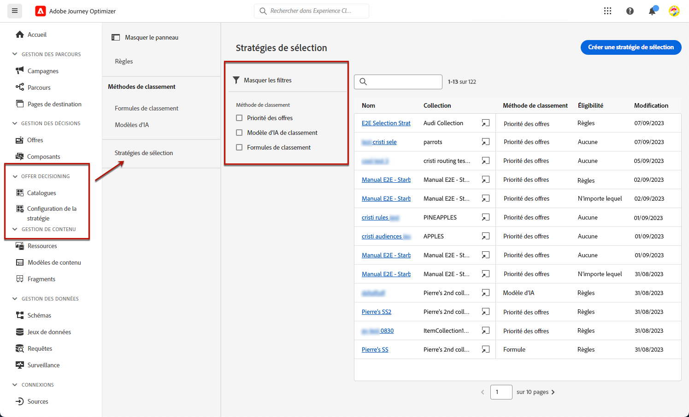
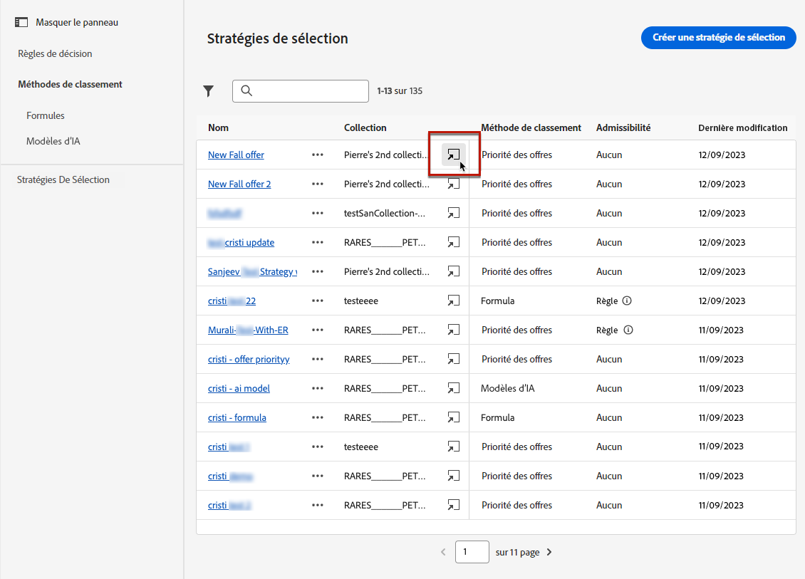

# Créer des stratégies de sélection {#selection-strategies}

>[!CONTEXTUALHELP]
>id="ajo_exd_config_strategies"
>title="Définir vos stratégies de sélection"
>abstract="Une stratégie de sélection est réutilisable et est constituée d’une collection associée à une contrainte d’éligibilité et d’une méthode de classement permettant de déterminer les offres à afficher lorsqu’elles sont sélectionnées dans une politique de décision."
>additional-url="https://experienceleague.adobe.com/fr/docs/journey-optimizer/using/decisioning/experience-decisioning/create-decision" text="Créer des politiques de décision"

>[!CONTEXTUALHELP]
>id="ajo_exd_strategy_eligibility"
>title="Limiter les profils éligibles"
>abstract="Vous pouvez restreindre la sélection des offres pour cette stratégie de sélection. Par défaut, tous les profils sont éligibles, mais vous pouvez utiliser des audiences ou des règles pour limiter la sélection des offres à des profils spécifiques uniquement."
>additional-url="https://experienceleague.adobe.com/fr/docs/journey-optimizer/using/audiences-profiles-identities/audiences/about-audiences" text="Utiliser des audiences"
>additional-url="https://experienceleague.adobe.com/fr/docs/journey-optimizer/using/decisioning/experience-decisioning/selection/rules" text="Utiliser des règles de décision"

Une stratégie de sélection est réutilisable et est constituée d’une collection associée à une contrainte d’éligibilité et d’une méthode de classement permettant de déterminer les offres à afficher lorsqu’elles sont sélectionnées dans une [politique de décision](create-decision.md).

## Accéder aux stratégies de sélection et les gérer

1. Accédez à **[!UICONTROL Prise de décision]** > **[!UICONTROL Configuration de la stratégie]** > **[!UICONTROL Stratégies de sélection]**.

1. Toutes les stratégies de sélection créées jusqu’à présent y sont répertoriées. Des filtres sont disponibles pour vous aider à récupérer les stratégies en fonction de la méthode de classement.

   

1. Cliquez sur le nom d’une stratégie de sélection pour la modifier.

1. La collection, la méthode de classement et l’éligibilité sélectionnées pour chaque stratégie sont également affichées. Vous pouvez cliquer sur l’icône en regard de chaque nom de collection pour modifier directement une collection.

   

## Créer une stratégie de sélection {#create-selection-strategy}

Pour créer une stratégie de sélection, procédez comme suit.

1. Dans l’inventaire des **[!UICONTROL Stratégies de sélection]**, cliquez sur **[!UICONTROL Créer une stratégie de sélection]**.

   

1. Ajoutez un nom pour votre stratégie.

   >[!NOTE]
   >
   >Actuellement, seul le catalogue par défaut **[!UICONTROL Offres]** est disponible.

1. Renseignez les détails de votre stratégie de sélection, en commençant par le nom.

   

1. Sélectionnez la [collection](collections.md) qui contient les offres à prendre en compte.

1. Utilisez le champ **[!UICONTROL Éligibilité]** pour restreindre la sélection des offres pour cette stratégie de sélection.

   

   * Pour restreindre la sélection des offres aux membres d’une audience Experience Platform, sélectionnez **[!UICONTROL Audiences]** et choisissez une audience dans la liste. [Découvrez comment utiliser les audiences](../audience/about-audiences.md)

   * Si vous souhaitez ajouter une contrainte de sélection avec une règle de décision, utilisez l’option **[!UICONTROL Règle de décision]** et sélectionnez la règle de votre choix. [Découvrez comment créer une règle](rules.md)

1. Définissez la méthode de classement à utiliser pour sélectionner la meilleure offre pour chaque profil. [En savoir plus](#select-ranking-method)

   

   * Par défaut, si plusieurs offres sont éligibles pour cette stratégie, la méthode [Priorité des offres](#offer-priority) utilise la valeur définie dans les offres.

   * Si vous souhaitez utiliser un score calculé spécifique pour choisir l’offre éligible à présenter, sélectionnez [Formule](#ranking-formula) ou [Modèle d’IA](#ai-ranking).

1. Cliquez sur **[!UICONTROL Créer]**. Elle est maintenant prête à être utilisée dans une [politique de décision](create-decision.md).

## Sélectionner une méthode de classement {#select-ranking-method}

>[!CONTEXTUALHELP]
>id="ajo_exd_strategy_ranking"
>title="Définir le classement des offres"
>abstract="Si plusieurs offres sont éligibles pour une stratégie de sélection donnée, choisissez la méthode qui sélectionnera la meilleure offre pour chaque profil lors de la création d’une stratégie de sélection : formule de priorité ou de classement."
>additional-url="https://experienceleague.adobe.com/docs/journey-optimizer/using/decisioning/experience-decisioning/create-decision.html?lang=fr" text="Créer des politiques de décision"

Si plusieurs offres sont éligibles pour une stratégie de sélection donnée, vous pouvez choisir la méthode qui sélectionnera la meilleure offre pour chaque profil lors de la création d’une stratégie de sélection. Vous pouvez classer les offres par :

* [Priorité des offres](#offer-priority)
* [Formule](#ranking-formula)
* [Classement par l&#39;IA](#ai-ranking)

### Priorité des offres {#offer-priority}

Par défaut, lorsque plusieurs offres sont éligibles dans une politique de décision, les éléments avec la **priorité** la plus élevée sont diffusés en premier aux clients.

{width=85%}

Les scores de priorité des offres sont attribués lors de la création d’un [élément de décision](items.md).

### Formule de classement {#ranking-formula}

En plus de la priorité d’offre, Journey Optimizer vous permet de créer des **formules de classement**. Ces formules déterminent quelle offre doit être présentée en premier pour un emplacement donné au lieu de prendre en compte les scores de priorité des offres.

Par exemple, vous pouvez augmenter la priorité de toutes les offres dont la date de fin est inférieure à 24 heures, ou remonter les offres de la catégorie « en cours » si le point ciblé du profil est « en cours ». Découvrez comment créer une formule de classement dans [cette section](ranking/ranking-formulas.md).

Une fois créée, vous pouvez utiliser cette formule dans une stratégie de sélection. Si plusieurs offres sont éligibles à la présentation lors de l’utilisation de cette stratégie de sélection, la décision emploiera la formule sélectionnée pour calculer l’offre à présenter en premier.

### Classement par l’IA {#ai-ranking}

Vous pouvez également utiliser un système de modèles formés qui classe automatiquement les offres à afficher pour un profil donné en sélectionnant un modèle d’IA. Découvrez comment créer un modèle d’IA dans [cette section](ranking/create-ai-models.md).

Une fois qu’un modèle d’IA a été créé, vous pouvez l’utiliser dans une stratégie de sélection. Si plusieurs offres sont éligibles, le système de modèles formés détermine l’offre qui doit être présentée en premier pour la stratégie de sélection.

>[!NOTE]
>
>Actuellement, le rapport [Mesure de l’effet élévateur](ranking/auto-optimization-model.md#lift) n’est disponible que pour le modèle d’IA [Optimisation personnalisée](ranking/personalized-optimization-model.md).

