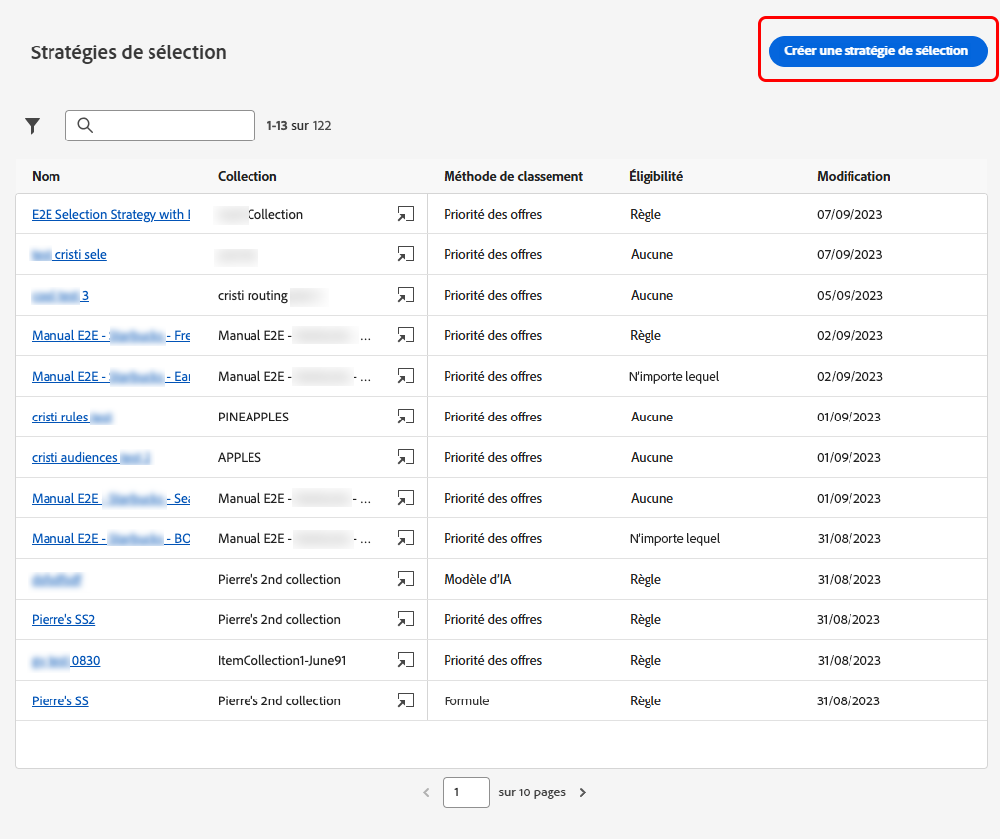
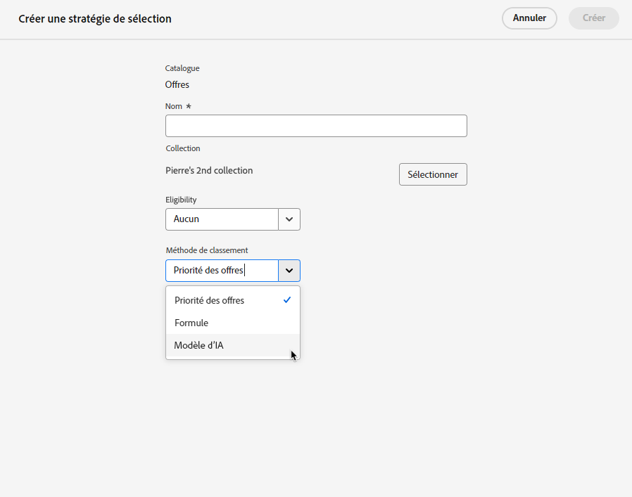

# Créer des stratégies de sélection {#selection-strategies}

>[!BEGINSHADEBOX]

Ce guide couvre les sujets suivants :

* [Prise en main de la prise de décision basée sur l’expérience](gs-experience-decisioning.md)
* Gérer les éléments de décision
   * [Configurer le catalogue d’éléments](catalogs.md)
   * [Créer des éléments de décision](items.md)
   * [Gérer des collections d’éléments](collections.md)
* Configurer la sélection d’éléments
   * [Créer des règles de décision](rules.md)
   * [Créer des méthodes de classement](ranking.md)
* **[Créer des stratégies de sélection](selection-strategies.md)**
* [Créer des stratégies de décision](create-decision.md)

>[!ENDSHADEBOX]

Une stratégie de sélection est un élément réutilisable, constitué d’une collection associée à une contrainte d’éligibilité et d’une méthode de classement permettant de déterminer les offres à afficher lorsqu’elles sont sélectionnées dans une [stratégie de décision](create-decision.md).

## Accès et gestion des stratégies de sélection

1. Accédez à **[!UICONTROL Experience Decisioning]** > **[!UICONTROL Configuration]** > **[!UICONTROL Stratégies de sélection]**.

1. Toutes les stratégies de sélection créées jusqu’à présent sont répertoriées. Des filtres sont disponibles pour vous aider à récupérer les stratégies en fonction de la méthode de classement.

   

1. Cliquez sur le nom d’une stratégie de sélection pour la modifier.

1. La collection, le classement et l&#39;éligibilité sélectionnés pour chaque stratégie sont également affichés. Vous pouvez cliquer sur l’icône en regard de chaque nom de collection pour modifier directement une collection.

   

## Création d’une stratégie de sélection

Pour créer une stratégie de sélection, procédez comme suit.

1. Dans la **[!UICONTROL Stratégies de sélection]** inventory, cliquez sur **[!UICONTROL Créer une stratégie de sélection]**.

   

1. Ajoutez un nom pour votre stratégie.

   >[!NOTE]
   >
   >Actuellement, seule la valeur par défaut **[!UICONTROL Offres]** Le catalogue est disponible.

1. Renseignez les détails de votre stratégie de sélection, en commençant par le nom.

   

1. Sélectionner l’offre [collection](collections.md) qui contient les offres à prendre en compte.

1. Utilisez la variable **[!UICONTROL Eligibilité]** pour restreindre la sélection des offres de cette stratégie de sélection.

   

   * Pour restreindre la sélection des offres aux membres d’une audience Experience Platform, sélectionnez **[!UICONTROL Audiences]** et choisissez une audience dans la liste. [Découvrez comment utiliser les audiences](../audience/about-audiences.md)

   * Si vous souhaitez ajouter une contrainte de sélection avec une règle de décision, utilisez l’option **[!UICONTROL Règle de décision]** et sélectionnez la règle de votre choix. [Découvrez comment créer une règle](rules.md)

1. Définissez la méthode de classement à utiliser pour sélectionner la meilleure offre pour chaque profil. [En savoir plus](#select-ranking-method)

   

   * Par défaut, si plusieurs offres sont éligibles pour cette stratégie, la variable [Priorité des offres](#offer-priority) utilise la valeur définie dans les offres.

   * Si vous souhaitez utiliser un score calculé spécifique pour choisir l’offre éligible à présenter, sélectionnez [Formule](#ranking-formula) ou [Modèle d’IA](#ai-ranking).

1. Cliquez sur **[!UICONTROL Créer]**. Il est maintenant prêt à être utilisé dans une [décision](create-decision.md)

## Sélection d’une méthode de classement {#select-ranking-method}

Si plusieurs offres sont éligibles pour une stratégie de sélection donnée, vous pouvez choisir la méthode qui sélectionnera la meilleure offre pour chaque profil lors de la création d&#39;une stratégie de sélection. Vous pouvez classer les offres par :

* [Priorité des offres](#offer-priority)
* [Formule](#ranking-formula)
* [Classement par l&#39;IA](#ai-ranking)

### Priorité des offres {#offer-priority}

Par défaut, lorsque plusieurs offres sont éligibles pour un emplacement donné dans une décision, les éléments ayant le plus haut **priority** sera d’abord livré aux clients.

Les scores de priorité des offres sont attribués lors de la création d’un [élément de décision](items.md).

### Formule de classement {#ranking-formula}

En plus de la priorité d’offre, Journey Optimizer vous permet de créer des **formules de classement**. Ces formules déterminent quelle offre doit être présentée en premier pour un emplacement donné au lieu de prendre en compte les scores de priorité des offres.

Par exemple, vous pouvez augmenter la priorité de toutes les offres dont la date de fin est inférieure à 24 heures, ou remonter les offres de la catégorie « en cours » si le point ciblé du profil est « en cours ». Découvrez comment créer une formule de classement dans [cette section](ranking.md).

Une fois créée, vous pouvez utiliser cette formule dans une stratégie de sélection. Si plusieurs offres peuvent être présentées lors de l’utilisation de cette stratégie de sélection, la décision utilisera la formule sélectionnée pour calculer la première offre à diffuser.

### Classement par l’IA {#ai-ranking}

Vous pouvez également utiliser un système de modèles formés qui classe automatiquement les offres à afficher pour un profil donné en sélectionnant un modèle d’IA. Découvrez comment créer un modèle d’IA dans [cette section](ranking.md).

Une fois qu’un modèle AI a été créé, vous pouvez l’utiliser dans une stratégie de sélection. Si plusieurs offres sont éligibles, le système de modèle formé détermine l’offre qui doit être présentée en premier pour cette stratégie de sélection.
