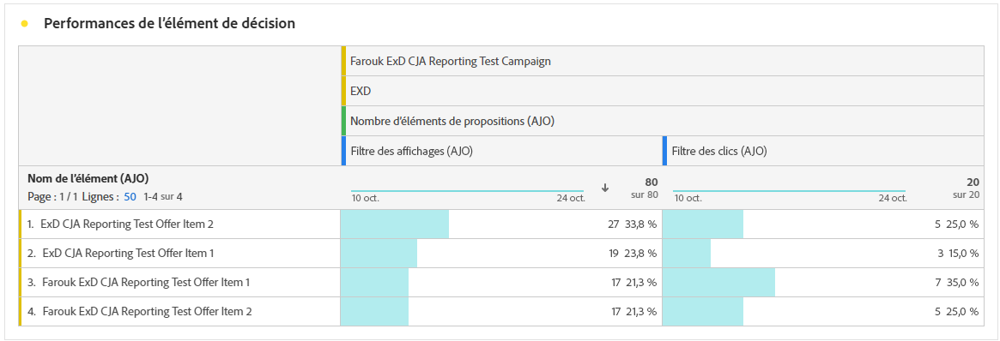

# Utiliser des politiques de décision dans les messages {#create-decision}

Une fois que vous avez ajouté une politique de décision à votre contenu, vous pouvez utiliser les attributs des éléments de décision renvoyés pour la personnalisation. Pour ce faire, insérez d’abord le code de la politique de décision dans votre contenu.

>[!CAUTION]
>
>Les politiques de décision sont disponibles pour tous les clients pour les canaux **Expérience basée sur le code**, **SMS** et **Notification push**.
>
>La prise de décision pour le canal e-mail est disponible en disponibilité limitée. Pour demander l’accès, contactez votre représentant Adobe. En savoir plus sur les [libellés de disponibilité](../rn/releases.md#availability-labels).

## Insérer le code de la politique de décision {#insert}

>[!BEGINTABS]

>[!TAB  Expérience basée sur le code ]

1. Modifiez votre expérience basée sur le code et accédez à **[!UICONTROL Politique de décision]**.

2. Sélectionnez **[!UICONTROL Insérer une politique]** pour ajouter le code de politique de décision.

   

>[!NOTE]
>
>Pour les expériences basées sur du code, si votre politique de décision contient des éléments de décision, y compris des fragments, vous pouvez exploiter ces fragments dans le code de la politique de décision. [Découvrez comment exploiter les fragments](../experience-decisioning/fragments-decision-policies.md)

>[!TAB E-mail]

1. Ouvrez l’éditeur **Personalization** puis accédez à **[!UICONTROL Politiques de décision]**.

2. Sélectionnez **[!UICONTROL Insérer une syntaxe]** pour ajouter le code de votre politique de décision.

   

   >[!NOTE]
   >
   >Si l’option d’insertion n’apparaît pas, il se peut qu’une politique de décision soit déjà configurée pour le composant parent.

3. Si aucun emplacement n’a encore été affecté au composant, sélectionnez-en un dans la liste et cliquez sur **[!UICONTROL Attribuer]**.

   

>[!TAB SMS]

1. Ouvrez l’éditeur **Personalization** puis accédez à **[!UICONTROL Politiques de décision]**.

2. Sélectionnez **[!UICONTROL Insérer une syntaxe]** pour ajouter le code de votre politique de décision.

   

>[!TAB Notification push]

1. Ouvrez l’éditeur **Personalization** puis accédez à **[!UICONTROL Politiques de décision]**.

2. Sélectionnez **[!UICONTROL Insérer une syntaxe]** pour ajouter le code de votre politique de décision.

   

>[!IMPORTANT]
>
>Experience Decisioning avec les notifications push nécessite une version spécifique de Mobile SDK. Avant d’implémenter cette fonctionnalité, consultez les [notes de mise à jour](https://developer.adobe.com/client-sdks/home/release-notes/){target="_blank"} pour identifier la version requise et vous assurer que vous avez effectué la mise à niveau en conséquence. Vous pouvez également afficher toutes les versions de SDK disponibles pour votre plateforme dans [cette section](https://developer.adobe.com/client-sdks/home/current-sdk-versions/){target="_blank"}.

>[!ENDTABS]

Le code de la politique de décision est ajouté. Vous pouvez désormais utiliser des attributs des éléments de décision renvoyés pour personnaliser votre contenu.

>[!NOTE]
>
>Pour l’expérience basée sur le code et les canaux e-mail, répétez cette séquence une fois par élément de décision que vous souhaitez renvoyer. Par exemple, si vous avez choisi de renvoyer 2 éléments lors de la [création de la décision](create-decision-policy.md), répétez deux fois la séquence. Pour les canaux SMS et Push, un seul élément de décision peut être renvoyé.

## Personnalisation à l’aide des attributs d’élément de décision {#attributes}

Une fois que vous avez ajouté le code d’une politique de décision dans votre contenu, tous les attributs des éléments de décision renvoyés peuvent être personnalisés. [Découvrez comment utiliser la personnalisation](../personalization/personalize.md).

Les attributs sont stockés dans le schéma de catalogue [&#x200B; Offres &#x200B;](catalogs.md). Elles s’affichent dans les dossiers suivants de l’éditeur de personnalisation :
* **Attributs personnalisés** : dossier `_\<imsOrg\>`
* **Attributs standard** : dossier `_experience`

Les attributs d’élément de décision et les attributs contextuels ne sont pas pris en charge par défaut dans les fragments de [!DNL Journey Optimizer]. Cependant, vous pouvez utiliser des variables globales à la place, comme décrit ci-dessous.

Pour ajouter un attribut, cliquez sur l’icône **`+`** en regard de l’attribut. Vous pouvez ajouter autant d’attributs que nécessaire. Vous pouvez également inclure d’autres attributs de personnalisation, tels que les données de profil.

* Pour les canaux **e-mail** et **basés sur du code**, encapsulez les attributs dans la boucle `#each` à l’aide de crochets `[ ]` et ajoutez une virgule avant la balise de fermeture `/each`.

  +++Voir l’exemple

  

  +++

* Pour les canaux **SMS** et **Push**, veillez à insérer des attributs après le code de syntaxe de la politique de décision. Cette syntaxe doit toujours être conservée ligne 1.

  +++Voir l’exemple

  

  +++

  >[!NOTE]
  >Si vous insérez un attribut de ressource d’image dans du contenu SMS ou push (par exemple, dans le titre ou le corps), la valeur de l’attribut s’affiche sous la forme d’une URL. L’image elle-même n’est pas rendue dans ces champs.

* Pour activer le suivi des éléments de décision, ajoutez l’attribut `trackingToken` : `trackingToken: {{item._experience.decisioning.decisionitem.trackingToken}}`

## Prévisualiser et tester votre contenu

Après avoir créé votre contenu, prévisualisez et testez-le avant d’activer votre parcours ou votre campagne. Les éléments de décision s’affichent en fonction des profils sélectionnés dans l’interface de simulation. [Découvrez comment prévisualiser et tester du contenu](../content-management/preview-test.md).

## Étapes suivantes {#final-steps}

Une fois que votre contenu est prêt, passez en revue et publiez votre campagne ou votre parcours :

* [Publier un parcours](../building-journeys/publish-journey.md)
* [Examiner et activer une campagne](../campaigns/review-activate-campaign.md)

Pour les expériences basées sur du code, dès que votre développeur ou développeuse effectue un appel d’API ou de SDK pour récupérer du contenu pour la surface définie dans votre configuration de canal, les modifications sont appliquées à votre page web ou votre application.

>[!NOTE]
>
>Actuellement, vous ne pouvez pas simuler le contenu basé sur la décision pour les campagnes ou parcours [expérience basée sur le code](../code-based/create-code-based.md). Une solution est disponible [ici](../code-based/code-based-decisioning-implementations.md).

## Utilisation des tableaux de bord de reporting

Pour évaluer les performances de vos décisions, vous pouvez afficher les mesures de prise de décision prêtes à l’emploi dans le rapport de campagne ou de parcours, ou créer des tableaux de bord Customer Journey Analytics personnalisés pour mesurer les performances et obtenir des informations sur la manière dont vos politiques de décision et vos offres sont diffusées et utilisées. [En savoir plus sur les rapports Decisioning](cja-reporting.md).

