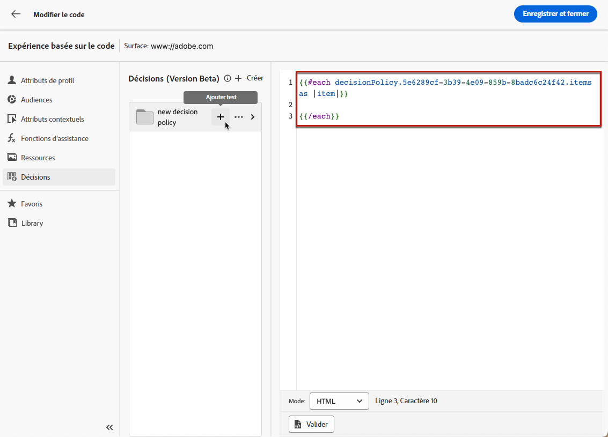
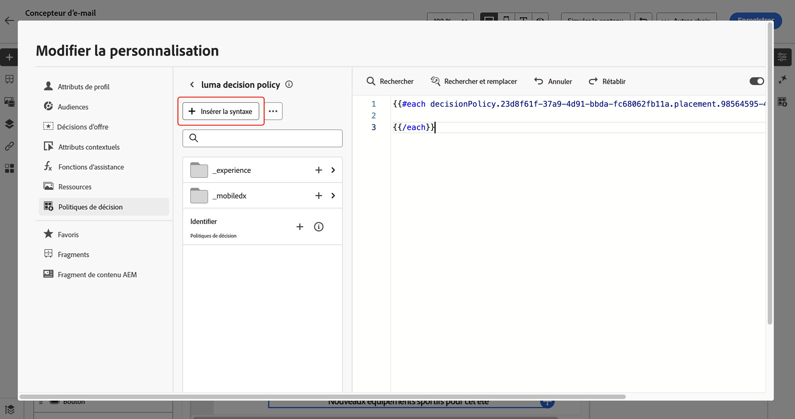
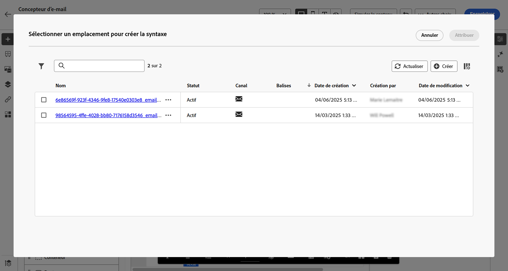
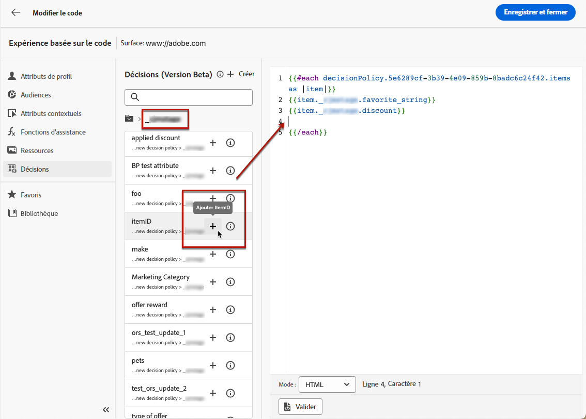
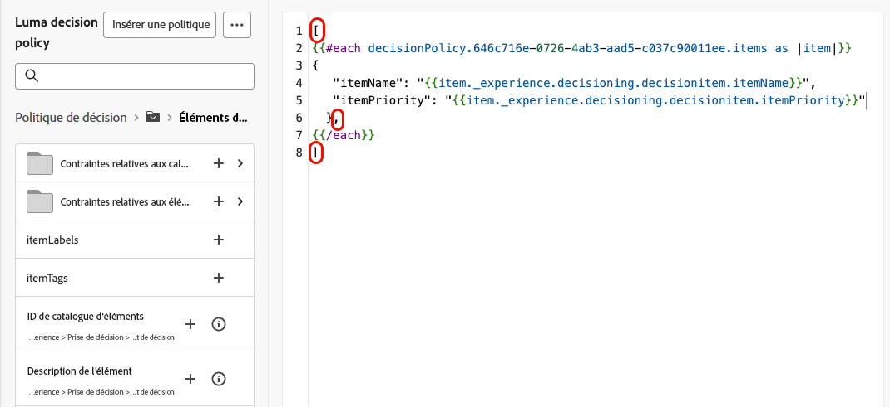
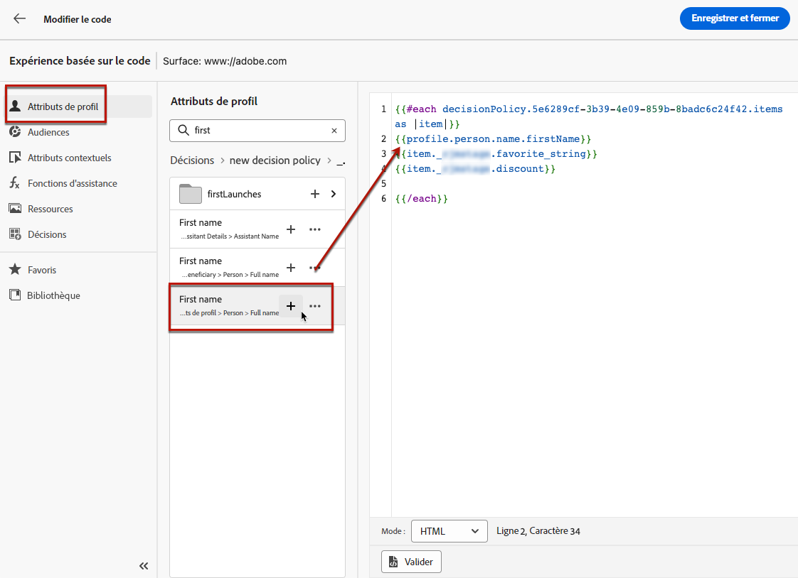
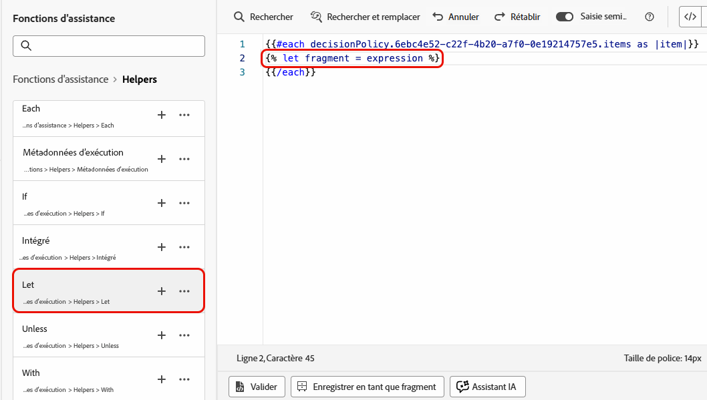
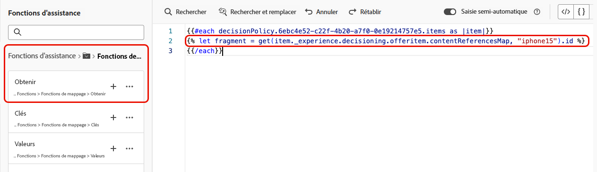
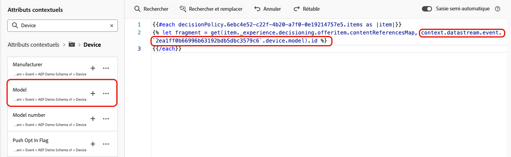
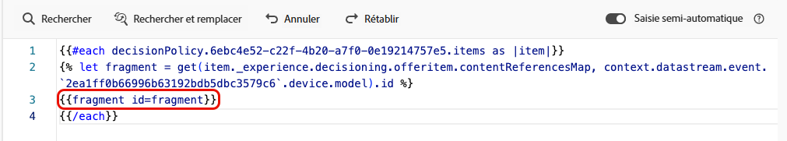

# Utiliser des politiques de décision dans les messages {#create-decision}

Une fois une politique de décision créée, la politique et les attributs liés aux éléments de décision renvoyés peuvent être utilisés dans votre contenu à des fins de personnalisation. Pour ce faire, le code associé à la politique de décision doit d’abord être inséré dans votre contenu. Une fois cette opération terminée, vous pouvez exploiter ses attributs à des fins de personnalisation.

## Insérer le code de la politique de décision {#insert-code}

>[!BEGINTABS]

>[!TAB Expérience basée sur du code]

1. Ouvrez l’éditeur de personnalisation et accédez au menu **[!UICONTROL Politiques de décision]**.

1. Sélectionnez **[!UICONTROL Insérer une politique]** pour ajouter le code correspondant à la politique de décision.

   

   >[!NOTE]
   >
   >Si le bouton d’insertion de code ne s’affiche pas, il se peut qu’une politique de décision ait déjà été configurée pour le composant parent.

1. Le code de la politique de décision est ajouté. Cette séquence sera répétée selon le nombre de renvoi de la politique de décision que vous choisissez. Par exemple, si vous avez choisi de renvoyer 2 éléments lors de la [création de la décision](#add-decision), la même séquence sera répétée deux fois.

>[!TAB E-mail]

1. Ouvrez l’éditeur de personnalisation et accédez au menu **[!UICONTROL Politique de décision]**.

1. Sélectionnez **[!UICONTROL Insérer une syntaxe]** pour ajouter le code correspondant à la politique de décision.

   

   >[!NOTE]
   >
   >Si le bouton d’insertion de code ne s’affiche pas, il se peut qu’une politique de décision ait déjà été configurée pour le composant parent.

1. Si aucun emplacement n’a été associé au préalable au composant, sélectionnez-en un dans la liste et cliquez sur **[!UICONTROL Attribuer]**.

   

>[!ENDTABS]

Une fois le code de la politique de décision ajouté, cette séquence sera répétée autant de fois que vous souhaitez que la politique de décision soit renvoyée. Par exemple, si vous avez choisi de renvoyer 2 éléments lors de la [création de la décision](#add-decision), la même séquence sera répétée deux fois.

## Utiliser des attributs d’éléments de décision {#attributes}

Vous pouvez désormais ajouter tous les attributs de décision que vous souhaitez dans ce code. Les attributs disponibles sont stockés dans le schéma du catalogue **[!UICONTROL Offres]**. Les attributs personnalisés sont stockés dans le dossier **`_<imsOrg`>**, et les attributs standard dans le dossier **`_experience`**. [En savoir plus sur le schéma du catalogue Offres](catalogs.md)


>[!NOTE]
>
>Pour le suivi des éléments de la politique de décision, l’attribut `trackingToken` doit être ajouté comme suit pour le contenu de la politique de décision :
>`trackingToken: {{item._experience.decisioning.decisionitem.trackingToken}}`

Pour ajouter un attribut, cliquez sur l’icône « + » en regard de celui-ci. Vous pouvez ajouter au code autant d’attributs que vous le souhaitez.



Veillez à placer la boucle `#each` à l’intérieur d’une paire de crochets `[ ]`, ajoutez une virgule juste avant l’élément `/each` de fermeture.



Vous pouvez également ajouter tout autre attribut disponible dans l’éditeur de personnalisation, tel que des attributs de profil.



## Utiliser les fragments (expérience basée sur du code) {#fragments}

Si votre politique de décision contient des éléments de décision, y compris des fragments, vous pouvez utiliser ces fragments dans le code de la politique de décision. [En savoir plus sur les fragments](../content-management/fragments.md)

>[!CAUTION]
>
>Actuellement, cette fonctionnalité n’est disponible que pour le canal d’expérience basé sur le code.
>
>Actuellement, seuls les [fragments d’expression](../personalization/use-expression-fragments.md) peuvent être utilisés. Les fragments imbriqués (fragments référençant d’autres fragments) ne sont pas pris en charge.

Supposons, par exemple, que vous souhaitiez afficher différents contenus pour plusieurs modèles d’appareils mobiles. Assurez-vous d’avoir ajouté les fragments correspondant à ces appareils à l’élément de décision que vous utilisez dans la politique de décision. [Découvrez comment procéder](items.md#attributes).

{width=70%}

Une fois cette opération terminée, vous pouvez utiliser l’une des méthodes suivantes :

>[!BEGINTABS]

>[!TAB Insérer directement le code]

Il vous suffit de copier-coller le bloc de code ci-dessous dans le code de la politique de décision. Remplacez `variable` par l’ID de fragment et `placement` par la clé de référence du fragment :

```

{{fragment id = variable}}
```

>[!TAB Suivre les étapes détaillées]

1. Accédez aux **[!UICONTROL Fonctions d’assistance]** et ajoutez la fonction **Let** ` {{variable}}` au volet de code, où vous pouvez déclarer la variable pour votre fragment.

   

1. Utilisez la fonction **Map** > **Get** ``pour créer votre expression. La carte est le fragment référencé dans l’élément de décision et la chaîne peut être le modèle d’appareil que vous avez saisi dans l’élément de décision en tant que **[!UICONTROL clé de référence du fragment]**.

   

1. Vous pouvez également utiliser un attribut contextuel qui contiendra cet identifiant de modèle d’appareil.

   

1. Ajoutez la variable que vous avez choisie pour votre fragment en tant qu’ID de fragment.

   

>[!ENDTABS]

L’ID de fragment et la clé de référence sont sélectionnés dans la section **[!UICONTROL Fragments]** de l’élément de décision.

>[!WARNING]
>
>Si la clé de fragment est incorrecte ou si le contenu du fragment n’est pas valide, le rendu échoue, ce qui entraîne une erreur dans l’appel Edge.

### Mécanismes de sécurisation lors de l’utilisation de fragments {#fragments-guardrails}

**Attributs d’élément de décision et de contexte**

Les attributs d’élément de décision et les attributs contextuels ne sont pas pris en charge par défaut dans les fragments de [!DNL Journey Optimizer]. Cependant, vous pouvez utiliser des variables globales à la place, comme décrit ci-dessous.

Supposons que vous souhaitiez utiliser la variable *sport* dans votre fragment.

1. Référencez cette variable dans le fragment, par exemple :

   ```
   Elevate your practice with new {{sport}} gear!
   ```

1. Définissez la variable avec la fonction **Let** dans le bloc de politique de décision. Dans l’exemple ci-dessous, *sport* est défini avec l’attribut d’élément de décision :

   ```
   {#each decisionPolicy.13e1d23d-b8a7-4f71-a32e-d833c51361e0.items as |item|}}
   
   {{fragment id = get(item._experience.decisioning.offeritem.contentReferencesMap, "placement1").id }}
   {{/each}}
   ```

**Validation du contenu du fragment d’élément de décision**

* En raison de la nature dynamique de ces fragments, lorsqu’ils sont utilisés dans une campagne, la validation du message pendant la création du contenu de la campagne est ignorée pour les fragments référencés dans les éléments de décision.

* La validation du contenu du fragment se produit uniquement lors de la création et de la publication du fragment.

* Dans le cas de fragments JSON, la validité de l’objet JSON n’est pas garantie. Assurez-vous que le contenu du fragment d’expression est un fichier JSON valide qui peut être utilisé dans les éléments de décision.

Au moment de l’exécution, le contenu de la campagne (y compris le contenu du fragment des éléments de décision) est validé. En cas d’échec de validation, la campagne ne sera pas rendue.

## Étapes suivantes {#final-steps}

Une fois que votre contenu est prêt, passez en revue et publiez votre campagne ou votre parcours :

* [Publier un parcours](../building-journeys/publish-journey.md)
* [Vérifier et activer une campagne](../campaigns/review-activate-campaign.md)
* [Publier et activer une expérience basée sur du code](../code-based/publish-code-based.md)

Pour les expériences basées sur du code, dès que votre développeur ou développeuse effectue un appel d’API ou de SDK pour récupérer du contenu pour la surface définie dans votre configuration de canal, les modifications sont appliquées à votre page web ou votre application.

>[!NOTE]
>
>Actuellement, vous ne pouvez pas simuler le contenu de l’interface d’utilisation dans une campagne ou un parcours d’[expérience basée sur du code](../code-based/create-code-based.md) à l’aide de décisions. Une solution de contournement est proposée dans [cette section](../code-based/code-based-decisioning-implementations.md).

Pour évaluer les performances de vos décisions, vous pouvez créer des [tableaux de bord de rapports Customer Journey Analytics personnalisés](cja-reporting.md).

