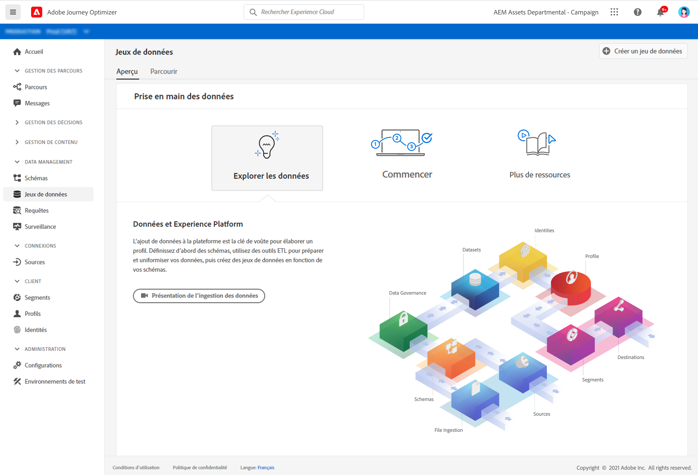

# Prise en main des jeux de données {#datasets-gs}

Toutes les données ingérées dans Adobe Experience Platform sont conservées sous forme de jeux de données dans le lac de données. Un jeu de données est une structure de stockage et de gestion pour la collecte de données, généralement sous la forme d&#39;un tableau, qui contient un schéma (des colonnes) et des champs (des lignes).

Découvrez comment créer des jeux de données dans [cette documentation](https://experienceleague-review.corp.adobe.com/docs/experience-platform/catalog/datasets/overview.html){target=&quot;_blank&quot;}.

L’ajout de données à Adobe Experience Platform est la base de la création d’un profil. Vous pourrez ensuite exploiter les profils dans [!DNL Adobe Journey Optimizer]. Commencez par définir des schémas, utilisez les outils ETL pour préparer et normaliser vos données, puis créez des jeux de données basés sur vos schémas.

➡️ [Découvrez comment créer et configurer un jeu de données](#video-dataset) (vidéo)

L’espace de travail **Jeux de données** de l’interface utilisateur [!DNL Adobe Journey Optimizer] vous permet d’explorer les données et de créer des jeux de données.

Découvrez comment utiliser l’interface utilisateur des jeux de données dans la [documentation de présentation de Data Ingestion](https://experienceleague.adobe.com/docs/experience-platform/ingestion/home.html?lang=fr){target=&quot;_blank&quot;}.

La documentation étape par étape pour mapper un fichier CSV à un schéma XDM est disponible dans [cette documentation](https://experienceleague.adobe.com/docs/experience-platform/ingestion/tutorials/map-a-csv-file.html?lang=fr){target=&quot;_blank&quot;}

## Vidéo pratique{#video-dataset}

Découvrez comment créer un jeu de données, le mapper à un schéma, y ajouter des données et confirmer que les données ont été ingérées.

>[!VIDEO](https://video.tv.adobe.com/v/334293?quality=12)

**Voir également**

* [Créer un schéma, un jeu de données et ingérer des données pour ajouter des profils de test dans Journey Optimizer](building-journeys/creating-test-profiles.md)
* [Présentation de l’ingestion par flux](https://experienceleague.adobe.com/docs/experience-platform/ingestion/streaming/overview.html?lang=fr){target=&quot;_blank&quot;}
* [Ingestion de données dans Adobe Experience Platform](https://experienceleague.adobe.com/docs/experience-platform/ingestion/tutorials/ingest-batch-data.html?lang=en){target=&quot;_blank&quot;}

