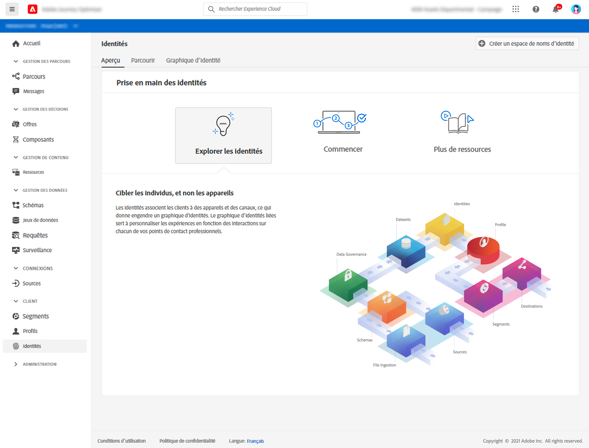

# Prise en main des identités {#identities-gs}

Une identité correspond à des données propres à une entité, généralement une personne individuelle. Une identité telle qu’un identifiant de connexion, un ECID ou un identifiant de fidélité correspond à une identité connue.

Les informations d’identification personnelle (PII), telles que l’adresse électronique et le numéro de téléphone, permettent d’identifier directement un client. Par conséquent, les PII sont utilisées pour faire correspondre les identités multiples d’un client sur plusieurs systèmes.

Dans [!DNL Adobe Journey Optimizer], **Identités** qui relient les consommateurs sur les appareils et les canaux, le résultat est un [graphique d’identités](#id-graph). Le graphique d’identités lié est utilisé pour personnaliser les expériences en fonction des interactions entre tous les points de contact de votre entreprise.

Pour en savoir plus sur **Identity Service** dans [cette documentation](https://experienceleague.adobe.com/docs/experience-platform/identity/home.html?lang=fr){target=&quot;_blank&quot;}.

## Espaces de noms d’identité

**** Les espaces de noms d’identité sont des composants d’Identity Service qui servent d’indicateurs du contexte auquel une identité se rapporte. Par exemple, ils distinguent une valeur `name@email.com` comme adresse électronique ou `443522` comme identifiant CRM numérique. L’utilisation des espaces de noms d’identité nécessite une compréhension des différents services d’Adobe Experience Platform impliqués. Avant de commencer à travailler avec les espaces de noms d’identité, veuillez consulter la documentation relative aux services suivants :

Pour en savoir plus sur les **espaces de noms d’identité** dans [cette documentation](https://experienceleague.adobe.com/docs/experience-platform/identity/namespaces.html?lang=fr){target=&quot;_blank&quot;}.

## Graphique d’identités{#id-graph}

Le **graphique d’identités** est une carte des relations entre les différentes identités d’un client particulier, qui vous fournit une représentation visuelle de la manière dont votre client interagit avec votre marque sur différents canaux. Tous les graphiques d’identités de client sont gérés et mis à jour collectivement par Adobe Experience Platform Identity Service en temps quasi réel, en réponse à l’activité des clients.

La visionneuse de graphiques d’identités de l’interface utilisateur [!DNL Adobe Journey Optimizer] vous permet de visualiser et de mieux comprendre quelles identités de client sont regroupées, et de quelles façons. La visionneuse vous permet de faire glisser et d’interagir différentes parties du graphique, ce qui vous permet d’examiner les relations d’identité complexes, de déboguer plus efficacement et de bénéficier d’une transparence accrue dans la manière dont les informations sont utilisées.

Pour en savoir plus sur **le graphique d’identités** dans [cette documentation](https://experienceleague.adobe.com/docs/experience-platform/identity/ui/identity-graph-viewer.html){target=&quot;_blank&quot;}.

