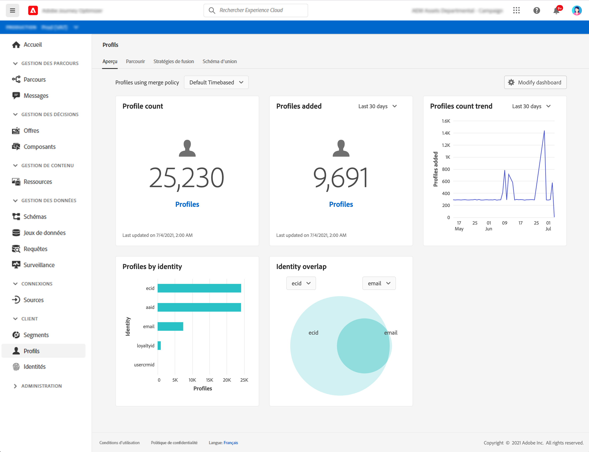

# Prise en main des profils {#profiles-gs}

Tirez parti de Real-time Customer Profile dans [!DNL Adobe Journey Optimizer] pour obtenir une vue d’ensemble de chaque client en combinant des données provenant de plusieurs canaux, notamment en ligne, hors ligne, CRM et tiers. **** Les profils vous permettent de consolider vos données client en une vue unifiée offrant un compte horodaté et exploitable de chaque interaction client.

>[!NOTE]
>
>Si votre organisation débute avec [!DNL Adobe Journey Optimizer] et ne dispose pas encore de jeux de données ou de stratégies de fusion principaux, le tableau de bord **Profils** n’est pas visible. À la place, l’onglet **Aperçu** affiche des liens vers la documentation Adobe Experience Platform pour vous aider à prendre en main Real-time Customer Profile.

Pour savoir comment accéder au **tableau de bord du profil** et l’utiliser, ainsi que pour obtenir des informations détaillées sur les mesures affichées dans le tableau de bord, reportez-vous à [cette section](https://experienceleague.adobe.com/docs/experience-platform/profile/ui/user-guide.html?lang=fr){target=&quot;_blank&quot;}.

Vous pouvez rassembler des fragments de données provenant de plusieurs sources et les combiner afin d’obtenir une vue complète de chacun de vos clients. Lorsque vous rassemblez ces données, les stratégies de fusion sont les règles utilisées pour déterminer la priorité des données et les données qui seront combinées pour créer la vue unifiée.

Pour en savoir plus sur les **stratégies de fusion** dans cette [documentation](https://experienceleague.adobe.com/docs/experience-platform/profile/merge-policies/ui-guide.html){target=&quot;_blank&quot;}.

**Voir également**

* [Documentation sur Real-time Customer Profile](https://experienceleague-review.corp.adobe.com/docs/experience-platform/query/home.html){target=&quot;_blank&quot;}
* [Vidéo de présentation du profil du client en temps réel](https://experienceleague.adobe.com/docs/experience-platform/profile/home.html?lang=fr){target=&quot;_blank&quot;}
