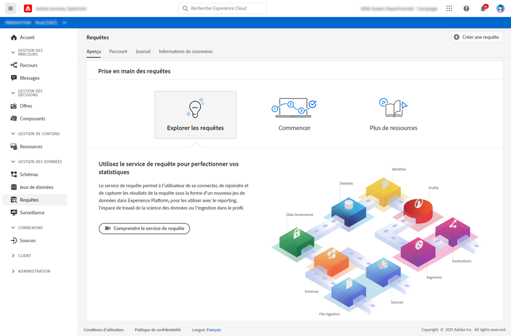

# Prise en main des requêtes {#queries-gs}

Query Editor est un outil interactif fourni par Adobe Experience Platform Query Service. Il permet d’écrire, de valider et d’exécuter des requêtes pour les données d’expérience client dans l’interface utilisateur dans [!DNL Adobe Journey Optimizer].

Query Editor prend en charge le développement de requête pour l’analyse et l’exploration de données. Il vous permet également d’exécuter des requêtes interactives à des fins de développement, ainsi que des requêtes non interactives pour renseigner des [jeux de données](get-started-datasets.md).

Découvrez comment utiliser Query Editor dans [cette documentation](https://experienceleague.adobe.com/docs/experience-platform/query/ui/user-guide.html?lang=fr){target=&quot;_blank&quot;}.

**Voir également**

* [Documentation de Query Service](https://experienceleague.adobe.com/docs/experience-platform/query/home.html?lang=fr){target=&quot;_blank&quot;}
* [Vidéo de présentation de Query Service](https://experienceleague.adobe.com/docs/platform-learn/tutorials/queries/understanding-query-service.html?lang=fr){target=&quot;_blank&quot;}
