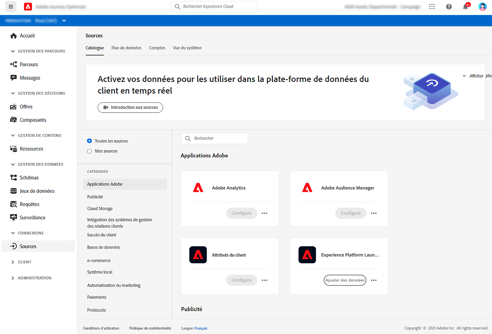

# Prise en main des connecteurs de sources {#sources-gs}

Adobe Experience Platform permet d’ingérer des données à partir de sources externes tout en vous permettant de structurer, de libeller et d’améliorer les données entrantes à l’aide des services de Platform. Vous pouvez ingérer des données à partir de diverses sources telles que des applications d’Adobe, des entrepôts dans le cloud, des bases de données, etc.

Découvrez comment ingérer des données provenant de sources externes avec des connecteurs source dans [cette documentation](https://experienceleague.adobe.com/docs/experience-platform/sources/home.html?lang=fr){target=&quot;_blank&quot;}.
