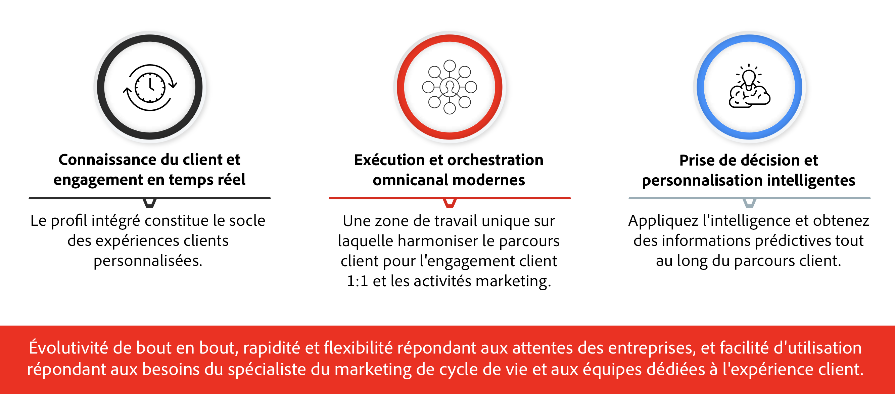

# Prise en main de Journey Optimizer {#cjm-gs}

>[!CONTEXTUALHELP]
>id="test_id"
>title="Contenu de test"
>abstract="Testez le contenu pour l’intégration de l’aide contextuelle dans AJO."

## Présentation d’[!DNL Adobe Journey Optimizer] {#about-cjm}

[!DNL Adobe Journey Optimizer] aide les sociétés à proposer des expériences connectées, contextuelles et personnalisées à leurs clients. Le parcours client est l’ensemble du processus d’interaction d’un client avec la marque, depuis le premier moment de contact jusqu’au départ du client. Il débute avec la phase de sensibilisation, où le client découvre la marque et des commence de façon. Le client interagira ensuite davantage avec la marque, se rendra sur les sites Web et physiques, effectuera des achats, enverra des messages ou publiera des commentaires.

[!DNL Adobe Journey Optimizer] est conçu de manière native sur  [!DNL Adobe Experience Platform] et combine un profil client en temps réel unifié, un framework ouvert d’abord API, un offer decisioning centralisé et une intelligence artificielle (IA) et un apprentissage automatique (ML) pour la personnalisation et l’optimisation. Journey Optimizer permet aux marques de déterminer intelligemment la meilleure interaction possible sur l’échelle, la vitesse et la flexibilité pour l’ensemble du parcours client. Avec [!DNL Adobe Journey Optimizer], les entreprises peuvent créer et diffuser des campagnes marketing planifiées (comme des promotions hebdomadaires pour un magasin de vente au détail) et des communications individuelles personnalisées (comme une notification push pour un article qu’un client d’application de fidélité peut avoir examiné et qui était précédemment en rupture de stock) dans la même application.

## Cas d’utilisation

* Les marketeurs peuvent utiliser [!DNL Adobe Journey Optimizer] pour envoyer à la fois des communications personnalisées et des communications par lots basées sur l’audience. Par exemple, une boutique de vêtements envoie généralement des enquêtes après achat à tous les clients qui ont acheté des produits la semaine dernière. En raison des intempéries, quelques envois ont été retardés. En voyant les clients qui n’ont pas reçu leurs envois, la boutique de vêtements peut les exclure de l’envoi de satisfaction client programmée et envoyer à la place un email personnalisé s’excusant du retard et proposant un code de remise avec des recommandations de produits basées sur les achats passés du client.

   Les marketeurs peuvent également utiliser l’application pour envoyer des communications en temps réel basées sur le comportement. Par exemple, le même détaillant pourrait engager un client fidèle qui se rend sur le parking du magasin en temps réel en lui envoyant une notification push à propos d’un pull qui est de nouveau en stock au même niveau que le client.

* Les non-spécialistes du marketing tels que les équipes d’exploitation et le service clientèle qui s’impliquent dans l’expérience client peuvent utiliser [!DNL Adobe Journey Optimizer] pour gérer diverses tâches, telles que des notifications opérationnelles, voire pour surveiller le processus d’intégration. Prenez par exemple un parc d’attraction où les visiteurs du parc téléchargent une application mobile dans le cadre de leur expérience dans le parc. Le personnel de maintenance peut utiliser [!DNL Adobe Journey Optimizer] pour avertir les visiteurs du parc des trajets actuellement fermés en raison de travaux de maintenance.

## Fonctionnalités principales

[!DNL Adobe Journey Optimizer] est une application agile et évolutive permettant de créer et de proposer des expériences client personnalisées, connectées et opportunes sur n’importe quelle application, périphérique ou canal.

Les fonctionnalités principales sont les suivantes :

* **Real-time Customer Insights &amp; Engagement**  : un profil intégré fusionne les données en direct de toutes les sources entre les points de contact des clients, y compris les données comportementales, transactionnelles, financières et opérationnelles afin d’optimiser les expériences personnelles et contextuelles des clients à leur époque.

* **Orchestration et exécution omnicanal modernes**  : un canevas unique sur lequel harmoniser et optimiser le parcours client pour l’interaction client 1:1 et la sensibilisation marketing, afin d’aider les marques à offrir plus de valeur tout au long du cycle de vie du client. Les parcours client conçus dans [!DNL Adobe Journey Optimizer] peuvent être dynamiques et basés sur des événements afin d’aider les marques à réagir aux signaux en temps réel et à lier ces interactions à des campagnes planifiées afin de pouvoir prendre les bonnes décisions concernant les communications à envoyer à un client, le moment et les canaux.

* **Prise de décision intelligente et personnalisation**  : les marques peuvent appliquer une prise de décision centralisée et intégrer l’intelligence artificielle et l’apprentissage automatique pour faire surface des informations prédictives tout au long de l’expérience client, ce qui facilite l’automatisation des décisions et l’optimisation de l’expérience à grande échelle. L’Offer decisioning alimente les offres centralisées sur tous les canaux à l’échelle via [!DNL Adobe Journey Optimizer].

>[!NOTE]
>
> Les lignes directrices et procédures générales de Adobe Experience Cloud sur la protection des renseignements personnels s&#39;appliquent à [!DNL Journey Optimizer]. [En savoir plus sur la confidentialité d&#39;Adobe Experience Cloud](https://www.adobe.com/fr/privacy/experience-cloud.html).
> Vous devez également connaître les [barrières de sécurité pour les données Real-time Customer Profile avant de commencer](https://experienceleague.adobe.com/docs/experience-platform/profile/guardrails.html).

**Voir également**

* [Étapes clés pour débuter](quick-start.md)
* [Créer votre premier message](get-started-content.md)
* [Concevoir des parcours et envoyer des messages](building-journeys/journey-gs.md)
* [Rapports dynamiques](reports/live-report.md)
* [FAQ sur Journey Optimizer](assets/do-not-localize/AJO-FAQ.pdf)  (PDF)
