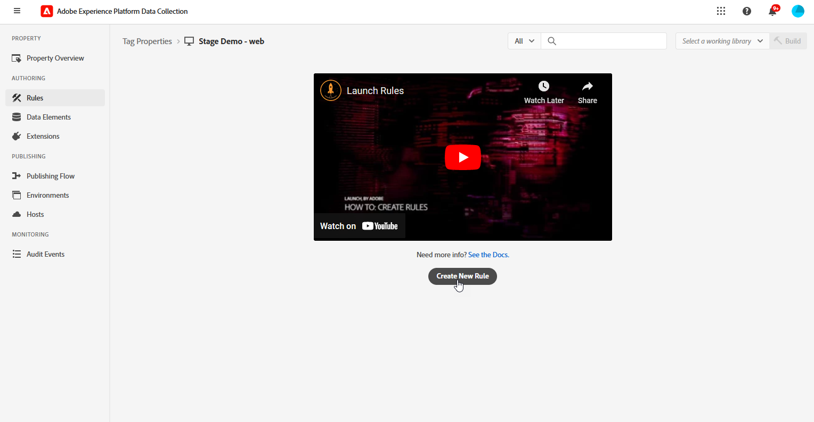

# Configuration du canal web in-app {#configure-in-app-web}

## Conditions préalables {#prerequisites}

* Assurez-vous d’utiliser la dernière version pour votre **SDK Web Adobe Experience Platform** extension .

* Installez le **SDK Web Adobe Experience Platform** dans votre **Propriétés des balises** et activez la variable **Stockage de personnalisation** .

  Cette configuration est essentielle pour le stockage des historiques d’événements sur le client, condition préalable à l’implémentation des règles de fréquence dans le créateur de règles. [En savoir plus](https://experienceleague.adobe.com/docs/experience-platform/tags/extensions/client/web-sdk/web-sdk-extension-configuration.html?lang=en)

  

## Configuration des données envoyées à la règle Platform {#configure-sent-data-trigger}

1. Accédez à **Collecte de données Adobe Experience Platform** et accédez à **Propriétés de balise** configuré à l’aide de la fonction **SDK Web Adobe Experience Platform** extension .

1. Dans la **Création** menu, sélectionnez **Règles** then **Créer une règle** ou **Ajouter une règle**.

   

1. Dans le **Événements** , cliquez sur **Ajouter** et configurez-le comme suit :

   * **Extension**: Core

   * **Type d’événement**: bibliothèque chargée (haut de page).

   

1. Cliquez sur **Conserver les modifications** pour enregistrer la configuration Evénement .

1. Dans le **Actions** , cliquez sur **Ajouter** et configurez-le comme suit :

   * **Extension**: SDK Web Adobe Experience Platform

   * **Type d’action**: événement d’envoi

   

1. Dans le **Personnalisation** de votre **Action** type, activez l’option **Rendu des décisions de personnalisation visuelle** .

   

1. Dans le **Contexte de décision** , définissez les **Clé** et **Valeur** qui déterminent l’expérience à diffuser.

   

1. Enregistrez vos **Action** configuration en cliquant sur **Conserver les modifications**.

1. Accédez au **Flux de publication** . Créer **Bibliothèque** ou sélectionner un **Bibliothèque** et ajoutez le **Règle** à lui. [En savoir plus](https://experienceleague.adobe.com/docs/experience-platform/tags/publish/libraries.html?lang=en#create-a-library)

1. Dans **Bibliothèque**, sélectionnez **Enregistrer et créer dans le développement**.

   

## Configuration d’une règle manuelle {#configure-manual-trigger}

1. Accédez à **Collecte de données Adobe Experience Platform** et accédez à **Propriétés de balise** configuré à l’aide de la fonction **SDK Web Adobe Experience Platform** extension .

1. Dans la **Création** menu, sélectionnez **Règles** then **Créer une règle** ou **Ajouter une règle**.

   

1. Dans le **Événements** , cliquez sur **Ajouter** et configurez-le comme suit :

   * **Extension**: Core

   * **Type d’événement**: cliquez sur

   

1. Dans le **Configuration des clics**, définissez la variable **Sélecteur** qui seront évalués.

   

1. Cliquez sur **Conserver les modifications** pour enregistrer la variable **Événement** configuration.

1. Dans le **Actions** , cliquez sur **Ajouter** et configurez-le comme suit :

   * **Extension**: SDK Web Adobe Experience Platform

   * **Type d’action**: évaluation des jeux de règles

   

1. Dans le **Évaluation de l’action des jeux de règles** de votre **Action** type, activez l’option **Rendu des décisions de personnalisation visuelle** .

   

1. Dans le **Contexte de décision** , définissez les **Clé** et **Valeur** qui déterminent l’expérience à diffuser.

1. Accédez au **Flux de publication** , créer une **Bibliothèque** ou sélectionner un **Bibliothèque** et ajoutez le **Règle**. [En savoir plus](https://experienceleague.adobe.com/docs/experience-platform/tags/publish/libraries.html?lang=en#create-a-library)

1. Dans **Bibliothèque**, sélectionnez **Enregistrer et créer dans le développement**.

   

