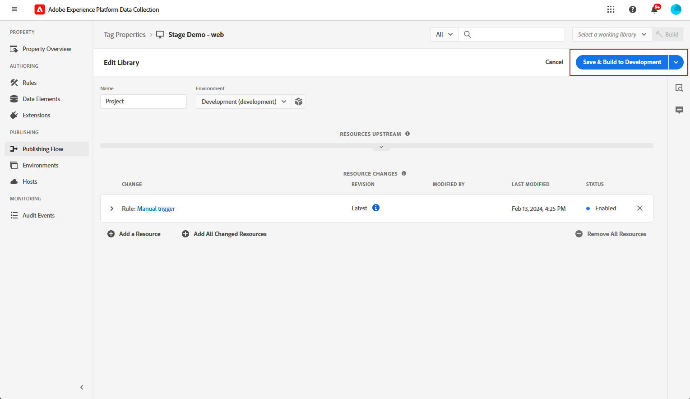
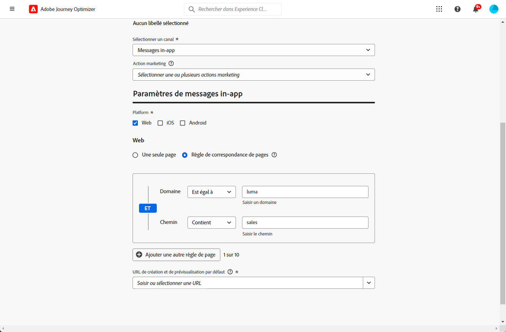

# Configurer le canal web in-app {#configure-in-app-web}

## Conditions préalables {#prerequisites}

* Assurez-vous d’utiliser la dernière version pour votre extension **SDK Web Adobe Experience Platform**.

* Installez l’extension **SDK Web Adobe Experience Platform** dans vos **Propriétés de balise** et activez l’option **Stockage de personnalisation**.

  Cette configuration est essentielle pour le stockage des historiques d’événements sur le client, condition préalable à l’implémentation des règles de fréquence dans le créateur de règles. [En savoir plus](https://experienceleague.adobe.com/fr/docs/experience-platform/tags/extensions/client/web-sdk/web-sdk-extension-configuration){target="_blank"}

  

## Configurer la règle Envoi de données à Platform {#configure-sent-data-trigger}

1. Accédez à votre instance de **collecte de données dʼAdobe Experience Platform** et aux **Propriétés de balise** configurées à l’aide de l’extension **SDK Web Adobe Experience Platform**.

1. Dans le menu **Création**, sélectionnez **Règles** puis **Créer une règle** ou **Ajouter une règle**.

   

1. Dans la section **Événements**, cliquez sur **Ajouter** et configurez comme suit :

   * **Extension** : Core

   * **Type d’événement** : bibliothèque chargée (Haut de la page)

   

1. Cliquez sur **Conserver les modifications** pour enregistrer la configuration d’événement.

1. Dans la section **Actions**, cliquez sur **Ajouter** et configurez comme suit :

   * **Extension** : SDK Web Adobe Experience Platform

   * **Type d’action** : envoyer un événement

   

1. Dans la section **Personnalisation** de votre type **Action**, activez l’option **Rendu visuel des décisions de personnalisation**.

   

1. Dans la section **Contexte de décision**, définissez les paires **Clé** et **Valeur** qui déterminent l’expérience à diffuser.

   

1. Enregistrez la configuration de votre **Action** en cliquant sur **Conserver les modifications**.

1. Accédez au menu **Flux de publication**. Créez une **Bibliothèque** ou sélectionnez un **Bibliothèque** existante et ajoutez la **Règle** nouvellement créée à celle-ci. [En savoir plus](https://experienceleague.adobe.com/fr/docs/experience-platform/tags/publish/libraries#create-a-library){target="_blank"}

1. Dans votre **Bibliothèque**, sélectionnez **Enregistrer et créer pour le développement**.

   

## Configurer une règle manuelle {#configure-manual-trigger}

1. Accédez à votre instance de **collecte de données d’Adobe Experience Platform** et aux **Propriétés de balise** configurées à l’aide de l’extension **SDK Web Adobe Experience Platform**.

1. Dans le menu **Création**, sélectionnez **Règles** puis **Créer une règle** ou **Ajouter une règle**.

   

1. Dans la section **Événements**, cliquez sur **Ajouter** et configurez comme suit :

   * **Extension** : Core

   * **Type d’événement** : clic

   

1. Dans **Configuration des clics**, définissez le **Sélecteur** qui sera évalué.

   

1. Cliquez sur **Conserver les modifications** pour enregistrer la configuration d’**Événement**.

1. Dans la section **Actions**, cliquez sur **Ajouter** et configurez comme suit :

   * **Extension** : SDK Web Adobe Experience Platform

   * **Type d’action** : évaluation des jeux de règles

   

1. Dans la section de l’**action Évaluation des jeux de règles** de votre type d’**Action**, activez l’option **Rendu visuel des décisions de personnalisation**.

   

1. Dans la section **Contexte des décisions**, définissez les paires **Clé** et **Valeur** qui déterminent l’expérience à diffuser.

1. Accédez au menu **Flux de publication**, créez une **Bibliothèque** ou sélectionnez une **Bibliothèque** existante et ajoutez la **Règle** nouvellement créée. [En savoir plus](https://experienceleague.adobe.com/fr/docs/experience-platform/tags/publish/libraries#create-a-library){target="_blank"}

1. Dans votre **Bibliothèque**, sélectionnez **Enregistrer et créer pour le développement**.

   

## Créer une configuration web in-app {#in-app-config}

1. Accédez au menu **[!UICONTROL Canaux]** > **[!UICONTROL Paramètres généraux]** > **[!UICONTROL Configurations des canaux]**, puis cliquez sur **[!UICONTROL Créer une configuration de canal]**.

   

1. Saisissez un nom et une description (facultatif) pour la configuration, puis sélectionnez le canal à configurer.

   >[!NOTE]
   >
   > Les noms doivent commencer par une lettre (A-Z). Ils ne peuvent contenir que des caractères alphanumériques. Vous pouvez également utiliser le trait de soulignement `_`, le point`.` et le trait d&#39;union `-`.

1. Pour attribuer des libellés d’utilisation des données personnalisés ou de base à la configuration, vous pouvez sélectionner **[!UICONTROL Gérer l’accès]**. [En savoir plus sur le contrôle d’accès au niveau de l’objet (OLAC)](../administration/object-based-access.md)

1. Sélectionnez une **[!UICONTROL Action marketing]** ou plusieurs pour associer des politiques de consentement aux messages utilisant cette configuration. Toutes les politiques de consentement associées à cette action marketing sont utilisées afin de respecter les préférences de vos clientes et clients. [En savoir plus](../action/consent.md#surface-marketing-actions)

1. Sélectionnez le canal **Messagerie in-app**.

1. Définissez une configuration d’application. Vous disposez de deux options pour apporter des modifications :

   * Vous pouvez saisir une **[!UICONTROL URL de page]** pour appliquer des modifications à une page spécifique.

   * Vous pouvez créer une règle pour cibler plusieurs URL qui suivent le même motif.

     +++ Création d’une règle de correspondance de pages.

      1. Sélectionnez **[!UICONTROL Règle de correspondance des pages]** comme configuration de l’application et saisissez votre **[!UICONTROL URL de page]**.

      1. Dans la fenêtre **[!UICONTROL Modifier la règle de configuration]**, définissez vos critères pour les champs **[!UICONTROL Domaine]** et **[!UICONTROL Page]**.
      1. Dans les listes déroulantes des conditions, personnalisez davantage vos critères.

         Par exemple, si vous souhaitez modifier ici des éléments qui s’affichent sur toutes les pages des produits en soldes de votre site web Luma, sélectionnez Domaine > Commence par > luma et Page > Contient > soldes.

         

      1. Cliquez sur **[!UICONTROL Ajouter une autre règle de page]** pour créer une autre règle si nécessaire.

      1. Sélectionnez l’**[!UICONTROL URL de création et de prévisualisation par défaut]**.

      1. Enregistrez vos modifications. La règle s’affiche dans l’écran **[!UICONTROL Créer une campagne]**.

     +++

1. Envoyez votre configuration web in-app.

Vous pouvez désormais [créer un canal in-app web](../in-app/create-in-app-web.md) dans une campagne.
