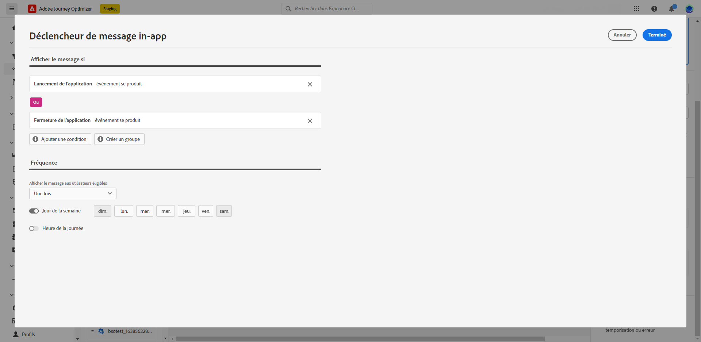

# Créer un message in-app dans un parcours {#create-in-app-journey}

1. Ouvrez votre parcours, puis effectuez un glisser-déposer d’une activité **[!UICONTROL In-app]** depuis la section **[!UICONTROL Actions]** de la palette.

   Lorsqu’un profil atteint la fin de son parcours, tous les messages in-app qui lui sont affichés expirent automatiquement. Pour cette raison, une activité d’attente est automatiquement ajoutée après votre activité in-app afin d’assurer un timing correct.

   

1. Saisissez un **[!UICONTROL libellé]** et une **[!UICONTROL description]** pour votre message.

1. Choisissez la [surface in-app](inapp-configuration.md) à utiliser.

   

1. Vous pouvez maintenant commencer à concevoir votre contenu à l’aide du bouton **[!UICONTROL Modifier le contenu]**. [En savoir plus](design-in-app.md).

1. Cliquez sur **[!UICONTROL Modifier le trigger]** pour configurer votre trigger.

   

1. Dans la fenêtre **[!UICONTROL Déclencheur de message in-app]**, choisissez le ou les événements et les critères qui déclencheront votre message :

   1. Cliquez sur **[!UICONTROL Ajouter une condition]** si vous souhaitez que le déclencheur prenne en compte plusieurs événements ou critères.
   1. Dans le menu déroulant **[!UICONTROL Sélection d’un événement]**, sélectionnez le type d’événement de votre déclencheur.
   1. Sélectionnez le mode de liaison de vos événements, par exemple choisissez **[!UICONTROL And]** si vous voulez que les déclencheurs soient **tous les deux** vérifiés pour que le message s’affiche ou choisissez **[!UICONTROL Or]** si vous souhaitez que le message ne s’affiche que si **l’un ou l’autre** des déclencheurs est vérifié.
   1. Cliquez sur **[!UICONTROL Créer un groupe]** pour regrouper les déclencheurs.

   

1. Sélectionnez la fréquence de votre déclencheur lorsque votre message in-app est actif :

   * **[!UICONTROL À chaque fois]** : toujours afficher le message lorsque les événements sélectionnés dans le menu déroulant **[!UICONTROL Déclencheur d’application mobile]** se produisent.
   * **[!UICONTROL Une fois]** : n’affichez ce message que la première fois que les événements sélectionnés dans le menu déroulant **[!UICONTROL Déclencheur d’application mobile]** se produisent.
   * **[!UICONTROL Jusqu’au clic]** : affichez ce message lorsque les événements sélectionnés dans le menu déroulant **[!UICONTROL Déclencheur d’application mobile]** se produisent jusqu’à ce qu’un événement d’interaction soit envoyé par le SDK avec une action « faisant l’objet d’un clic ».
   * **[!UICONTROL X fois]** : affichez le message uniquement un nombre spécifique de fois, déterminé par la valeur définie dans le champ **[!UICONTROL Nombre d’affichages]**.

1. Sélectionnez le jour de la semaine et l’heure spécifique à laquelle votre message in-app doit être déclenché, puis cliquez sur **[!UICONTROL Enregistrer]**.

1. Si nécessaire, complétez votre flux de parcours en faisant glisser et en déposant des actions ou des événements supplémentaires. [En savoir plus](../building-journeys/about-journey-activities.md).

1. Une fois votre message in-app prêt, finalisez la configuration et publiez votre parcours pour l’activer.

Pour plus d’informations sur la configuration de votre parcours, consultez cette [page](../building-journeys/journey-gs.md).

## Limites des activités in-app {#in-app-activity-limitations}

* Cette fonctionnalité n’est actuellement pas disponible pour les clientes et clients du secteur de la santé.

* La personnalisation ne peut contenir que des attributs de profil.

* L’affichage in-app est lié à la durée de parcours, ce qui signifie que lorsque le parcours se termine pour un profil, tous les messages in-app de ce parcours ne s’affichent plus pour ce profil.  Par conséquent, il n’est pas possible d’arrêter un message in-app directement à partir d’une activité de parcours. Vous devez plutôt terminer le parcours entier pour que les messages in-app ne s’affichent pas sur le profil.

* En mode test, l’affichage in-app dépend de la durée de vie du parcours. Pour éviter que le parcours ne se termine trop tôt au cours du test, ajustez la valeur **[!UICONTROL Temps d’attente]** de vos activités **[!UICONTROL Attente]**.

* Les activités **[!UICONTROL Réaction]** ne peuvent pas être utilisées pour réagir à une ouverture ou un clic in-app.

* Un délai d’activation peut se produire entre le moment où le profil d’une personne atteint une activité in-app dans la zone de travail et le moment où ladite personne commence à voir ce message in-app.

## Rapport in-app {#inapp-report}

Dans le **[!UICONTROL rapport global]** de votre parcours, l’onglet **[!UICONTROL In-app]** détaille les principales informations relatives aux diffusions in-app envoyées dans vos parcours.

En savoir plus sur le [Rapport global de parcours](../reports/journey-global-report.md).

+++En savoir plus sur les différents widgets et mesures disponibles pour le rapport in-app.

Les KPI **[!UICONTROL Performances in-app]** détaillent les informations principales relatives à l’engagement des visiteurs avec vos messages in-app, telles que :

* **[!UICONTROL Impressions uniques]** : nombre d’utilisateurs uniques auxquels le message in-app a été délivré.

* **[!UICONTROL Impressions]** : nombre total de messages in-app diffusés à tous les utilisateurs.

* **[!UICONTROL Taux de clics]** : pourcentage d&#39;utilisateurs ayant interagi avec les boutons inclus dans le message in-app par rapport au nombre d’utilisateurs ayant vu le message.

* **[!UICONTROL Taux d’ignorance]** : pourcentage de messages in-app ignorés par les destinataires.

Le graphique du **[!UICONTROL Résumé in-app]** présente l’évolution de vos impressions in-app pour la période concernée.

Les graphiques et le tableau **[!UICONTROL Clics par bouton]** contiennent les données disponibles pour le comportement des destinataires par bouton :

* **[!UICONTROL Clics]** : nombre total de destinataires ayant interagi avec les boutons inclus dans le message in-app.

* **[!UICONTROL Taux de clics]** : pourcentage d’utilisateurs ayant interagi avec les boutons inclus dans le message in-app par rapport au nombre d’utilisateurs ayant vu le message.
+++

**Rubriques connexes :**

* [Concevoir un message in-app](design-in-app.md)
* [Tester et envoyer le message in-app](send-in-app.md)
* [Rapport in-app](../reports/campaign-global-report.md#inapp-report)
* [Configuration in-app](inapp-configuration.md)
