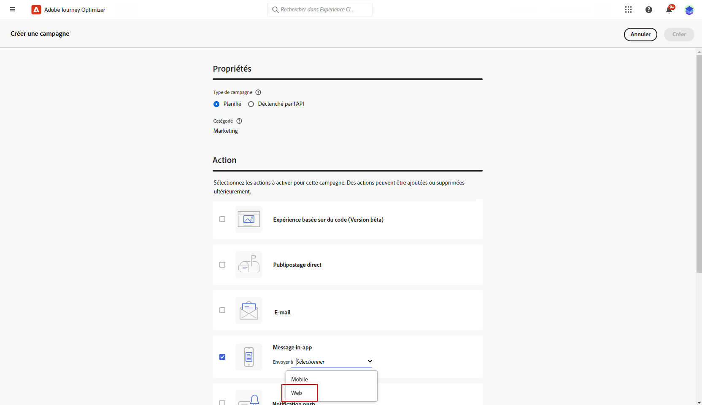
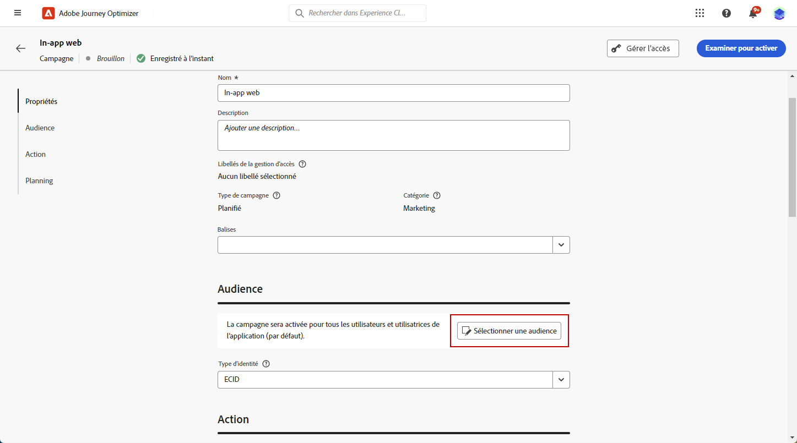
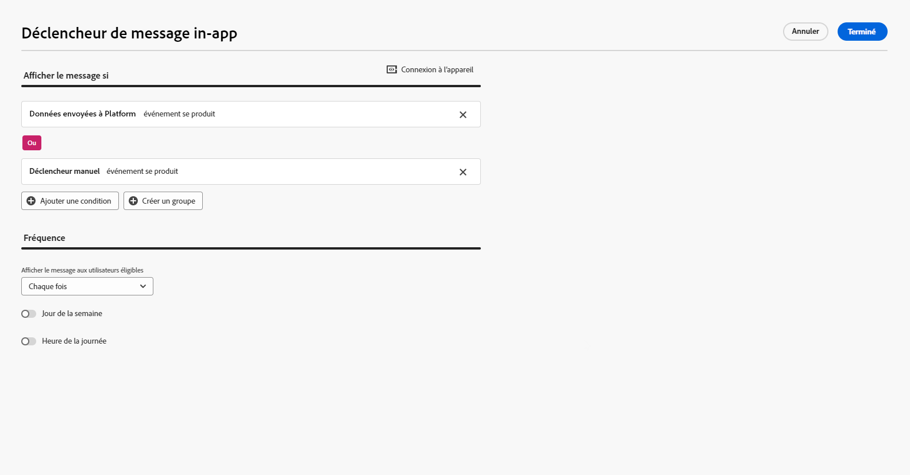
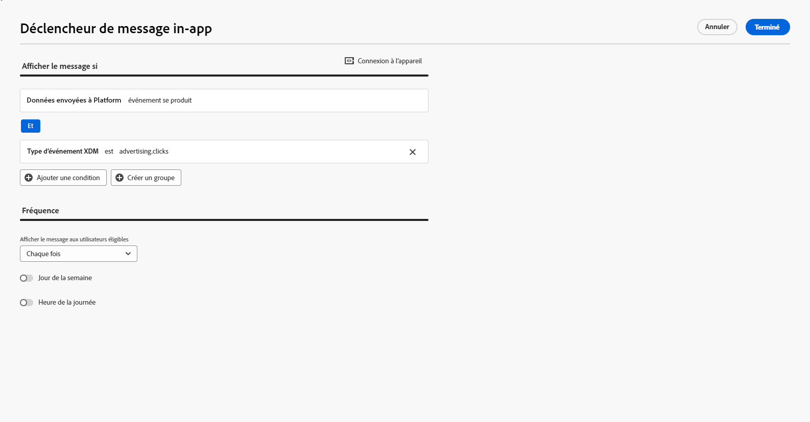
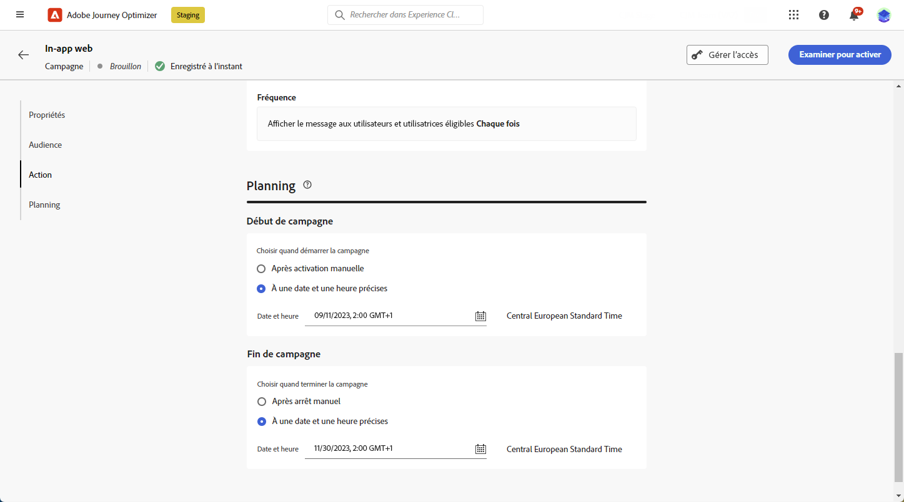

# Créer un message web in-app {#create-in-app-web}

## Configurer le canal web in-app {#configure-web-inapp}

Pour configurer votre canal web in-app, procédez comme suit :

* Installez l’extension de balise SDK Web pour prendre en charge la messagerie web in-app. [En savoir plus](https://experienceleague.adobe.com/fr/docs/experience-platform/tags/extensions/client/web-sdk/web-sdk-extension-configuration){target="_blank"}

* Personnalisez vos déclencheurs. La messagerie web in-app prend en charge deux types de déclencheurs : Envoi de données à la plateforme et Déclencheurs manuels. [En savoir plus](https://experienceleague.adobe.com/docs/experience-platform/edge/personalization/ajo/web-in-app-messaging.html?lang=fr){target="_blank"}

* Créez votre configuration in-app web. [En savoir plus](inapp-configuration.md)

## Créer votre campagne de messages web in-app {#create-inapp-web-campaign}

1. Accédez au menu **[!UICONTROL Campagnes]**, puis cliquez sur **[!UICONTROL Créer une campagne]**.

1. Choisissez le type d’exécution de la campagne : planifiée ou déclenchée par l’API. En savoir plus sur les types de campagne sur [cette page](../campaigns/create-campaign.md#campaigntype).

1. Dans le menu déroulant **[!UICONTROL Actions]**, choisissez le **[!UICONTROL Message in-app]**.

   

1. Sélectionnez ou créez la configuration de votre application. [En savoir plus](inapp-configuration.md#channel-prerequisites)

## Définir votre campagne de messages web in-app {#configure-inapp}

1. Dans la section **[!UICONTROL Propriétés]**, rédigez le **[!UICONTROL Titre]** et la **[!UICONTROL Description]**.

1. Pour attribuer des libellés d’utilisation des données personnalisés ou de base au message in-app, sélectionnez **[!UICONTROL Gérer l’accès]**. [En savoir plus](../administration/object-based-access.md).

1. Cliquez sur le bouton **[!UICONTROL Sélectionner une audience]** pour définir l’audience à cibler à partir de la liste des audiences Adobe Experience Platform disponibles. [En savoir plus](../audience/about-audiences.md).

   

1. Dans le champ **[!UICONTROL Espace de noms d’identité]**, choisissez l’espace de noms à utiliser pour identifier les personnes à partir de l’audience sélectionnée. [En savoir plus](../event/about-creating.md#select-the-namespace).

1. Dans le menu **[!UICONTROL Action]**, vous trouverez les paramètres précédemment configurés comme **[!UICONTROL configuration de l’application]**. Vous pouvez y apporter des modifications si nécessaire ou mettre à jour votre règle en cliquant sur **[!UICONTROL Modifier la règle]**.

1. Cliquez sur **[!UICONTROL Créer une expérience]** pour commencer à configurer votre expérience de contenu et créer des traitements afin de mesurer leurs performances et d’identifier la meilleure option pour votre audience cible. [En savoir plus](../content-management/content-experiment.md).

1. Cliquez sur **[!UICONTROL Modifier les déclencheurs]** pour choisir le ou les événements et les critères qui déclencheront votre message. Les créateurs de règles permettent aux utilisateurs et utilisatrices de spécifier des critères et des valeurs qui, lorsqu’ils sont satisfaits, déclenchent un ensemble d’actions, telles que l’envoi d’un message in-app.

   1. Cliquez sur la liste déroulante d’événements pour modifier votre déclencheur si nécessaire.

      +++Affichez les déclencheurs disponibles.

      | Package | Déclencheur | Définition |
      |---|---|---|
      | Platform | Envoi de données à Platform | Déclenché lorsque l’application mobile émet un événement d’expérience Edge pour envoyer des données à Adobe Experience Platform. En règle générale, l’appel API [sendEvent](https://developer.adobe.com/client-sdks/documentation/edge-network/api-reference/#sendevent){target="_blank"} à partir de l’extension AEP Edge. |
      | Manuel | Déclencheur manuel | Deux éléments de données associés : une clé, qui est une constante qui définit le jeu de données (par exemple, le genre, la couleur, le prix), et une valeur, qui est une variable qui appartient au jeu (par exemple, masculin/féminin, vert, 100). |

      +++

   1. Cliquez sur **[!UICONTROL Ajouter une condition]** si vous souhaitez que le déclencheur prenne en compte plusieurs événements ou critères.

   1. Choisissez la condition **[!UICONTROL Ou]** si vous souhaitez ajouter d’autres **[!UICONTROL Déclencheurs]** pour développer davantage votre règle.

      

   1. Choisissez la condition **[!UICONTROL Et]** si vous souhaitez ajouter une **[!UICONTROL caractéristique]** personnalisée et mieux affiner votre règle.

      +++Consultez les caractéristiques disponibles.

      | Package | Caractéristique | Définition |
      |---|---|---|
      | Platform | Type d’événement XDM | Déclenché lorsque le type d’événement spécifié est rencontré. |
      | Platform | Valeur XDM | Déclenché lorsque la valeur XDM spécifie est rencontrée. |

      +++

      

   1. Cliquez sur **[!UICONTROL Créer un groupe]** pour regrouper les déclencheurs.

1. Sélectionnez la fréquence de votre déclencheur lorsque votre message in-app est actif. Les options disponibles sont les suivantes :

   * **[!UICONTROL À chaque fois]** : affichez toujours le message lorsque les événements sélectionnés dans le menu déroulant **[!UICONTROL Déclencheur d’application mobile]** se produisent.
   * **[!UICONTROL Une fois]** : n’affichez ce message que la première fois que les événements sélectionnés dans le menu déroulant **[!UICONTROL Déclencheur d’application mobile]** se produisent.
   * **[!UICONTROL Jusqu’au clic]** : affichez ce message lorsque les événements sélectionnés dans le menu déroulant **[!UICONTROL Déclencheur d’application mobile]** se produisent jusqu’à ce qu’un événement d’interaction soit envoyé par le SDK avec une action « faisant l’objet d’un clic ».
   * **[!UICONTROL X fois]** : affichez ce message X fois.

1. Si nécessaire, choisissez le **[!UICONTROL Jour de la semaine]** ou l’ **[!UICONTROL Heure de la journée]** à laquelle le message in-app s’affiche.

1. Les campagnes sont conçues pour être exécutées à une date spécifique ou à une fréquence récurrente. Découvrez comment configurer le **[!UICONTROL Planning]** de votre campagne dans [cette section](../campaigns/create-campaign.md#schedule).

   

1. Vous pouvez maintenant commencer à concevoir votre contenu à l’aide du bouton **[!UICONTROL Modifier le contenu]**. [En savoir plus](design-in-app.md).

   

**Rubriques connexes :**

* [Tester et envoyer le message in-app](send-in-app.md)
* [Rapport in-app](../reports/campaign-global-report-cja-inapp.md)
* [Configuration in-app](inapp-configuration.md)
