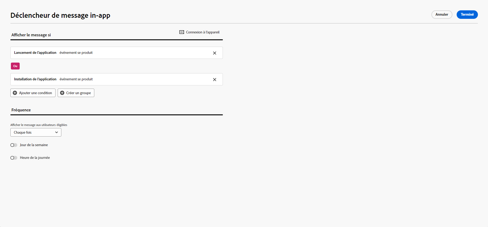
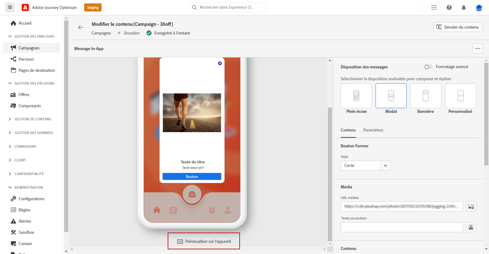
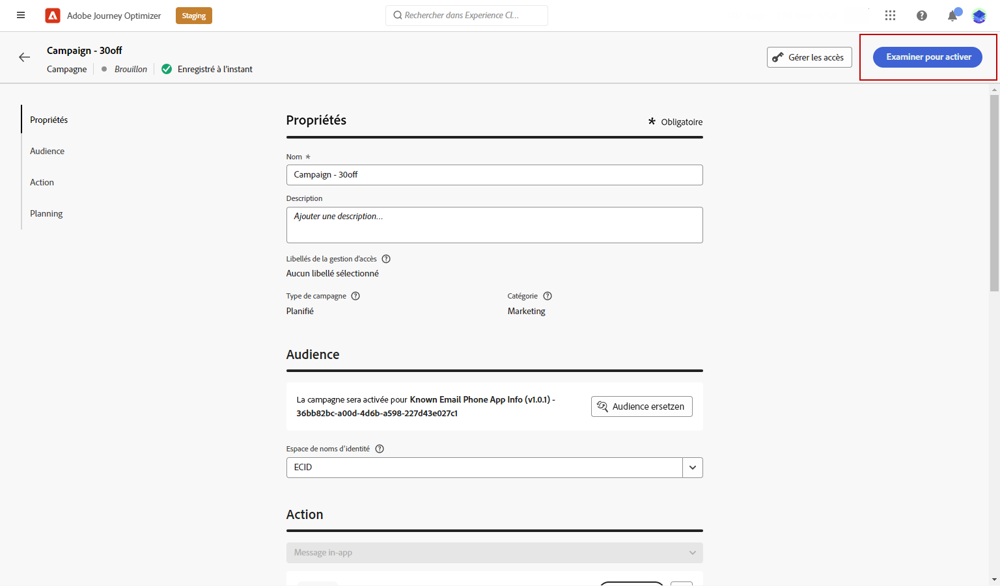

# Création d’un message in-app {#create-in-app}

## Créer une campagne et un message in-app{#create-in-app-in-a-campaign}

Pour créer un message In-App, procédez comme suit :

1. Accédez au **[!UICONTROL Campaigns]** , puis cliquez sur **[!UICONTROL Create campaign]**.

1. Dans le **[!UICONTROL Properties]** , indiquez quand exécuter la campagne.

1. Dans le **[!UICONTROL Actions]** , choisissez la **[!UICONTROL In-app message]** et le **[!UICONTROL App surface]** précédemment configuré pour votre message in-app. Cliquez ensuite sur **[!UICONTROL Create]**.

   [En savoir plus sur la configuration In-App](inapp-configuration.md).

   

1. Dans la **[!UICONTROL Properties]** , modifiez la section de votre campagne **[!UICONTROL Title]** et **[!UICONTROL Description]**.

1. Pour attribuer des libellés d’utilisation des données personnalisés ou de base à la page d’entrée, sélectionnez **[!UICONTROL Manage access]**. [En savoir plus](../administration/object-based-access.md).

1. Cliquez sur le bouton **[!UICONTROL Select audience]** pour définir l’audience à cibler à partir de la liste des segments Adobe Experience Platform disponibles. [En savoir plus](../segment/about-segments.md).

   

1. Dans le **[!UICONTROL Identity namespace]** , choisissez l’espace de noms à utiliser pour identifier les individus du segment sélectionné. [En savoir plus](../event/about-creating.md#select-the-namespace).

1. Sélectionnez la fréquence de votre trigger lorsque votre message in-app est actif :

   * **[!UICONTROL Show every time]**: Toujours afficher le message lorsque les événements sélectionnés dans la variable **[!UICONTROL Mobile app trigger]** s’affiche.
   * **[!UICONTROL Show once]**: N’afficher ce message que la première fois que les événements sont sélectionnés dans la variable **[!UICONTROL Mobile app trigger]** s’affiche.
   * **[!UICONTROL Show until click through]**: Afficher ce message lorsque les événements sélectionnés dans la variable **[!UICONTROL Mobile app trigger]** se produit jusqu’à ce qu’un événement d’interaction soit envoyé par le SDK avec une action &quot;clicked&quot;.

1. Dans la **[!UICONTROL Mobile app trigger]** , choisissez le ou les événements et les critères qui déclencheront votre message :

   1. Dans la liste déroulante de gauche, sélectionnez l’événement nécessaire pour déclencher le message.
   1. Dans la liste déroulante de droite, sélectionnez la validation requise pour l’événement sélectionné.
   1. Cliquez sur le bouton **[!UICONTROL Add]** si vous souhaitez que le déclencheur prenne en compte plusieurs événements ou critères. Répétez ensuite les étapes ci-dessus.
   1. Sélectionnez le mode de liaison de vos événements, par exemple choisissez **[!UICONTROL And]** si vous voulez **both** se déclenche pour que le message s’affiche ou soit **[!UICONTROL Or]** si vous souhaitez que le message s’affiche **both** des déclencheurs sont vrais.

   

1. Sélectionnez l’événement qui déclenche votre message dans la **[!UICONTROL Mobile app trigger]**
menu déroulant.

   En choisissant un déclencheur, vous choisissez l’action de l’utilisateur qui entraîne l’affichage du message in-app.

   

1. Les campagnes sont conçues pour être exécutées à une date spécifique ou à une fréquence récurrente. Découvrez comment configurer le **[!UICONTROL Schedule]** de votre campagne dans [cette section](../campaigns/create-campaign.md#schedule).

   

1. Vous pouvez maintenant commencer à concevoir votre contenu à l’aide de la méthode **[!UICONTROL Edit content]** bouton .

   

## Envoyer vos messages In-App{#in-app-send}

### Aperçu sur l’appareil {#preview-device}

Vous pouvez prévisualiser la notification In-App sur un appareil spécifique.

1. Cliquez sur **[!UICONTROL Preview on device]**.

   

1. Dans la **[!UICONTROL Connect to device]** fenêtre, cliquez sur **[!UICONTROL Start]**.

1. Saisissez dans la variable **[!UICONTROL Base URL]** de votre application, puis cliquez sur **[!UICONTROL Next]**.

   

1. Analysez le code QR avec votre appareil et saisissez le code PIN affiché.

Votre message in-app peut maintenant être déclenché directement sur votre appareil, ce qui vous permet de prévisualiser et de revoir votre message sur un appareil réel.

### Vérifier et activer votre notification In-App{#in-app-review}

Une fois votre message In-App créé et son contenu défini et personnalisé, vous pouvez le consulter et l&#39;activer.

Pour ce faire, procédez comme suit :

1. Utilisez la variable **[!UICONTROL Review to activate]** pour afficher un résumé de votre message.

   Le résumé vous permet de modifier votre campagne si nécessaire et de vérifier si un paramètre est incorrect ou manquant.

   

1. Vérifiez que votre campagne est correctement configurée, puis cliquez sur **[!UICONTROL Activate]**.

Votre campagne est maintenant activée. La notification In-App configurée dans la campagne est envoyée immédiatement ou à la date spécifiée.

Une fois envoyés, vous pouvez mesurer l’impact de vos messages In-App dans le rapport Campaign. Pour plus d&#39;informations sur les rapports, reportez-vous à la section [cette section](inapp-report.md).

**Rubriques connexes :**

* [Concevoir un message in-app](design-in-app.md)
* [Rapport in-app](inapp-report.md)
* [Configuration In-App](inapp-configuration.md)
