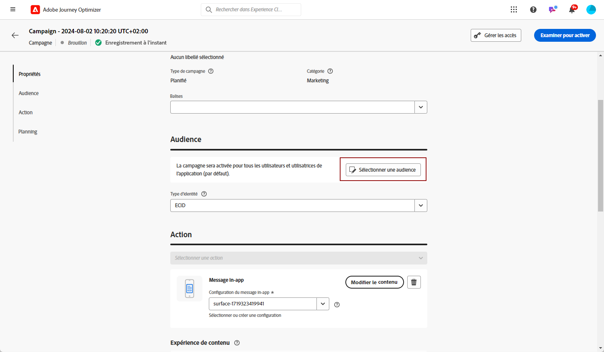

# Créer un message in-app {#create-in-app}

<!--
>[!BEGINTABS]

>[!TAB Add an In-app message to a journey]

>[!AVAILABILITY]
>
>The In-app activity is currently available as a beta to select users only. To join the beta program, contact Adobe Customer Care.

1. Open your journey, then drag and drop an **[!UICONTROL In-app]** activity from the **[!UICONTROL Actions]** section of the palette.

    When a profile reaches the end of their journey, any in-app messages displayed to them will automatically expire. For that reason, a Wait activity is automatically added after your In-app activity to ensure proper timing.

    

1. Enter a **[!UICONTROL Label]** and **[!UICONTROL Description]** for your message.

1. Choose the [In-app surface](inapp-configuration.md) to use.

    

1. You can now start designing your content with the **[!UICONTROL Edit content]** button. [Learn more](design-in-app.md)

1. Click **[!UICONTROL Edit trigger]** to configure your Trigger. 

    

1. Choose the frequency of your trigger when your In-app message is active:

    * **[!UICONTROL Show every time]**: Always show the message when the events selected in the **[!UICONTROL Mobile app trigger]** drop-down occur.
    * **[!UICONTROL Show once]**: Only show this message the first time the events selected in the **[!UICONTROL Mobile app trigger]** drop-down occur.
    * **[!UICONTROL Show until click through]**: Show this message when the events selected in the **[!UICONTROL Mobile app trigger]** drop-down occur until an interact event is sent by the SDK with an action of "clicked".

1. From the **[!UICONTROL Mobile app trigger]** dropdown(s), choose the event(s) and criteria that will trigger your message:

    1. From the left drop-down, select the event required to trigger the message.
    1. From the right drop-down, select the validation required on the selected event.
    1. Click the **[!UICONTROL Add]** button if you want the trigger to consider multiple events or criteria. Then, repeat the steps above.
    1. Select how your events are linked, e.g. choose **[!UICONTROL And]** if you want **both** triggers to be true in order for a message to be shown or choose **[!UICONTROL Or]** if you want the message to be shown if **either** of the triggers are true.
    1. Click **[!UICONTROL Save]** when your Triggers have been configured.

    
    
1. If necessary, complete your journey flow by dragging and dropping additional actions or events. [Learn more](../building-journeys/about-journey-activities.md)

1. Once your In-app message is ready, finalize the configuration and publish your journey to activate it.

For more information on how to configure a journey, refer to [this page](../building-journeys/journey-gs.md).

>[!TAB Add an In-app message to a campaign]
-->

1. Accédez au menu **[!UICONTROL Campagnes]**, puis cliquez sur **[!UICONTROL Créer une campagne]**.

1. Dans la section **[!UICONTROL Propriétés]**, sélectionnez le type d’exécution de la campagne : planifié ou déclenché par l’API. Pour en savoir plus sur les types de campagne, consultez [cette page](../campaigns/create-campaign.md#campaigntype).

1. Dans la section **[!UICONTROL Actions]**, choisissez le **[!UICONTROL Message in-app]** et la **[!UICONTROL Surface d’application]** précédemment configurée pour votre message in-app. Cliquez ensuite sur **[!UICONTROL Créer]**.

   En savoir plus sur la configuration in-app sur [cette page](inapp-configuration.md).

   

1. Dans la section **[!UICONTROL Propriétés]**, rédigez le **[!UICONTROL Titre]** et la **[!UICONTROL Description]**.

1. Pour attribuer des libellés d’utilisation des données personnalisés ou de base au message in-app, sélectionnez **[!UICONTROL Gérer l’accès]**. [En savoir plus](../administration/object-based-access.md).

1. Cliquez sur le bouton **[!UICONTROL Sélectionner une audience]** pour définir l’audience à cibler à partir de la liste des audiences Adobe Experience Platform disponibles. [En savoir plus](../audience/about-audiences.md).

   

1. Dans le champ **[!UICONTROL Espace de noms d’identité]**, choisissez l’espace de noms à utiliser pour identifier les personnes à partir de l’audience sélectionnée. [En savoir plus](../event/about-creating.md#select-the-namespace).

1. Cliquez sur **[!UICONTROL Créer une expérience]** pour commencer à configurer votre expérience de contenu et créer des traitements afin de mesurer leurs performances et d’identifier la meilleure option pour votre audience cible. [En savoir plus](../campaigns/content-experiment.md).

1. Cliquez sur **[!UICONTROL Modifier les déclencheurs]** pour sélectionner le ou les événements et les critères qui déclencheront votre message. Les créateurs de règles permettent aux utilisateurs de spécifier des critères et des valeurs qui, lorsqu’ils sont satisfaits, déclenchent un ensemble d’actions, telles que l’envoi d’un message in-app.

   1. Cliquez sur la liste déroulante d’événements pour modifier votre déclencheur si nécessaire.

   1. Cliquez sur **[!UICONTROL Ajouter une condition]** si vous souhaitez que le déclencheur prenne en compte plusieurs événements ou critères.

   1. Choisissez la **[!UICONTROL Ou]** condition si vous souhaitez ajouter d’autres **[!UICONTROL Triggers]** pour développer davantage votre règle.

      

   1. Choisissez la **[!UICONTROL Et]** condition si vous souhaitez ajouter **[!UICONTROL Caractéristiques]** et affinez mieux votre règle.

      +++Voir Caractéristiques disponibles.

      | Package | Caractéristiques  | Définition |
      |---|---|---|
      | Informations sur le périphérique | Nom de l’opérateur | Déclenché lorsque l’un des noms de l’opérateur de la liste est rencontré. |
      | Informations sur le périphérique | Nom de l’appareil | Déclenché lorsque l’un des noms de périphérique est rencontré. |
      | Informations sur le périphérique | Paramètres régionaux | Déclenché lorsque l’une des langues de la liste est remplie. |
      | Informations sur le périphérique | Version du SE | Déclenché lorsque l’une des versions de système d’exploitation spécifiées est remplie. |
      | Informations sur le périphérique | Version précédente du système d’exploitation | Déclenché lorsque l’une des versions précédentes du système d’exploitation spécifiées est atteinte. |
      | Informations sur le périphérique | Mode d’exécution | Déclenché si le mode d’exécution est une application ou une extension. |
      | Cycle de vie de l’application | ID d’application | Déclenché lorsque l’ID d’application spécifié est atteint. |
      | Cycle de vie de l’application | Jour de la semaine | Déclenché lorsque le jour de la semaine spécifié est atteint. |
      | Cycle de vie de l’application | Jour depuis la première utilisation | Déclenché lorsque le nombre spécifié depuis la première utilisation est atteint. |
      | Cycle de vie de l’application | Jour depuis la dernière utilisation | Déclenché lorsque le nombre spécifié depuis la dernière utilisation est atteint. |
      | Cycle de vie de l’application | Jour depuis la mise à niveau | Déclenché lorsque le nombre spécifié de jours depuis la dernière mise à niveau est atteint. |
      | Cycle de vie de l’application | Date d’installation | Déclenché lorsque la date d’installation spécifiée est atteinte. |
      | Cycle de vie de l’application | Lancements | Déclenché lorsque le nombre spécifié de lancements est atteint. |
      | Cycle de vie de l’application | Heure | Déclenché lorsque l’heure spécifiée est atteinte. |
      | Places | Point ciblé actuel | Déclenché par le SDK Places lorsque votre client entre dans le point ciblé spécifié. |
      | Places | Dernier point ciblé | Déclenché par le SDK Places en fonction du dernier point ciblé de votre client. |
      | Places | Dernier point ciblé de sortie | Déclenché par le SDK Places en fonction du dernier point ciblé de votre client. |

+++

      

   1. Cliquez sur **[!UICONTROL Créer un groupe]** pour regrouper les déclencheurs.

1. Sélectionnez la fréquence de votre déclencheur lorsque votre message in-app est actif. Les options disponibles sont les suivantes :

   * **[!UICONTROL À chaque fois]** : affichez toujours le message lorsque les événements sélectionnés dans le menu déroulant **[!UICONTROL Déclencheur d’application mobile]** se produisent.
   * **[!UICONTROL Une fois]** : n’affichez ce message que la première fois que les événements sélectionnés dans le menu déroulant **[!UICONTROL Déclencheur d’application mobile]** se produisent.
   * **[!UICONTROL Jusqu’au clic]** : affichez ce message lorsque les événements sélectionnés dans le menu déroulant **[!UICONTROL Déclencheur d’application mobile]** se produisent jusqu’à ce qu’un événement d’interaction soit envoyé par le SDK avec une action « faisant l’objet d’un clic ».
   * **[!UICONTROL X fois]** : affichez ce message X fois.

1. Si nécessaire, choisissez le **[!UICONTROL Jour de la semaine]** ou l’ **[!UICONTROL Heure de la journée]** à laquelle le message in-app s’affiche.

1. Les campagnes sont conçues pour être exécutées à une date spécifique ou à une fréquence récurrente. Découvrez comment configurer le **[!UICONTROL Planning]** de votre campagne dans [cette section](../campaigns/create-campaign.md#schedule).

   

1. Vous pouvez maintenant commencer à concevoir votre contenu à l’aide du bouton **[!UICONTROL Modifier le contenu]**. [En savoir plus](design-in-app.md).

   

<!--
>[!ENDTABS]
-->

## Tutoriels vidéo{#video}

* La vidéo ci-dessous montre comment créer, configurer et publier des messages in-app dans vos campagnes.

  +++Voir la vidéo
  >[!VIDEO](https://video.tv.adobe.com/v/3410430?quality=12&learn=on)
+++

* La vidéo ci-dessous montre comment configurer et analyser des expériences de contenu pour les messages in-app de test AB.

  +++Voir la vidéo
  >[!VIDEO](https://video.tv.adobe.com/v/3419898)
+++

**Rubriques connexes :**

* [Concevoir un message in-app](design-in-app.md)
* [Tester et envoyer le message in-app](send-in-app.md)
* [Rapport in-app](../reports/campaign-global-report.md#inapp-report)
* [Configuration in-app](inapp-configuration.md)