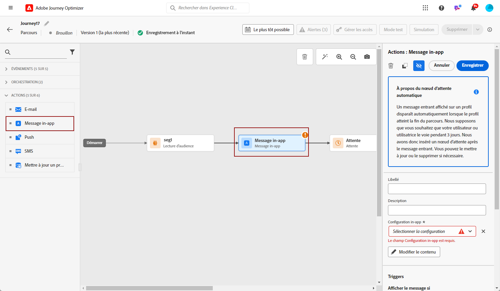

# Créer un message in-app {#create-in-app}

Vous pouvez ajouter un message in-app dans une campagne ou dans un parcours. Suivez les étapes détaillées ci-dessous pour créer un message in-app dans les deux contextes.

>[!BEGINTABS]

>[!TAB Ajouter un message in-app à un parcours]

Pour ajouter un message In-App dans un parcours, procédez comme suit :

1. Ouvrez votre parcours, puis effectuez un glisser-déposer d’une activité **[!UICONTROL In-app]** depuis la section **[!UICONTROL Actions]** de la palette.

   Lorsqu’un profil atteint la fin de son parcours, tous les messages in-app qui lui sont affichés expirent automatiquement. Pour cette raison, une activité d’attente est automatiquement ajoutée après votre activité in-app afin d’assurer un timing correct.

   

1. Saisissez un **[!UICONTROL libellé]** et une **[!UICONTROL description]** pour votre message.

1. Choisissez la [surface in-app](inapp-configuration.md) à utiliser.

   

1. Vous pouvez maintenant commencer à concevoir votre contenu à l’aide du bouton **[!UICONTROL Modifier le contenu]**. [En savoir plus](design-in-app.md).

1. Cliquez sur **[!UICONTROL Modifier le trigger]** pour configurer votre trigger.

   

1. Sélectionnez la fréquence de votre déclencheur lorsque votre message in-app est actif :

   * **[!UICONTROL Afficher à chaque fois]** : toujours afficher le message lorsque les événements sélectionnés dans le menu déroulant **[!UICONTROL Déclencheur d’application mobile]** se produisent.
   * **[!UICONTROL Afficher une fois]** : n’afficher ce message que la première fois que les événements sélectionnés dans le menu déroulant **[!UICONTROL Déclencheur d’application mobile]** se produisent.
   * **[!UICONTROL Afficher jusqu’au clic]** : afficher ce message lorsque les événements sélectionnés dans le menu déroulant **[!UICONTROL Déclencheur d’application mobile]** se produisent jusqu’à ce qu’un événement d’interaction soit envoyé par le SDK avec une action « faisant l’objet d’un clic ».

1. Dans le ou les menus déroulants **[!UICONTROL Déclencheur d’application mobile]**, choisissez le ou les événements et les critères qui déclencheront votre message :

   1. Dans le menu déroulant de gauche, sélectionnez l’événement nécessaire pour déclencher le message.
   1. Dans le menu déroulant de droite, sélectionnez la validation requise pour l’événement sélectionné.
   1. Cliquez sur le bouton **[!UICONTROL Ajouter]** si vous souhaitez que le déclencheur prenne en compte plusieurs événements ou critères. Répétez ensuite les étapes ci-dessus.
   1. Sélectionnez le mode de liaison de vos événements, par exemple choisissez **[!UICONTROL And]** si vous voulez que les déclencheurs soient **tous les deux** vérifiés pour que le message s’affiche ou choisissez **[!UICONTROL Or]** si vous souhaitez que le message ne s’affiche que si **l’un ou l’autre** des déclencheurs est vérifié.
   1. Cliquez sur **[!UICONTROL Enregistrer]** une fois vos triggers configurés.

   

1. Si nécessaire, complétez votre flux de parcours en faisant glisser et en déposant des actions ou des événements supplémentaires. [En savoir plus](../building-journeys/about-journey-activities.md).

1. Une fois votre message in-app prêt, finalisez la configuration et publiez votre parcours pour l’activer.

Pour plus d’informations sur la configuration de votre parcours, consultez cette [page](../building-journeys/journey-gs.md).

>[!TAB Ajouter un message in-app à une campagne]

Pour ajouter un message In-App dans une campagne, procédez comme suit :

1. Accédez au menu **[!UICONTROL Campagnes]**, puis cliquez sur **[!UICONTROL Créer une campagne]**.

1. Dans la section **[!UICONTROL Propriétés]**, sélectionnez le type d’exécution de la campagne : planifié ou déclenché par l’API. Pour en savoir plus sur les types de campagne, consultez [cette page](../campaigns/create-campaign.md#campaigntype).

1. Dans la section **[!UICONTROL Actions]**, choisissez le **[!UICONTROL Message in-app]** et la **[!UICONTROL Surface d’application]** précédemment configurée pour votre message in-app. Cliquez ensuite sur **[!UICONTROL Créer]**.

   En savoir plus sur la configuration in-app sur [cette page](inapp-configuration.md).

   

1. Dans la section **[!UICONTROL Propriétés]**, rédigez le **[!UICONTROL Titre]** et la **[!UICONTROL Description]**.

1. Pour attribuer des libellés d’utilisation des données personnalisés ou de base au message in-app, sélectionnez **[!UICONTROL Gérer l’accès]**. [En savoir plus](../administration/object-based-access.md).

1. Cliquez sur le bouton **[!UICONTROL Sélectionner une audience]** pour définir l’audience à cibler à partir de la liste des audiences Adobe Experience Platform disponibles. [En savoir plus](../audience/about-audiences.md).

   

1. Dans le champ **[!UICONTROL Espace de noms d’identité]**, choisissez l’espace de noms à utiliser pour identifier les personnes à partir de l’audience sélectionnée. [En savoir plus](../event/about-creating.md#select-the-namespace).

1. Cliquez sur **[!UICONTROL Créer une expérience]** pour commencer à configurer votre expérience de contenu et créer des traitements afin de mesurer leurs performances et d’identifier la meilleure option pour votre audience cible. [En savoir plus](../campaigns/content-experiment.md).

1. Cliquez sur **[!UICONTROL Modifier les déclencheurs]** pour choisir le ou les événements et les critères qui déclencheront votre message. Les créateurs de règles permettent aux utilisateurs et utilisatrices de spécifier des critères et des valeurs qui, lorsqu’ils sont satisfaits, déclenchent un ensemble d’actions, telles que l’envoi d’un message in-app.

   1. Cliquez sur la liste déroulante d’événements pour modifier votre déclencheur si nécessaire.

   1. Cliquez sur **[!UICONTROL Ajouter une condition]** si vous souhaitez que le déclencheur prenne en compte plusieurs événements ou critères.

   1. Choisissez la condition **[!UICONTROL Ou]** si vous souhaitez ajouter d’autres **[!UICONTROL Déclencheurs]** pour développer davantage votre règle.

      

   1. Choisissez la condition **[!UICONTROL Et]** si vous souhaitez ajouter des **[!UICONTROL caractéristiques]** et mieux affiner votre règle.

      +++Voir les caractéristiques disponibles.

      | Package | Caractéristiques | Définition |
      |---|---|---|
      | Informations sur l’appareil | Nom de l’opérateur | Déclenché lorsque l’un des noms de l’opérateur de la liste est rencontré. |
      | Informations sur l’appareil | Nom de l’appareil | Déclenché lorsque l’un des noms d’appareil est rencontré. |
      | Informations sur l’appareil | Paramètres régionaux | Déclenché lorsque l’une des langues de la liste est rencontrée. |
      | Informations sur l’appareil | Version du système d’exploitation | Déclenché lorsque l’une des versions de système d’exploitation spécifiées est rencontrée. |
      | Informations sur l’appareil | Version précédente du système d’exploitation | Déclenché lorsque l’une des versions précédentes de système d’exploitation spécifiées est rencontrée. |
      | Informations sur l’appareil | Mode d’exécution | Déclenché si le mode d’exécution est une application ou une extension. |
      | Cycle de vie de l’application | ID d’application | Déclenché lorsque l’ID d’application spécifié est rencontré. |
      | Cycle de vie de l’application | Jour de la semaine | Déclenché lorsque le jour de la semaine spécifié est atteint. |
      | Cycle de vie de l’application | Jours depuis la première utilisation | Déclenché lorsque le nombre spécifié de jours depuis la première utilisation est atteint. |
      | Cycle de vie de l’application | Jours depuis la dernière utilisation | Déclenché lorsque le nombre spécifié de jours depuis la dernière utilisation est atteint. |
      | Cycle de vie de l’application | Jours depuis la mise à niveau | Déclenché lorsque le nombre spécifié de jours depuis la dernière mise à niveau est atteint. |
      | Cycle de vie de l’application | Date d’installation | Déclenché lorsque la date d’installation spécifiée est atteinte. |
      | Cycle de vie de l’application | Lancements | Déclenché lorsque le nombre spécifié de lancements est atteint. |
      | Cycle de vie de l’application | Heure | Déclenché lorsque l’heure spécifiée du jour est atteinte. |
      | Places | Point ciblé actuel | Déclenché par le SDK Places lorsque votre cliente ou client accède au point ciblé spécifié. |
      | Places | Dernier point ciblé accédé | Déclenché par le SDK Places en fonction du dernier point ciblé accédé par votre cliente ou client. |
      | Places | Dernier point ciblé quitté | Déclenché par le SDK Places en fonction du dernier point ciblé quitté par votre cliente ou client. |

+++

      

   1. Cliquez sur **[!UICONTROL Créer un groupe]** pour regrouper les déclencheurs.

1. Sélectionnez la fréquence de votre déclencheur lorsque votre message in-app est actif. Les options disponibles sont les suivantes :

   * **[!UICONTROL À chaque fois]** : affichez toujours le message lorsque les événements sélectionnés dans le menu déroulant **[!UICONTROL Déclencheur d’application mobile]** se produisent.
   * **[!UICONTROL Une fois]** : n’affichez ce message que la première fois que les événements sélectionnés dans le menu déroulant **[!UICONTROL Déclencheur d’application mobile]** se produisent.
   * **[!UICONTROL Jusqu’au clic]** : affichez ce message lorsque les événements sélectionnés dans le menu déroulant **[!UICONTROL Déclencheur d’application mobile]** se produisent jusqu’à ce qu’un événement d’interaction soit envoyé par le SDK avec une action « faisant l’objet d’un clic ».
   * **[!UICONTROL X fois]** : affichez ce message X fois.

1. Si nécessaire, choisissez le **[!UICONTROL Jour de la semaine]** ou l’ **[!UICONTROL Heure de la journée]** à laquelle le message in-app s’affiche.

1. Les campagnes sont conçues pour être exécutées à une date spécifique ou à une fréquence récurrente. Découvrez comment configurer le **[!UICONTROL Planning]** de votre campagne dans [cette section](../campaigns/create-campaign.md#schedule).

   

1. Vous pouvez maintenant commencer à concevoir votre contenu à l’aide du bouton **[!UICONTROL Modifier le contenu]**. [En savoir plus](design-in-app.md).

   

>[!ENDTABS]

## Tutoriels vidéo{#video}

* La vidéo ci-dessous montre comment créer, configurer et publier des messages in-app dans vos campagnes.

  >[!VIDEO](https://video.tv.adobe.com/v/3410430?quality=12&learn=on)

* La vidéo ci-dessous montre comment configurer et analyser des expériences de contenu pour les messages in-app de test AB.

  >[!VIDEO](https://video.tv.adobe.com/v/3419898)

**Rubriques connexes :**

* [Concevoir un message in-app](design-in-app.md)
* [Tester et envoyer le message in-app](send-in-app.md)
* [Rapport in-app](../reports/campaign-global-report.md#inapp-report)
* [Configuration in-app](inapp-configuration.md)