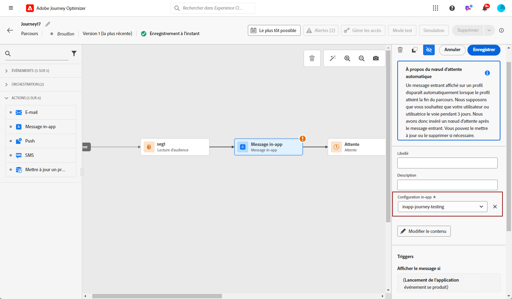
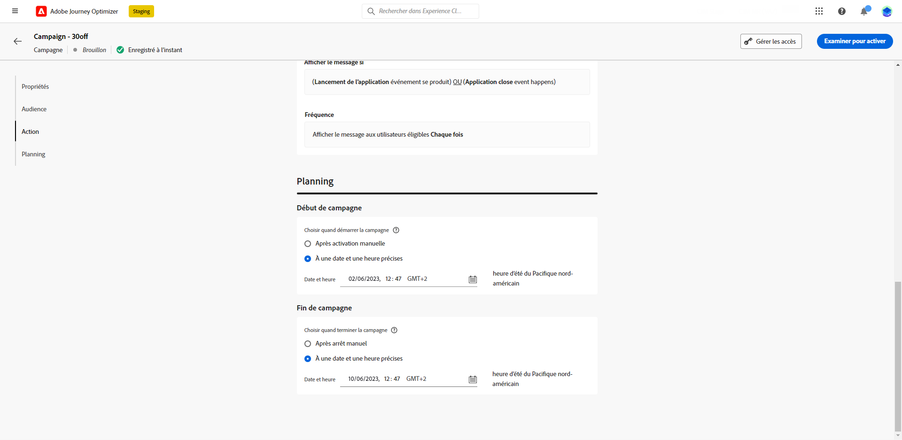

# Créer un message in-app {#create-in-app}

>[!CONTEXTUALHELP]
>id="ajo_campaigns_inapp_triggers"
>title="Gérer des déclencheurs in-app"
>abstract="Contrôlez efficacement vos déclencheurs en sélectionnant les événements et critères spécifiques qui activeront vos messages. Avec le créateur de règles, les personnes peuvent définir des conditions et des valeurs précises. Lorsque ces conditions sont remplies, elles déclenchent une série d’actions, y compris la diffusion de messages in-app."

Vous pouvez ajouter un message in-app dans une campagne ou dans un parcours. Suivez les étapes détaillées ci-dessous pour créer un message in-app dans les deux contextes.

Notez que les messages in-app ne sont pas affectés par le choix de l’utilisateur ou de l’utilisatrice de s’inscrire ou de se désinscrire des notifications push dans le système d’exploitation.

>[!BEGINTABS]

>[!TAB Ajouter un message in-app à un parcours]

Pour ajouter un message in-app dans un parcours, procédez comme suit :

1. Ouvrez votre [parcours ](../building-journeys/journey-gs.md), puis effectuez un glisser-déposer d&#39;une activité **[!UICONTROL Action]** depuis la section **[!UICONTROL Actions]** de la palette. En savoir plus sur l’activité [Action](../building-journeys/journey-action.md).

   >[!IMPORTANT]
   >
   >Tous les canaux natifs étant désormais accessibles par le biais de l’activité Action , les activités de canal natives héritées seront abandonnées avec la version de mars. Les parcours existants qui incluent des actions héritées continueront à fonctionner en l’état. Aucune migration n’est requise.

1. Sélectionnez **[!UICONTROL In-app]** comme type d’action.

   

   >[!NOTE]
   >
   >Lorsqu’un profil atteint la fin de son parcours, tous les messages in-app qui lui sont affichés expirent automatiquement. Pour cette raison, une activité **Attente** de 3 jours est automatiquement ajoutée après votre action in-app afin d’assurer un timing correct. [En savoir plus](../building-journeys/wait-activity.md#auto-wait-node)

1. Saisissez un **[!UICONTROL Libellé]** pour identifier votre action dans la zone de travail du parcours.

1. Cliquez sur le bouton **[!UICONTROL Configurer l’action]**.

1. Vous accédez à l’onglet **[!UICONTROL Actions]**. À partir de là, sélectionnez ou créez la configuration in-app à utiliser. [En savoir plus](inapp-configuration.md#channel-prerequisites)

   

1. Sélectionnez le bouton **[!UICONTROL Modifier le contenu]** et créez votre contenu selon vos besoins. [En savoir plus](design-in-app.md)

1. Cliquez sur **[!UICONTROL Modifier les déclencheurs]** pour choisir le ou les événements et les critères qui déclencheront votre message. Les créateurs de règles permettent aux utilisateurs et utilisatrices de spécifier des critères et des valeurs qui, lorsqu’ils sont remplis, déclenchent un ensemble d’actions, telles que l’envoi d’un message in-app. [En savoir plus](design-in-app.md)

   1. Cliquez sur la liste déroulante d’événements pour modifier votre déclencheur si nécessaire.

      +++Affichez les déclencheurs disponibles.

      | Package | Déclencheur | Définition |
      |---|---|---|
      | Envoyer des données à Platform | Envoi de données à Platform | Déclenché lorsque l’application mobile émet un événement d’expérience Edge pour envoyer des données à Adobe Experience Platform. En règle générale, l’appel API [sendEvent](https://developer.adobe.com/client-sdks/documentation/edge-network/api-reference/#sendevent) à partir de l’extension AEP Edge. |
      | Suivi principal | Suivi de l’action | Déclenché lorsque la fonctionnalité héritée proposée dans l’API de code mobile [trackAction](https://developer.adobe.com/client-sdks/documentation/mobile-core/api-reference/#trackaction) est appelée. |
      | Suivi principal | Suivi de l’état | Déclenché lorsque la fonctionnalité héritée proposée dans l’API de code mobile [trackState](https://developer.adobe.com/client-sdks/documentation/mobile-core/api-reference/#trackstate) est appelée. |
      | Suivi principal | Collecte des PII | Déclenchée lorsque la fonctionnalité héritée proposée dans l’API de code mobile [collectPII](https://developer.adobe.com/client-sdks/documentation/mobile-core/api-reference/#collectpii) est appelée. |
      | Cycle de vie de l’application | Lancement de l’application | Déclenché à chaque exécution, y compris les blocages et les installations. Également déclenché à la mise en premier plan de l’application lorsque le délai d’expiration de la session de cycle de vie a été dépassé. |
      | Cycle de vie de l’application | Installation de l’application | Déclenchée lors de la première exécution après l’installation ou la réinstallation. |
      | Cycle de vie de l’application | Mise à jour de l’application | Déclenchée lors de la première exécution après une mise à niveau ou lorsque le numéro de version change. |
      | Cycle de vie de l’application | Fermeture de l’application | Déclenchée lorsque l’application est fermée. |
      | Cycle de vie de l’application | Crash de l‘application | Déclenché lorsque l’application n’est pas mise en arrière-plan avant sa fermeture. L’événement est envoyé au démarrage de l’application après son crash. La création de rapports de crash d’Adobe Mobile n’implémente pas un gestionnaire global d’exceptions non interceptées. |
      | Places | Entrer dans le POI | Déclenché par le SDK Places lorsque votre client ou cliente accède au point ciblé (POI) configuré. |
      | Places | Quitter le POI | Déclenché par le SDK Places lorsque votre client ou cliente quitte le point ciblé (POI) configuré. |

      +++

   1. Cliquez sur **[!UICONTROL Ajouter une condition]** si vous souhaitez que le déclencheur prenne en compte plusieurs événements ou critères.

   1. Choisissez la condition **[!UICONTROL Ou]** si vous souhaitez ajouter d’autres **[!UICONTROL Déclencheurs]** pour développer davantage votre règle.

      

   1. Choisissez la condition **[!UICONTROL Et]** si vous souhaitez ajouter des **[!UICONTROL caractéristiques]** et mieux affiner votre règle.

      +++Consultez les caractéristiques disponibles.

      | Package | Caractéristiques | Définition |
      |---|---|---|
      | Informations sur l’appareil | Nom de l’opérateur | Déclenché lorsque l’un des noms de l’opérateur de la liste est rencontré. |
      | Informations sur l’appareil | Nom de l’appareil | Déclenché lorsque l’un des noms d’appareil est rencontré. |
      | Informations sur l’appareil | Paramètres régionaux | Déclenché lorsque l’une des langues de la liste est rencontrée. |
      | Informations sur l’appareil | Version du système d’exploitation | Déclenché lorsque l’une des versions de système d’exploitation spécifiées est rencontrée. |
      | Informations sur l’appareil | Version précédente du système d’exploitation | Déclenché lorsque l’une des versions précédentes de système d’exploitation spécifiées est rencontrée. |
      | Informations sur l’appareil | Mode d’exécution | Déclenché si le mode d’exécution est une application ou une extension. |
      | Cycle de vie de l’application | ID d’application | Déclenché lorsque l’ID d’application spécifié est rencontré. |
      | Cycle de vie de l’application | Jour de la semaine | Déclenché lorsque le jour de la semaine spécifié est atteint. |
      | Cycle de vie de l’application | Jours depuis la première utilisation | Déclenché lorsque le nombre spécifié de jours depuis la première utilisation est atteint. |
      | Cycle de vie de l’application | Jours depuis la dernière utilisation | Déclenché lorsque le nombre spécifié de jours depuis la dernière utilisation est atteint. |
      | Cycle de vie de l’application | Jours depuis la mise à niveau | Déclenché lorsque le nombre spécifié de jours depuis la dernière mise à niveau est atteint. |
      | Cycle de vie de l’application | Date d’installation | Déclenché lorsque la date d’installation spécifiée est atteinte. |
      | Cycle de vie de l’application | Lancements | Déclenché lorsque le nombre spécifié de lancements est atteint. |
      | Cycle de vie de l’application | Heure | Déclenché lorsque l’heure spécifiée du jour est atteinte. |
      | Places | Point ciblé actuel | Déclenché par le SDK Places lorsque votre cliente ou client accède au point ciblé spécifié. |
      | Places | Dernier point ciblé accédé | Déclenché par le SDK Places en fonction du dernier point ciblé accédé par votre cliente ou client. |
      | Places | Dernier point ciblé quitté | Déclenché par le SDK Places en fonction du dernier point ciblé quitté par votre cliente ou client. |

      +++

      

   1. Cliquez sur **[!UICONTROL Créer un groupe]** pour regrouper les déclencheurs.

      

   1. Sélectionnez la fréquence de votre déclencheur lorsque votre message in-app est actif :

      * **[!UICONTROL Afficher à chaque fois]** : toujours afficher le message lorsque les événements sélectionnés dans le menu déroulant **[!UICONTROL Déclencheur d’application mobile]** se produisent.
      * **[!UICONTROL Afficher une fois]** : ce message s’affiche une seule fois par session utilisateur et reste visible dans toutes les fenêtres ou activités jusqu’à sa fermeture. Pour le limiter à un certain écran ou le faire disparaître automatiquement, utilisez une logique personnalisée avec le délégué de messagerie.
      * **[!UICONTROL Afficher jusqu’au clic]** : afficher ce message lorsque les événements sélectionnés dans le menu déroulant **[!UICONTROL Déclencheur d’application mobile]** se produisent jusqu’à ce qu’un événement d’interaction soit envoyé par le SDK avec une action « faisant l’objet d’un clic ».

1. Vous pouvez ajouter une ou plusieurs actions entrantes à votre message in-app en cliquant sur le bouton **[!UICONTROL Ajouter une action]**. [En savoir plus](../building-journeys/journey-action.md#multi-action)

1. Revenez à la zone de travail parcours. Si nécessaire, complétez votre flux de parcours en faisant glisser et en déposant des actions ou des événements supplémentaires. [En savoir plus](../building-journeys/about-journey-activities.md)

Pour plus d’informations sur la création, la configuration et la publication d’un parcours, consultez [cette page](../building-journeys/journey-gs.md).

>[!NOTE]
>
>Si vous souhaitez afficher un message in-app peu de temps après l’envoi d’une notification push, utilisez une activité **Attente** pour permettre à la payload du message in-app de se propager. En règle générale, une attente de 5 à 15 minutes est recommandée, mais les heures exactes peuvent varier en fonction de la complexité de la payload et des besoins de personnalisation.

>[!TAB Ajouter un message in-app à une campagne]

Pour ajouter un message in-app dans une campagne, procédez comme suit :

1. Accédez au menu **[!UICONTROL Campagnes]**, puis cliquez sur **[!UICONTROL Créer une campagne]**.

1. Sélectionner le type de campagne que vous souhaitez exécuter.

   * **Scheduled - Marketing** : permet d’exécuter la campagne immédiatement ou à une date spécifiée. Les campagnes planifiées visent à envoyer des messages marketing. Elles sont configurées et exécutées à partir de l’interface d’utilisation.

   * **Déclenchée par API - Marketing/Transactionnelle** : permet d’exécuter la campagne à l’aide d’un appel API. Les campagnes déclenchées par API sont destinées à envoyer des messages marketing, ou transactionnels, c’est-à-dire des messages envoyés suite à une action effectuée par une personne : réinitialisation du mot de passe, abandon de panier, etc.

1. Dans la section **[!UICONTROL Propriétés]**, rédigez le **[!UICONTROL Titre]** et la **[!UICONTROL Description]**.

1. Pour attribuer des libellés d’utilisation des données personnalisés ou de base au message in-app, sélectionnez **[!UICONTROL Gérer l’accès]**. [En savoir plus](../administration/object-based-access.md).

1. Cliquez sur le bouton **[!UICONTROL Sélectionner une audience]** pour définir l’audience à cibler à partir de la liste des audiences Adobe Experience Platform disponibles. [En savoir plus](../audience/about-audiences.md).

   

1. Dans le champ **[!UICONTROL Espace de noms d’identité]**, choisissez l’espace de noms à utiliser pour identifier les personnes à partir de l’audience sélectionnée. [En savoir plus](../event/about-creating.md#select-the-namespace).

1. Dans la section **[!UICONTROL Actions]**, sélectionnez le **[!UICONTROL message in-app]** et sélectionnez ou créez une configuration.

   En savoir plus sur la configuration in-app sur [cette page](inapp-configuration.md).

   

1. Cliquez sur **[!UICONTROL Créer une expérience]** pour commencer à configurer votre expérience de contenu et créer des traitements afin de mesurer leurs performances et d’identifier la meilleure option pour votre audience cible. [En savoir plus](../content-management/content-experiment.md)

1. Cliquez sur **[!UICONTROL Modifier les déclencheurs]** pour choisir le ou les événements et les critères qui déclencheront votre message. Les créateurs de règles permettent aux utilisateurs et utilisatrices de spécifier des critères et des valeurs qui, lorsqu’ils sont satisfaits, déclenchent un ensemble d’actions, telles que l’envoi d’un message in-app.

   1. Cliquez sur la liste déroulante d’événements pour modifier votre déclencheur si nécessaire.

      +++Affichez les déclencheurs disponibles.

      | Package | Déclencheur | Définition |
      |---|---|---|
      | Envoyer des données à Platform | Envoi de données à Platform | Déclenché lorsque l’application mobile émet un événement d’expérience Edge pour envoyer des données à Adobe Experience Platform. En règle générale, l’appel API [sendEvent](https://developer.adobe.com/client-sdks/documentation/edge-network/api-reference/#sendevent) à partir de l’extension AEP Edge. |
      | Suivi principal | Suivi de l’action | Déclenché lorsque la fonctionnalité héritée proposée dans l’API de code mobile [trackAction](https://developer.adobe.com/client-sdks/documentation/mobile-core/api-reference/#trackaction) est appelée. |
      | Suivi principal | Suivi de l’état | Déclenché lorsque la fonctionnalité héritée proposée dans l’API de code mobile [trackState](https://developer.adobe.com/client-sdks/documentation/mobile-core/api-reference/#trackstate) est appelée. |
      | Suivi principal | Collecte des PII | Déclenchée lorsque la fonctionnalité héritée proposée dans l’API de code mobile [collectPII](https://developer.adobe.com/client-sdks/documentation/mobile-core/api-reference/#collectpii) est appelée. |
      | Cycle de vie de l’application | Lancement de l’application | Déclenché à chaque exécution, y compris les blocages et les installations. Également déclenché à la mise en premier plan de l’application lorsque le délai d’expiration de la session de cycle de vie a été dépassé. |
      | Cycle de vie de l’application | Installation de l’application | Déclenchée lors de la première exécution après l’installation ou la réinstallation. |
      | Cycle de vie de l’application | Mise à jour de l’application | Déclenchée lors de la première exécution après une mise à niveau ou lorsque le numéro de version change. |
      | Cycle de vie de l’application | Fermeture de l’application | Déclenchée lorsque l’application est fermée. |
      | Cycle de vie de l’application | Crash de l‘application | Déclenché lorsque l’application n’est pas mise en arrière-plan avant sa fermeture. L’événement est envoyé au démarrage de l’application après son crash. La création de rapports de crash d’Adobe Mobile n’implémente pas un gestionnaire global d’exceptions non interceptées. |
      | Places | Entrer dans le POI | Déclenché par le SDK Places lorsque votre client ou cliente accède au point ciblé (POI) configuré. |
      | Places | Quitter le POI | Déclenché par le SDK Places lorsque votre client ou cliente quitte le point ciblé (POI) configuré. |

      +++

   1. Cliquez sur **[!UICONTROL Ajouter une condition]** si vous souhaitez que le déclencheur prenne en compte plusieurs événements ou critères.

   1. Choisissez la condition **[!UICONTROL Ou]** si vous souhaitez ajouter d’autres **[!UICONTROL Déclencheurs]** pour développer davantage votre règle.

      

   1. Choisissez la condition **[!UICONTROL Et]** si vous souhaitez ajouter des **[!UICONTROL caractéristiques]** et mieux affiner votre règle.

      +++Consultez les caractéristiques disponibles.

      | Package | Caractéristiques | Définition |
      |---|---|---|
      | Informations sur l’appareil | Nom de l’opérateur | Déclenché lorsque l’un des noms de l’opérateur de la liste est rencontré. |
      | Informations sur l’appareil | Nom de l’appareil | Déclenché lorsque l’un des noms d’appareil est rencontré. |
      | Informations sur l’appareil | Paramètres régionaux | Déclenché lorsque l’une des langues de la liste est rencontrée. |
      | Informations sur l’appareil | Version du système d’exploitation | Déclenché lorsque l’une des versions de système d’exploitation spécifiées est rencontrée. |
      | Informations sur l’appareil | Version précédente du système d’exploitation | Déclenché lorsque l’une des versions précédentes de système d’exploitation spécifiées est rencontrée. |
      | Informations sur l’appareil | Mode d’exécution | Déclenché si le mode d’exécution est une application ou une extension. |
      | Cycle de vie de l’application | ID d’application | Déclenché lorsque l’ID d’application spécifié est rencontré. |
      | Cycle de vie de l’application | Jour de la semaine | Déclenché lorsque le jour de la semaine spécifié est atteint. |
      | Cycle de vie de l’application | Jours depuis la première utilisation | Déclenché lorsque le nombre spécifié de jours depuis la première utilisation est atteint. |
      | Cycle de vie de l’application | Jours depuis la dernière utilisation | Déclenché lorsque le nombre spécifié de jours depuis la dernière utilisation est atteint. |
      | Cycle de vie de l’application | Jours depuis la mise à niveau | Déclenché lorsque le nombre spécifié de jours depuis la dernière mise à niveau est atteint. |
      | Cycle de vie de l’application | Date d’installation | Déclenché lorsque la date d’installation spécifiée est atteinte. |
      | Cycle de vie de l’application | Lancements | Déclenché lorsque le nombre spécifié de lancements est atteint. |
      | Cycle de vie de l’application | Heure | Déclenché lorsque l’heure spécifiée du jour est atteinte. |
      | Places | Point ciblé actuel | Déclenché par le SDK Places lorsque votre cliente ou client accède au point ciblé spécifié. |
      | Places | Dernier point ciblé accédé | Déclenché par le SDK Places en fonction du dernier point ciblé accédé par votre cliente ou client. |
      | Places | Dernier point ciblé quitté | Déclenché par le SDK Places en fonction du dernier point ciblé quitté par votre cliente ou client. |

      +++

      

   1. Cliquez sur **[!UICONTROL Créer un groupe]** pour regrouper les déclencheurs.

1. Sélectionnez la fréquence de votre déclencheur lorsque votre message in-app est actif. Les options disponibles sont les suivantes :

   * **[!UICONTROL À chaque fois]** : affichez toujours le message lorsque les événements sélectionnés dans le menu déroulant **[!UICONTROL Déclencheur d’application mobile]** se produisent.
   * **[!UICONTROL Une fois]** : n’affichez ce message que la première fois que les événements sélectionnés dans le menu déroulant **[!UICONTROL Déclencheur d’application mobile]** se produisent.
   * **[!UICONTROL Jusqu’au clic]** : affichez ce message lorsque les événements sélectionnés dans le menu déroulant **[!UICONTROL Déclencheur d’application mobile]** se produisent jusqu’à ce qu’un événement d’interaction soit envoyé par le SDK avec une action « faisant l’objet d’un clic ».
   * **[!UICONTROL X fois]** : affichez ce message X fois.

1. Si nécessaire, choisissez le **[!UICONTROL Jour de la semaine]** ou l’ **[!UICONTROL Heure de la journée]** à laquelle le message in-app s’affiche.

1. Les campagnes sont conçues pour être exécutées à une date spécifique ou à une fréquence récurrente. Découvrez comment configurer le **[!UICONTROL Planning]** de votre campagne dans [cette section](../campaigns/create-campaign.md#schedule).

   

1. Vous pouvez maintenant commencer à concevoir votre contenu à l’aide du bouton **[!UICONTROL Modifier le contenu]**. [En savoir plus](design-in-app.md)

   

Pour plus d’informations sur la création, la configuration et l’activation d’une campagne, consultez [cette page](../campaigns/get-started-with-campaigns.md).

>[!ENDTABS]

## Vidéos pratiques{#video}

* La vidéo ci-dessous montre comment créer, configurer et publier des messages in-app dans vos campagnes.

  +++Regarder la vidéo

  >[!VIDEO](https://video.tv.adobe.com/v/3410430?quality=12&learn=on)

  +++

* La vidéo ci-dessous montre comment configurer et analyser des expériences de contenu pour les messages in-app de test A/B.

  +++Regarder la vidéo

  >[!VIDEO](https://video.tv.adobe.com/v/3419898/?learn=on&autoplay=true)

  +++

* La vidéo ci-dessous montre comment créer un message in-app dans un parcours et comment tester et publier votre parcours.

  +++Regarder la vidéo

  >[!VIDEO](https://video.tv.adobe.com/v/3423077/?learn=on&autoplay=true)

  +++

**Rubriques connexes :**

* [Concevoir un message in-app](design-in-app.md)
* [Tester et envoyer le message in-app](send-in-app.md)
* [Rapport in-app](../reports/campaign-global-report-cja-inapp.md)
* [Configuration in-app](inapp-configuration.md)