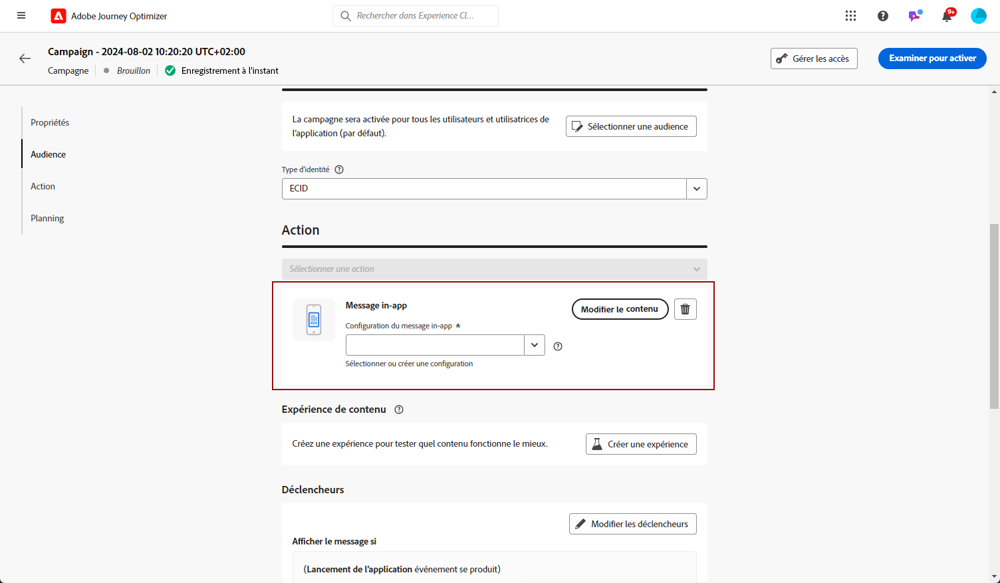

# Créer un message in-app {#create-in-app}

Les messages in-app sont créés dans le cadre d’une campagne.

Pour créer un message in-app, suivez les étapes ci-dessous :

1. Accédez au menu **[!UICONTROL Campagnes]**, puis cliquez sur **[!UICONTROL Création d’une campagne]**.

1. Dans le **[!UICONTROL Propriétés]** , sélectionnez le type d&#39;exécution de l&#39;opération : Planifié ou déclenché par l’API. En savoir plus sur les types de campagne dans [cette page](../campaigns/create-campaign.md#campaigntype).

1. Dans la section **[!UICONTROL Actions]**, choisissez le **[!UICONTROL Message in-app]** et la **[!UICONTROL Surface d’application]** précédemment configurée pour votre message in-app. Cliquez ensuite sur **[!UICONTROL Créer]**.

   En savoir plus sur la configuration In-App dans [cette page](inapp-configuration.md).

   

1. Dans la **[!UICONTROL Propriétés]** , saisissez la **[!UICONTROL Titre]** et le **[!UICONTROL Description]** description.

1. Pour attribuer des libellés d’utilisation des données personnalisés ou de base au message in-app, sélectionnez **[!UICONTROL Gérer l’accès]**. [En savoir plus](../administration/object-based-access.md).

1. Cliquez sur le bouton **[!UICONTROL Sélectionner une audience]** pour définir l’audience à cibler à partir de la liste des segments Adobe Experience Platform disponibles. [En savoir plus](../segment/about-segments.md).

   

1. Dans le champ **[!UICONTROL Espace de noms d’identité]**, choisissez l’espace de noms à utiliser pour identifier les personnes à partir du segment sélectionné. [En savoir plus](../event/about-creating.md#select-the-namespace).

1. Cliquez sur **[!UICONTROL Modifier les déclencheurs]** pour choisir le ou les événements et les critères qui déclencheront votre message :

   1. Cliquez sur **Ajouter une condition** si vous souhaitez que le déclencheur prenne en compte plusieurs événements ou critères.
   1. Sélectionnez le mode de liaison de vos événements, par exemple choisissez **[!UICONTROL And]** si vous voulez que les déclencheurs soient **tous les deux** vérifiés pour que le message s’affiche ou choisissez **[!UICONTROL Or]** si vous souhaitez que le message ne s’affiche que si **l’un ou l’autre** des déclencheurs est vérifié.
   1. Cliquez sur **[!UICONTROL Créer un groupe]** pour regrouper les déclencheurs.

   

1. Sélectionnez la fréquence de votre trigger lorsque votre message in-app est principal. Les options disponibles sont les suivantes :

   * **[!UICONTROL Everytime]**: Toujours afficher le message lorsque les événements sélectionnés dans la variable **[!UICONTROL Déclencheur d’application mobile]** s’affiche.
   * **[!UICONTROL Une fois]**: N’afficher ce message que la première fois que les événements sont sélectionnés dans la variable **[!UICONTROL Déclencheur d’application mobile]** s’affiche.
   * **[!UICONTROL Jusqu’à ce qu’un clic soit]**: Afficher ce message lorsque les événements sélectionnés dans la variable **[!UICONTROL Déclencheur d’application mobile]** se produit jusqu’à ce qu’un événement d’interaction soit envoyé par le SDK avec une action &quot;clicked&quot;.
   * **[!UICONTROL X nombre de fois]**: Afficher ce message X fois.

1. Si nécessaire, choisissez laquelle **[!UICONTROL Jour de la semaine]** ou **[!UICONTROL Heure de la journée]** le message in-app s’affiche.

1. Les campagnes sont conçues pour être exécutées à une date spécifique ou à une fréquence récurrente. Découvrez comment configurer le **[!UICONTROL Planning]** de votre campagne dans [cette section](../campaigns/create-campaign.md#schedule).

   

1. Vous pouvez maintenant commencer à concevoir votre contenu à l’aide du bouton **[!UICONTROL Modifier le contenu.]** [En savoir plus](design-in-app.md)

   

## Vidéo pratique{#video}

La vidéo ci-dessous montre comment créer, configurer et publier des messages in-app dans vos campagnes.

>[!VIDEO](https://video.tv.adobe.com/v/3410430?quality=12&learn=on)

**Rubriques connexes :**

* [Concevoir un message in-app](design-in-app.md)
* [Tester et envoyer votre message in-app](send-in-app.md)
* [Rapport in-app](../reports/campaign-global-report.md#inapp-report)
* [Configuration in-app](inapp-configuration.md)