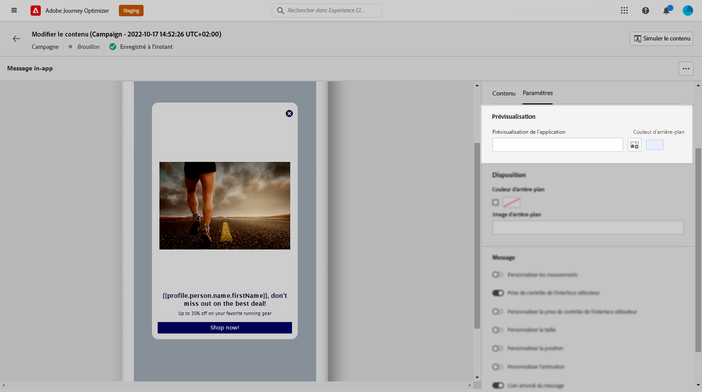

# Concevoir le contenu in-app {#design-content}

Vous pouvez modifier le contenu in-app pour configurer les options d’expérience, notamment la disposition et l’affichage du message, le texte et les options de bouton.

Pour configurer le contenu du message, cliquez sur le bouton **[!UICONTROL Modifier le contenu]** et utilisez les options de la section droite de l&#39;écran pour concevoir le contenu de votre message in-app.

Le **[!UICONTROL Formatage avancé]** activer/désactiver active des options supplémentaires pour personnaliser l’expérience.

Une fois votre message in-app créé et son contenu défini et personnalisé, vous pouvez le consulter et l’activer. Les notifications seront alors envoyées conformément au planning de la campagne. En savoir plus sur [cette page](create-in-app.md#in-app-send).

## Disposition des messages {#message-layout}

Dans la **[!UICONTROL Disposition du message]** sélectionnez l’une des quatre options de mise en page différentes en fonction de vos besoins en matière de messagerie.

* **[!UICONTROL Plein écran]**: Ce type de disposition couvre tout l’écran des appareils de votre audience.

   Elle prend en charge des composants multimédia (image, vidéo), texte et bouton.

* **[!UICONTROL Modal]**: Cette disposition apparaît dans une grande fenêtre de style alerte. Votre application est toujours visible en arrière-plan.

   Elle prend en charge des composants multimédia (image, vidéo), texte et bouton.

* **[!UICONTROL Bannière]**: Ce type de disposition apparaît comme message d’alerte du système d’exploitation natif.

   Vous pouvez uniquement ajouter une **[!UICONTROL En-tête]** et un **[!UICONTROL Corps]** à votre message.

* **[!UICONTROL Personnalisé]**: Le mode Message personnalisé vous permet d’importer et de modifier directement l’un de vos messages de HTML préconfigurés.

   * Sélectionner **[!UICONTROL Composer]** pour saisir ou coller votre code de HTML brut.

      Utilisez le volet de gauche pour tirer parti des fonctionnalités de personnalisation de Journey Optimizer. Voir à ce propos [cette section](../personalization/personalize.md).

   * Sélectionner **[!UICONTROL Importer]** pour importer le HTML ou le fichier .zip contenant le contenu de votre HTML.

## Onglet Contenu {#content-tab}

Dans la **Contenu** vous pouvez définir et personnaliser les éléments suivants : le contenu de la notification et le style de la **Fermer** bouton . Vous pouvez également ajouter un média à votre notification in-app et ajouter des boutons d’action depuis cet onglet.

### Bouton Fermer {#close-button}

Choisissez la **[!UICONTROL Style]** de votre **[!UICONTROL Bouton Fermer]**.

Les styles disponibles sont les suivants :

* **[!UICONTROL Simple]**
* **[!UICONTROL Cercle]**
* **[!UICONTROL Image personnalisée]** à partir d’une URL de média ou de vos ressources.

+++ Plus d’options avec mise en forme avancée

Si la variable **[!UICONTROL Mode de mise en forme avancé]** est activé, vous pouvez vérifier la variable **[!UICONTROL Couleur]** pour choisir la couleur et l’opacité de votre bouton.

+++

### Média {#add-media}

Le **[!UICONTROL Média]** vous permet d’ajouter des médias à votre message in-app afin de créer une expérience utilisateur unique.

Saisissez votre URL de média ou cliquez sur le bouton **[!UICONTROL Sélectionner les ressources]** pour ajouter directement des ressources stockées dans votre bibliothèque de ressources à votre message in-app. [En savoir plus sur la gestion des ressources](../design/assets-essentials.md).
Vous pouvez également ajouter une **[!UICONTROL Texte de remplacement]** pour les applications de lecture d’écran.

+++ Plus d’options avec mise en forme avancée

Si la variable **[!UICONTROL Mode de mise en forme avancé]** est activé, vous pouvez personnaliser la variable **[!UICONTROL Hauteur max.]** et **[!UICONTROL Largeur maximale]** de vos médias.

+++

### En-tête et corps {#title-body}

Pour composer votre message, saisissez le contenu dans le champ **[!UICONTROL En-tête]** et **[!UICONTROL Corps]** champs.

Utilisez la variable **[!UICONTROL Personnalisation]** pour ajouter de la personnalisation. En savoir plus sur la personnalisation dans Adobe Journey Optimizer Expression Editor [dans cette section](../personalization/personalize.md).

+++ Plus d’options avec mise en forme avancée

Si la variable **[!UICONTROL Mode de mise en forme avancé]** est activé, vous pouvez choisir pour votre **[!UICONTROL En-tête]** et **[!UICONTROL Corps]**:

* la valeur **[!UICONTROL Police]**
* la valeur **[!UICONTROL Taille de pt]**
* la valeur **[!UICONTROL Couleur de la police]**
* la valeur **[!UICONTROL Alignement]**
+++

### Boutons       {#add-buttons}

Ajoutez des boutons pour que les utilisateurs puissent interagir avec votre message in-app.

Pour personnaliser votre bouton :

1. Editez le champ Texte #1 bouton (Principal) . Vous pouvez également utiliser la variable **[!UICONTROL Personnalisation]** pour définir le contenu et les données de personnalisation.

1. Choisissez votre **[!UICONTROL Événement Interact]** qui définit l’action du bouton une fois que les utilisateurs ont interagi avec celui-ci.

1. Entrez votre URL web ou votre lien profond dans la **[!UICONTROL Cible]** champ .

1. Pour ajouter plusieurs boutons, cliquez sur **[!UICONTROL Bouton Ajouter]**.

+++ Plus d’options avec mise en forme avancée

Si la variable **[!UICONTROL Mode de mise en forme avancé]** est activé, vous pouvez choisir pour votre **[!UICONTROL Boutons]**:

* la valeur **[!UICONTROL Police]**
* la valeur **[!UICONTROL Taille de pt]**
* la valeur **[!UICONTROL Couleur de la police]**
* la valeur **[!UICONTROL Alignement]**
* la valeur **[!UICONTROL Style de bouton]**
* la valeur **[!UICONTROL Rayon]**
* la valeur **[!UICONTROL Couleur du bouton]**

+++

## Paramètres  onglet {#settings-tab}

Dans la **Paramètres** vous pouvez définir la mise en page du message et prévisualiser le message in-app. Vous pouvez également accéder à des options de mise en forme avancées.

### Aperçu {#preview-tab}

Le **[!UICONTROL Aperçu de l’application]** vous permet d’ajouter un arrière-plan derrière votre message in-app :

* Un média provenant d’un lien URL.

* Ressource de votre bibliothèque Assets.

* Couleur d’arrière-plan.

### Mise en page {#layout-options}

Le **[!UICONTROL Image d’arrière-plan]** vous permet d’ajouter un arrière-plan à votre message in-app :

* Un média provenant d’un lien URL.

* Couleur d’arrière-plan.

### Message {#message-tab}

L’option de prise de contrôle de l’interface utilisateur, activée par défaut, vous permet d’assombrir l’arrière-plan de votre message in-app pour mettre l’accent sur votre contenu.

+++ Plus d’options avec mise en forme avancée

Si la variable **[!UICONTROL Mode de mise en forme avancé]** est activé, vous pouvez personnaliser davantage votre message à l’aide des options suivantes :

* **[!UICONTROL Personnalisation des mouvements]**: vous permet de personnaliser l’interaction de glissement de l’utilisateur. Si l’option Ignorer est sélectionnée, vous pouvez ajouter un événement d’interaction personnalisé et/ou une destination cible.

* **[!UICONTROL Personnalisation de la prise de contrôle de l’interface utilisateur]**: permet de sélectionner une couleur à afficher en arrière-plan et son opacité.

* **[!UICONTROL Personnalisation de la taille]**: vous permet d’ajuster la largeur et la hauteur de votre notification in-app.

* **[!UICONTROL Personnalisation de la position]**: vous permet de personnaliser la position de vos messages in-app sur l’écran de vos utilisateurs. Vous pouvez modifier les alignements vertical et horizontal.

* **[!UICONTROL Personnalisation de l’animation]**: vous permet de personnaliser vos animations d’affichage et d’affichage, par exemple si votre notification in-app apparaît depuis la gauche ou la partie supérieure de l’appareil de votre utilisateur.

* **[!UICONTROL Coin rond du message]**: vous permet d’ajouter un coin rond à votre notification in-app en modifiant la variable **[!UICONTROL Rayon du coin]**.

+++

**Rubriques connexes :**

* [Créer un message in-app](create-in-app.md)
* [Rapport in-app](inapp-report.md)
* [Configuration In-App](inapp-configuration.md)

