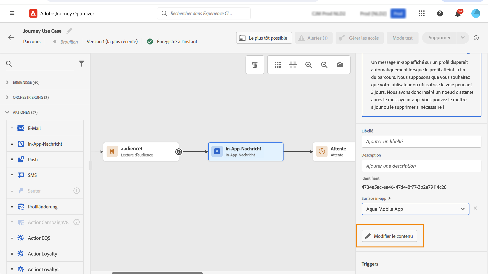
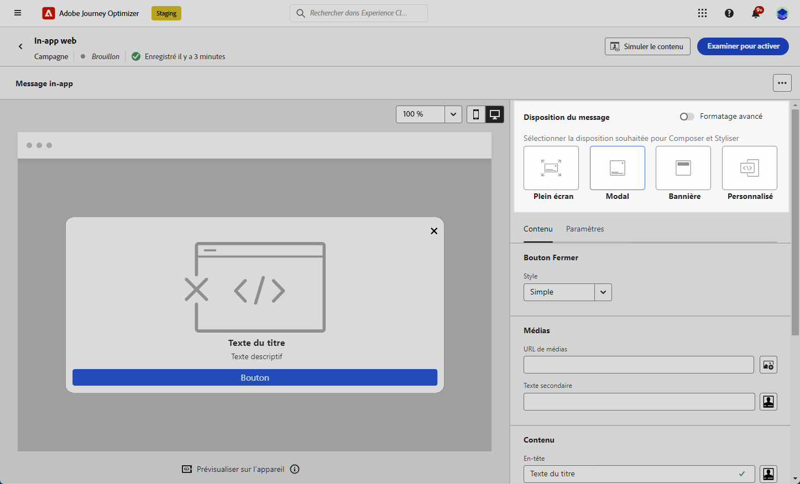
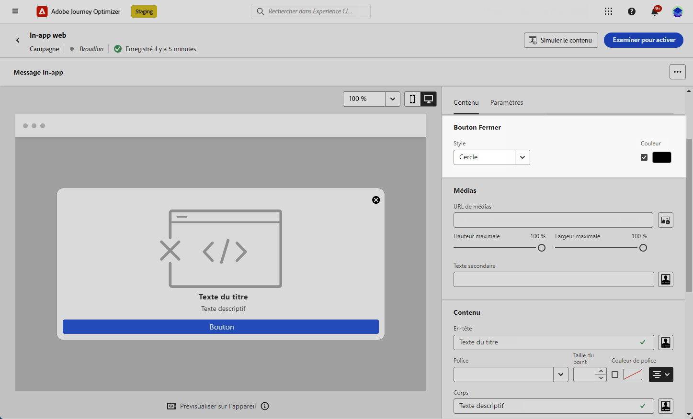
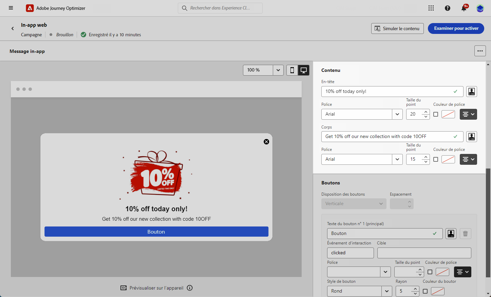
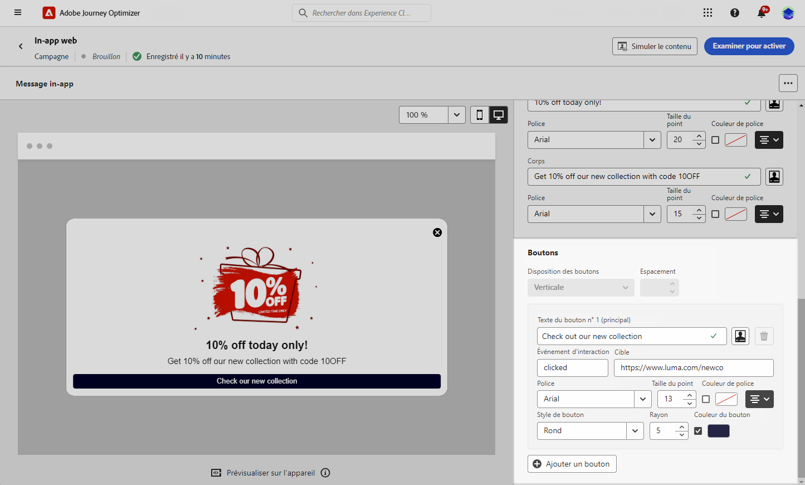
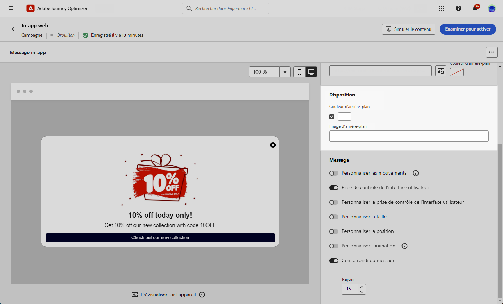
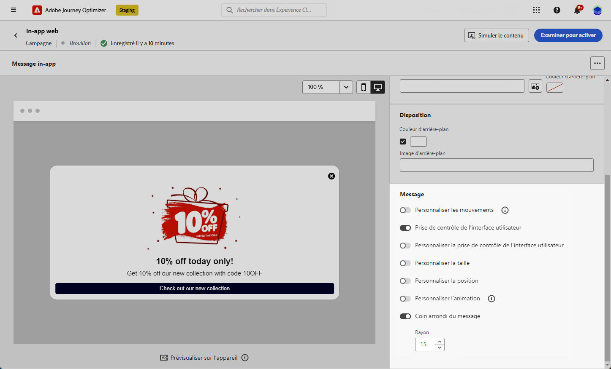

# Concevoir votre contenu in-app {#design-content}

>[!CONTEXTUALHELP]
>id="ajo_campaigns_inapp_content"
>title="Concevoir votre contenu in-app"
>abstract="Personnalisez le contenu et le style de vos messages in-app. Vous pouvez également ajouter des médias et des boutons d’action pour des messages plus attrayants et plus efficaces."

Vous pouvez modifier le contenu in-app pour configurer les options d’expérience :

* Dans une **[!UICONTROL campagne]**, à partir du menu **[!UICONTROL Action]**, cliquez sur le bouton **[!UICONTROL Modifier le contenu]** pour configurer le contenu du message.

  

* Dans un **[!UICONTROL parcours]**, dans le menu avancé de votre **[!UICONTROL action]** in-app, cliquez sur le bouton **[!UICONTROL Modifier le contenu]** pour commencer à concevoir votre contenu.

  

Le bouton **[!UICONTROL Formatage avancé]** active des options supplémentaires pour personnaliser l’expérience.

Une fois votre message in-app créé et son contenu défini et personnalisé, vous pouvez le vérifier et l’activer. Les notifications seront alors envoyées conformément au planning de la campagne. En savoir plus sur [cette page](send-in-app.md).

## Disposition des messages {#message-layout}

>[!CONTEXTUALHELP]
>id="ajo_campaigns_inapp_authoring_message_layout"
>title="Concevoir votre contenu in-app"
>abstract="La disposition du message contient les modèles couramment utilisés pour encadrer votre message. La disposition personnalisée fournit des options pour charger ou composer des messages HTML personnalisés."

Dans la section **[!UICONTROL Disposition des messages]**, sélectionnez l’une des quatre options de disposition différentes en fonction de vos besoins en matière de messagerie.

* **[!UICONTROL Plein écran]** : ce type de disposition couvre tout l’écran des appareils de votre audience.

  Elle prend en charge des composants multimédia (image, vidéo), texte et bouton.

* **[!UICONTROL Modal]** : cette disposition apparaît dans une grande fenêtre de style alerte. Votre application est toujours visible en arrière-plan.

  Elle prend en charge des composants multimédia (image, vidéo), texte et bouton.

* **[!UICONTROL Bannière]** : ce type de disposition apparaît comme message d’alerte natif du système d’exploitation.

  Vous pouvez uniquement ajouter un **[!UICONTROL En-tête]** et un **[!UICONTROL Corps]** à votre message.

* **[!UICONTROL Personnalisé]** : le mode message personnalisé permet d’importer et de modifier directement l’un de vos messages HTML préconfigurés.

   * Sélectionnez **[!UICONTROL Composer]** pour saisir ou coller votre code HTML brut.

     Utilisez le volet de gauche pour tirer parti des fonctionnalités de personnalisation de Journey Optimizer. Voir à ce propos [cette section](../personalization/personalize.md).

   * Sélectionnez **[!UICONTROL Importer]** pour importer le fichier HTML ou .zip contenant votre contenu HTML.

## Onglet Contenu {#content-tab}

Dans l’onglet **Contenu**, vous pouvez définir et personnaliser le contenu de la notification et le style du bouton **Fermer**. Vous pouvez également ajouter un média à votre notification in-app et ajouter des boutons d’action depuis cet onglet.

### Bouton Fermer {#close-button}

>[!CONTEXTUALHELP]
>id="ajo_campaigns_inapp_authoring_close"
>title="Choisissez le style de votre bouton Fermer."
>abstract="La section du bouton de fermeture vous donne la possibilité de sélectionner des variantes du bouton de fermeture du message et de charger une image personnalisée."

Choisissez le **[!UICONTROL Style]** de votre **[!UICONTROL Bouton Fermer]**.

Les styles disponibles sont les suivants :

* **[!UICONTROL Simple]**
* **[!UICONTROL Cercle]**
* **[!UICONTROL Image personnalisée]** à partir d’une URL de média ou de vos ressources.

+++Plus d’options avec formatage avancé

Si le **[!UICONTROL Mode de formatage avancé]** est activé, vous pouvez vérifier l’option **[!UICONTROL Couleur]** pour choisir la couleur et l’opacité de votre bouton.

+++

### Média {#add-media}

>[!CONTEXTUALHELP]
>id="ajo_campaigns_inapp_authoring_media"
>title="Ajoutez des médias à votre message in-app afin de créer une expérience attrayante pour l’utilisateur final ou l’utilisatrice finale."
>abstract="Fournissez un lien direct vers le contenu ou utilisez le sélecteur de ressources pour sélectionner le média dans Asset Essentials à ajouter à votre message."

Le champ **[!UICONTROL Média]** permet d’ajouter des médias à votre message in-app afin de créer une expérience attrayante pour l’utilisateur final.

Saisissez votre URL de média ou cliquez sur l’icône **[!UICONTROL Sélectionner les ressources]** pour ajouter directement des ressources stockées dans votre bibliothèque de ressources à votre message in-app. [En savoir plus sur la gestion des ressources](../integrations/assets.md).
Vous pouvez également ajouter un **[!UICONTROL Texte secondaire]** pour les applications de lecture d’écran.

+++Plus d’options avec formatage avancé

Si le **[!UICONTROL Mode de formatage avancé]** est activé, vous pouvez personnaliser la **[!UICONTROL Hauteur maximale]** et la **[!UICONTROL Largeur maximale]** de vos médias.

+++

### Contenu {#title-body}

>[!CONTEXTUALHELP]
>id="ajo_campaigns_inapp_authoring_content"
>title="Pour composer votre message, saisissez le contenu dans les champs En-tête et Corps."
>abstract="Vous pouvez ajouter un en-tête et un corps de texte ici. Pour inclure des jetons de personnalisation, ouvrez la boîte de dialogue de personnalisation."

Pour composer votre message, saisissez le contenu dans les champs **[!UICONTROL En-tête]** et **[!UICONTROL Corps]**.

Utilisez l’icône **[!UICONTROL Personnalisation]** pour ajouter de la personnalisation. En savoir plus sur la personnalisation avec l’éditeur de personnalisation d’Adobe Journey Optimizer [dans cette section](../personalization/personalize.md).

+++Plus d’options avec formatage avancé

Si le **[!UICONTROL Mode de formatage avancé]** est activé, vous pouvez choisir les éléments suivants pour votre **[!UICONTROL En-tête]** et votre **[!UICONTROL Corps]** :

* la **[!UICONTROL Police]**
* la **[!UICONTROL Taille du point]**
* la **[!UICONTROL Couleur de la police]**
* l’**[!UICONTROL Alignement]**
+++

### Boutons {#add-buttons}

>[!CONTEXTUALHELP]
>id="ajo_campaigns_inapp_authoring_buttons"
>title="Ajoutez des boutons pour que les utilisateurs et utilisatrices puissent interagir avec votre message in-app."
>abstract="Cette section vous permettra d’ajouter des boutons d’appel à l’action à votre message. Vous pouvez inclure du texte personnalisé et des cibles pour chaque bouton."

Ajoutez des boutons pour que les utilisateurs et utilisatrices puissent interagir avec votre message in-app.

Pour personnaliser votre bouton :

1. Modifiez le champ texte Bouton #1 (principal). Vous pouvez également utiliser l’icône **[!UICONTROL Personnalisation]** pour définir le contenu et les données de personnalisation.

1. Choisissez votre **[!UICONTROL Événement d’interaction]**, lequel définit l’action du bouton une fois que les utilisateurs et utilisatrices ont interagi avec celui-ci.

1. Entrez votre URL web ou votre lien profond dans le champ **[!UICONTROL Cible]**.

1. Pour ajouter plusieurs boutons, cliquez sur **[!UICONTROL Ajouter un bouton]**.

+++Plus d’options avec formatage avancé

Si le **[!UICONTROL Mode de formatage avancé]** est activé, vous pouvez choisir les éléments suivants pour vos **[!UICONTROL Boutons]** :

* la **[!UICONTROL Police]**
* la **[!UICONTROL Taille du point]**
* la **[!UICONTROL Couleur de la police]**
* l’**[!UICONTROL Alignement]**
* le **[!UICONTROL Style de bouton]**
* le **[!UICONTROL Rayon]**
* la **[!UICONTROL Couleur du bouton]**

+++

## Onglet Paramètres {#settings-tab}

Dans l’onglet **Paramètres**, vous pouvez définir la disposition du message et prévisualiser votre message in-app. Vous pouvez également accéder à des options de formatage avancé.

### Prévisualisation {#preview-tab}

>[!CONTEXTUALHELP]
>id="ajo_campaigns_inapp_authoring_preview"
>title="Prévisualisez votre message in-app."
>abstract="Il s’agit de l’image d’aperçu qui s’affiche lorsque votre message est envoyé à la synthèse de message de l’appareil."

>[!NOTE]
>
>L’aperçu n’est disponible que pour les messages mobiles in-app.

La **[!UICONTROL Prévisualisation de l’application]** vous permet d’ajouter un arrière-plan derrière votre message in-app :

* Un média provenant d’un lien URL.

* Une ressource de votre bibliothèque de ressources.

* Une couleur d’arrière-plan.

### Disposition {#layout-options}

>[!CONTEXTUALHELP]
>id="ajo_campaigns_inapp_authoring_layout"
>title="Définissez la disposition de votre message in-app."
>abstract="Cette section vous permet d’ajouter un arrière-plan à votre message in-app. Cela nécessite l’activation de la prise de contrôle de l’interface utilisateur."

Le champ **[!UICONTROL Image d’arrière-plan]** vous permet d’ajouter un arrière-plan à votre message in-app :

* Un média provenant d’un lien URL.

* Une couleur d’arrière-plan.

### Message {#message-tab}

>[!CONTEXTUALHELP]
>id="ajo_campaigns_inapp_authoring_message_advanced"
>title="Définissez les paramètres avancés du message."
>abstract="Cette section vous permet d’améliorer la personnalisation de votre contenu in-app, en particulier lorsque la fonction Formatage avancé est activée."

L’option de prise de contrôle de l’interface utilisateur, activée par défaut, vous permet d’assombrir l’arrière-plan derrière votre message in-app pour mettre l’accent sur votre contenu.

+++Plus d’options avec formatage avancé

Si le **[!UICONTROL Mode de formatage avancé]** est activé, vous pouvez personnaliser davantage votre message à l’aide des options suivantes :

* **[!UICONTROL Personnaliser les mouvements]** : vous permet de personnaliser l’interaction de balayage des utilisateurs et utilisatrices. Si l’option Ignorer est sélectionnée, vous pouvez ajouter un événement d’interaction personnalisé et/ou une destination cible.

* **[!UICONTROL Personnaliser la prise de contrôle de l’interface utilisateur]** : vous permet de sélectionner une couleur à afficher en arrière-plan et son opacité.

* **[!UICONTROL Personnaliser la taille]** : vous permet d’ajuster la largeur et la hauteur de votre notification in-app.

* **[!UICONTROL Personnaliser la position]** : vous permet de personnaliser la position de vos messages in-app sur l’écran des utilisateurs et utilisatrices. Vous pouvez modifier les alignements vertical et horizontal.

* **[!UICONTROL Personnaliser l’animation]** : vous permet de personnaliser vos animations d’affichage et d’ignorance, par exemple si votre notification in-app apparaît depuis la gauche ou la partie supérieure de l’appareil des utilisateurs et utilisatrices.

* **[!UICONTROL Coin arrondi du message]** : vous permet d’ajouter un coin arrondi à votre notification in-app en modifiant le **[!UICONTROL Rayon]**.

+++

## Onglet Données {#data-tab}

Dans l’onglet **Données**, vous pouvez définir une **[!UICONTROL Clé]** et une **[!UICONTROL Valeur]** pour inclure des variables personnalisées dans la payload. Ces paires clé/valeur vous permettent de transmettre des données supplémentaires, selon votre configuration spécifique.

Pour plus d’informations, consultez la [documentation de développement](https://developer.adobe.com/client-sdks/edge/adobe-journey-optimizer/in-app-message/tutorials/messaging-metadata/).

1. Dans l’onglet **[!UICONTROL Données]**, sélectionnez **[!UICONTROL Ajouter une paire clé/valeur]**.

   

1. Renseignez les champs **[!UICONTROL Clé]** et **[!UICONTROL Valeur]**.

   

1. Cliquez sur  pour supprimer toute paire nécessaire.

**Rubriques connexes :**

* [Créer un message in-app](create-in-app.md)
* [Rapport in-app](../reports/campaign-global-report-cja-inapp.md)
* [Configuration in-app](inapp-configuration.md)

## Vidéo pratique{#video}

La vidéo ci-dessous montre comment créer et tester vos messages in-app.

>[!VIDEO](https://video.tv.adobe.com/v/3410471?quality=12&learn=on)
