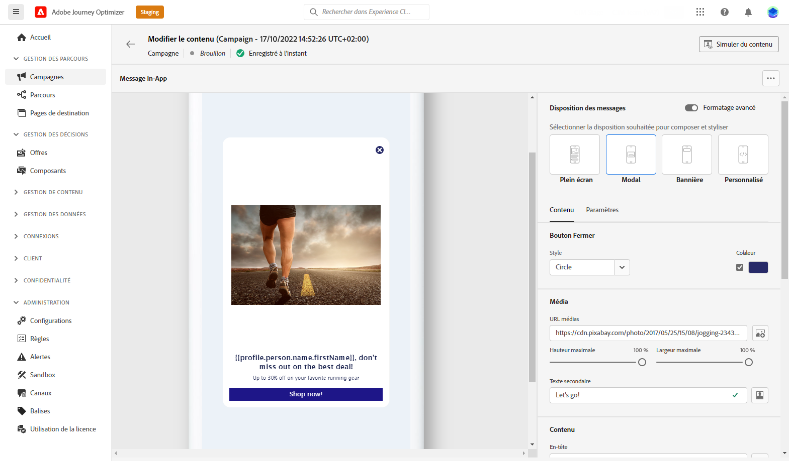

# Prise en main du canal In-App {#gs-in-app}

Les messages in-app sont des notifications que vous pouvez envoyer aux utilisateurs dans votre application pour les diriger vers des points ciblés spécifiques. Les notifications in-app peuvent être utilisées pour proposer un service, promouvoir une nouvelle fonctionnalité, une offre spéciale ou embarquer un nouvel utilisateur.

Utilisez Journey Optimizer pour créer des notifications In-App et configurer des options d’expérience, notamment la disposition et l’affichage du message, le texte et les options de bouton.

## Conditions préalables{#prerequisites-in-app}

Avant d&#39;envoyer des messages In-App, vous devez :

* Configurez le canal In-App. [En savoir plus](inapp-configuration.md)

* Assurez-vous de disposer des autorisations appropriées sur les campagnes Journey Optimizer avant de commencer. [En savoir plus](../campaigns/get-started-with-campaigns.md#campaign-prerequisites)

Une fois cette opération terminée, vous pouvez créer, configurer et envoyer votre premier message in-app. Découvrez comment y parvenir dans [cette section](create-in-app.md).

**Rubriques connexes :**

* [Créer un message in-app](create-in-app.md)
* [Concevoir un message in-app](design-in-app.md)
* [Rapport in-app](inapp-report.md)
* [Configuration In-App](inapp-configuration.md)
