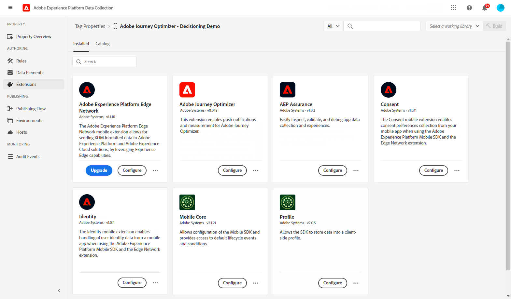

# Prérequis et configuration {#inapp-configuration}

## Étapes de configuration {#inapp-steps}

Pour envoyer des messages In-App dans vos parcours et campagnes avec [!DNL Journey Optimizer], vous devez suivre les étapes de configuration suivantes.

1. Assurez-vous de disposer des autorisations appropriées sur les campagnes Journey Optimizer avant de commencer, même si vous prévoyez d’utiliser uniquement les messages in-app dans des parcours. Les autorisations de Campaign sont toujours requises. [En savoir plus](../campaigns/get-started-with-campaigns.md#campaign-prerequisites).
Une autorisation spécifique doit être accordée pour accéder à la variable **Surfaces de l’application** dans la collecte de données Adobe Experience Platform. En savoir plus dans [cette vidéo](#video).
1. Activez Adobe Journey Optimizer dans votre flux de données de collecte de données Adobe Experience Platform et vérifiez votre stratégie de fusion par défaut dans Adobe Experience Platform, comme indiqué dans la section [Prérequis de diffusion](#delivery-prerequisites) ci-dessous
1. Créez et configurez une surface d’application dans la collecte de données Adobe Experience Platform, comme décrit dans la section [cette section](#channel-prerequisites).
1. Si vous utilisez des expériences de contenu, veillez à respecter les exigences répertoriées dans la section [cette section](#experiment-prerequisite).

Une fois cette opération terminée, vous pouvez créer, configurer et envoyer votre premier message in-app. Découvrez comment accomplir cela dans [cette section](create-in-app.md).

## Conditions préalables à la diffusion {#delivery-prerequisites}

Pour que les messages in-app soit correctement diffusés, les paramètres suivants doivent être définis :

* Dans la [Collecte de données Adobe Experience Platform](https://experienceleague.adobe.com/docs/experience-platform/edge/datastreams/overview.html?lang=fr){target="_blank"}, assurez-vous qu’un train de données est défini, de telle sorte que sous le service **[!UICONTROL Adobe Experience Platform]**, les options Adobe Experience Platform Edge et **[!UICONTROL Adobe Journey Optimizer]** soient activées.

  Cela permet de s’assurer que les événements entrants Journey Optimizer sont correctement gérés par Adobe Experience Platform Edge. [En savoir plus](https://experienceleague.adobe.com/docs/experience-platform/edge/datastreams/configure.html?lang=fr){target="_blank"}.

  

* Dans [Adobe Experience Platform](https://experienceleague.adobe.com/docs/experience-platform/profile/home.html?lang=fr){target="_blank"}, make sure you have the default merge policy with the **[!UICONTROL Active-On-Edge Merge Policy]** option enabled. To do this, select a policy under the **[!UICONTROL Customer]** > **[!UICONTROL Profiles]** > **[!UICONTROL Merge Policies]** Experience Platform menu. [Learn more](https://experienceleague.adobe.com/docs/experience-platform/profile/merge-policies/ui-guide.html?lang=fr#configure){target="_blank"}

  Cette politique de fusion est utilisée par les canaux entrants [!DNL Journey Optimizer] pour activer et publier correctement les campagnes entrantes sur Edge. [En savoir plus](https://experienceleague.adobe.com/docs/experience-platform/profile/merge-policies/ui-guide.html?lang=fr){target="_blank"}.

  >[!NOTE]
  >
  >Lors de l’utilisation d’une politique de fusion personnalisée **[!UICONTROL Préférence de jeu de données]**, veillez à ajouter le jeu de données **[!UICONTROL Parcours entrant]** dans la politique de fusion spécifiée.

  

## Conditions préalables à la configuration des canaux {#channel-prerequisites}

1. Accédez au menu **[!UICONTROL Surfaces d’application]** et cliquez sur **[!UICONTROL Créer une surface d’application]**.

1. Ajoutez un nom à votre **[!UICONTROL Surface d’application]**.

   

1. Dans la liste déroulante **[!UICONTROL Apple iOS]**, configurez votre application mobile pour Apple iOS.

+++ En savoir plus

   1. Saisissez votre **[!UICONTROL ID de bundle iOS]**. Voir la [Documentation Apple](https://developer.apple.com/documentation/appstoreconnectapi/bundle_ids) pour plus d’informations sur l’**ID de bundle**.

   1. (Facultatif) Choisissez la **[!UICONTROL Sandbox]** d’où vous souhaitez envoyer des notifications push. Notez que le choix d’une sandbox spécifique nécessite les autorisations d’accès nécessaires.

      Pour plus d’informations sur la gestion des sandbox, consultez [cette page](../administration/sandboxes.md#assign-sandboxes).

   1. Activez l’option **[!UICONTROL Informations d’identification push]** pour faire glisser et déposer votre fichier de clé d’authentification .p8 si nécessaire.

      Vous pouvez également activer l’option **[!UICONTROL Saisie manuelle des informations d’identification push]** pour copier et coller directement votre clé d’authentification APNS.

   1. Saisissez votre **[!UICONTROL Identifiant de clé]** et votre **[!UICONTROL Identifiant d’équipe]**.

      

+++

1. Dans la liste déroulante **[!UICONTROL Android]**, configurez votre application mobile pour Android.

+++ En savoir plus

   1. Saisissez le **[!UICONTROL Nom du package Android]**. Voir la [Documentation Android](https://support.google.com/admob/answer/9972781?hl=en#:~:text=The%20package%20name%20of%20an,supported%20third%2Dparty%20Android%20stores) pour plus d’informations sur le **nom du package**.

   1. (Facultatif) Choisissez la **[!UICONTROL Sandbox]** d’où vous souhaitez envoyer des notifications push. Notez que le choix d’une sandbox spécifique nécessite les autorisations d’accès nécessaires.

      Pour plus d’informations sur la gestion des sandbox, consultez [cette page](../administration/sandboxes.md#assign-sandboxes).

   1. Activez l’option **[!UICONTROL Informations d’identification push]** pour faire glisser et déposer votre fichier de clé privée .json si nécessaire.

      Vous pouvez également activer l’option **[!UICONTROL Saisie manuelle des informations d’identification push]** pour copier et coller directement votre clé privée FCM.

      

1. Cliquez sur **[!UICONTROL Enregistrer]** lorsque vous avez terminé la configuration de votre **[!UICONTROL Surface d’application]**.

   

   Votre **[!UICONTROL Surface d’application]** sera désormais disponible lors de la création d’une nouvelle campagne avec un message in-app. [En savoir plus](create-in-app.md)

1. Après avoir créé votre surface d’application, vous devez maintenant créer une propriété mobile.

   Voir [cette page](https://experienceleague.adobe.com/docs/experience-platform/tags/admin/companies-and-properties.html?lang=fr) pour la procédure détaillée.

   

1. Dans le menu Extensions de la propriété que vous venez de créer, installez les extensions suivantes :

   * Adobe Experience Platform Edge Network
   * Adobe Journey Optimizer
   * Assurance AEP
   * Consentement
   * Identité
   * Mobile Core
   * Profile

   Voir [cette page](https://experienceleague.adobe.com/docs/experience-platform/tags/ui/extensions/overview.html?lang=fr#add-a-new-extension) pour la procédure détaillée.

   

Le canal in-app est maintenant configuré. Vous pouvez commencer à envoyer des messages in-app à vos utilisateurs.

## Conditions préalables à l’expérience de contenu {#experiment-prerequisites}

Pour activer les expériences de contenu pour le canal in-app, vous devez vous assurer que le [jeu de données](../data/get-started-datasets.md) utilisé dans le [train de données](https://experienceleague.adobe.com/docs/experience-platform/datastreams/overview.html?lang=fr){target="_blank"} de votre implémentation in-app est également inclus dans la configuration des rapports.

En d’autres termes, lors de la configuration des rapports d’expérience, si vous ajoutez un jeu de données qui n’est pas présent dans votre train de données web, les données web ne s’afficheront pas dans les rapports d’expérience de contenu.

Découvrez comment ajouter des jeux de données pour les rapports d’expérience de contenu dans [cette section](../campaigns/reporting-configuration.md#add-datasets).

>[!NOTE]
>
>Le jeu de données est utilisé en lecture seule par le système de création de rapports de [!DNL Journey Optimizer] et n’affecte pas la collecte ni l’ingestion de données.

Si vous n’utilisez **pas** les [groupes de champs](https://experienceleague.adobe.com/docs/experience-platform/xdm/tutorials/create-schema-ui.html?lang=fr#field-group){target="_blank"} for your dataset schema: `AEP Web SDK ExperienceEvent` and `Consumer Experience Event` (as defined in [this page](https://experienceleague.adobe.com/docs/platform-learn/implement-web-sdk/initial-configuration/configure-schemas.html?lang=fr#add-field-groups){target="_blank"} prédéfinis suivants, assurez-vous d’ajouter les groupes de champs suivants : `Experience Event - Proposition Interactions`, `Application Details`, `Commerce Details` et `Web Details`. Ils participent à la création de rapports d’expérience de contenu de [!DNL Journey Optimizer], car ils effectuent le suivi des expériences et des traitements auxquels chaque profil participe.

>[!NOTE]
>
>L’ajout de ces groupes de champs n’a aucune incidence sur la collecte de données standard. Seules les pages où une expérience est en cours d’exécution sont concernées. Les autres éléments de suivi restent inchangés.

## Vidéo pratique{#video}

La vidéo ci-dessous montre comment attribuer l’autorisation **Gérer la configuration de l’application** pour accéder au menu Surfaces de l’application.

>[!VIDEO](https://video.tv.adobe.com/v/3421607)

**Rubriques connexes :**

* [Créer un message in-app](create-in-app.md)
* [Création d’une campagne](../campaigns/create-campaign.md)
* [Concevoir un message in-app](design-in-app.md)
* [Rapport in-app](../reports/campaign-global-report.md#inapp-report)

