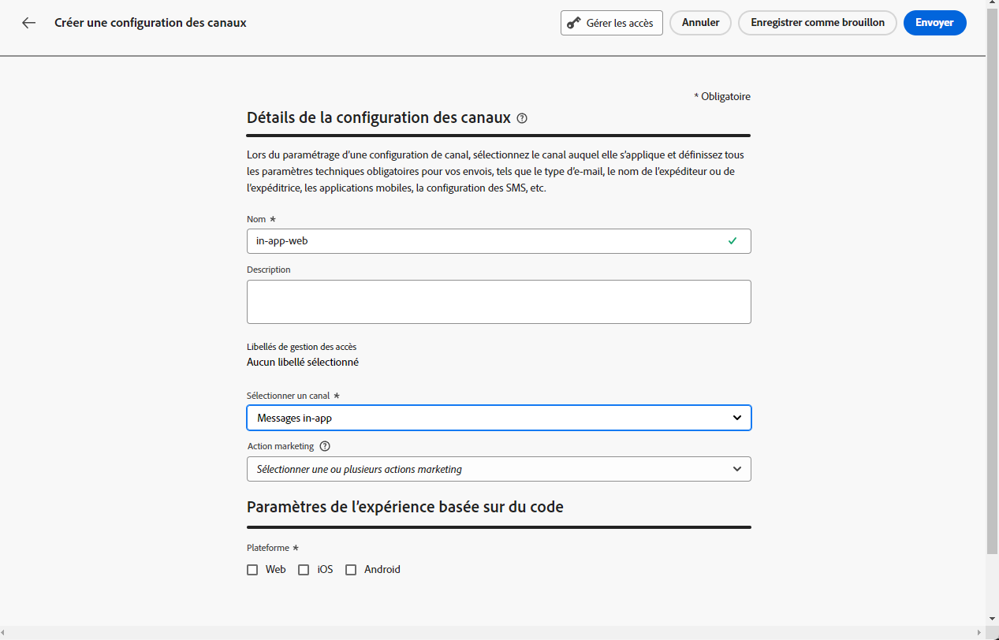
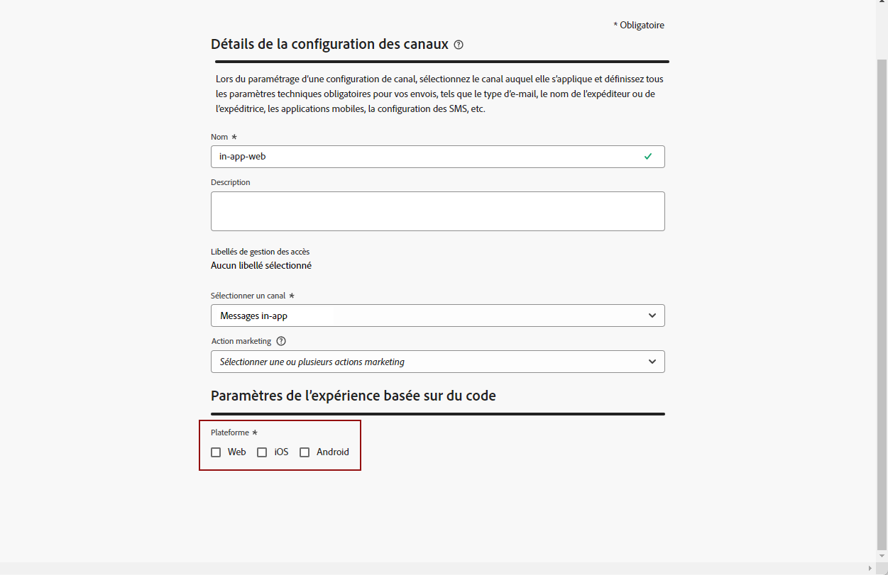

# Conditions préalables et configuration {#inapp-configuration}

## Étapes de configuration {#inapp-steps}

Pour envoyer des messages in-app dans vos parcours et campagnes avec [!DNL Journey Optimizer], vous devez suivre les étapes de configuration suivantes.

1. Assurez-vous de disposer des autorisations appropriées sur les campagnes Journey Optimizer avant de commencer, même si vous prévoyez d’utiliser uniquement les messages in-app dans des parcours. Les autorisations de Campaign sont toujours requises. [En savoir plus](../campaigns/get-started-with-campaigns.md#prerequisites).
1. Activez Adobe Journey Optimizer dans votre train de données de collecte de données Adobe Experience Platform et vérifiez votre politique de fusion par défaut dans Adobe Experience Platform, comme indiqué dans la section [Conditions préalables à la diffusion](#delivery-prerequisites) ci-dessous.
1. Créez une configuration de canal des messages in-app dans Administration > Canaux > Configurations de canal, comme décrit dans [cette section](#channel-prerequisites).
1. Si vous utilisez des expériences de contenu, veillez à respecter les exigences répertoriées dans [cette section](#experiment-prerequisite).

Une fois cette opération terminée, vous pouvez créer, configurer et envoyer votre premier message in-app. Découvrez comment accomplir cela dans [cette section](create-in-app.md).

>[!CAUTION]
>
>Lors du ciblage de profils pseudonymes (visiteurs non authentifiés) avec vos messages in-app, pensez à définir une durée de vie (TTL) pour la suppression automatique des profils afin de gérer le nombre de profils engageables et les coûts associés. [En savoir plus](../start/guardrails.md#profile-management-inbound)

## Conditions préalables à la diffusion {#delivery-prerequisites}

Pour que les messages in-app soit correctement diffusés, les paramètres suivants doivent être définis :

* Dans la [collecte de données Adobe Experience Platform](https://experienceleague.adobe.com/docs/experience-platform/edge/datastreams/overview.html?lang=fr){target="_blank"}, assurez-vous qu’un train de données est défini, de telle sorte que sous le service **[!UICONTROL Adobe Experience Platform]**, les options Adobe Experience Platform Edge et **[!UICONTROL Adobe Journey Optimizer]** soient activées.

  Cela permet de s’assurer que les événements entrants Journey Optimizer sont correctement gérés par Adobe Experience Platform Edge. [En savoir plus](https://experienceleague.adobe.com/docs/experience-platform/edge/datastreams/configure.html?lang=fr){target="_blank"}

  >[!NOTE]
  >
  >L’utilisation des attributs `context.datastream` est actuellement prise en charge uniquement pour les campagnes de canal web dans Journey Optimizer. Toute tentative d’utilisation de `context.datastream` dans les messages in-app entraînera des erreurs de validation telles que `Invalid syntax Missing schema field: 'datastream`.

  

* Dans [Adobe Experience Platform](https://experienceleague.adobe.com/docs/experience-platform/profile/home.html?lang=fr){target="_blank"}, assurez-vous d’avoir activé la politique de fusion par défaut avec l’option **[!UICONTROL Politique de fusion Active-On-Edge]**. Pour ce faire, sélectionnez une politique dans le menu Experience Platform **[!UICONTROL Client ou cliente]** > **[!UICONTROL Profils]** > **[!UICONTROL Politiques de fusion]**. [En savoir plus](https://experienceleague.adobe.com/docs/experience-platform/profile/merge-policies/ui-guide.html?lang=fr#configure){target="_blank"}

  Cette politique de fusion est utilisée par les canaux entrants [!DNL Journey Optimizer] pour activer et publier correctement les campagnes entrantes sur Edge. [En savoir plus](https://experienceleague.adobe.com/docs/experience-platform/profile/merge-policies/ui-guide.html?lang=fr){target="_blank"}

  >[!NOTE]
  >
  >Lors de l’utilisation d’une politique de fusion personnalisée **[!UICONTROL Préférence de jeu de données]**, veillez à ajouter le jeu de données **[!UICONTROL Parcours entrant]** dans la politique de fusion spécifiée.

  

* Pour résoudre les problèmes liés à la diffusion d’expériences mobiles Journey Optimizer, vous pouvez utiliser la vue **Edge Delivery** dans **Adobe Experience Platform Assurance**. Ce plug-in vous permet de regarder en détail les appels de requête, de vérifier si les appels Edge attendus se produisent comme prévu et d’examiner les données de profil, notamment les mappages d’identités, les appartenances à des segments et les paramètres de consentement. En outre, vous pouvez consulter les activités pour lesquelles la requête a rempli les critères et identifier celles pour lesquelles elle ne l’a pas fait.

  L’utilisation du plug-in **Edge Delivery** vous aide à obtenir les informations nécessaires pour comprendre vos implémentations entrantes et résoudre leurs problèmes efficacement.

  [En savoir plus sur la vue Edge Delivery](https://experienceleague.adobe.com/fr/docs/experience-platform/assurance/view/edge-delivery){target="_blank"}

## Créer une configuration in-app {#channel-prerequisites}

Pour créer une configuration in-app dans Journey Optimizer, procédez comme suit :

1. Accédez au menu **[!UICONTROL Canaux]** > **[!UICONTROL Paramètres généraux]** > **[!UICONTROL Configurations des canaux]**, puis cliquez sur **[!UICONTROL Créer une configuration des canaux]**.

   

1. Saisissez un nom et une description (facultatif) pour la configuration, puis sélectionnez le canal à configurer.

   >[!NOTE]
   >
   > Les noms doivent commencer par une lettre (A-Z). Ils ne peuvent contenir que des caractères alphanumériques. Vous pouvez également utiliser le trait de soulignement `_`, le point`.` et le trait d&#39;union `-`.

1. Pour attribuer des libellés d’utilisation des données personnalisés ou de base à la configuration, vous pouvez sélectionner **[!UICONTROL Gérer l’accès]**. [En savoir plus sur le contrôle d’accès au niveau de l’objet (OLAC)](../administration/object-based-access.md)

1. Sélectionnez une **[!UICONTROL Action marketing]** ou plusieurs pour associer des politiques de consentement aux messages utilisant cette configuration. Toutes les politiques de consentement associées à cette action marketing sont utilisées afin de respecter les préférences de vos clientes et clients. [En savoir plus](../action/consent.md#surface-marketing-actions)

1. Sélectionnez le canal **Messagerie in-app**.

   

1. Sélectionnez la plateforme pour laquelle définir les paramètres. Vous pouvez ainsi spécifier l’application cible pour chaque plateforme et assurer la cohérence de la diffusion du contenu sur plusieurs plateformes.

   >[!NOTE]
   >
   >Pour les plateformes iOS et Android, la diffusion se base uniquement sur l’ID d’application. Si les deux applications possèdent le même ID d’application, le contenu sera diffusé sur les deux, quelle que soit la plateforme sélectionnée dans la **[!UICONTROL configuration des canaux]**.
   >Pour restreindre la diffusion des messages in-app à une plateforme spécifique, vous devez implémenter des règles spécifiques à l’appareil dans la logique de votre parcours ou de votre campagne.

   

1. Pour le web :

   * Vous pouvez saisir une **[!UICONTROL URL de page]** pour appliquer des modifications à une page spécifique.

   * Vous pouvez créer une règle pour cibler plusieurs URL qui suivent le même motif.

     +++ Création d’une règle de correspondance de pages.

      1. Sélectionnez **[!UICONTROL Règle de correspondance des pages]** comme configuration de l’application et saisissez votre **[!UICONTROL URL de page]**.

      1. Dans la fenêtre **[!UICONTROL Modifier la règle de configuration]**, définissez vos critères pour les champs **[!UICONTROL Domaine]** et **[!UICONTROL Page]**.
      1. Dans les listes déroulantes des conditions, personnalisez davantage vos critères.

         Par exemple, si vous souhaitez modifier ici des éléments qui s’affichent sur toutes les pages des produits en soldes de votre site web Luma, sélectionnez Domaine > Commence par > luma et Page > Contient > soldes.

         

      1. Cliquez sur **[!UICONTROL Ajouter une autre règle de page]** pour créer une autre règle si nécessaire.

      1. Sélectionnez l’**[!UICONTROL URL de création et de prévisualisation par défaut]**.

      1. Enregistrez vos modifications. La règle s’affiche dans l’écran **[!UICONTROL Créer une campagne]**.

     +++

1. Pour iOS et Android :

   * Saisissez votre **[!UICONTROL ID d’application]**.

1. Soumettez vos modifications.

Vous pouvez maintenant sélectionner votre configuration lors de la création de votre message in-app.

## Conditions préalables des rapports {#experiment-prerequisites}

>[!NOTE]
>
>Le jeu de données est utilisé en lecture seule par le système de création de rapports de [!DNL Journey Optimizer] et n’a aucune incidence sur la collecte ou l’ingestion de données.

Pour activer les rapports pour le canal in-app, vous devez vous assurer que le [jeu de données](../data/get-started-datasets.md) utilisé dans le [train de données](https://experienceleague.adobe.com/docs/experience-platform/datastreams/overview.html?lang=fr){target="_blank"} de votre implémentation in-app est également inclus dans la configuration des rapports. En d’autres termes, lors de la configuration des rapports, si vous ajoutez un jeu de données qui n’est pas présent dans le train de données de votre application, les données de l’application ne s’afficheront pas dans vos rapports. Découvrez comment ajouter des jeux de données pour les rapports dans [cette section](../reports/reporting-configuration.md#add-datasets).

Si vous **n’utilisez pas** les [groupes de champs](https://experienceleague.adobe.com/docs/experience-platform/xdm/tutorials/create-schema-ui.html?lang=fr#field-group){target="_blank"} prédéfinis suivants pour le schéma de votre jeu de données : `AEP Web SDK ExperienceEvent` et `Consumer Experience Event` (tels que définis sur [cette page](https://experienceleague.adobe.com/docs/platform-learn/implement-web-sdk/initial-configuration/configure-schemas.html?lang=fr#add-field-groups){target="_blank"}), assurez-vous d’ajouter les groupes de champs suivants : `Experience Event - Proposition Interactions`, `Application Details`, `Commerce Details` et `Web Details`. Ceux-ci sont nécessaires pour la création de rapports [!DNL Journey Optimizer], car ils effectuent le suivi des campagnes et des parcours auxquels chaque profil participe.

[En savoir plus sur la configuration des rapports](../reports/reporting-configuration.md)

>[!NOTE]
>
>L’ajout de ces groupes de champs n’a aucune incidence sur la collecte de données standard. Seules les pages où une campagne ou un parcours est en cours d’exécution sont concernées. Les autres éléments de suivi restent inchangés.

**Rubriques connexes :**

* [Créer un message in-app](create-in-app.md)
* [Création d’une campagne](../campaigns/create-campaign.md)
* [Concevoir un message in-app](design-in-app.md)
* [Rapport in-app](../reports/campaign-global-report-cja-inapp.md)

