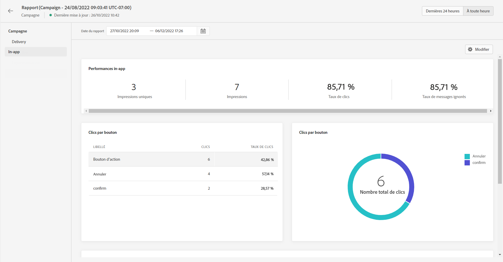

# Rapport in-app {#inapp-report}

Le rapport in-app est disponible dans le rapport de campagne.

La page Rapport de la campagne s’affiche avec les onglets suivants :

* [Campagne](../reports/campaign-global-report.md#campaign-live)
* [E-mail](../reports/campaign-global-report.md#email-live)
* [Push](../reports/campaign-global-report.md#push-live)
* [SMS](../reports/campaign-global-report.md#sms-live)
* [In-app](#in-app-global)

Le **[!UICONTROL Rapport global]** de campagne est divisé en différents widgets présentant le succès et les erreurs de votre campagne. Chaque widget peut être redimensionné et supprimé si nécessaire. Pour plus d&#39;informations à ce propos, consultez cette [section](../reports/global-report.md#modify-dashboard).

Pour obtenir la liste détaillée de chaque mesure disponible dans Adobe Journey Optimizer, reportez-vous à [cette page](../reports/global-report.md#list-of-components-global.md).

## Onglet in-app {#inapp-global}

Dans le **[!UICONTROL Rapport global]** de campagne, l’onglet **[!UICONTROL In-app]** détaille les principales informations relatives aux diffusions in-app envoyées dans votre campagne.

+++En savoir plus sur les différents widgets et mesures disponibles pour le rapport in-app.

Les KPI **[!UICONTROL Performances in-app]** détaillent les informations principales relatives à l’engagement des visiteurs avec vos messages in-app, telles que :

* **[!UICONTROL Impressions uniques]** : nombre d’utilisateurs uniques auxquels le message in-app a été délivré.

* **[!UICONTROL Impressions]** : nombre total de messages in-app diffusés à tous les utilisateurs.

* **[!UICONTROL Taux de clics]** : pourcentage d&#39;utilisateurs ayant interagi avec les boutons inclus dans le message in-app par rapport au nombre d’utilisateurs ayant vu le message.

* **[!UICONTROL Taux d’ignorance]** : pourcentage de messages in-app ignorés par les destinataires.

Le graphique du **[!UICONTROL Résumé in-app]** présente l’évolution de vos impressions in-app pour la période concernée.

Le graphique et le tableau **[!UICONTROL Clics par bouton]** contiennent les données disponibles pour le comportement des destinataires par bouton :

* **[!UICONTROL Clics]** : nombre total de destinataires ayant interagi avec les boutons inclus dans le message in-app.

* **[!UICONTROL Taux de clics]** : pourcentage d’utilisateurs ayant interagi avec les boutons inclus dans le message in-app par rapport au nombre d’utilisateurs ayant vu le message.
+++

**Rubriques connexes :**

* [Créer un message in-app](../in-app/create-in-app.md)
* [Concevoir un message in-app](../in-app/design-in-app.md)
* [Configuration in-app](../in-app/inapp-configuration.md)

>[!BEGINTABS]

>[!TAB Ajout d’une notification push à un Parcours]

1. Ouvrez votre parcours, puis faites glisser et déposez une activité Push depuis la section Actions de la palette.

1. Fournissez des informations de base sur votre message (libellé, description, catégorie), puis choisissez la surface du message à utiliser.

>[!TAB Ajout d’une notification push à une campagne]

1. Créez une campagne planifiée ou déclenchée par une API, sélectionnez **[!UICONTROL Notification push]** comme action et choisissez la variable **[!UICONTROL Surface de l’application]** à utiliser.

1. Cliquez sur **[!UICONTROL Créer]**.

1. Dans la section **[!UICONTROL Propriétés]**, modifiez le **[!UICONTROL Titre]** et la **[!UICONTROL Description]** de votre campagne.

1. Cliquez sur le bouton **[!UICONTROL Sélectionner une audience]** pour définir l’audience à cibler à partir de la liste des segments Adobe Experience Platform disponibles.

1. Dans le champ **[!UICONTROL Espace de noms d’identité]**, choisissez l’espace de noms à utiliser pour identifier les personnes à partir du segment sélectionné.

1. Les campagnes sont conçues pour être exécutées à une date spécifique ou à une fréquence récurrente. Découvrez comment configurer le **[!UICONTROL Planification]** de votre campagne.

1. Dans la **[!UICONTROL Déclencheurs d’action]** , choisissez la variable **[!UICONTROL Fréquence]** de votre notification push :

   * Une fois
   * Quotidien
   * Hebdomadaire
   * Mensuel

>[!ENDTABS]

Test 2 :

1. Il sʼagit dʼune test.

>[!BEGINTABS]

>[!TAB Ajout d’une notification push à un Parcours]

    1. Ouvrez votre parcours, puis faites glisser et déposez une activité Push depuis la section Actions de la palette.
    
    1. Fournissez des informations de base sur votre message (libellé, description, catégorie), puis choisissez la surface du message à utiliser.

>[!TAB Ajout d’une notification push à une campagne]

    1. Créez une campagne planifiée ou déclenchée par une API, sélectionnez **[!UICONTROL Notification push]** comme action et choisissez la **[!UICONTROL Surface de l’application]** à utiliser.
    
    1. Cliquez sur **[!UICONTROL Créer]**.
    
    1. De la **[!UICONTROL Propriétés]** section, modifiez la ** de votre campagne[!UICONTROL Titre]** et **[!UICONTROL Description]**.
    
    1. Cliquez sur le **[!UICONTROL Sélection de l’audience]Bouton ** pour définir l’audience à cibler dans la liste des segments Adobe Experience Platform disponibles.
    
    1. Dans le **[!UICONTROL Espace de noms d’identité]**, choisissez l’espace de noms à utiliser pour identifier les individus du segment sélectionné.
    
    1. Les campagnes sont conçues pour être exécutées à une date spécifique ou à une fréquence récurrente. Découvrez comment configurer le **[!UICONTROL Planification]** de votre campagne.
    
    1. De la **[!UICONTROL Déclencheurs d’action]** menu, choisissez la **[!UICONTROL Fréquence]** de votre notification push :
    
    * Une fois
    * Quotidien
    * Hebdomadaire
    * Mensuel

>[!ENDTABS]

1. Cela fait partie du test.
