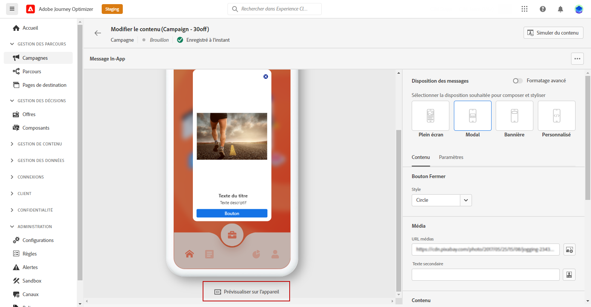
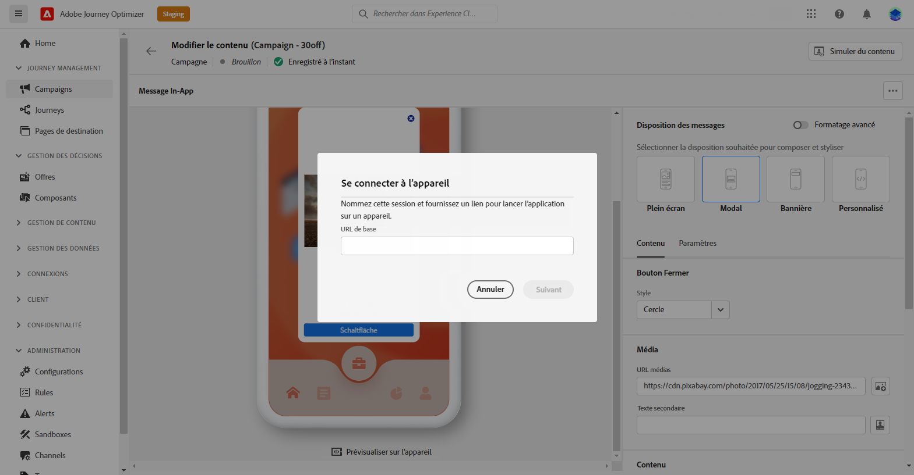

# Vérifier et envoyer votre notification in-app {#create-in-app}

## Aperçu sur l’appareil {#preview-device}

Vous pouvez prévisualiser la notification in-app sur un appareil spécifique avant qu’elle ne soit activée pour l’ensemble des utilisateurs et utilisatrices. Cette fonctionnalité garantit que la notification s’affiche et fonctionne comme prévu sur l’appareil choisi, offrant ainsi une meilleure expérience client à votre audience.

Pour ce faire, suivez les étapes ci-après :

1. Cliquez sur **[!UICONTROL Aperçu sur l’appareil]**.

   

1. Dans la fenêtre **[!UICONTROL Connexion à l’appareil]**, cliquez sur **[!UICONTROL Commencer]**.

1. Saisissez l’**[!UICONTROL URL de base]** de votre application, puis cliquez sur **[!UICONTROL Suivant]**.

   

1. Scannez le code QR avec votre appareil et saisissez le code PIN affiché.

Votre message in-app peut maintenant être déclenché directement sur votre appareil, ce qui vous permet de prévisualiser et de vérifier votre message sur un appareil réel.

## Prévisualiser avec les profils de test {#simulate}

Une fois le contenu du message in-app défini, prévisualisez-le et testez-le à l’aide de profils de test. Si vous avez inséré du contenu personnalisé, vous pouvez vérifier l’affichage de celui-ci dans le message à l’aide des données de profil de test.

Pour ce faire, cliquez sur **[!UICONTROL Simuler du contenu]**, puis ajoutez un profil de test pour vérifier votre message à l’aide des données de profil de test.

Vous trouverez des informations détaillées sur la sélection des profils de test et la prévisualisation de votre contenu dans la section [Gestion de contenu](../content-management/preview-test.md).

## Vérifier et activer votre notification in-app{#in-app-review}

>[!IMPORTANT]
>
>À compter de la version de septembre, une nouvelle expérience d’activation de campagne et de parcours vous permet de gérer l’ensemble du processus d’approbation, en veillant à ce que les campagnes et les parcours soient minutieusement examinés et approuvés par les parties prenantes appropriées avant de passer en ligne. Cette fonctionnalité est disponible en disponibilité limitée. [En savoir plus](../test-approve/gs-approval.md)

Une fois votre message in-app créé et son contenu défini et personnalisé, vous pouvez le vérifier et l’activer.

Pour ce faire, suivez les étapes ci-après :

1. Utilisez le bouton **[!UICONTROL Examiner pour activer]** pour afficher un résumé de votre message.

   Le résumé vous permet de modifier votre campagne si nécessaire et de vérifier si un paramètre est incorrect ou manquant.

   

1. Vérifiez que votre campagne est correctement configurée, puis cliquez sur **[!UICONTROL Activer]**.

Votre campagne est maintenant activée. La notification in-app configurée dans la campagne est envoyée immédiatement ou le sera à la date indiquée.

Une fois votre message in-app envoyé, vous pouvez en mesurer l’impact dans les rapports Campaign ou Journey. Pour plus d’informations sur les rapports, consultez [cette section](../reports/campaign-global-report.md#inapp-report).

**Rubriques connexes :**

* [Créer un message in-app](create-in-app.md)
* [Concevoir un message in-app](design-in-app.md)
* [Rapport in-app](../reports/campaign-global-report.md#inapp-report)
* [Configuration in-app](inapp-configuration.md)
