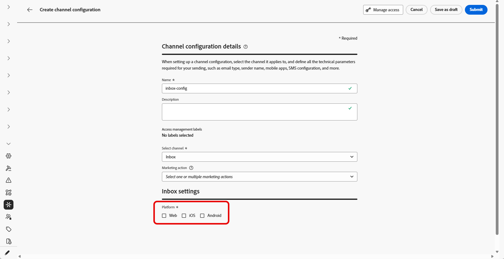

# Configurer la boîte de réception {#inbox-configuration}

Avant de pouvoir diffuser des expériences de carte de contenu par le biais de la boîte de réception, vous devez définir une configuration de canal **boîte de réception** dans **[!UICONTROL configurations de canal]**. Cette configuration associe la surface au consentement, aux libellés d’accès facultatifs et à l’emplacement où l’expérience apparaît sur le web ou dans votre application iOS ou Android. Pour créer une configuration, procédez comme suit :

1. Accédez au menu **[!UICONTROL Canaux]** > **[!UICONTROL Paramètres généraux]** > **[!UICONTROL Configurations des canaux]**, puis cliquez sur **[!UICONTROL Créer une configuration des canaux]**.

   

1. Saisissez un nom et une description (facultatif) pour la configuration.

   >[!NOTE]
   >
   > Les noms doivent commencer par une lettre (A-Z). Ils ne peuvent contenir que des caractères alphanumériques. Vous pouvez également utiliser le trait de soulignement `_`, le point`.` et le trait d&#39;union `-`.

1. Pour attribuer des libellés d’utilisation des données personnalisés ou de base à la configuration, vous pouvez sélectionner **[!UICONTROL Gérer l’accès]**. [En savoir plus sur le contrôle d’accès au niveau de l’objet (OLAC)](../administration/object-based-access.md)

1. Sélectionnez le canal **[!UICONTROL Boîte de réception]**.

   

1. Sélectionnez une **[!UICONTROL Action marketing]** ou plusieurs pour associer des politiques de consentement aux messages utilisant cette configuration. Toutes les politiques de consentement associées à cette action marketing sont utilisées afin de respecter les préférences de vos clientes et clients. [En savoir plus](../action/consent.md#surface-marketing-actions)

1. Sélectionnez la plateforme sur laquelle l’expérience de la boîte de réception sera appliquée.

   

1. Pour le web :

   * Dans **[!UICONTROL URL de la page]**, saisissez ou sélectionnez l’URL de la page sur laquelle la boîte de réception doit apparaître. Utilisez cette option lorsque l’expérience est limitée à une page.

   * Dans **[!UICONTROL Emplacement sur la page]**, définissez l’emplacement sur la page, par exemple la région ou l’identifiant que votre site utilise pour la surface de la boîte de réception. [En savoir plus](../web/web-configuration.md)

     

1. Pour iOS et Android :

   * Dans **[!UICONTROL ID de l’application]**, saisissez ou sélectionnez l’identifiant de votre application afin que la configuration s’applique à la version iOS ou Android appropriée.

   * Dans **[!UICONTROL Emplacement ou chemin d’accès dans l’application]**, spécifiez l’écran, l’itinéraire ou le conteneur dans lequel les utilisateurs doivent ouvrir la boîte de réception.

1. Soumettez vos modifications.

Vous pouvez désormais sélectionner votre configuration lors de la création de votre expérience de boîte de réception.

➡️[Suivez les étapes décrites dans cette page](inbox-create.md)
