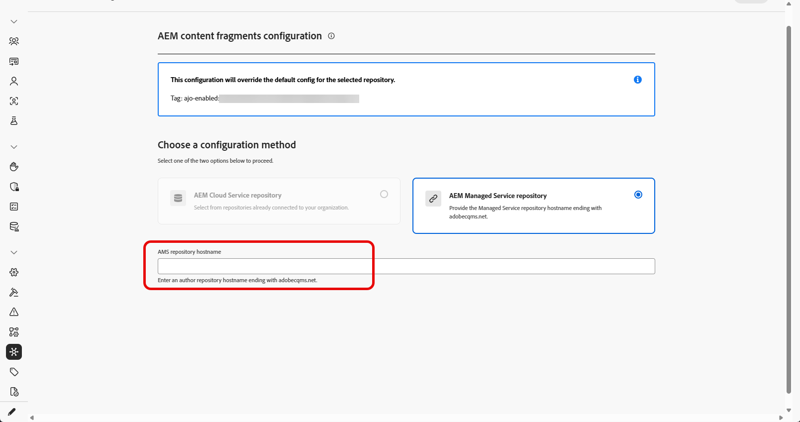
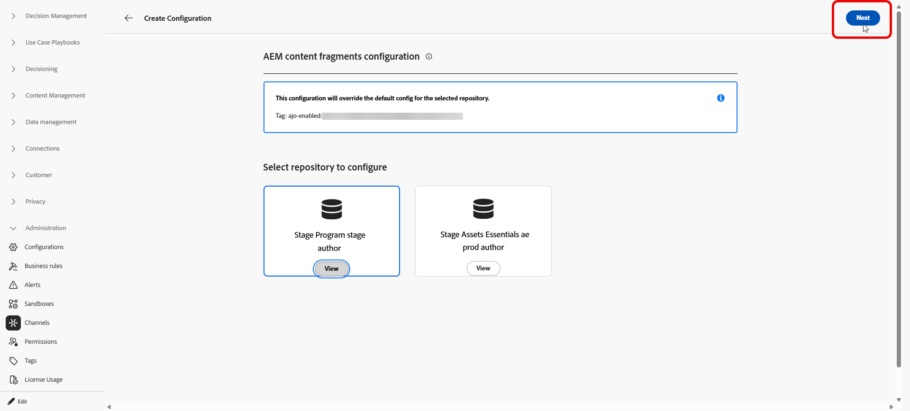

# Configuration de l’accès au référentiel Adobe Experience Manager {#aem-admin-settings}

>[!BEGINSHADEBOX]

**Sur cette page :** découvrez comment les administrateurs connectent un sandbox à un référentiel Adobe Experience Manager, en définissant un accès de création uniquement ou de publication, des domaines personnalisés et une authentification, afin que les spécialistes marketing puissent utiliser des fragments de contenu AEM dans leurs parcours et campagnes.

>[!ENDSHADEBOX]

Adobe Journey Optimizer s’intègre à **[!DNL Adobe Experience Manager as a Cloud Service]** et **[!DNL Adobe Experience Manager Managed Service]** afin que vous puissiez utiliser **fragments de contenu** dans les Parcours et les campagnes. Par défaut, les **fragments de contenu** sont lus à partir du référentiel de publication Adobe Experience Manager. Les administrateurs peuvent passer en mode de création uniquement ou ajuster l’accès de publication dans le menu **[!UICONTROL Intégration d’AEM]**.

➡️ Lorsque le référentiel est configuré, continuez avec [Utiliser des fragments de contenu Experience Manager](../integrations/aem-fragments.md) pour les tâches de création et de sélection dans Journey Optimizer.

## Configuration des référentiels {#configure-ui}

>[!NOTE]
>
> **[!UICONTROL Intégration AEM]** enregistre les paramètres du référentiel **par sandbox**. Chaque sandbox conserve ses propres intégrations qui ne s’appliquent pas à tous les sandbox.

Journey Optimizer stocke une intégration par organisation, sandbox et référentiel Adobe Experience Manager. Si vous enregistrez une nouvelle intégration pour cette même combinaison, elle remplace les paramètres précédents. Seule la dernière configuration est conservée.

➡️ [Découvrez cette fonctionnalité pour Adobe Experience Manager Managed Service en vidéo](#video)

Pour configurer votre référentiel :

1. Accédez À **[!UICONTROL Administration]** > **[!UICONTROL Canaux]** > **[!UICONTROL Intégration AEM]**.

1. Cliquez sur **[!UICONTROL Créer une configuration]**.

   

1. Choisissez une méthode de configuration :

   * Pour **[!DNL Adobe Experience Manager Managed Services]** référentiel, saisissez un nom d’hôte de référentiel se terminant par `adobecqms.net` dans le champ **[!UICONTROL Nom d’hôte du référentiel AMS]**.

     

   * Si vous utilisez **[!DNL Adobe Experience as a Cloud Service]**, choisissez le référentiel à configurer, puis cliquez sur **[!UICONTROL Suivant]**.

     De plus, vous pouvez cliquer sur **[!UICONTROL Afficher]** pour accéder à ce référentiel.

     >[!IMPORTANT]
     >
     >L’enregistrement d’une nouvelle configuration pour la même organisation, le même sandbox et le même référentiel **remplace** la configuration par défaut, c’est-à-dire le référentiel **publier**.

     

1. Saisissez un **[!UICONTROL Nom]** et un **[!UICONTROL Description]**.

1. Choisissez votre configuration dans le menu déroulant ci-dessous :

   +++ Configuration de l’auteur uniquement

   Sélectionnez **[!UICONTROL Configuration de l’auteur uniquement]** lorsque Journey Optimizer doit lire les fragments de contenu de l’environnement Adobe Experience Manager **auteur** uniquement. La réplication de l’auteur vers la publication et les mises à jour de publication actives ne sont pas prises en charge.

   

   +++

    

   +++ Configuration de l’instance de publication

   Par défaut, chaque référentiel **[!DNL Adobe Experience Manager as a Cloud Service]** est configuré pour utiliser l’instance **publication**. Vous pouvez passer à l’étape de test de fragment de contenu sans modifier ces paramètres.

   Si votre instance de publication est **authentifiée** ou si vous devez utiliser un domaine de publication personnalisé, procédez comme suit.

   1. Sélectionnez **[!UICONTROL Configuration de l’instance de publication]** pour activer les paramètres de l’instance de publication.

      

   1. Activez l’option **[!UICONTROL Envoyer le jeton à l’instance de publication]** afin que les informations d’identification du service soient incluses avec les requêtes à l’instance de publication.

   1. Collez un **[!UICONTROL JSON d’informations d’identification de service]** valide pour l’authentification.

   1. Vous pouvez éventuellement fournir un domaine personnalisé si votre organisation ne parvient pas à atteindre l’hôte de publication AEM par défaut (`publish-XX-XX.adobeaemcloud.com`) pour récupérer du contenu.

      

   +++

1. Une fois la configuration de l’instance terminée, sélectionnez un fragment de contenu pour confirmer que l’intégration fonctionne.

   

1. Dans la fenêtre **Gestionnaire d’accès**, sélectionnez le fragment à tester, puis cliquez sur **[!UICONTROL Sélectionner]**.

1. Cliquez sur **[!UICONTROL Enregistrer]**.

1. Lorsque vous enregistrez avec un fragment de contenu de test sélectionné, la validation s’exécute automatiquement. Si la validation échoue, une liste d’erreurs s’affiche afin que vous puissiez corriger la configuration.

   

1. Pour modifier ou désactiver cette intégration de référentiel, accédez à la configuration précédemment créée à partir du menu **[!UICONTROL Intégration d’]**.

Lorsque vous enregistrez cette configuration, Journey Optimizer la stocke pour ce référentiel dans le sandbox actuel. Vous pouvez ensuite utiliser ce référentiel et ses paramètres lors de la navigation et de la sélection de contenu dans le sélecteur **Gestionnaire de contenu**.

## Vidéo pratique {#video}

Découvrez comment les administrateurs configurent les paramètres du référentiel Adobe Experience Manager Managed Services dans Journey Optimizer afin que les marketeurs puissent utiliser les fragments de contenu dans les parcours et les campagnes.

>[!VIDEO](https://video.tv.adobe.com/v/3492529?quality=12)
