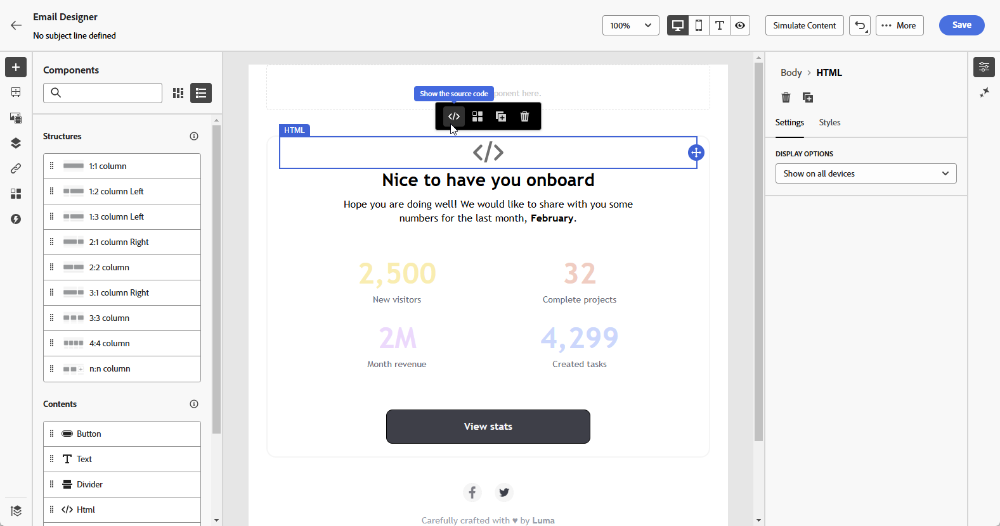
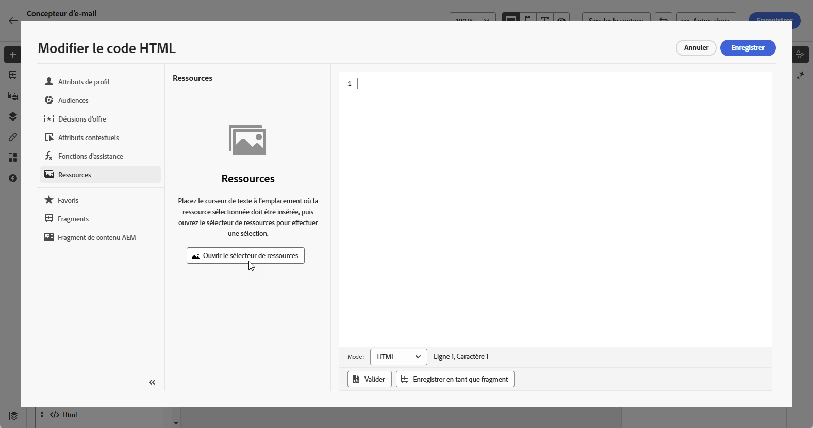
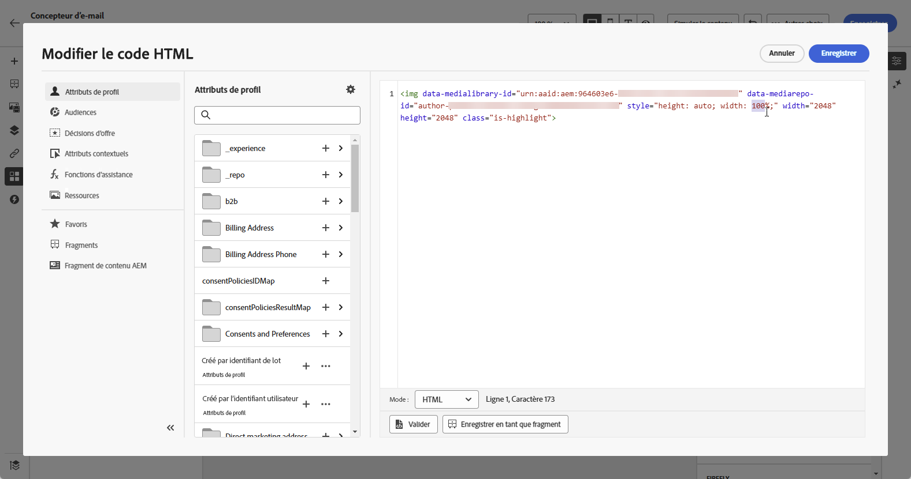
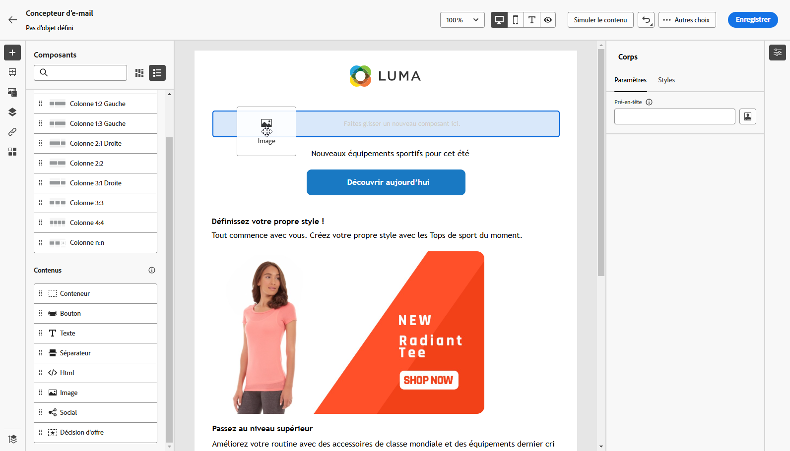
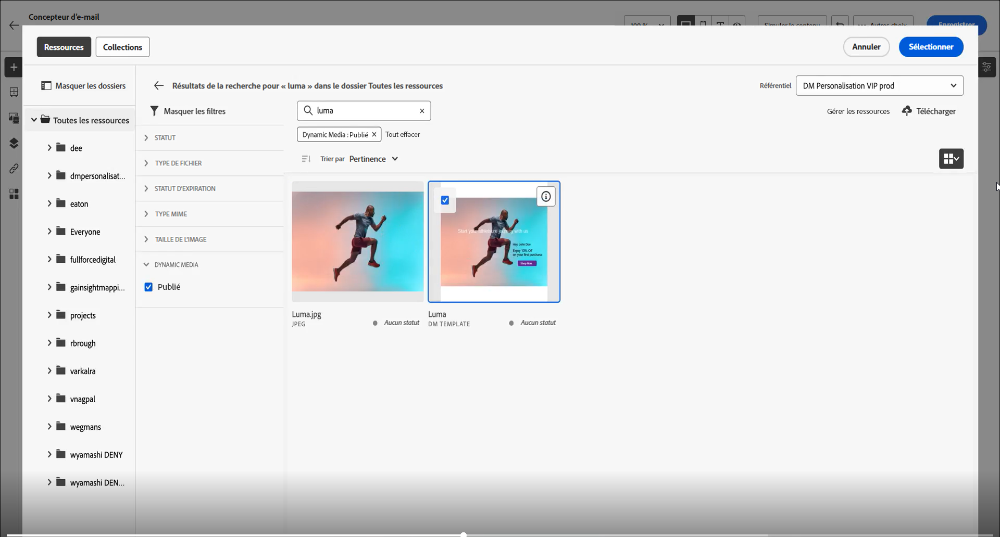
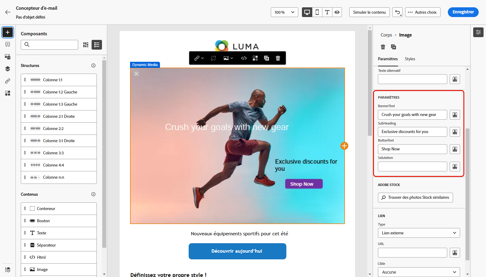
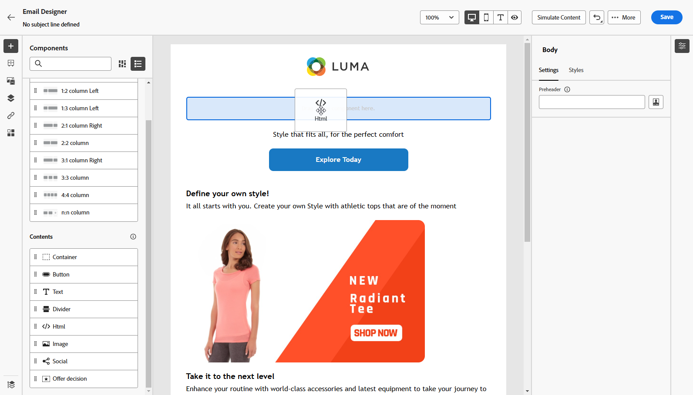
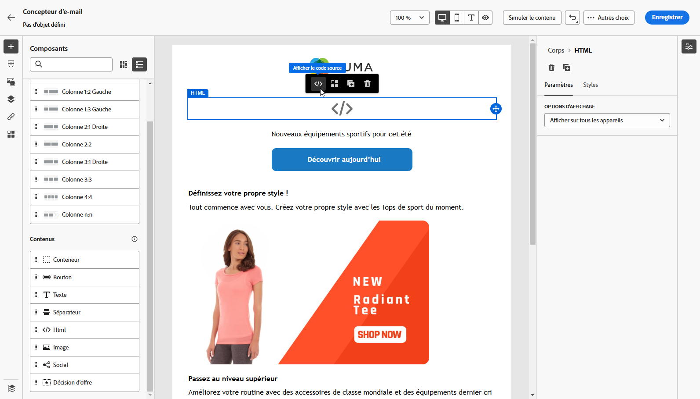

# Utilisation de Dynamic Media {#aem-dynamic}

## Prise en main de Dynamic Media {#gs-aem-dynamic}

Le sélecteur de ressources prend désormais en charge Dynamic Media, ce qui vous permet de sélectionner et d’utiliser facilement des rendus de médias dynamiques approuvés dans Journey Optimizer. Les modifications apportées aux ressources dans Adobe Experience Manager sont immédiatement répercutées dans votre contenu Journey Optimizer. Ainsi, les versions les plus récentes sont toujours utilisées sans nécessiter de mises à jour manuelles.

Notez que cette intégration n’est disponible que pour les clients et clientes qui utilisent Dynamic Media Manager as a Cloud Service.

Pour en savoir plus sur Dynamic Media dans Adobe Experience Manager as a Cloud Service, consultez la [documentation d’Experience Manager](https://experienceleague.adobe.com/fr/docs/experience-manager-cloud-service/content/assets/dynamicmedia/dynamic-media){target="_blank"}.

>[!AVAILABILITY]
>
>Pour les clients du secteur de la santé, l’intégration n’est activée que sous licence pour les offres complémentaires Journey Optimizer Healthcare Shield et Adobe Experience Manager Extended Security for Healthcare.

## Ajouter et gérer des médias dynamiques {#dynamic-media}

Améliorez et optimisez votre contenu pour n’importe quel écran ou navigateur en insérant des médias dynamiques depuis Adobe Experience Manager as a Cloud Service directement dans votre contenu Journey Optimizer.  Vous pouvez ensuite redimensionner, recadrer, améliorer et effectuer d’autres réglages si nécessaire.

>[!IMPORTANT]
>
>Vérifiez que Dynamic Media avec OpenAPI est activé dans Adobe Experience Manager as a Cloud Service. [En savoir plus](https://experienceleague.adobe.com/fr/docs/experience-manager-cloud-service/content/assets/dynamicmedia/dynamic-media-open-apis/dynamic-media-open-apis-overview#enable-dynamic-media-open-apis){target="_blank"}.

L’intégration de Dynamic Media à Adobe Journey Optimizer est disponible à la fois pour Dynamic Media en [mode Scene7](https://experienceleague.adobe.com/fr/docs/experience-manager-65/content/assets/dynamic/config-dms7){target="_blank"} et Dynamic Media [avec OpenAPI](https://experienceleague.adobe.com/fr/docs/experience-manager-cloud-service/content/assets/dynamicmedia/dynamic-media-open-apis/dynamic-media-open-apis-overview){target="_blank"}.

<!--
>[!AVAILABILITY]
>
>Older versions of Outlook (including 2016) do not support rendering of content with Dynamic Media.  We are actively working on a permanent fix to enhance compatibility. In the meantime, apply the following guidelines:
>
>* For Dynamic Media Scene7 URLs: Append `?bfc=on` to the image URL. This enables automatic format negotiation, ensuring the most compatible image format is delivered based on the client's capabilities.
>
>* For Dynamic Media with Open API: Use the `.avif` format. This format includes built-in fallback mechanisms to deliver a compatible format when necessary.
>
-->

Pour ajouter une ressource Adobe Experience Manager à votre contenu HTML, procédez comme suit :

1. Faites glisser et déposez un **[!UICONTROL composant HTML]** dans votre contenu.

1. Sélectionnez **[!UICONTROL Afficher le code source]**.

   

1. Dans le menu **[!UICONTROL Modifier le code HTML]**, accédez à **[!UICONTROL Ressources]**, puis cliquez sur **[!UICONTROL Ouvrir le sélecteur de ressources]**.

   Vous pouvez également copier et coller l’URL de la ressource.

   

1. Parcourez vos ressources AEM et sélectionnez celle que vous souhaitez ajouter à votre contenu.

1. Ajustez les paramètres de l’image (par exemple, la hauteur, la largeur, la rotation, le basculement, la luminosité, la teinte, etc.) selon vos besoins, afin de répondre aux exigences de vos ressources.

   Pour obtenir la liste complète des paramètres d’image qui peuvent être ajoutés à l’URL, consultez la [documentation d’Experience Manager](https://experienceleague.adobe.com/fr/docs/dynamic-media-developer-resources/image-serving-api/image-serving-api/http-protocol-reference/command-reference/c-command-reference){target="_blank"}.

   

1. Cliquez sur **[!UICONTROL Enregistrer]**.

Votre contenu comprend désormais un média dynamique. Toutes les mises à jour effectuées dans Experience Manager apparaîtront automatiquement dans Journey Optimizer.

## Personnaliser la superposition de texte {#text-overlay}

Personnalisez facilement n’importe quel média dynamique en remplaçant la superposition de texte existante par un texte de votre choix, pour simplifier les mises à jour et la personnalisation.

Par exemple, à l’aide de la fonctionnalité d’expérimentation, vous pouvez mettre à jour la superposition de texte existante en la remplaçant par un texte différent pour chaque traitement. Ainsi, chaque ouverture de message est personnalisée pour chaque profil.

>[!AVAILABILITY]
>
>La **personnalisation de la superposition de texte** est uniquement disponible dans Dynamic Media en [mode Scene7](https://experienceleague.adobe.com/fr/docs/experience-manager-65/content/assets/dynamic/config-dms7){target="_blank"}. Comme le mode Scene7 n’est pas accessible pour les clientes et clients du secteur de la santé, le contenu est rendu à l’aide d’une copie binaire de l’image Journey Optimizer. Pour toute exception, veuillez contacter votre représentant ou représentante Adobe.

Pour personnaliser votre superposition de texte, procédez comme suit :

1. Faites glisser et déposez un **[!UICONTROL composant HTML]** dans votre contenu.

1. Sélectionnez **[!UICONTROL Afficher le code source]**.

1. Dans le menu **[!UICONTROL Modifier le code HTML]**, accédez à **[!UICONTROL Ressources]**, puis **[!UICONTROL Ouvrir le sélecteur de ressources]**.

   Vous pouvez également simplement copier et coller l’URL de vos ressources.

1. Parcourez vos ressources AEM et sélectionnez celle que vous souhaitez ajouter à votre contenu.

1. Remplacez la superposition par le texte souhaité.

   

1. Mettez à jour les paramètres d’image suivants :

   * **Layer** : saisissez l’élément de base où est placé le texte.
   * **Taille** : mettez à jour la taille de votre bloc de texte.
   * **TextAttr** : ajustez la taille de la police du texte.
   * **Pos** : définissez la position du texte sur l’image.

   >[!WARNING]
   >
   >Le paramètre Layer est requis pour mettre à jour le média dynamique.

   

1. Cliquez sur **[!UICONTROL Enregistrer]**.

Votre contenu inclut désormais la superposition de texte mise à jour.

## Ajouter et gérer votre modèle Dynamic Media {#dynamic-media-template}

Ajoutez facilement votre modèle Dynamic Media dans Journey Optimizer et mettez à jour votre contenu multimédia chaque fois que nécessaire. Vous pouvez désormais incorporer des champs de personnalisation dans vos médias, ce qui vous permet de créer du contenu plus personnalisé et plus attrayant dans Journey Optimizer.

En savoir plus sur le [modèle Dynamic Media](https://experienceleague.adobe.com/fr/docs/dynamic-media-classic/using/template-basics/quick-start-template-basics){target="_blank"}

>[!AVAILABILITY]
>
>Le **modèle Dynamic Media** est disponible exclusivement dans Dynamic Media en [mode Scene7](https://experienceleague.adobe.com/fr/docs/experience-manager-65/content/assets/dynamic/config-dms7). Comme le mode Scene7 n’est pas accessible pour les clientes et clients du secteur de la santé, le contenu ne sera pas rendu. Pour toute exception, contactez l’assistance Experience Manager.

### Avec le composant Image {#image-component}

Vous pouvez insérer votre modèle dynamique directement dans votre contenu à l’aide du composant Image :

1. Ouvrez votre campagne ou votre parcours et accédez à votre contenu.

1. Faites glisser et déposez un **composant Image** dans votre disposition.

   Pour plus d’informations sur le composant Image, consultez [cette page](../email/content-components.md).

   

1. Parcourez vos ressources AEM et sélectionnez le modèle Dynamic Media que vous souhaitez ajouter à votre contenu.

   

1. Dans les **paramètres d’image**, accédez aux paramètres de votre modèle Dynamic Media.

   Les champs disponibles dépendent des paramètres ajoutés lors de la [création du modèle](https://experienceleague.adobe.com/fr/docs/dynamic-media-classic/using/template-basics/creating-template-parameters#creating_template_parameters){target="_blank"} dans Adobe Experience Manager.

   

1. Renseignez les différents champs et utilisez l’éditeur de personnalisation pour ajouter du contenu personnalisé. Vous pouvez utiliser n’importe quel attribut, tel que le nom du profil, la ville ou d’autres détails pertinents, pour créer une expérience plus personnalisée.

   Pour en savoir plus sur la personnalisation, consultez [cette page](../personalization/personalize.md).

   

1. Le contenu conditionnel peut être appliqué au composant Dynamic Media pour générer différentes variantes de contenu. [En savoir plus](../personalization/dynamic-content.md)

1. Cliquez sur **[!UICONTROL Enregistrer]**.

Une fois que vous avez effectué vos tests et validé le contenu, vous pouvez envoyer votre message à votre audience.

### Avec le composant HTML {#html-component}

Vous pouvez insérer votre modèle dynamique directement dans votre contenu à l’aide du composant HTML :

1. Ouvrez votre campagne ou votre parcours et accédez à votre contenu.

1. Faites glisser et déposez un **composant HTML** dans votre disposition.

   

1. Sélectionnez **[!UICONTROL Afficher le code source]**.

   

1. Dans le menu **[!UICONTROL Modifier le code HTML]**, accédez à **[!UICONTROL Ressources]**, puis **[!UICONTROL Ouvrir le sélecteur de ressources]**.

   Vous pouvez également simplement copier et coller l’URL de vos ressources.

1. Ajustez les paramètres de texte de l’image selon vos besoins pour répondre aux exigences des ressources.

   

1. Cliquez sur **[!UICONTROL Enregistrer]**.

Une fois que vous avez effectué vos tests et validé le contenu, vous pouvez envoyer votre message à votre audience.

## Vidéo pratique {#video}

Découvrez comment intégrer Adobe Experience Manager Dynamic Media à Adobe Journey Optimizer pour activer la mise à jour de contenu en temps réel et la personnalisation.

Ce tutoriel explique comment modifier des images directement dans AJO, ajouter des superpositions de texte à l’aide du mode HTML, créer des modèles Dynamic Media dans AEM à des fins d’hyper-personnalisation et personnaliser des campagnes en adaptant le contenu à différents segments d’audience. Cette intégration permet aux spécialistes du marketing de créer efficacement des campagnes attrayantes et personnalisées sans passer d’une application à l’autre.

>[!VIDEO](https://video.tv.adobe.com/v/3457695/?learn=on&enablevpops=&autoplay=true)

