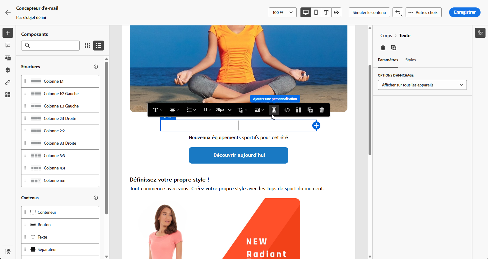
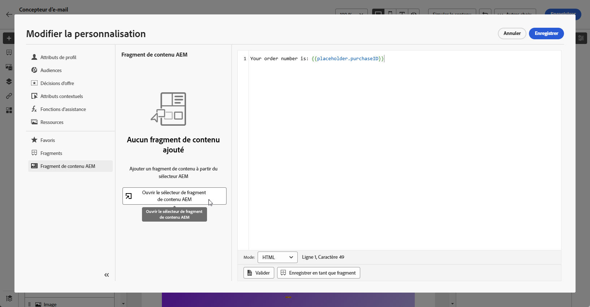
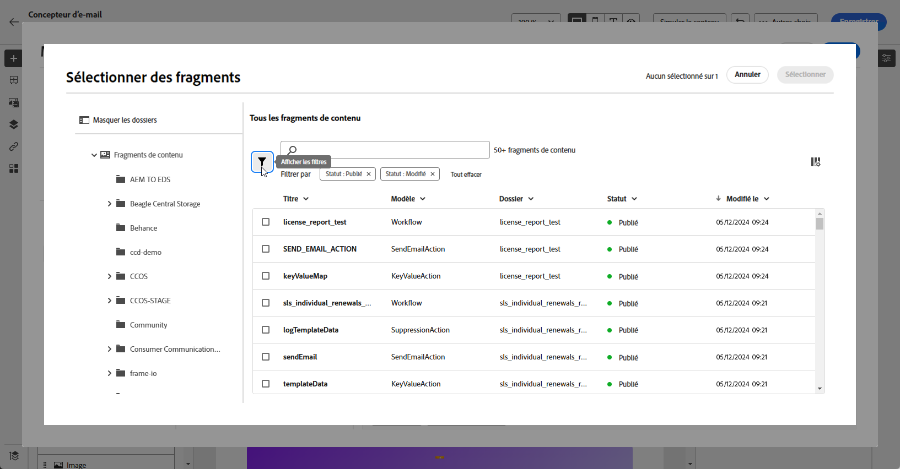
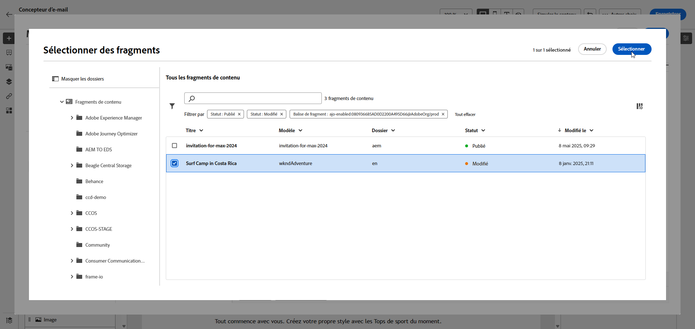
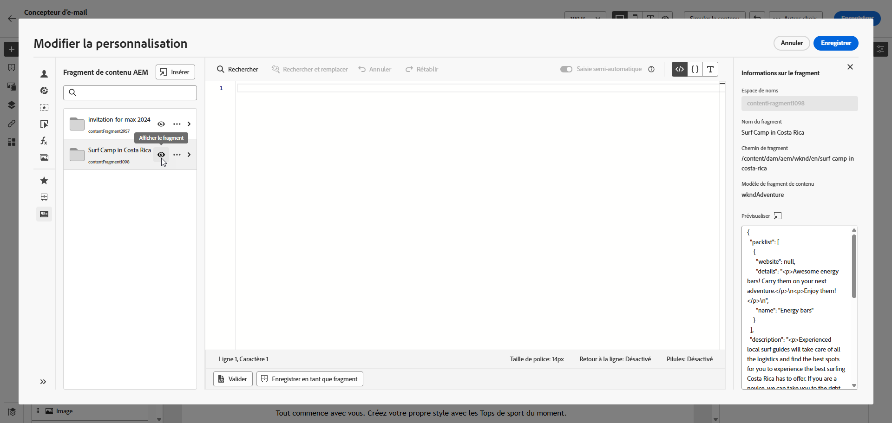
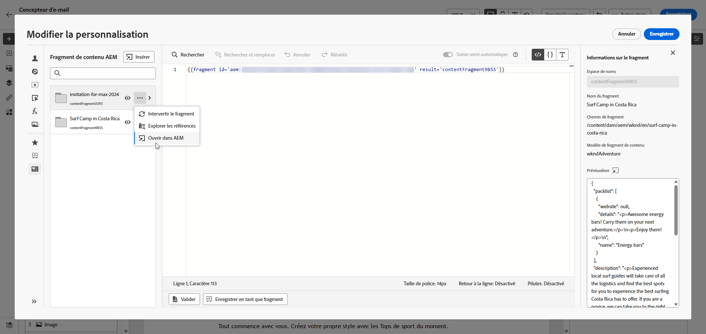
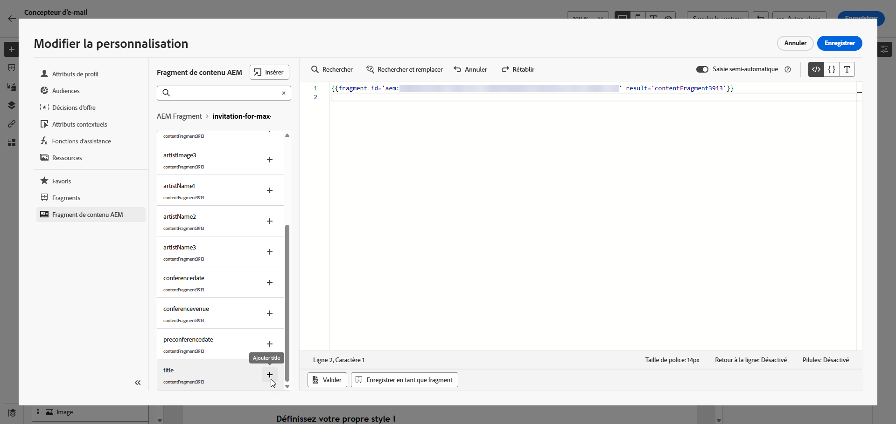
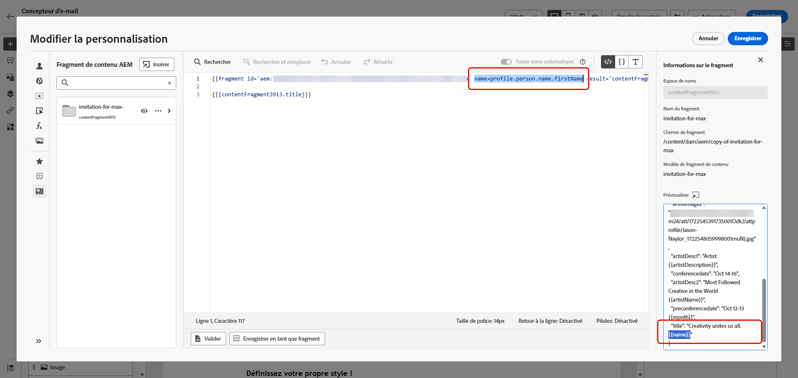

# Fragments de contenu Adobe Experience Manager {#aem-fragments}

En intégrant Adobe Experience Manager as a Cloud Service à Adobe Journey Optimizer, vous pouvez désormais incorporer facilement vos fragments de contenu AEM dans le contenu de Journey Optimizer. Cette connexion rationalisée simplifie le processus d’accès au contenu AEM et d’utilisation de celui-ci, ce qui permet de créer des campagnes et des parcours personnalisés et dynamiques.

Pour en savoir plus sur les fragments de contenu AEM, voir [Utilisation des fragments de contenu](https://experienceleague.adobe.com/fr/docs/experience-manager-cloud-service/content/sites/administering/content-fragments/content-fragments-with-journey-optimizer){target="_blank"} dans la documentation d’Experience Manager.

>[!AVAILABILITY]
>
>Pour la clientèle du secteur de la santé, l’intégration n’est activée qu’après l’obtention d’une licence pour les offres complémentaires Journey Optimizer Healthcare Shield et Adobe Experience Manager Enhanced Security.

## Limites {#limitations}

* Il est recommandé de limiter le nombre de personnes autorisées à publier des fragments de contenu afin de réduire le risque d’erreurs accidentelles.

* Pour le contenu multilingue, seul le flux manuel est pris en charge.

* Les variations ne sont actuellement pas prises en charge.

* Le BAT de la campagne et du parcours publiés reflète les données de la dernière publication de fragment de contenu Experience Manager.

## Créer et affecter une balise dans Experience Manager

>[!IMPORTANT]
>
>Pour permettre à Journey Optimizer d’accéder aux fragments de contenu de Adobe Experience Manager via l’API de gestion des fragments de contenu, vous devez d’abord [configurer Dispatcher](https://experienceleague.adobe.com/en/docs/experience-manager-cloud-service/content/sites/administering/content-fragments/content-fragments-with-journey-optimizer#dispatcher-configuration).

Avant d’utiliser votre fragment de contenu dans Journey Optimizer, vous devez créer une balise spécifique à Journey Optimizer :

1. Accédez à votre environnement **Experience Manager**.

1. Dans le menu **Outils**, sélectionnez **Balisage**.

   

1. Cliquez sur **Créer une balise**.

1. Assurez-vous que l’identifiant respecte la syntaxe suivante : `ajo-enabled:{AJO-OrgId}/{AJO-SandboxName}`.

1. Cliquez sur **Créer**.

1. Définissez votre modèle de fragment de contenu comme indiqué dans la documentation d’[Experience Manager](https://experienceleague.adobe.com/fr/docs/experience-manager-cloud-service/content/sites/administering/content-fragments/content-fragment-models){target="_blank"} et attribuez la balise Journey Optimizer que vous venez de créer.

Vous pouvez maintenant commencer à créer et configurer votre fragment de contenu pour une utilisation ultérieure dans Journey Optimizer. En savoir plus dans la documentation d’[Adobe Experience Manager](https://experienceleague.adobe.com/fr/docs/experience-manager-cloud-service/content/sites/administering/content-fragments/managing){target="_blank"}.

## Ajouter des fragments de contenu Experience Manager {#aem-add}

Après avoir créé et personnalisé vos fragments de contenu AEM, vous pouvez maintenant les importer dans votre campagne ou parcours Journey Optimizer.

1. Créez votre [campagne](../campaigns/create-campaign.md) ou [parcours](../building-journeys/journey-gs.md).

1. Pour accéder à votre fragment de contenu AEM, cliquez sur l’icône  dans n’importe quel champ de texte ou ouvrez le code source à l’aide d’un composant de contenu HTML.

   

1. Dans le menu **[!UICONTROL Fragment de contenu AEM]** du volet de gauche, cliquez sur **[!UICONTROL Ouvrir le sélecteur AEM CF]**.

   

1. Sélectionnez un **[!UICONTROL fragment de contenu]** dans la liste des éléments à importer dans votre contenu Journey Optimizer.

1. Cliquez sur **[!UICONTROL Afficher les filtres]** pour affiner votre liste de fragments de contenu.

   Par défaut, le filtre Fragment de contenu est préréglé pour afficher uniquement le contenu approuvé.

   

1. Après avoir sélectionné votre **[!UICONTROL fragment de contenu]**, cliquez sur **[!UICONTROL Sélectionner]** pour l’ouvrir.

   

1. Cliquez sur **[!UICONTROL Afficher le fragment]** pour consulter les informations relatives au fragment. Notez que l’ouverture du menu **[!UICONTROL Informations sur le fragment]** met l’éditeur en mode lecture seule.

   Sélectionnez **[!UICONTROL Aperçu]** dans le menu de droite pour afficher votre fragment dans Adobe Experience Manager.

   

1. Cliquez sur l’ pour accéder au menu avancé de votre fragment :

   * **[!UICONTROL Intervertir le fragment]**
   * **[!UICONTROL Explorer les références]**
   * **[!UICONTROL Ouvrir dans AEM]**

   

1. Sélectionnez les champs de votre **[!UICONTROL fragment]** à ajouter à votre contenu.

   <!--
    Note that if you choose to copy the value, any future updates to the Content Fragment will not be reflected in your campaign or journey. However, using dynamic placeholders ensures real-time updates.-->

   

1. Pour activer la personnalisation en temps réel, tous les espaces réservés utilisés dans un **[!UICONTROL fragment de contenu]** doivent être explicitement déclarés par l’utilisateur ou l’utilisatrice en tant que paramètres dans la balise helper du fragment. Vous pouvez mapper ces espaces réservés aux attributs de profil, aux attributs contextuels, aux chaînes statiques ou aux variables prédéfinies à l’aide des méthodes suivantes :

   1. **Mappage de profil ou d’attribut contextuel** : attribuez l’espace réservé à un profil ou à un attribut contextuel, par exemple name = profile.person.name.firstName.

   1. **Mappage de chaîne statique** : attribuez une valeur de chaîne fixe en la plaçant entre guillemets doubles, par exemple name = &quot;John&quot;.

   1. **Mappage de variables** : référencez une variable déclarée précédemment dans le même HTML, par exemple name = &#39;variableName&#39;.
Dans ce cas, assurez-vous que **_variableName_** est déclaré avant d’ajouter l’identifiant du fragment, en utilisant la syntaxe suivante :

      ```html
       
      ```

   Dans l’exemple ci-dessous, l’espace réservé **_name_** est mappé sur l’attribut **_profile.person.name.firstName_** dans le fragment.

   {zoomable="yes"}


1. Cliquez sur **[!UICONTROL Enregistrer]**. Vous pouvez maintenant tester et vérifier le contenu de votre message, comme indiqué dans [cette section](../content-management/preview.md).

Une fois que vous avez effectué vos tests et validé le contenu, vous pouvez [envoyer votre campagne](../campaigns/review-activate-campaign.md) ou [publier votre parcours](../building-journeys/publish-journey.md) pour votre audience.

Adobe Experience Manager permet d’identifier les campagnes ou parcours Journey Optimizer qui utilisent un fragment de contenu. En savoir plus dans la documentation d’[Adobe Experience Manager](https://experienceleague.adobe.com/fr/docs/experience-manager-cloud-service/content/sites/administering/content-fragments/extension-content-fragment-ajo-external-references).
