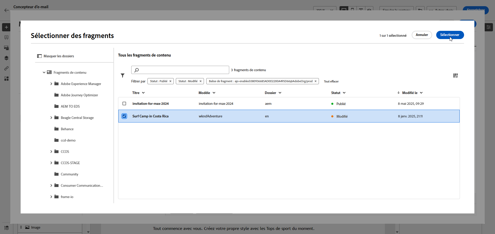
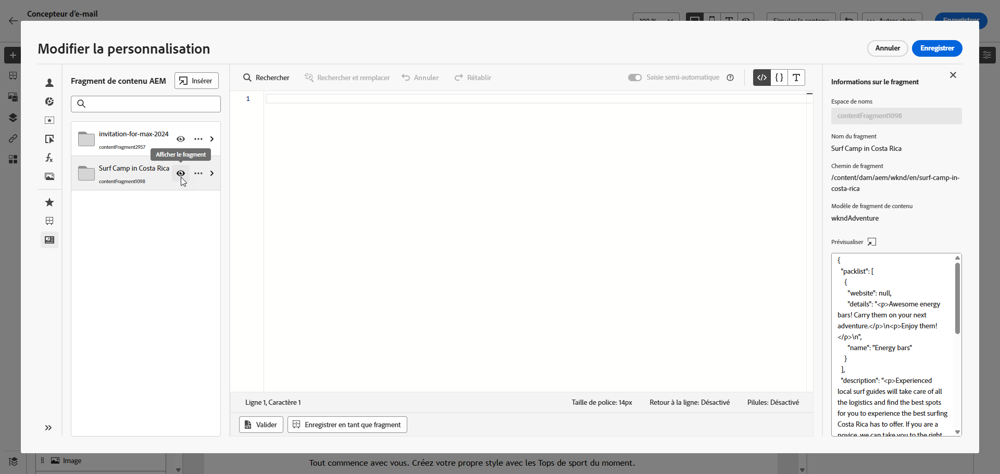
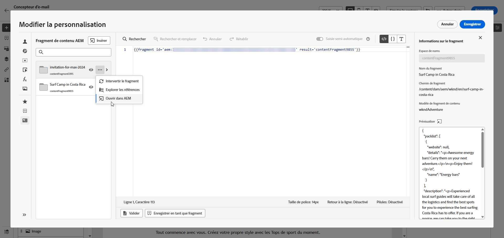
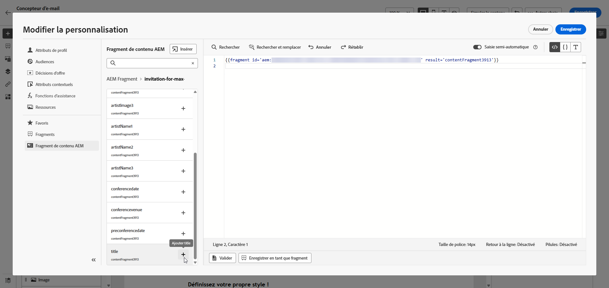

# Utilisation de fragments de contenu Adobe Experience Manager {#aem-fragments}

>[!BEGINSHADEBOX]

**Sur cette page :** découvrez comment baliser, ajouter et personnaliser des fragments de contenu Adobe Experience Manager dans les campagnes et parcours Journey Optimizer, y compris en utilisant des variations et Experience Decisioning.

>[!ENDSHADEBOX]

>[!BEGINSHADEBOX]

Les expériences **sélecteur de ressources** et **sélecteur de fragments de contenu** existantes dans les workflows Adobe Journey Optimizer sont en cours de remplacement par **gestionnaire d’accès**. Le gestionnaire de contenu fournit une interface unifiée optimisée par l’IA pour découvrir et sélectionner des Assets, des fragments de contenu et Dynamic Media directement dans vos workflows de création AJO. Les intégrations existantes continueront à fonctionner pendant la période de transition.

>[!ENDSHADEBOX]

>[!NOTE]
>
>Les **fragments de contenu** sont créés dans Adobe Experience Manager et utilisés dans [!DNL Journey Optimizer]. Elles sont différentes de :
>
>* **[Fragments](../content-management/fragments.md)** : composants de contenu réutilisables créés dans [!DNL Journey Optimizer] et utilisés dans les e-mails dans les campagnes et les parcours.
>* **[Fragments de Parcours](../building-journeys/journey-fragments.md)** — ensembles réutilisables de nœuds de parcours insérés dans des parcours.

L’intégration entre Adobe Experience Manager et Journey Optimizer suit ce flux de données :

1. **[Configurer le Dispatcher](https://experienceleague.adobe.com/fr/docs/experience-manager-cloud-service/content/sites/administering/content-fragments/content-fragments-with-journey-optimizer#dispatcher-configuration){target="_blank"}** : pour permettre à Journey Optimizer d’accéder aux fragments de contenu de Adobe Experience Manager via l’API de gestion des fragments de contenu, vous devez d’abord configurer le Dispatcher. Il s’agit d’une condition préalable à l’intégration.

1. **[Créer et créer](https://experienceleague.adobe.com/fr/docs/experience-manager-cloud-service/content/sites/administering/content-fragments/managing#creating-a-content-fragment)** : le contenu est créé et configuré dans Adobe Experience Manager en tant que fragments de contenu.

1. **[Balisage](https://experienceleague.adobe.com/fr/docs/experience-manager-cloud-service/content/sites/administering/content-fragments/managing#manage-tags)** : les fragments de contenu doivent être balisés avec la balise spécifique à Journey Optimizer (`ajo-enabled:{OrgId}/{SandboxName}`).

1. **[Publication](https://experienceleague.adobe.com/fr/docs/experience-manager-cloud-service/content/sites/administering/content-fragments/managing#publishing-and-previewing-a-fragment)** : les fragments de contenu sont publiés dans Adobe Experience Manager, ce qui les rend disponibles pour Journey Optimizer.

1. **[Accès](#aem-add)** : Journey Optimizer récupère et affiche les fragments de contenu disponibles à partir de l’instance de publication Adobe Experience Manager en temps réel.

1. **[Intégration](#aem-add)** : les fragments de contenu sont sélectionnés et intégrés dans les campagnes ou les parcours.

Lorsqu’un fragment de contenu est publié dans Adobe Experience Manager, un événement est envoyé pour mettre à jour le contenu côté Journey Optimizer. Si la mise à jour est réussie, le fragment de contenu est disponible dans les 5 minutes environ pour les parcours unitaires et dans le lot de traitement suivant pour les cas d’utilisation par lots. Une fois que la mise à jour est disponible dans Journey Optimizer, le contenu publié le plus récent est utilisé dans toutes les campagnes et tous les parcours applicables.

>[!AVAILABILITY]
>
>Pour les clients du secteur de la santé, l’intégration n’est activée que sous licence pour les offres complémentaires Journey Optimizer Healthcare Shield et Adobe Experience Manager Extended Security for Healthcare.

## Créer et affecter une balise dans Experience Manager {#create-tag}

>[!IMPORTANT]
>
>Pour permettre à Journey Optimizer d’accéder aux fragments de contenu d’Adobe Experience Manager via l’API Content Fragment Management, vous devez d’abord [configurer Dispatcher](https://experienceleague.adobe.com/fr/docs/experience-manager-cloud-service/content/sites/administering/content-fragments/content-fragments-with-journey-optimizer#dispatcher-configuration){target="_blank"}.

Journey Optimizer affiche un fragment de contenu dans le sélecteur de fragment de contenu uniquement lorsqu’il porte une balise pour votre **organisation** et **sandbox**. Cette exigence est délibérée : elle empêche le contenu Experience Manager non lié ou non approuvé d’accéder à Journey Optimizer.

Attribuez une balise dont l’ID suit `ajo-enabled:{AJO-OrgId}/{AJO-SandboxName}`, à l’aide de votre ID d’organisation Journey Optimizer et du nom du sandbox à la place des espaces réservés, par exemple `ajo-enabled:123A12A123A123A12A@AdobeOrg/prod`.

Pour créer la balise dans Experience Manager :

1. Accédez à **Outils** > **Balisage**.

   

1. Créez une structure de balise imbriquée afin que l’ID de balise complet corresponde au format ci-dessus :

   1. Au niveau racine, créez un dossier nommé `ajo-enabled`.

   1. Sous `ajo-enabled`, créez une balise pour l’ID de votre organisation, par exemple `123A12A123A123A12A@AdobeOrg`.

   1. Sous cette balise d’organisation, créez une balise pour votre sandbox, par exemple `prod`.

   Le chemin d’accès combiné génère un identifiant de balise tel que `ajo-enabled:123A12A123A123A12A@AdobeOrg/prod`.

1. Pour l’appliquer à un fragment de contenu, ouvrez le fragment de contenu dans l’éditeur.

1. Dans **Propriétés**, ajoutez la balise que vous avez créée.

1. Enregistrez le fragment.

➡️ [En savoir plus sur les balises dans la documentation Adobe Experience Manager](https://experienceleague.adobe.com/fr/docs/experience-manager-cloud-service/content/sites/administering/content-fragments/managing#manage-tags)

## Ajouter des fragments de contenu Experience Manager {#aem-add}

Après avoir créé et personnalisé vos fragments de contenu AEM, vous pouvez maintenant les importer dans votre campagne ou parcours Journey Optimizer.

1. Créez votre [campagne](../campaigns/create-campaign.md) ou [parcours](../building-journeys/journey-gs.md).

1. Pour accéder à votre fragment de contenu AEM, cliquez sur l’icône  dans n’importe quel champ de texte ou ouvrez le code source à l’aide d’un composant de contenu HTML.

   

1. Dans le menu **[!UICONTROL Fragment de contenu]** dans le volet de gauche, cliquez sur **[!UICONTROL Ouvrir le gestionnaire d’accès d’AEM]**.

   

1. Parcourez la liste et sélectionnez un **[!UICONTROL fragment de contenu]** à importer dans votre contenu Journey Optimizer.

   >[!NOTE]
   >
   > Si le fragment comporte une ou plusieurs variations **publiées**, une liste déroulante **[!UICONTROL Variation]** s’affiche dans le sélecteur. Si aucune **[!UICONTROL Variation]** n’est sélectionnée, la variation **Principal** est utilisée automatiquement. En savoir plus dans [Utilisation de variations de fragments de contenu](#aem-variations).

1. Cliquez sur **[!UICONTROL Afficher les filtres]** pour affiner votre liste de fragments de contenu.

   Par défaut, le filtre Fragment de contenu est préréglé pour afficher uniquement le contenu approuvé.

   

1. Après avoir sélectionné votre **[!UICONTROL fragment de contenu]**, cliquez sur **[!UICONTROL Sélectionner]** pour l’ajouter.

   

1. Cliquez sur **[!UICONTROL Afficher le fragment]** pour consulter les informations relatives au fragment. Notez que l’ouverture du menu **[!UICONTROL Informations sur le fragment]** met l’éditeur en mode lecture seule.

   Sélectionnez **[!UICONTROL Aperçu]** dans le menu de droite pour afficher votre fragment dans Adobe Experience Manager.

   

1. Cliquez sur l’ pour accéder au menu avancé de votre fragment :

   * **[!UICONTROL Intervertir le fragment]**
   * **[!UICONTROL Explorer les références]**
   * **[!UICONTROL Ouvrir dans AEM]**

   

1. Sélectionnez les champs de votre **[!UICONTROL fragment]** à ajouter à votre contenu.

   <!--
    Note that if you choose to copy the value, any future updates to the Content Fragment will not be reflected in your campaign or journey. However, using dynamic placeholders ensures real-time updates.
    
    -->

   

1. Pour surfacer une URL d’image stockée dans un attribut de fragment de contenu, par exemple un chemin ou un champ d’URL à partir du modèle de fragment, insérez-la dans votre HTML avec une balise `` et l’attribut de fragment comme source, par exemple :

   ```html
   
   ```

   >[!NOTE]
   >
   >Les URL d’images relatives provenant de Adobe Experience Manager ne sont pas prises en charge. Utilisez des URL **absolues**.

1. Sélectionnez **Pilules : désactivée** pour permettre à l’expérience des pilules d’améliorer la lisibilité en masquant les chemins d’accès aux attributs longs.

   

1. Pour utiliser des **espaces réservés de personnalisation** créés dans Adobe Experience Manager dans le texte de votre fragment, définissez-les dans le fragment de contenu de Adobe Experience Manager comme suit : `{{name}}`.

   Dans Journey Optimizer, ces jetons sont des espaces réservés. Une fois l’expérience **pilules** activée, ils apparaissent dans la section **[!UICONTROL Fragment de contenu AEM]** du rail de droite à côté des champs de fragment.

1. Pour activer la personnalisation en temps réel, tous les espaces réservés utilisés dans un **[!UICONTROL fragment de contenu]** doivent être explicitement déclarés par l’utilisateur ou l’utilisatrice en tant que paramètres dans la balise helper du fragment. Mappez ces espaces réservés aux attributs de profil, aux attributs contextuels, aux chaînes statiques ou aux variables prédéfinies comme suit :

   1. **Mappage de profil ou d’attribut contextuel** : attribuez l’espace réservé à un profil ou à un attribut contextuel, par exemple name = profile.person.name.firstName.

   1. **Mappage de chaîne statique** : attribuez une valeur de chaîne fixe en la plaçant entre guillemets doubles, par exemple name = &quot;John&quot;.

   1. **Mappage de variables** : référencez une variable déclarée précédemment dans le même HTML, par exemple name = &#39;variableName&#39;.
Dans ce cas, assurez-vous que **_variableName_** est déclaré avant d&#39;ajouter l&#39;identifiant du fragment, en utilisant la syntaxe suivante :

      ```html
       
      ```

   Dans l’exemple ci-dessous, l’espace réservé **_month_** est mappé à l’attribut **_profile.person.bornDate_** dans le fragment.

   {zoomable="yes"}

1. Cliquez sur **[!UICONTROL Enregistrer]**. Vous pouvez maintenant tester et vérifier le contenu de votre message, comme indiqué dans [cette section](../content-management/preview.md).

   Notez que le fragment de contenu que vous avez sélectionné reste actif pour ce message. Lorsque vous ouvrez l’éditeur Personalization dans un autre champ ou bloc de contenu, vous pouvez continuer à utiliser le même fragment de la section **[!UICONTROL Fragment de contenu AEM]** et ajouter d’autres champs sans rouvrir **[!UICONTROL Ouvrir le gestionnaire de contenu AEM]**.

Une fois que vous avez effectué vos tests et validé le contenu, vous pouvez [envoyer votre campagne](../campaigns/review-activate-campaign.md) ou [publier votre parcours](../building-journeys/publish-journey.md) pour votre audience.

Adobe Experience Manager permet d’identifier les campagnes ou parcours Journey Optimizer qui utilisent un fragment de contenu. En savoir plus dans la documentation d’[Adobe Experience Manager](https://experienceleague.adobe.com/fr/docs/experience-manager-cloud-service/content/sites/administering/content-fragments/extension-content-fragment-ajo-external-references){target="_blank"}.

## Utilisation de fragments de contenu AEM avec Experience Decisioning {#aem-decisioning}


>[!AVAILABILITY]
>
>Cette fonctionnalité est disponible pour les canaux sortants avec prise en charge de la prise de décision.

Les fragments de contenu AEM peuvent également être utilisés comme attributs d’élément d’offre dans **Experience Decisioning**. En mappant les champs de fragment de contenu aux attributs d’élément de décision, vous pouvez utiliser des modèles, des formules et des critères de classement de prise de décision Journey Optimizer pour optimiser le fragment diffusé à chaque profil.

### Conditions préalables et mécanismes de sécurisation

* Les fragments de contenu doivent être balisés dans Adobe Experience Manager avec la balise `ajo-enabled:{OrgId}/{SandboxName}` avant d’apparaître dans le sélecteur de prise de décision. [Découvrez comment créer et affecter une balise](#create-tag)
* Seuls les fragments de contenu dont l’état est **publié** sont disponibles.
* Vous pouvez ajouter jusqu’à **cinq** fragments de contenu AEM à un seul élément de décision.

### Utilisation des fragments de contenu AEM dans la prise de décision

Une fois le fragment de contenu AEM créé et publié, vous devez :

1. Liez-le à un élément de décision en le sélectionnant dans les attributs de l’élément de décision.
1. Tirez-en parti dans une politique de décision pour faire apparaître le bon contenu au bon client.

➡️ [lier un fragment de contenu AEM à un élément de décision](../experience-decisioning/items.md#aem-fragments)

➡️ [Utilisation de fragments de contenu AEM dans une politique de décision](../experience-decisioning/fragments-decision-policies.md#aem-fragments-decisioning)

## Utilisation de variations de fragments de contenu {#aem-variations}

Dans Adobe Experience Manager, chaque fragment de contenu est constitué des éléments suivants :

* **Principal** : le contenu principal du fragment, qui existe toujours, ne peut pas être supprimé et constitue la base de toutes les variations.
* **Variations** : une ou plusieurs permutations de **Principal** que les auteurs créent pour des canaux ou des scénarios spécifiques. Les variations sont présentes dans le fragment non comme des ressources distinctes et peuvent être comparées et synchronisées avec **Principal**.

Exemples de cas d’utilisation de variation :

* Une version courte de copie pour une notification push et une version plus longue pour l’e-mail.
* Réglages régionaux de la tonalité sans créer de fragment distinct.
* Messages spécifiques à un canal (par exemple, web par rapport à mobile).

➡️ [En savoir plus dans la documentation Adobe Experience Manager](https://experienceleague.adobe.com/fr/docs/experience-manager-65/content/assets/content-fragments/content-fragments-variations)

Journey Optimizer vous permet de choisir la variation à utiliser lorsque vous insérez un fragment. De ce fait, différentes campagnes ou parcours peuvent s’appuyer sur différents rendus du même contenu source dans Adobe Experience Manager sans dupliquer les fragments.

Pour sélectionner une variation :

1. Ouvrez une [campagne](../campaigns/create-campaign.md) ou un [parcours &#x200B;](../building-journeys/journey-gs.md).

1. Cliquez sur l’icône  dans n’importe quel champ de texte, ou ouvrez la source HTML à partir d’un composant de contenu HTML.

1. Dans **[!UICONTROL Fragment de contenu]**, cliquez sur **[!UICONTROL Ouvrir le gestionnaire de contenu AEM]**.

   

1. Pour sélectionner un fragment de contenu Adobe Experience Manager spécifique aux paramètres régionaux dans la vue Tableau, utilisez **[!UICONTROL Personnaliser le tableau]** afin d’ajouter la colonne **[!UICONTROL Langue]**. Les valeurs des paramètres régionaux s’affichent dans le tableau, ce qui vous permet d’identifier et de sélectionner le fragment approprié.

   

1. Sélectionnez votre **[!UICONTROL fragment de contenu]**.

1. Cliquez sur l’icône  pour ouvrir le menu **[!UICONTROL Détails]**. Si le fragment comporte une ou plusieurs variations publiées, une liste déroulante **[!UICONTROL Variation]** s’affiche en regard des détails du fragment.

   

1. Dans le menu **[!UICONTROL Détails rapides]**, cliquez sur **[!UICONTROL Explorer les références]** pour ouvrir les options associées dans Adobe Experience Manager pour les détails de variation, la prévisualisation et le BAT, le cas échéant.

1. Choisissez votre variation, puis cliquez sur **[!UICONTROL Sélectionner]**.

   >[!NOTE]
   >
   > Si vous ne sélectionnez pas de variation ou si le fragment a été ajouté avant que la prise en charge de variation ne soit disponible, Journey Optimizer utilise automatiquement la variation **Principal** au moment de la diffusion.

Après avoir inséré un fragment avec une variation, sa republication dans Adobe Experience Manager met automatiquement à jour chaque **variation référencée** dans les campagnes ou parcours actifs. Les aperçus et les BAT utilisent toujours la variation que vous avez choisie, avec le contenu publié le plus récent pour cette variation.
