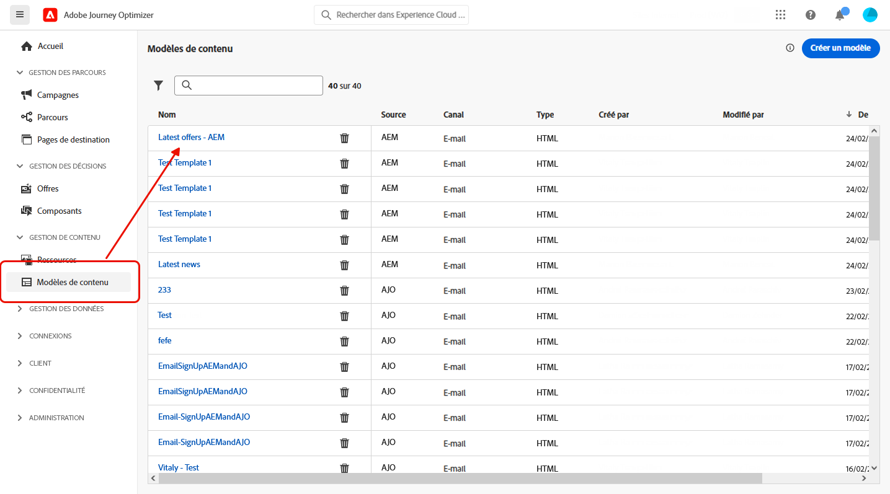
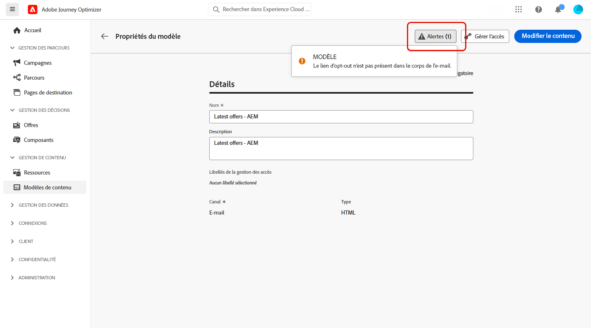
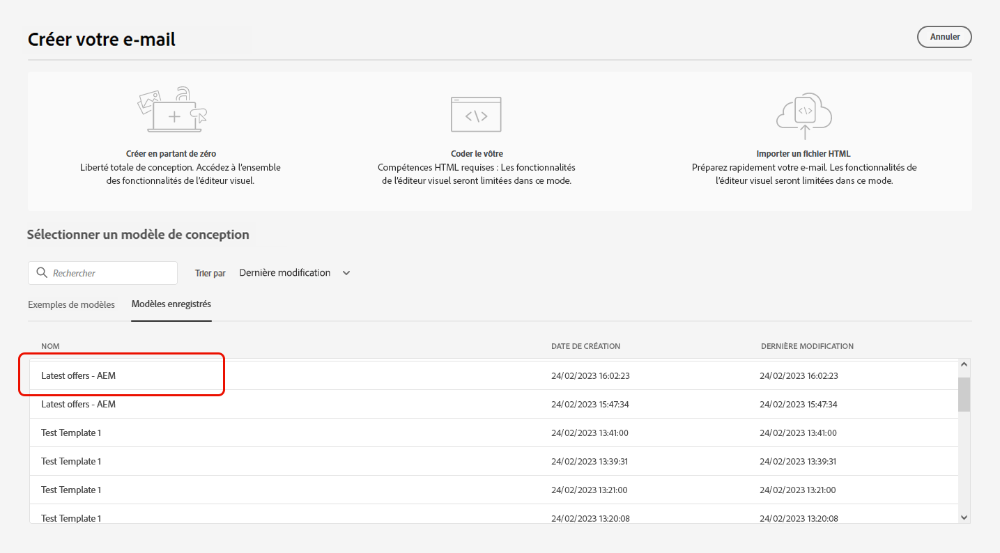
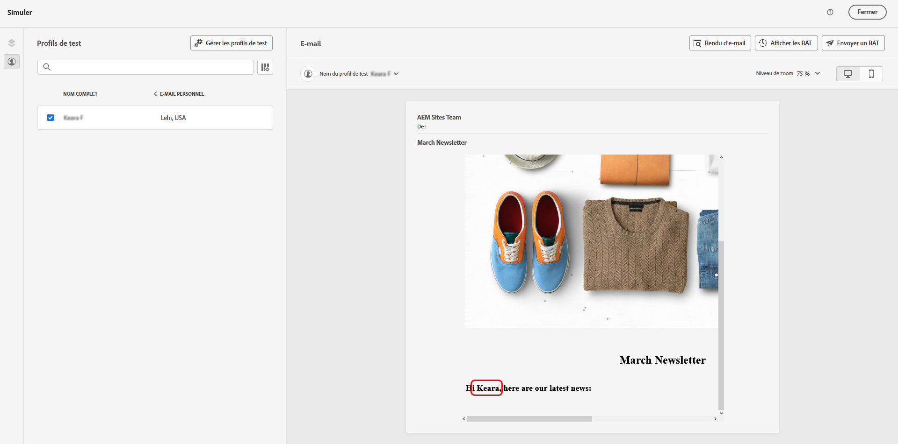

# Utiliser les modèles Adobe Experience Manager {#aem-templates}

## Commencer avec les modèles Adobe Experience Manager {#gs-aem-templates}

Adobe Journey Optimizer vous permet de créer des messages personnalisés via Adobe Experience Manager Sites. Commencez par concevoir vos modèles à l’aide de sources de contenu d’Adobe Experience Manager, puis envoyez-les à Adobe Journey Optimizer. Une fois partagés, ces modèles sont accessibles dans le concepteur d’e-mail d’Adobe Journey Optimizer, ce qui facilite la rédaction et l’envoi des messages à l’audience cible.

>[!AVAILABILITY]
>
>L’intégration à Adobe Experience Manager est actuellement disponible en version Beta pour certains utilisateurs et utilisatrices uniquement.
>En tant qu’utilisateur ou utilisatrice de la version Beta, complétez [ce formulaire](https://forms.office.com/pages/responsepage.aspx?id=Wht7-jR7h0OUrtLBeN7O4Wf0cbVTQ3tCpW_unE-w8-JUN1FaNlAzNkhPSUdaSkJXVFRCNTRJNVRFSy4u){target="_blank"} pour nous faire part de vos commentaires.

### Conditions préalables {#prerequisites}

Avant de commencer à utiliser cette fonctionnalité, assurez-vous de répondre aux exigences suivantes :

* **Paramètres d’Experience Manager**

  Cette fonctionnalité est disponible dans [Adobe Experience Manager as a Cloud Service](https://experienceleague.adobe.com/docs/experience-manager-cloud-service/content/overview/introduction.html?lang=fr){target="_blank"}.

  Dans le cadre du programme Beta, la configuration du service cloud est effectuée par Adobe dans Adobe Experience Manager pour se connecter à Adobe Journey Optimizer.

* **Autorisations**

  Pour créer, modifier et supprimer des modèles de contenu dans Adobe Journey Optimizer, vous devez disposer de l’autorisation **[!DNL Manage Library Items]** incluse dans le profil de produit **[!DNL Content Library Manager]**. [En savoir plus](../administration/ootb-product-profiles.md#content-library-manager).

### Mécanismes de sécurisation et limitations{#aem-templates-limitations}

Pour optimiser davantage votre utilisation d’Adobe Experience Manager avec Adobe Journey Optimizer, tenez compte des mécanismes de sécurisation et limitations supplémentaires suivantes :

* Pour que la personnalisation du modèle Experience Manager porte ses fruits, la syntaxe de Journey Optimizer doit être respectée. [En savoir plus](../personalization/personalization-syntax.md).

* L’exportation de modèles en bloc n’est actuellement pas prise en charge, les modèles doivent être exportés individuellement.

* La synchronisation entre Experience Manager et Journey Optimizer n’est actuellement pas disponible. Si des modifications sont apportées à un modèle Experience Manager après son envoi à Journey Optimizer, l’utilisateur ou l’utilisatrice devra réexporter le modèle et l’envoyer à nouveau à Journey Optimizer.

## Envoyer un modèle à Journey Optimizer{#aem-templates-send}

Pour exporter un modèle Adobe Experience Manager vers Adobe Journey Optimizer, procédez comme suit :

1. Sur la page d’accueil d’Adobe Experience Manager, sélectionnez **[!UICONTROL Marketing sortant]**.

   

1. Dans votre bibliothèque de contenu, vous pouvez utiliser des modèles configurés précédemment ou en créer un à partir de rien. [En savoir plus](https://experienceleague.adobe.com/docs/experience-manager-65/authoring/authoring/managing-pages.html?lang=fr#creating-a-new-page).

1. En incorporant la syntaxe de personnalisation de Journey Optimizer dans votre modèle, vous pouvez effectuer une personnalisation plus poussée. [En savoir plus](../personalization/personalization-syntax.md).

   

1. Sélectionnez le modèle à exporter vers Journey Optimizer, puis cliquez sur **[!UICONTROL Envoyer à]** dans le menu Avancé.

   

1. Saisissez le **[!UICONTROL Nom]** du modèle de contenu et sélectionnez la **[!UICONTROL Sandbox]** cible.

   

1. Une fois que vous avez cliqué sur le bouton **[!UICONTROL Envoyer]**, le processus d’exportation commence. Une fois l’exportation terminée, le message suivant s’affiche dans l’interface utilisateur : « Le modèle « XX » a été envoyé avec succès à AJO ».

Le modèle est ajouté aux modèles de contenu Adobe Journey Optimizer de la sandbox sélectionnée.

## Utiliser et personnaliser un modèle Adobe Experience Manager{#aem-templates-perso}

Une fois que le modèle Experience Manager est disponible dans Journey Optimizer en tant que modèle de contenu, vous pouvez identifier et incorporer le contenu de l’e-mail, y compris la personnalisation.

1. Dans le menu **[!UICONTROL Modèle de contenu]** de Journey Optimizer, accédez au modèle importé.

   

1. Cliquez sur le bouton **[!UICONTROL Alerte]** pour vérifier rapidement si des paramètres importants sont manquants. Cela permet de vous assurer que vos messages sont correctement configurés et d’éviter toute erreur ou problème potentiel.

   

1. Dans la fenêtre **[!UICONTROL Propriétés du modèle]**, cliquez sur le bouton **[!UICONTROL Gérer l’accès]** pour attribuer des libellés d’utilisation des données personnalisés ou de base à votre modèle. [En savoir plus sur le contrôle d’accès au niveau de l’objet (OLAC)](../administration/object-based-access.md)

1. Pour personnaliser davantage votre modèle Experience Manager et votre contenu, cliquez sur **[!UICONTROL Modifier le contenu]**. Cet écran vous permet d’apporter facilement des modifications et d’adapter le modèle selon vos besoins. [En savoir plus](../email/get-started-email-design.md).

   >[!WARNING]
   >
   > Si vous souhaitez modifier et personnaliser votre modèle, seul le mode de compatibilité est disponible.

1. Lorsque votre modèle de contenu est prêt, [testez et validez votre modèle](../content-management/content-templates.md#content-templates).

1. Une fois le contenu défini, accédez à la collection **[!UICONTROL Modèles enregistrés]** pour l’incorporer dans un nouveau e-mail. Sélectionnez ensuite **[!UICONTROL Utiliser ce modèle]**.

   

1. Vous pouvez maintenant modifier et personnaliser votre contenu. Pour plus d’informations sur la création du contenu de votre e-mail, consultez cette [page](../email/content-from-scratch.md).

   

1. Si vous avez ajouté du contenu personnalisé à votre modèle Experience Manager, cliquez sur **[!UICONTROL Simuler le contenu]** pour afficher l’aperçu du message à l’aide de profils de test.

[En savoir plus sur la prévisualisation et les profils de test](../content-management/preview-test.md)

   

1. Lors de l’affichage de l’aperçu du message, tous les éléments personnalisés sont automatiquement remplacés par les données correspondantes du profil de test sélectionné.

   Le cas échéant, des profils de test supplémentaires peuvent être ajoutés via le bouton **[!UICONTROL Gérer les profils de test]**.

   

Une fois votre e-mail prêt, effectuez la configuration de votre [parcours](../building-journeys/journey-gs.md) ou [campagne](../campaigns/create-campaign.md) et activez-le pour envoyer le message.
