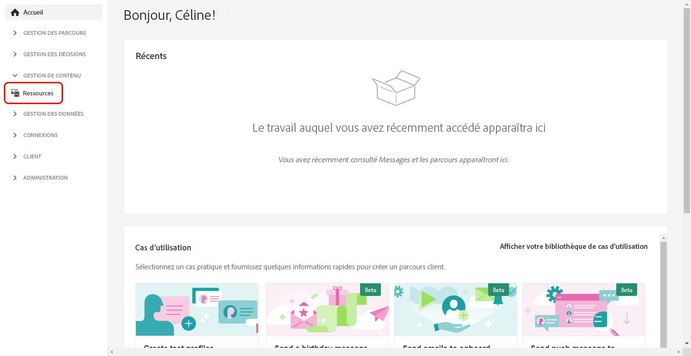
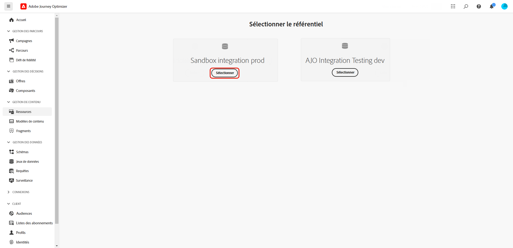
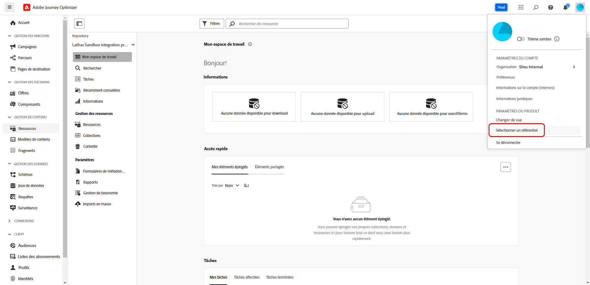
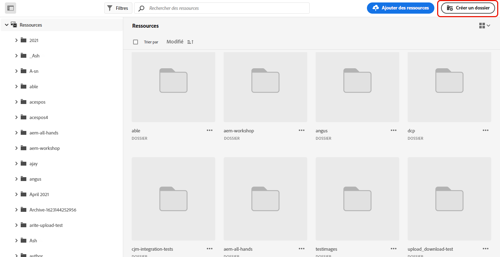
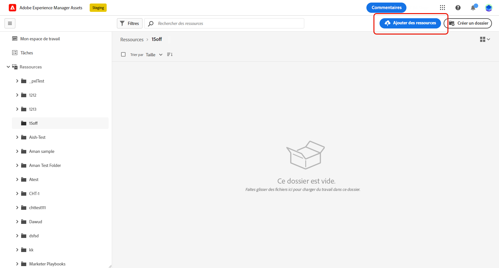
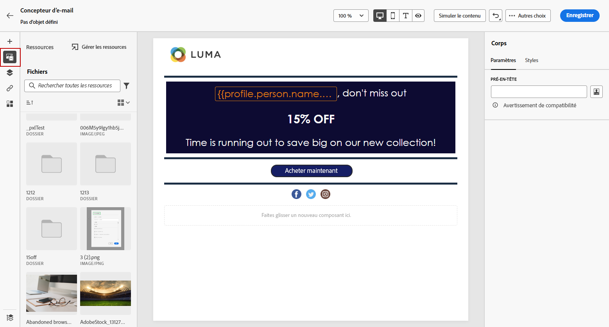
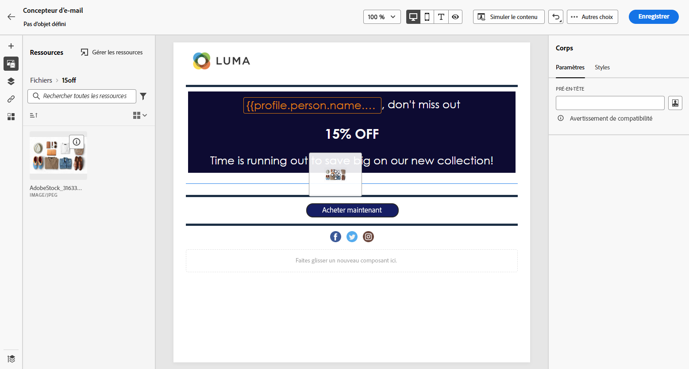
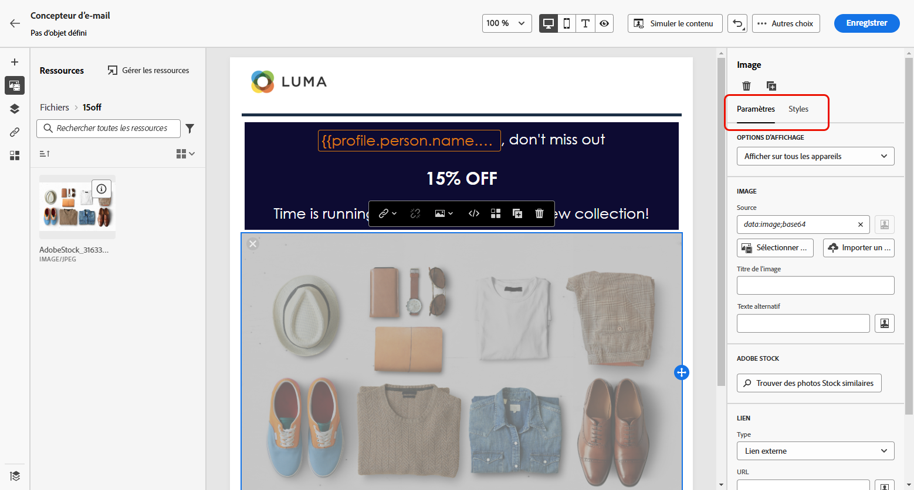

# Création et gestion des ressources avec [!DNL Experience Manager Assets]{#experience-manager-assets}

## Prise en main de [!DNL Experience Manager Assets] {#get-started-assets}

Rassemblez les workflows marketing et créatifs à l’aide de **[!DNL Adobe Experience Manager Assets]**. Accédez à **[!DNL Assets Essentials]** ou **[!DNL Assets as a Cloud Service]**, intégrés nativement à **[!DNL Adobe Journey Optimizer]**, pour stocker, gérer, découvrir et distribuer des ressources numériques. Ceci fournit un référentiel de ressources unique et centralisé que vous pouvez utiliser pour renseigner vos messages.

**[!DNL Adobe Experience Manager Assets]** offre deux espaces de travail collaboratifs et centralisés sur les ressources qui étendent votre système de création et unifient les ressources numériques pour la diffusion de l’expérience :

* **[!DNL Assets as a Cloud Service]** : Adobe Experience Manager Assets as a Cloud Service offre une solution cloud conviviale pour une gestion efficace des ressources numériques et des opérations Dynamic Media. Il intègre de manière transparente des fonctionnalités avancées, notamment l’intelligence artificielle et le machine learning.

  Apprenez-en plus dans la [documentation d’Adobe Experience Manager Assets as a Cloud Service](https://experienceleague.adobe.com/docs/experience-manager-cloud-service/content/assets/overview.html?lang=fr){target="_blank"}.

* **[!DNL Assets Essentials]** : Experience Manager Assets Essentials est une solution légère d’Assets as a Cloud Service pour une gestion et une collaboration unifiées des ressources. Grâce à une interface moderne et simplifiée, elle permet aux équipes créatives et marketing de stocker, découvrir et distribuer des ressources numériques sans effort.

  En savoir plus dans la [documentation d’Adobe Experience Manager Assets Essentials](https://experienceleague.adobe.com/docs/experience-manager-assets-essentials/help/introduction.html?lang=fr){target="_blank"}.

Selon votre contrat, **[!DNL Adobe Experience Manager Assets Essentials]** ou **[!DNL Adobe Experience Manager Assets as a Cloud Service]** est accessible directement depuis **[!DNL Adobe Journey Optimizer]** dans la section **[!UICONTROL Ressources]** du menu de gauche. Vous pouvez également accéder aux ressources et aux dossiers lors de la [conception d’un contenu d’e-mail](../email/get-started-email-design.md).

## Conditions préalables{#assets-prerequisites}

>[!BEGINTABS]

>[!TAB Adobe Experience Manager Assets Essentials]

Avant d’utiliser [!DNL Adobe Experience Manager Assets Essentials], vous devez ajouter des utilisateurs/utilisatrices aux profils de produits **Utilisateurs consommateurs/utilisatrices consommatrices Assets Essentials** ou/et **Utilisateurs/utilisatrices Assets Essentials**. Pour en savoir plus, consultez la [documentation d’Assets Essentials](https://experienceleague.adobe.com/docs/experience-manager-assets-essentials/help/get-started-admins/deploy-administer.html?lang=fr#add-user-groups){target="_blank"}.

>[!NOTE]
>Pour les produits Journey Optimizer obtenus avant le 6 janvier 2022, vous devez déployer **[!DNL Adobe Experience Manager Assets Essentials]** pour votre organisation. Pour en savoir plus, reportez-vous à la section [Déploiement d’Assets Essentials](https://experienceleague.adobe.com/docs/experience-manager-assets-essentials/help/deploy-administer.html?lang=fr){target="_blank"}.

>[!TAB Adobe Experience Manager Assets as a Cloud Service]

Avant d’utiliser **[!DNL Adobe Experience Manager Assets as a Cloud Service]**, vous devez ajouter des utilisateurs et utilisatrices aux services cloud d’Assets. Pour en savoir plus, consultez [Adobe Experience Manager Assets as a Cloud Service](https://experienceleague.adobe.com/docs/experience-manager-cloud-service/content/security/ims-support.html?lang=fr).

>[!ENDTABS]

## Chargement et ajout de ressources{#add-asset}

Pour importer des fichiers dans **[!DNL Assets Essentials]** ou **[!DNL Assets as a Cloud Service]**, vous devez d’abord parcourir ou créer le dossier dans lequel ils seront stockés. Vous pourrez alors les insérer dans le contenu de votre e-mail.

1. Sur la page d’accueil d’[!DNL Adobe Journey Optimizer], sélectionnez l’onglet **[!UICONTROL Ressources]** dans le menu **[!UICONTROL Gestion de contenu]** pour accéder à **[!DNL Assets Essentials]** ou **[!DNL Assets as a Cloud Service]**.

   

1. Sélectionnez le référentiel pour vos ressources dans Journey Optimizer. Vous pouvez opter pour un référentiel **[!DNL Assets Essentials]** ou **[!DNL Assets as a Cloud Service]**, à condition que vous possédiez cette solution.

   

   +++ Découvrez comment changer de référentiel Assets.

   Pour modifier votre référentiel Assets, sélectionnez l’icône Compte en haut à droite, puis cliquez sur **[!UICONTROL Sélectionner un référentiel]**.

   

   +++

1. Double-cliquez sur un dossier dans la section centrale ou dans l’arborescence pour l’ouvrir.

   Vous pouvez également cliquer sur **[!UICONTROL Créer un dossier]** pour créer un nouveau dossier.

   

1. Une fois dans le dossier sélectionné ou créé, cliquez sur **[!UICONTROL Ajouter des ressources]** pour télécharger une nouvelle ressource dans votre dossier.

   

1. Dans la section **[!UICONTROL Téléchargement de fichiers]**, cliquez sur **[!UICONTROL Parcourir]** et choisissez si vous souhaitez **[!UICONTROL Parcourir les fichiers]** ou **[!UICONTROL Parcourir les dossiers]**.

1. Sélectionnez le fichier que vous souhaitez télécharger. Lorsque vous avez terminé, cliquez sur **[!UICONTROL Télécharger]**. Pour en savoir plus sur la gestion des ressources, reportez-vous à cette [page](https://experienceleague.adobe.com/docs/experience-manager-assets-essentials/help/manage-organize.html?lang=fr).

1. Pour modifier davantage vos ressources avec Adobe Photoshop Express, double-cliquez dessus. Ensuite, dans le menu de droite, sélectionnez l’icône **[!UICONTROL Mode d’édition]**. [En savoir plus](https://experienceleague.adobe.com/docs/experience-manager-assets-essentials/help/edit-images.html?lang=fr){target="_blank"}.

   

1. Dans [!DNL Adobe Journey Optimizer], sélectionnez le menu **[!UICONTROL Sélecteur de ressources]** dans le volet gauche du concepteur d’e-mail.

   

1. Sélectionnez le dossier **[!UICONTROL Ressources]** précédemment créé. Vous pouvez également rechercher votre ressource ou votre dossier dans la barre de recherche.

1. Glissez-déposez votre ressource dans le contenu de votre e-mail.

   

1. Vous pouvez personnaliser davantage vos ressources, par exemple en ajoutant un lien externe ou du texte, à l’aide des onglets **[!UICONTROL Paramètres]** et **[!UICONTROL Styles]**. [En savoir plus sur les paramètres des composants](../email/content-components.md)

   

   <!--
    After adding your asset to your email, use the **[!UICONTROL Find similar Stock photos]** option to locate Stock photos that match the content, color, and composition of your image. [Learn more about Adobe Stock](stock.md).

    Note that this option is available for licensed/unlicensed Stock images and images from your Assets folder. 

    
    -->

## Questions fréquentes {#faq-assets}

Vous trouverez ci-dessous les questions fréquentes sur Adobe Experience Manager Assets.

Vous avez besoin de plus d’informations ? Utilisez les options de commentaires au bas de cette page pour poser votre question ou contacter la [communauté Adobe Journey Optimizer](https://experienceleaguecommunities.adobe.com/t5/adobe-journey-optimizer/ct-p/journey-optimizer?profile.language=fr){target="_blank"}.

+++ Puis-je continuer à utiliser le référentiel regroupé Assets Essentials dans Journey Optimizer ?

En cas d’approvisionnement sur **[!DNL Adobe Experience Manager Assets as a Cloud Service]**, vous avez accès aux référentiels **[!DNL Adobe Experience Manager Assets Essentials]** et **[!DNL Adobe Experience Manager Assets as a Cloud Service]** si vous disposez des autorisations appropriées. Ces référentiels sont séparés et non synchronisés. Un utilisateur ou une utilisatrice de Journey Optimizer pourra voir ces deux référentiels, y compris d’autres environnements auxquels il ou elle a accès (évaluation, développement, etc.) et pourra basculer en toute transparence de l’un à l’autre avec le sélecteur de référentiel.

+++

+++ Comment les ressources sont-elles gérées ? Les modifications apportées à Assets as a Cloud Service sont-elles reflétées dans Journey Optimizer ?

**[!DNL Adobe Experience Manager Assets as a Cloud Service]** s’intègre à Journey Optimizer de la même manière que **[!DNL Adobe Experience Manager Assets Essentials]**. Lorsque des modifications sont apportées à des ressources, une copie binaire est générée. Notez que les mises à jour dans **[!DNL Assets as a Cloud Service]** ne se propagent pas automatiquement aux campagnes par e-mail actives. Les modifications doivent être resélectionnées manuellement dans le concepteur d’e-mail afin de garantir la synchronisation entre les ressources et les campagnes par e-mail en cours.

+++

+++ Puis-je utiliser des URL Dynamic Media lors de la création d’e-mails dans Journey Optimizer ?

Oui, vous pouvez utiliser des URL Dynamic Media lors de la création d’e-mails Journey Optimizer. Il vous suffit de coller les URL au lieu de les sélectionner dans le sélecteur de ressources.

+++

+++ Peut-on apporter des modifications au référentiel Adobe Experience Manager Assets as a Cloud Service à partir de l’interface de Journey Optimizer ?

Si la personne utilisant Journey Optimizer est autorisée à utiliser **[!DNL Adobe Experience Manager Assets as a Cloud Service]** de manière standard et qu’elle dispose de l’autorisation Modifier sur le référentiel, elle peut apporter des modifications au référentiel **[!DNL Adobe Experience Manager Assets as a Cloud Service]**.

+++

+++ Pourquoi les images ne se chargent-elles parfois pas dans les e-mails envoyés depuis Journey Optimizer ?

Si des ressources (telles que des images) sont gérées via Adobe Experience Manager et utilisées dans Journey Optimizer, elles sont soumises à une politique de cycle de vie des ressources avec une durée de vie (TTL). Après l’expiration de la période de TTL, les ressources peuvent être supprimées du stockage (CDN), ce qui peut entraîner des images endommagées dans les e-mails qui font référence à ces ressources.

>[!NOTE]
>
>La TTL de la ressource est gérée par les services principaux de Adobe Journey Optimizer et n’est actuellement pas configurable par la clientèle. La période de durée de vie actuelle est définie sur 730 jours pour toutes les organisations Journey Optimizer.

+++

+++ Comment résoudre les images endommagées par l’expiration des ressources ?

Pour restaurer la disponibilité des images lorsque les ressources ont expiré :

1. **Republier les ressources affectées** : accédez à la ressource dans Adobe Experience Manager et republiez-la. La ressource sera à nouveau disponible dans le réseau CDN.

2. **Mettre à jour les références de contenu** : si vous utilisez des fragments de contenu ou des modèles qui référencent des ressources expirées :
   * Créer un brouillon ou un clone du fragment de contenu
   * Ajouter ou sélectionner à nouveau la ressource
   * Publier le contenu mis à jour

3. **Gestion proactive** : pour éviter toute perturbation future, pensez à vérifier et à republier régulièrement les ressources utilisées dans les campagnes par e-mail actives, en particulier celles dont la période d’expiration de TTL approche.

>[!CAUTION]
>
>Les exigences de republication s’appliquent à tous les environnements (production, évaluation, développement). Garantissez la disponibilité des ressources en gérant leur cycle de vie de manière appropriée.

+++

+++ La logique d’expiration des ressources sera-t-elle améliorée à l’avenir ?

Oui, Adobe s’emploie activement à apporter des améliorations pour affiner la logique d’expiration et de gestion du cycle de vie des ressources. Ces améliorations visent à offrir une meilleure visibilité sur le statut du cycle de vie des ressources et à réduire le risque de dégradation des images dans les campagnes en direct.

Pour connaître les dernières mises à jour, consultez l’équipe de votre compte Adobe ou surveillez les notes de mise à jour de Adobe Journey Optimizer.

+++
