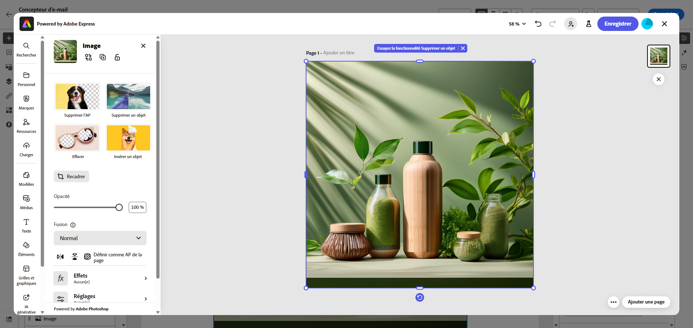

# Modifier les ressources avec [!DNL Adobe Express]{#express}

>[!CONTEXTUALHELP]
>id="ajo_express_menu"
>title="Intégration d’Adobe Express"
>abstract="Commencez à personnaliser vos ressources avec l’intégration d’Adobe Express. Cette fonctionnalité vous permet de redimensionner des images, de supprimer des arrière-plans, de recadrer des visuels et de convertir des ressources au format JPEG ou PNG."

L’intégration d’Adobe Express à Adobe Journey Optimizer vous permet d’accéder facilement aux puissants outils d’édition d’Adobe Express lors de la création de contenu. Cette intégration vous permet de redimensionner des images, de supprimer des arrière-plans, de recadrer des visuels et de convertir des ressources en JPEG ou en PNG sans avoir à basculer entre les solutions.

>[!AVAILABILITY]
>
>L’intégration d’Adobe Express à Adobe Journey Optimizer n’est actuellement pas disponible pour une utilisation avec Healthcare Shield ou Privacy and Security Shield.

Pour en savoir plus sur Adobe Express, reportez-vous à [cette documentation](https://helpx.adobe.com/fr/express/user-guide.html).

Pour accéder au menu **[!DNL Adobe Express]**, accédez à vos **Paramètres d’image** à partir du Concepteur d’e-mail et cliquez sur **[!UICONTROL Modifier dans Adobe Express]**.

➡️ [Découvrez cette fonctionnalité en vidéo.](#video)

## Licence Adobe Express Enterprise {#licence}

Les fonctionnalités présentées dans les sections ci-dessous sont accessibles aux utilisateurs et aux utilisatrices ne disposant pas d’une licence Adobe Express Enterprise.

Avec une licence Enterprise, les utilisateurs et les utilisatrices bénéficient d’un accès complet à l’éditeur Adobe Express, ce qui leur permet de modifier les images en ajustant la couleur, la luminosité, la netteté, le contraste, les dimensions et des paramètres supplémentaires.

+++Cas d’utilisation disponibles pour les utilisateurs et les utilisatrices disposant d’une licence Enterprise pour Adobe Express

* [Supprimer l’arrière-plan](https://helpx.adobe.com/fr/express/create-and-edit-images/edit-images/remove-background.html)
* [Supprimer des objets](https://helpx.adobe.com/fr/express/create-and-edit-images/create-and-modify-with-generative-ai/remove-objects-generative-fill.html)
* [Effacer](https://helpx.adobe.com/fr/express/create-and-edit-images/edit-images/eraser.html)
* [Insérer un objet](https://helpx.adobe.com/fr/express/adobe-express-on-mobile/create-and-edit-designs/generative-fill-mobile.html)
* [Recadrer](https://helpx.adobe.com/fr/express/create-and-edit-images/edit-images/crop-and-shape-images.html)
* [Effets](https://helpx.adobe.com/fr/express/add-effects-to-your-designs/add-images-and-visuals/apply-image-filters.html)

+++

## Redimensionner l’image {#resize}

1. Dans le menu Adobe Express , sélectionnez **[!UICONTROL Redimensionner l’image]**.

   

1. Sélectionnez le **[!UICONTROL format]** qui correspond le mieux aux proportions de votre ressource.

   

1. Utilisez le curseur pour zoomer et recadrer votre ressource, puis faites glisser pour effectuer un panoramique et ajuster la zone visible.

   

1. Cliquez sur **[!UICONTROL Réinitialiser]** pour restaurer l’état d’origine de votre ressource.

1. Cliquez sur **[!UICONTROL Appliquer]** une fois que le redimensionnement de l’image répond à vos besoins. Ensuite, **[!UICONTROL enregistrez]** la ressource modifiée.

1. Dans la fenêtre **[!UICONTROL Charger l’image]**, cliquez sur **[!UICONTROL Suivant]** et sélectionnez un dossier pour stocker la ressource modifiée.

   Cliquez ensuite sur **[!UICONTROL Importer]**.

Votre image est maintenant prête à être utilisée dans votre contenu.

## Supprimer l’arrière-plan {#background}

1. Dans le menu Adobe Express , sélectionnez **[!UICONTROL Supprimer l’arrière-plan]**.

   

1. Votre ressource s’affiche automatiquement sans son arrière-plan.

   Cliquez sur **[!UICONTROL Appliquer]** pour l’utiliser dans votre contenu.

   

1. Cliquez sur **[!UICONTROL Enregistrer]**.

1. Dans la fenêtre **[!UICONTROL Charger l’image]**, cliquez sur **[!UICONTROL Suivant]** et sélectionnez un dossier pour stocker la ressource modifiée.

   Cliquez ensuite sur **[!UICONTROL Importer]**.

Votre image est maintenant prête à être utilisée dans votre contenu.

## Recadrer l’image {#crop-image}

1. Dans le menu Adobe Express , sélectionnez **[!UICONTROL Recadrer l’image]**.

   

1. Faites glisser les poignées d’angle pour ajuster et recadrer l’image si nécessaire.

   

1. Cliquez sur **[!UICONTROL Appliquer]** pour l’utiliser dans votre contenu. Ensuite, **[!UICONTROL enregistrez]** la ressource modifiée.

1. Dans la fenêtre **[!UICONTROL Charger l’image]**, cliquez sur **[!UICONTROL Suivant]** et sélectionnez un dossier pour stocker la ressource modifiée.

   Cliquez ensuite sur **[!UICONTROL Importer]**.

Votre image est maintenant prête à être utilisée dans votre contenu.

## Convertir en JPEG ou PNG {#convert}

1. Dans le menu Adobe Express , sélectionnez **[!UICONTROL Convertir en JPEG]** ou **[!UICONTROL Convertir en PNG]** en fonction du format d’origine de l’image.

   

1. Cliquez sur **[!UICONTROL Appliquer]** pour commencer la conversion.

   

1. Cliquez sur **[!UICONTROL Enregistrer]**.

1. Une fois le format modifié, vous pouvez l’enregistrer en tant que nouvelle image sous un autre nom. Saisissez un **[!UICONTROL Nom]** puis cliquez sur **[!UICONTROL Enregistrer]**.

   

1. Dans la fenêtre **[!UICONTROL Charger l’image]**, cliquez sur **[!UICONTROL Suivant]** et sélectionnez un dossier pour stocker la ressource modifiée.

   Cliquez ensuite sur **[!UICONTROL Importer]**.

Votre image est maintenant prête à être utilisée dans votre contenu.

## Vidéo pratique {#video}

Découvrez comment modifier vos ressources dans Adobe Journey Optimizer à l’aide des outils d’Adobe Express.

>[!VIDEO](https://video.tv.adobe.com/v/3455523/?quality=12)

