# Utiliser des intégrations {#external-sources}

## Vue d’ensemble

La fonctionnalité **Intégrations** permet une intégration transparente des sources de données tierces dans Adobe Journey Optimizer. Cette fonctionnalité simplifie l’intégration de données et de sources de contenu externes dans vos campagnes. Vous pouvez ainsi diffuser des messages hautement personnalisés et dynamiques sur plusieurs canaux.

Vous pouvez utiliser cette fonctionnalité pour accéder à des données externes et extraire du contenu à partir d’outils tiers tels que :

* **Points de récompense** issus des systèmes de fidélité.
* **Informations sur les prix** pour les produits.
* **Recommandations de produits** à partir des moteurs de recommandation.
* **Mises à jour logistiques** comme le statut de la diffusion.

## Limites de la version Beta {#limitations}

La version Beta présente les limites suivantes :

* Seuls les canaux sortants sont pris en charge.

* Seul le format JSON est pris en charge pour les réponses d’appel API. Les sorties HTML et d’images binaires brutes ne sont pas disponibles.

* Seules les API de récupération ciblant un contenu spécifique sont prises en charge. Les API de liste ne sont pas disponibles.

* La fonctionnalité Intégrations est disponible pour les parcours et les campagnes, mais n’est pas prise en charge dans les fragments.

## Configurer votre intégration {#configure}

En tant qu’administrateur ou administratrice, vous pouvez configurer des intégrations externes en procédant comme suit :

1. Accédez à la section **[!UICONTROL Configurations]** dans le menu de gauche, puis cliquez sur **[!UICONTROL Gérer]** dans la carte **[!UICONTROL Intégrations]**.

   Cliquez ensuite sur **[!UICONTROL Créer une intégration]** pour démarrer une nouvelle configuration.

   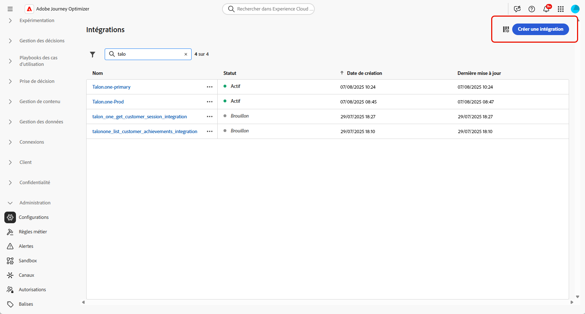

1. Indiquez un **[!UICONTROL nom]** et une **[!UICONTROL description]** pour votre intégration.

   >[!NOTE]
   >
   >Ces champs ne peuvent pas contenir d’espaces.

1. Saisissez l’**[!UICONTROL URL]** du point d’entrée API, qui peut inclure des paramètres de chemin comportant des variables définissables à l’aide de libellés et de valeurs par défaut.

1. Configurez le **[!UICONTROL Modèle de chemin]** avec son **[!UICONTROL Nom]** et sa **[!UICONTROL Valeur par défaut]**.

   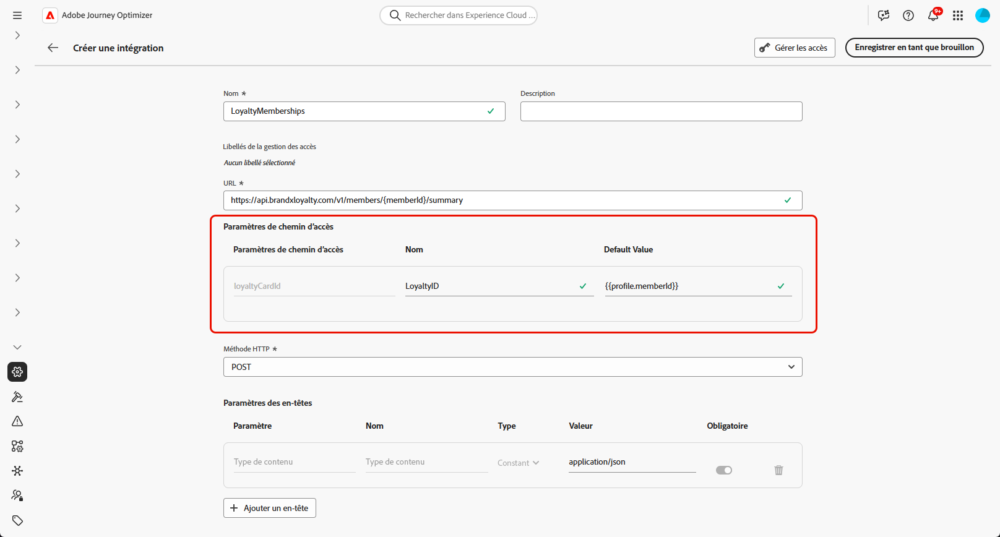

1. Sélectionnez la **[!UICONTROL méthode HTTP]** entre GET et POST.

1. Cliquez sur **[!UICONTROL Ajouter un en-tête]** et/ou **[!UICONTROL Ajouter des paramètres de requête]** selon les besoins de votre intégration. Pour chaque paramètre, fournissez les détails suivants :

   * **[!UICONTROL Paramètre]** : un identifiant unique utilisé en interne pour référencer le paramètre.

   * **[!UICONTROL Nom]** : le nom réel du paramètre, comme attendu par l’API.

   * **[!UICONTROL Type]** : choisissez **Constante** pour une valeur fixe ou **Variable** pour une entrée dynamique.

   * **[!UICONTROL Valeur]** : saisissez directement la valeur pour les constantes ou sélectionnez un mappage de variables.

   * **[!UICONTROL Obligatoire]** : indiquez si ce paramètre est obligatoire.

   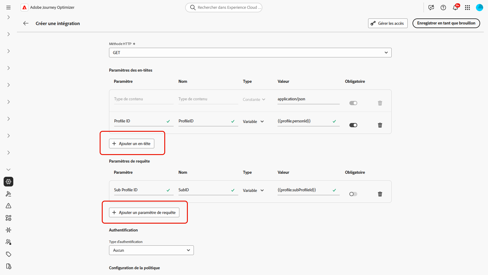

1. Choisissez un **[!UICONTROL type d’authentification]** :

   * **[!UICONTROL Aucune authentification]** : pour les API ouvertes qui ne nécessitent aucune information d’identification.

   * **[!UICONTROL Clé API]** : authentifiez les requêtes à l’aide d’une clé API statique. Saisissez votre **[!UICONTROL nom de clé API &#x200B;]**, la **[!UICONTROL valeur de la clé API &#x200B;]** et spécifiez votre **[!UICONTROL emplacement]**.

   * **[!UICONTROL Authentification de base]** : utilisez l’authentification HTTP de base standard. Saisissez le **[!UICONTROL nom d’utilisateur]** et le **[!UICONTROL mot de passe]**.

   * **[!UICONTROL OAuth 2.0]** : authentifiez-vous à l’aide du protocole OAuth 2.0. Cliquez sur l’icône  pour configurer ou mettre à jour la **[!UICONTROL payload]**.

   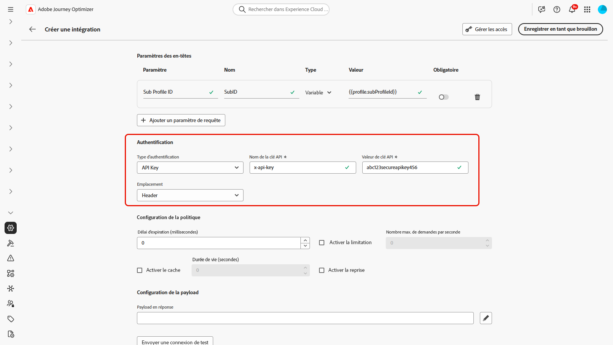

1. Définissez la **[!UICONTROL Configuration de la politique]** telle que le **[!UICONTROL délai d’expiration]** pour les requêtes API et choisissez d’activer le ralentissement, la mise en cache et/ou la reprise.

1. Avec le champ **[!UICONTROL payload de réponse]**, vous pouvez déterminer quels champs de l’exemple de sortie doivent être utilisés pour la personnalisation des messages.

   Cliquez sur l’icône  et collez un exemple de payload de réponse JSON pour détecter automatiquement les types de données.

1. Choisissez les champs à exposer pour la personnalisation et spécifiez leurs types de données correspondants.

   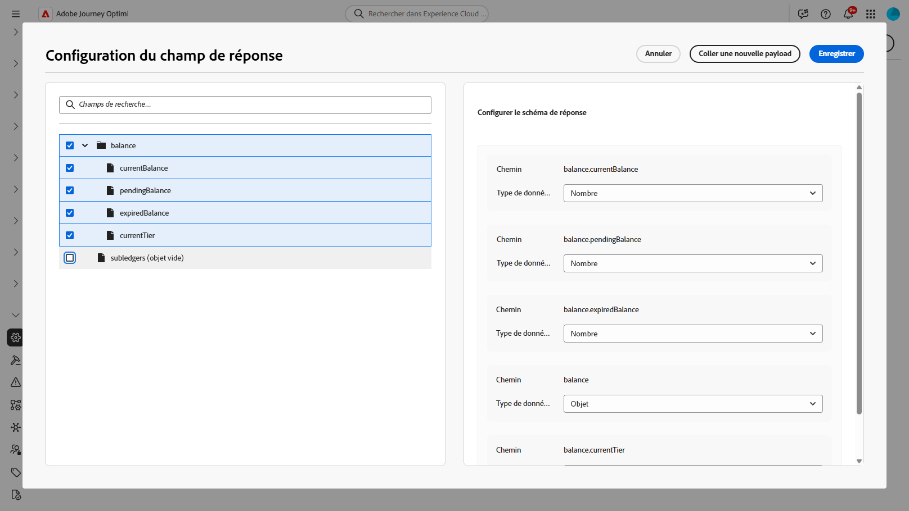

1. Utilisez **[!UICONTROL Envoyer une connexion de test]** pour valider l’intégration.

   Une fois la validation effectuée, cliquez sur **[!UICONTROL Activer]**.

## Utiliser des intégrations externes pour la personnalisation {#personalization}

En tant que responsable marketing, vous pouvez utiliser des intégrations configurées pour personnaliser votre contenu. Procédez comme suit :

1. Accédez au contenu de votre campagne et cliquez sur **[!UICONTROL Ajouter une personnalisation]** dans le champ **[!UICONTROL Composants]** Texte ou HTML.

[En savoir plus sur les composants](../email/content-components.md)

   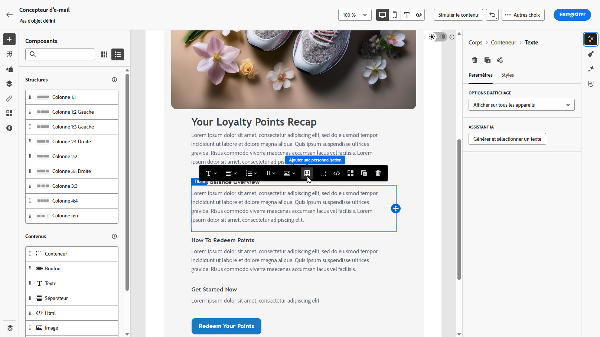

1. Accédez à la section **[!UICONTROL Intégrations]** et cliquez sur **[!UICONTROL Ouvrir les intégrations]** pour afficher toutes les intégrations actives.

   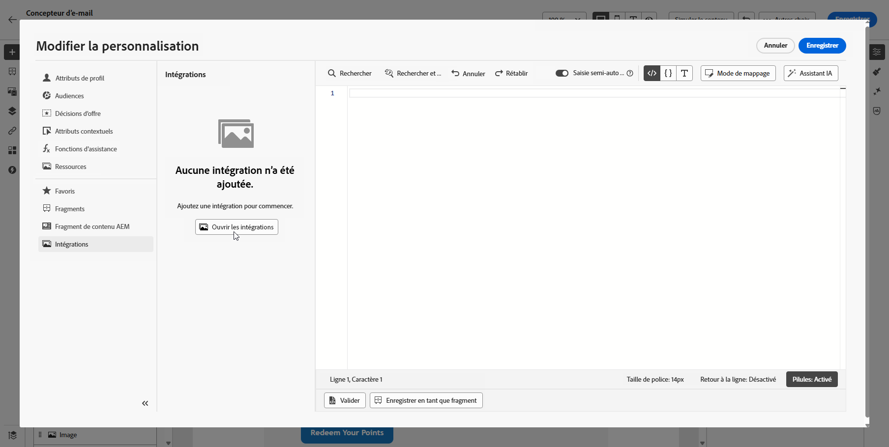

1. Sélectionnez une intégration et cliquez sur **[!UICONTROL Enregistrer]**.

   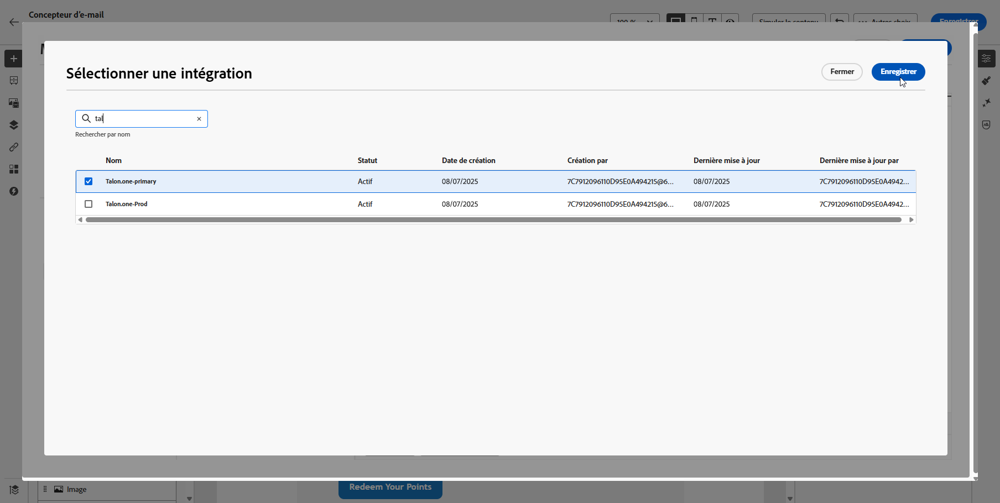

1. Activez le mode **[!UICONTROL Pastilles]** pour déverrouiller le menu d’intégration avancé.

   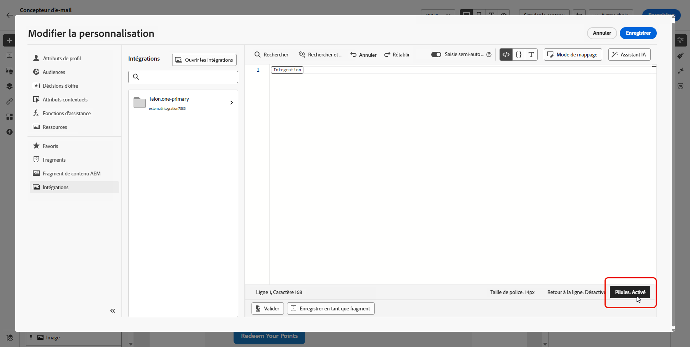

1. Pour terminer la configuration de votre intégration, définissez les attributs d’intégration, qui ont été précédemment spécifiés lors de la [configuration](#configure).

   Vous pouvez attribuer des valeurs à ces attributs à l’aide de valeurs statiques, qui restent constantes, ou d’attributs de profil, qui extraient dynamiquement des informations des profils utilisateur.

   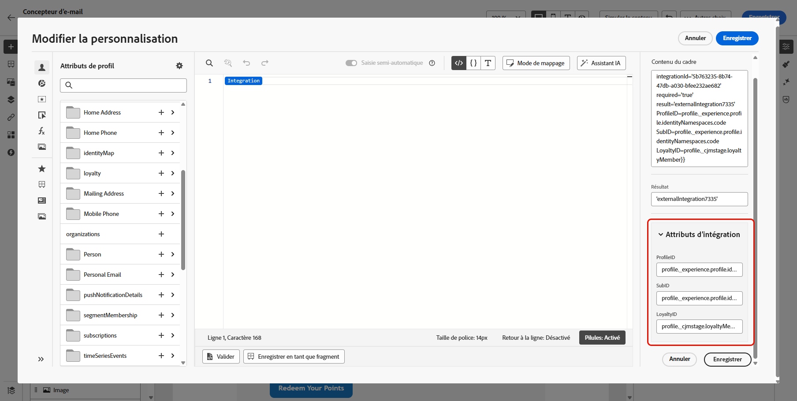

1. Une fois les attributs d’intégration définis, vous pouvez utiliser les champs d’intégration de votre contenu pour envoyer des messages personnalisés en cliquant sur l’icône .

   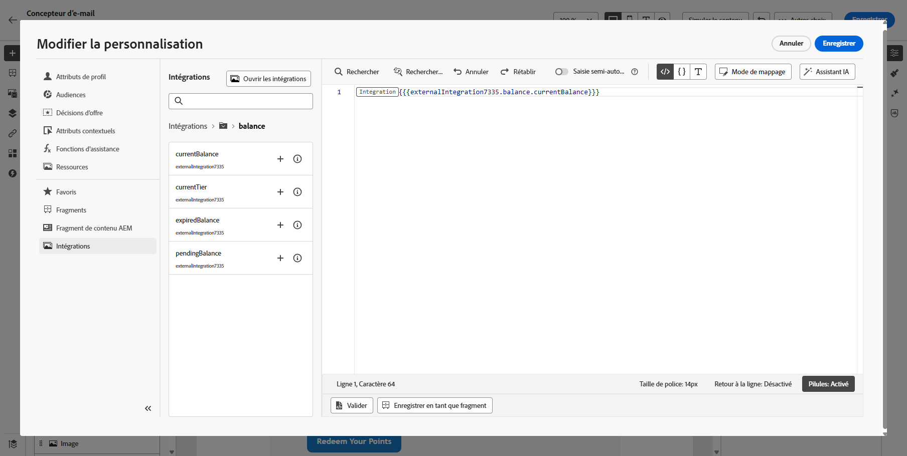

1. Cliquez sur **[!UICONTROL Enregistrer]**.

Votre personnalisation d’intégration est maintenant appliquée avec succès à votre contenu, en veillant à ce que chaque destinataire reçoive une expérience adaptée et pertinente en fonction des attributs que vous avez configurés.

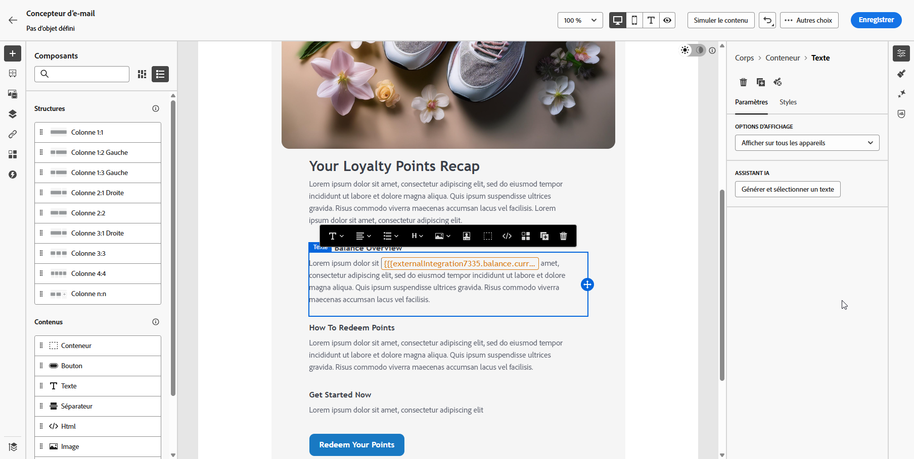
