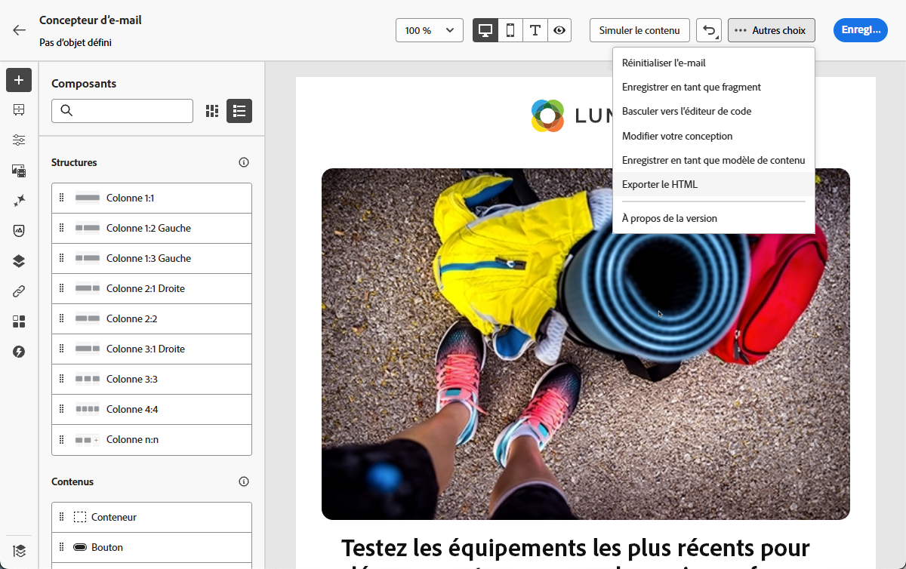
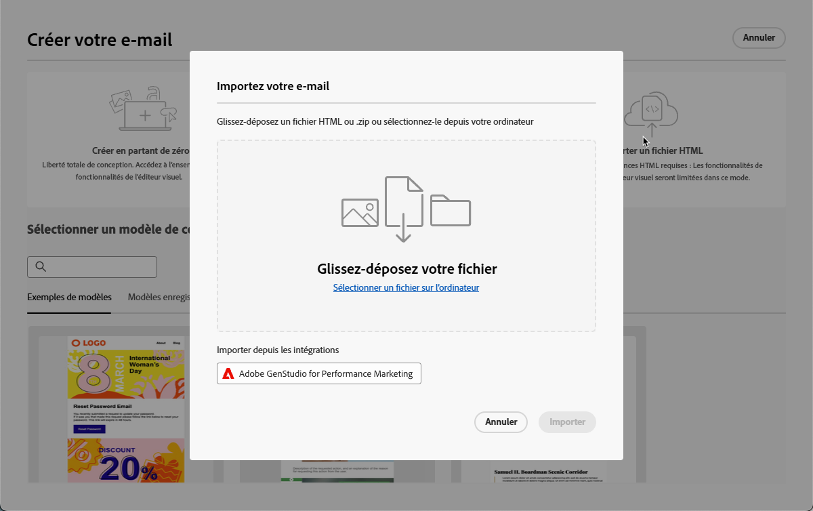
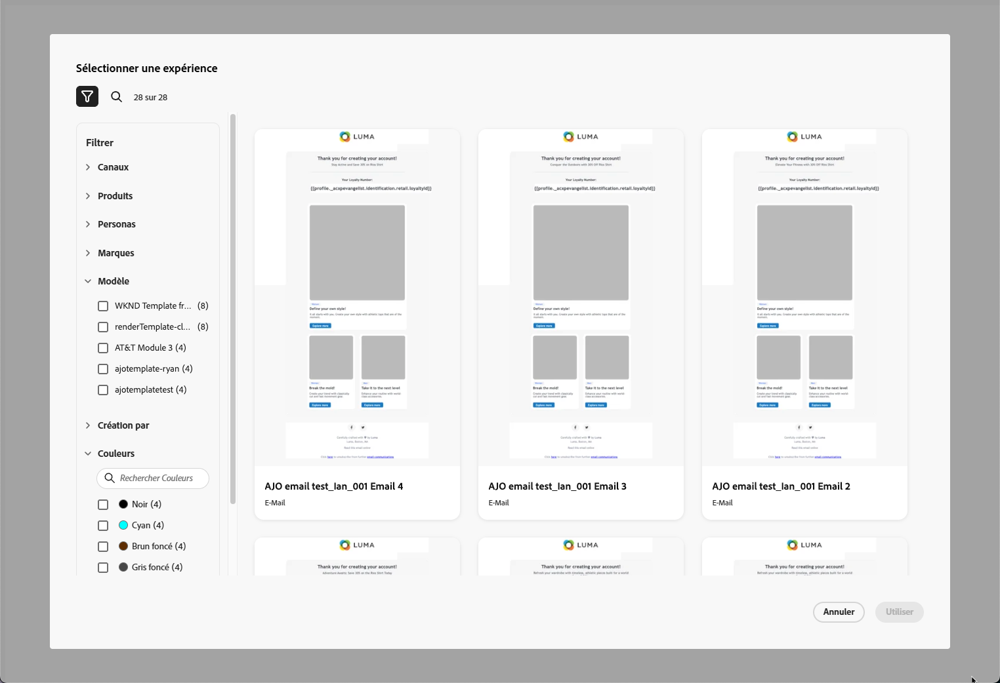
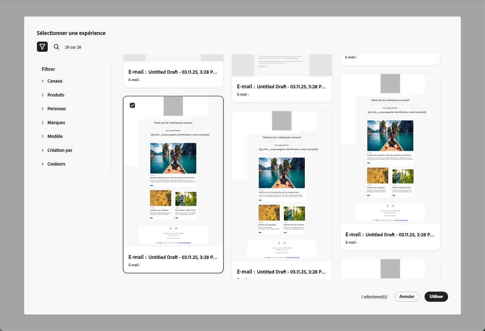
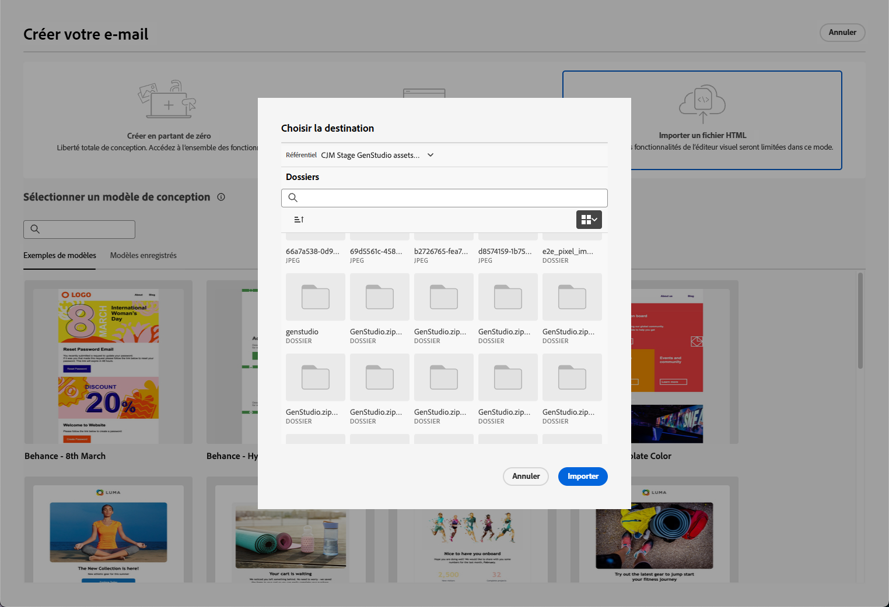
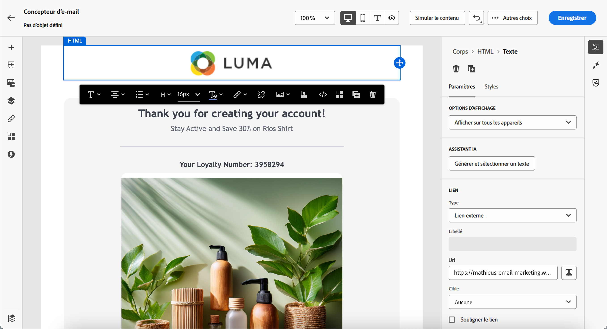
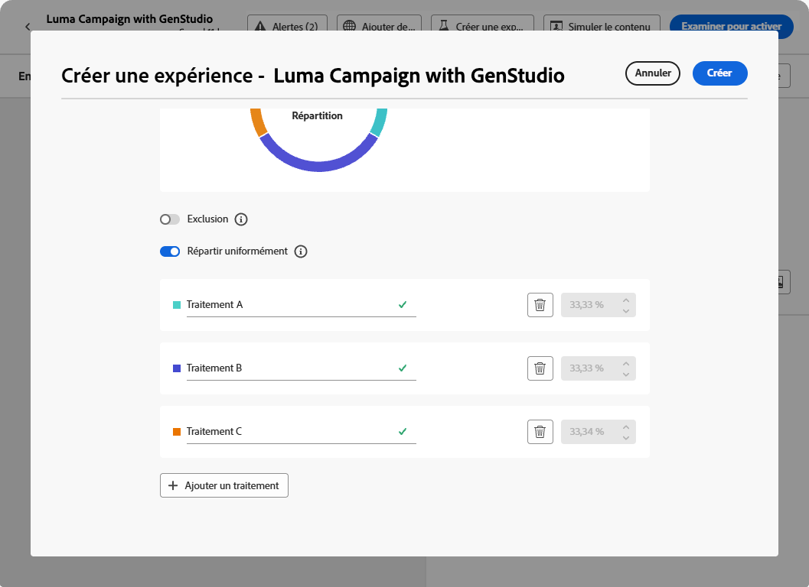
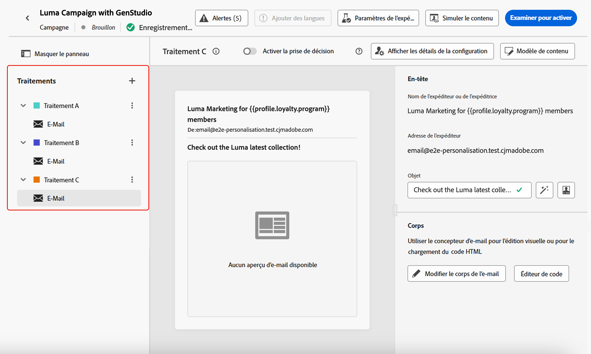

# Utiliser GenStudio for Performance Marketing {#ajo-genstudio}

>[!CONTEXTUALHELP]
>id="ajo_genstudio_button"
>title="Utiliser un modèle créé avec GenStudio"
>abstract="Grâce à l’intégration transparente à Adobe GenStudio for Performance Marketing, vous pouvez facilement importer un modèle GenStudio amélioré par la technologie d’IA Adobe."

## Commencer avec GenStudio {#gs-genstudio}

[Adobe GenStudio for Performance Marketing](https://experienceleague.adobe.com/fr/docs/genstudio-for-performance-marketing/user-guide/home){target="_blank"} est une application axée sur l’IA générative qui permet aux équipes marketing de créer leurs propres publicités et e-mails afin de mener des campagnes marketing percutantes et personnalisées, tout en respectant les normes de votre marque et les politiques de votre entreprise. La technologie d’IA d’Adobe met à votre disposition une suite complète d’outils qui simplifient la création et la gestion de contenu, ce qui permet aux personnes en charge de la création de se concentrer sur l’innovation.

>[!AVAILABILITY]
>
>* L’intégration de GenStudio dans [!DNL Adobe Journey Optimizer] n’est actuellement pas disponible pour une utilisation avec les offres complémentaires **Healthcare Shield** ou **Privacy and Security Shield**.
>
>* Cette fonctionnalité est disponible uniquement pour le canal e-mail.

Pour renforcer l’efficacité marketing et préserver la cohérence de la marque, vous pouvez intégrer de façon transparente les expériences [!DNL **GenStudio for Performance Marketing**] à [!DNL **Adobe Journey Optimizer**]. Vous pouvez ainsi tirer parti des capacités de création de contenu alimentées par l’IA de [!DNL GenStudio] en les associant aux fonctionnalités d’orchestration avancées de [!DNL Journey Optimizer].

>[!INFO]
>
>Pour aller plus loin, consultez cette [vue d’ensemble](https://business.adobe.com/fr/products/genstudio-for-performance-marketing.html#watch-overview){target="_blank"} ainsi qu’une [démonstration](https://business.adobe.com/fr/products/genstudio-for-performance-marketing.html#demo){target="_blank"} de [!DNL Adobe GenStudio for Performance Marketing].

➡️ [Découvrez cette fonctionnalité en vidéo.](#video)

<!--To access the GenStudio integration in [!DNL Adobe Journey Optimizer] feature, users need to be granted the **xxx** permission. [Learn more](../administration/permissions.md)

>[!IMPORTANT]
>
>* Before starting using this capability, read out related [Guardrails and Limitations](#generative-guardrails).-->

<!--Guardrails and limitations {#genstudio-guardrails}

General guidelines for using the GenStudio integration in [!DNL Adobe Journey Optimizer] for email generation are listed below:

See if guidelines/limitations such as the ones listed [here](../content-management/gs-generative.md#generative-guardrails) for AI Assistant can apply.

The following limitations apply to GenStudio integration in [!DNL Adobe Journey Optimizer]:-->

## Utiliser les fonctionnalités de GenStudio dans Journey Optimizer {#use-genstudio}

L’intégration entre [!DNL GenStudio for Performance Marketing] et [!DNL Journey Optimizer] permet aux équipes marketing de votre entreprise de mieux collaborer afin de rationaliser les processus.

Par exemple, une personne spécialiste du marketing technique, qui utilise [!DNL Journey Optimizer] pour concevoir et automatiser des campagnes e-mail, peut collaborer avec une personne spécialiste du marketing de performance qui crée du contenu à l’aide de [!DNL GenStudio].

Grâce à cette intégration, les deux personnes spécialistes peuvent collaborer pour intégrer facilement du contenu conforme à la marque depuis [!DNL GenStudio] dans [!DNL Journey Optimizer], afin de diffuser des e-mails attrayants ciblant des segments de clientèle spécifiques et générant des ventes.

### Exporter un modèle HTML de Journey Optimizer vers GenStudio {#export-from-ajo-to-genstudio}

Commencez par exporter un modèle HTML [!DNL Journey Optimizer] incluant les directives de votre marque vers [!DNL GenStudio for Performance Marketing]. Suivez les étapes ci-dessous.

1. Dans [!DNL Journey Optimizer], accédez au contenu de votre e-mail dans un parcours ou une campagne. [Voici comment procéder](../email/get-started-email-design.md#key-steps)

1. Dans le Concepteur d’e-mail, sélectionnez **[!UICONTROL Exporter le HTML]** à partir du bouton **[!UICONTROL Plus]**.

   {zoomable="yes"}

1. Chargez ce modèle exporté HTML dans [!DNL GenStudio for Performance Marketing]. <!--Make sure you detect the fields that the generative AI uses to insert content in order to create an actionable template.-->

   >[!NOTE]
   >
   >Découvrez comment charger un modèle HTML dans [!DNL GenStudio] dans la section dédiée du [Guide d’utilisation d’Adobe GenStudio for Performance Marketing](https://experienceleague.adobe.com/fr/docs/genstudio-for-performance-marketing/user-guide/content/templates/use-templates#templates-from-ajo-and-marketo){target="_blank"}.

1. Dans GenStudio, utilisez ce modèle pour créer plusieurs variantes d’e-mail à l’aide de prompts d’IA, puis enregistrez-les.

   >[!NOTE]
   >
   >Découvrez comment créer des expériences d’e-mail dans la [section](https://experienceleague.adobe.com/fr/docs/genstudio-for-performance-marketing/user-guide/create/create-email-experience){target="_blank"} dédiée à GenStudio.

### Tirer profit des expériences GenStudio dans Journey Optimizer {#leverage-genstudio-experiences}

Pour tirer profit des variantes d’e-mail [!DNL GenStudio] que vous venez de créer en les important dans [!DNL Journey Optimizer], suivez les étapes ci-dessous.

1. Dans [!DNL Journey Optimizer], [ajoutez un e-mail](../email/create-email.md) à une campagne.

1. Depuis l’écran de configuration de la campagne, accédez à l’écran [Modifier le contenu](../email/create-email.md#define-email-content), puis cliquez sur **[!UICONTROL Modifier le corps de l’e-mail]** pour ouvrir le Concepteur d’e-mail. [Voici comment procéder](../email/get-started-email-design.md#key-steps)

1. Sur la page d’accueil du Concepteur d’e-mail, sélectionnez **[!UICONTROL Importer le HTML]**, puis cliquez sur le bouton **[!UICONTROL Adobe GenStudio for Performance Marketing]**.

   {zoomable="yes"}

1. Parcourez les expériences GenStudio pour commencer à créer votre contenu. Vous pouvez filtrer les expériences selon plusieurs critères tels que les produits, les personas, les marques ou même les couleurs.

   <!--{zoomable="yes"}-->

1. Sélectionnez une expérience et cliquez sur **[!UICONTROL Utiliser]**.

   {zoomable="yes"}

1. Sélectionnez le dossier dans lequel vous souhaitez importer l’expérience GenStudio.

   {zoomable="yes"}

1. Le contenu sélectionné s’affiche dans le Concepteur d’e-mail.

   {zoomable="yes"}

   >[!NOTE]
   >
   >Les expériences GenStudio [créées à partir d’un  [!DNL Journey Optimizer] modèle](#export-from-ajo-to-genstudio) sont importées directement dans le Concepteur d’e-mail. Les expériences GenStudio créées sans [!DNL Journey Optimizer]modèle sont importées en [mode de compatibilité](../email/existing-content.md).

   Utilisez les [outils d’édition du contenu d’e-mail](../email/content-from-scratch.md) et les [champs de personnalisation](../personalization/personalize.md) pour modifier votre e-mail comme vous le souhaitez. Enregistrez votre contenu.

1. Retournez à la page récapitulative de la campagne, puis cliquez sur **[!UICONTROL Créer une expérience]** pour lancer une expérimentation. [Découvrir comment créer une expérience de contenu](../content-management/content-experiment.md)

   <!--{zoomable="yes"}-->

1. Créez plusieurs traitements et répétez les étapes ci-dessus pour importer et utiliser rapidement les autres variantes d’expérience d’e-mail que vous avez créées dans [!DNL GenStudio].

   {zoomable="yes"}

1. Enregistrez vos modifications et [activez](../campaigns/review-activate-campaign.md) la campagne.

Après avoir exécuté l’expérience, suivez les performances de vos traitements de campagne avec le [rapport de campagne d’expérimentation](../reports/campaign-global-report-cja-experimentation.md). Vous pourrez ensuite interpréter les résultats de votre expérience. [Voici comment procéder](../content-management/get-started-experiment.md#interpret-results)

## Vidéo pratique {#video}

Découvrez le processus d’export d’un modèle d’e-mail de Journey Optimizer vers GenStudio for Performance Marketing, de création d’e-mails conformes à la marque à l’aide du modèle dans GenStudio et de réimport transparent dans Journey Optimizer.

>[!VIDEO](https://video.tv.adobe.com/v/3456051/?captions=fre_fr&quality=12)